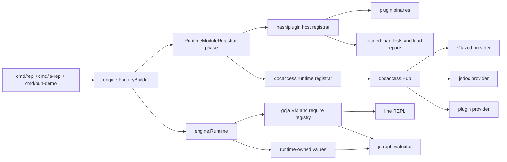
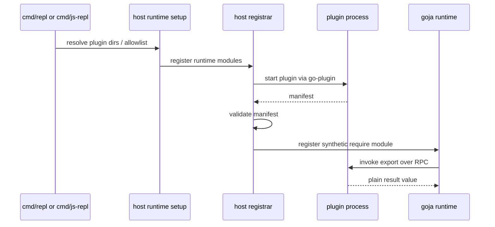
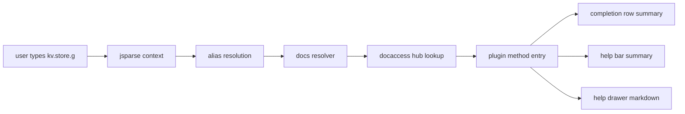

# Comprehensive branch review handoff guide for code review since origin main

## Executive Summary

This branch is not one feature. It is a coordinated architecture slice across the runtime engine, plugin system, documentation system, examples, and interactive REPL UX.

From `origin/main` to `HEAD`, the branch adds:

- runtime-scoped module registrars and runtime-owned shared state in `engine`
- HashiCorp `go-plugin` support with host, shared contract, SDK, examples, install flow, and REPL wiring
- a unified documentation hub that aggregates Glazed help, jsdoc, and plugin metadata
- doc-aware `js-repl` help and autocomplete using runtime-scoped docs state
- follow-up consolidation work to remove the legacy `glazehelp` path, reduce duplication, and tighten runtime behavior

This review guide is optimized for someone tired and new to the branch. It does not assume you have held the architecture in your head while it was being built. It gives you:

- a reading order
- a subsystem map
- before/after framing against `origin/main`
- concrete files and key symbols
- review heuristics and likely bug zones
- example workflows that exercise the system end-to-end
- validation commands and expected concerns

The branch delta is large:

- `118` files changed
- `18,161` insertions
- `562` deletions

The right review strategy is therefore not "read every diff linearly". Review by architecture seam, then use the commit history and examples to confirm that the slices compose cleanly.

That sentence is worth taking literally. If you try to review the branch as one uninterrupted diff, you will spend most of your energy just context-switching between unrelated-looking files. The branch becomes much easier to understand once you accept that it is really one architectural move with several downstream consumers. The engine changed first so that runtime-scoped work could exist cleanly. The plugin host then used that seam. The docs hub then used the same seam. The REPL work then consumed the outputs of those earlier layers. Reading in that order turns a long branch into a staged system.

I would also encourage you to read this document the same way you would read a careful architecture review from a teammate rather than a terse implementation note. Let the larger paragraphs do some of the mental work for you. The goal here is not only to remind you what files changed. It is to make the system feel legible enough that you can form your own opinion without needing the repository open beside you.

## Review Goal

The review goal is to answer five questions:

1. Is the new runtime composition model coherent and idiomatic enough to live long-term?
2. Is the plugin system correct enough around lifecycle, validation, transport boundaries, and JS reification?
3. Is the new documentation system materially better than the removed `glazehelp` path, and is the separation of concerns clean?
4. Does `js-repl` now consume the right data sources, or does it still duplicate logic in a fragile way?
5. Has the cleanup work actually reduced complexity, or just moved it around?

If you only remember one thing while reviewing, remember this:

> The branch moves the project from mostly static, package-global module wiring to runtime-scoped composition with external plugins and runtime-owned documentation state.

That is the architectural center of gravity.

The branch is therefore best reviewed as a change in runtime philosophy. The old philosophy was "choose modules up front, then run JavaScript with them." The new philosophy is "construct a runtime instance that can carry runtime-specific modules, state, and cleanup." That difference sounds small in one sentence, but it affects almost every later design decision. When a plugin is discovered at runtime, when documentation becomes runtime-scoped, or when the TUI asks the runtime for docs state, all of those behaviors now make sense because the runtime itself has become a first-class composed object.

## Scope Of What Changed

### Commit clusters

The branch falls into six main commit clusters:

1. Runtime engine extension
   - `d50da08` engine runtime registrars
   - `9c5feb8` runtime-owned registrar state
   - `874fc07` lifecycle, diagnostics, and shared runtime setup cleanup

2. Plugin transport and host integration
   - `d474dd9` shared gRPC contract scaffold
   - `9a463cf` host-side loading into runtimes
   - `e14bf3d` default discovery and `js-repl` support
   - `cef04cf` allowlist controls

3. Plugin authoring SDK and examples
   - `3c2a591` SDK core
   - `945a573` example migration
   - `9ed3b51` example catalog
   - `11db436` result normalization
   - `8e7e53c` explicit method summary/doc/tags

4. Documentation hub
   - `af6c7e5` plugin method-level docs in the contract
   - `74b95a4` docaccess providers
   - `1b8d2ef` runtime-scoped `docs` module
   - `4450376` centralized plugin docs source ID

5. REPL integration and user-facing docs
   - `e4b9b1d` examples
   - `ee6bfce` plugin discovery visibility
   - `a83d05b` `bun-demo` plugin wiring
   - `f704e2c` doc-aware `js-repl` help/autocomplete

6. Review-driven cleanup
   - `bf89ebc` remove `glazehelp`, unify validation, clean duplication
   - `784fb28` ticket closeout bookkeeping

### Branch-level file clusters

The most important directories for review are:

```text
engine/
pkg/hashiplugin/
pkg/docaccess/
pkg/repl/evaluators/javascript/
cmd/repl/
cmd/js-repl/
cmd/bun-demo/
plugins/examples/
pkg/doc/
```

## Reviewer Glossary

If you are reading this offline and your head is tired, use these terms consistently. They recur throughout the branch.

### Factory

`engine.Factory` is the immutable runtime creation plan. It used to mostly mean "static modules already registered into one `require.Registry`". On this branch it becomes "static modules plus runtime registrars plus runtime initializers plus builder settings".

### Runtime module registrar

A `RuntimeModuleRegistrar` is a per-runtime hook that can register native modules into the runtime's `require.Registry` before it is enabled for that specific VM. This is the new seam that makes runtime-scoped plugins and docs possible.

### Runtime value

A runtime value is setup-time information that survives onto the owned `engine.Runtime`. Examples:

- loaded plugin manifest snapshots
- the runtime docs hub

This matters because setup-time scratch state and runtime-time observable state are no longer the same thing.

That distinction is easy to under-appreciate when you are skimming. Many codebases accidentally smuggle setup state forward through package globals, closure capture, or ad hoc caches. This branch instead chooses to say: if later runtime consumers need the result of setup, that result should be owned by the runtime. That is a cleaner architecture, but it raises the bar on naming and discipline. Keys like `docaccess.hub` and the plugin-loaded-module snapshot are no longer incidental. They are part of the runtime contract and should be reviewed with that seriousness.

### Loaded module

In `pkg/hashiplugin/host`, a loaded module is the host-side handle to one plugin subprocess plus its validated manifest and RPC interface.

### Reification

Reification means turning the plugin's manifest into real JavaScript-callable module exports inside `goja`. In this branch, reification happens by registering synthetic native CommonJS modules.

### Docs hub

The docs hub is the runtime-scoped `docaccess.Hub` that aggregates documentation providers. It is the shared source of truth behind `require("docs")` and the newer `js-repl` help behavior.

### Docs resolver

The docs resolver in `pkg/repl/evaluators/javascript/docs_resolver.go` is the evaluator-side adapter that maps TUI symbols like `kv.store.get` back to structured documentation entries from the hub.

## Branch Story In Plain English

If you need to tell yourself the branch story in one minute before reading the details, use this version.

The original codebase had a good but mostly static runtime composition model:

- choose modules at build time
- build one `require.Registry`
- create runtimes from that registry

That model was not enough for dynamically discovered external plugins, because plugins need:

- per-runtime discovery and registration
- subprocess lifecycle cleanup
- manifest validation
- a trust boundary
- a way to publish runtime-scoped metadata to later consumers

So the branch first extends the engine to add a new runtime-registrar phase and long-lived runtime state. Once that exists, the branch adds a plugin host subsystem that loads subprocess-backed modules at runtime and reifies them into the JS module system. Then it adds an authoring SDK so writing plugins is not miserable. Then it adds a documentation hub so Glazed help, jsdoc, and plugin docs can be exposed through one model. Finally, it wires the TUI help path to consume that docs hub instead of relying only on static signatures.

That is the core narrative.

The review should verify two things:

1. The architecture is coherent.
2. The cleanup work after the first implementation round actually reduced complexity.

That second point matters as much as the first. Branches that add a large new capability often tell a flattering story after the fact: "we added the feature, then we cleaned it up." Sometimes that is true. Sometimes the cleanup only repackages the same complexity into more helpers and more directories. The GOJA-13 follow-up work was specifically meant to avoid that failure mode. It removed the legacy `glazehelp` path, centralized validation, made runtime-scoped state durable, and reduced duplicated bootstrap logic. A good review should verify those claims with the same care you apply to the original feature code.

## Commit Trail With Reviewer Interpretation

This section is intentionally repetitive. The point is not to list commits. The point is to tell you what each slice was trying to accomplish so you can judge whether the final code still reflects that intent.

### `d50da08` `engine: add runtime-scoped module registrars`

Intent:

- introduce a runtime-time registration seam instead of forcing all module wiring into build time

Reviewer interpretation:

- this is the foundational architecture commit
- if this slice is wrong, almost everything later is built on a shaky seam

### `d474dd9` `hashiplugin: add shared gRPC contract scaffold`

Intent:

- establish a plain-data plugin transport boundary before mixing in JS concerns

Reviewer interpretation:

- the branch deliberately chose the boring contract-first path
- check whether later code still respects that boundary

### `9a463cf` `hashiplugin: load plugin modules into runtimes`

Intent:

- prove that runtime registrars can load plugin modules and expose them to `require()`

Reviewer interpretation:

- this is where subprocess lifecycle first enters the runtime composition flow
- check for cleanup/cancellation sharp edges

### `e14bf3d` `repl: default plugin discovery and js-repl support`

Intent:

- move from architecture-only to usable entrypoints

Reviewer interpretation:

- check whether entrypoint wiring stayed coherent or became duplicated here

### `3c2a591` `hashiplugin: add authoring sdk core`

Intent:

- make authoring less transport-shaped

Reviewer interpretation:

- the right question is not "is this pretty" but "does this remove enough accidental complexity"

### `11db436` `hashiplugin: normalize common plugin result shapes`

Intent:

- stop forcing plugin authors to manually widen everyday Go types into `[]any` and `map[string]any`

Reviewer interpretation:

- check whether normalization behavior is explicit and predictable enough

### `af6c7e5` `hashiplugin: add method-level plugin docs`

Intent:

- stop losing method docs in the manifest and later doc surfaces

Reviewer interpretation:

- this matters more than it sounds, because later `js-repl` help depends on it

### `74b95a4` `docaccess: add unified documentation providers`

Intent:

- replace one-off doc wrappers with a shared runtime-scoped hub

Reviewer interpretation:

- this is the key maintainability bet for the docs side of the branch

### `f704e2c` `js-repl: use plugin docs in help and autocomplete`

Intent:

- cash in the architecture by making the TUI actually use the docs hub

Reviewer interpretation:

- look for new duplication hidden inside the evaluator

### `bf89ebc`, `9c5feb8`, `874fc07`

Intent:

- follow through on the review findings: make runtime values first-class, remove `glazehelp`, reduce duplication, improve diagnostics

Reviewer interpretation:

- these are the "did we actually tighten the system?" commits
- they deserve special scrutiny because cleanup commits can accidentally just rearrange complexity

## Recommended Review Order

Do not review this branch in alphabetical order. Read it in dependency order.

### Pass 1: Runtime composition

Read these first:

- [engine/factory.go](/home/manuel/workspaces/2026-03-18/add-goja-plugins/go-go-goja/engine/factory.go)
- [engine/runtime.go](/home/manuel/workspaces/2026-03-18/add-goja-plugins/go-go-goja/engine/runtime.go)
- [engine/runtime_modules.go](/home/manuel/workspaces/2026-03-18/add-goja-plugins/go-go-goja/engine/runtime_modules.go)
- [engine/module_specs.go](/home/manuel/workspaces/2026-03-18/add-goja-plugins/go-go-goja/engine/module_specs.go)

Reason:

- Everything else depends on the new runtime module registrar seam.
- The plugin and docs systems are both runtime-scoped consumers of this seam.

Review questions:

- Does `Factory.Build()` stay conceptually simple?
- Is runtime ownership still explicit and easy to reason about?
- Are runtime-scoped values first-class or still hidden setup-time state?
- Do initializer and registrar phases have a clean contract?

### Pass 2: Plugin contract and host behavior

Read these next:

- [pkg/hashiplugin/contract/jsmodule.proto](/home/manuel/workspaces/2026-03-18/add-goja-plugins/go-go-goja/pkg/hashiplugin/contract/jsmodule.proto)
- [pkg/hashiplugin/contract/validate.go](/home/manuel/workspaces/2026-03-18/add-goja-plugins/go-go-goja/pkg/hashiplugin/contract/validate.go)
- [pkg/hashiplugin/shared/](/home/manuel/workspaces/2026-03-18/add-goja-plugins/go-go-goja/pkg/hashiplugin/shared)
- [pkg/hashiplugin/host/client.go](/home/manuel/workspaces/2026-03-18/add-goja-plugins/go-go-goja/pkg/hashiplugin/host/client.go)
- [pkg/hashiplugin/host/registrar.go](/home/manuel/workspaces/2026-03-18/add-goja-plugins/go-go-goja/pkg/hashiplugin/host/registrar.go)
- [pkg/hashiplugin/host/reify.go](/home/manuel/workspaces/2026-03-18/add-goja-plugins/go-go-goja/pkg/hashiplugin/host/reify.go)
- [pkg/hashiplugin/host/report.go](/home/manuel/workspaces/2026-03-18/add-goja-plugins/go-go-goja/pkg/hashiplugin/host/report.go)
- [pkg/hashiplugin/host/runtime_setup.go](/home/manuel/workspaces/2026-03-18/add-goja-plugins/go-go-goja/pkg/hashiplugin/host/runtime_setup.go)

Reason:

- This is the highest-risk runtime behavior in the branch.
- It combines subprocess lifecycle, RPC encoding, validation, JS bridge logic, and CLI bootstrap.

Review questions:

- Is manifest validation centralized and adequate?
- Are plugin load failures visible enough?
- Is invocation bound to runtime lifetime and owner semantics?
- Are transport boundaries "boring data only" and easy to audit?

### Pass 3: SDK authoring surface and examples

Read:

- [pkg/hashiplugin/sdk/module.go](/home/manuel/workspaces/2026-03-18/add-goja-plugins/go-go-goja/pkg/hashiplugin/sdk/module.go)
- [pkg/hashiplugin/sdk/export.go](/home/manuel/workspaces/2026-03-18/add-goja-plugins/go-go-goja/pkg/hashiplugin/sdk/export.go)
- [pkg/hashiplugin/sdk/convert.go](/home/manuel/workspaces/2026-03-18/add-goja-plugins/go-go-goja/pkg/hashiplugin/sdk/convert.go)
- [plugins/examples/README.md](/home/manuel/workspaces/2026-03-18/add-goja-plugins/go-go-goja/plugins/examples/README.md)
- [plugins/examples/greeter/main.go](/home/manuel/workspaces/2026-03-18/add-goja-plugins/go-go-goja/plugins/examples/greeter/main.go)
- [plugins/examples/validator/main.go](/home/manuel/workspaces/2026-03-18/add-goja-plugins/go-go-goja/plugins/examples/validator/main.go)
- [plugins/examples/kv/main.go](/home/manuel/workspaces/2026-03-18/add-goja-plugins/go-go-goja/plugins/examples/kv/main.go)

Reason:

- This shows whether the architecture is pleasant to use, not just technically possible.
- The examples are the easiest way to spot accidental API awkwardness.

Review questions:

- Does the SDK remove enough protobuf/transport leakage?
- Are metadata APIs explicit and discoverable?
- Are example module names, docs, and installation paths consistent?
- Does result normalization cover common authoring cases cleanly?

### Pass 4: Documentation system

Read:

- [pkg/docaccess/hub.go](/home/manuel/workspaces/2026-03-18/add-goja-plugins/go-go-goja/pkg/docaccess/hub.go)
- [pkg/docaccess/model.go](/home/manuel/workspaces/2026-03-18/add-goja-plugins/go-go-goja/pkg/docaccess/model.go)
- [pkg/docaccess/plugin/provider.go](/home/manuel/workspaces/2026-03-18/add-goja-plugins/go-go-goja/pkg/docaccess/plugin/provider.go)
- [pkg/docaccess/runtime/registrar.go](/home/manuel/workspaces/2026-03-18/add-goja-plugins/go-go-goja/pkg/docaccess/runtime/registrar.go)
- [pkg/doc/15-docs-module-guide.md](/home/manuel/workspaces/2026-03-18/add-goja-plugins/go-go-goja/pkg/doc/15-docs-module-guide.md)

Reason:

- The branch deliberately replaces one-off help plumbing with a shared docs hub.
- This is a major long-term maintainability decision.

Review questions:

- Is the hub generic enough to be useful, but not so abstract it becomes vague?
- Are source IDs, entry IDs, and related refs stable and parseable?
- Did removal of `glazehelp` actually reduce duplication?
- Is runtime scoping real or just nominal?

### Pass 5: Interactive surfaces

Read:

- [cmd/repl/main.go](/home/manuel/workspaces/2026-03-18/add-goja-plugins/go-go-goja/cmd/repl/main.go)
- [cmd/js-repl/main.go](/home/manuel/workspaces/2026-03-18/add-goja-plugins/go-go-goja/cmd/js-repl/main.go)
- [cmd/bun-demo/main.go](/home/manuel/workspaces/2026-03-18/add-goja-plugins/go-go-goja/cmd/bun-demo/main.go)
- [pkg/repl/evaluators/javascript/evaluator.go](/home/manuel/workspaces/2026-03-18/add-goja-plugins/go-go-goja/pkg/repl/evaluators/javascript/evaluator.go)
- [pkg/repl/evaluators/javascript/docs_resolver.go](/home/manuel/workspaces/2026-03-18/add-goja-plugins/go-go-goja/pkg/repl/evaluators/javascript/docs_resolver.go)

Reason:

- These files answer the user-facing question: "Does the whole thing actually come together?"

Review questions:

- Did bootstrap duplication really shrink after `runtime_setup.go`?
- Does the evaluator consume the docs hub rather than rebuilding a second parallel index?
- Are autocomplete/help behaviors additive and deterministic?

## Architecture Map



### Architectural center

The key architectural move is this:

- before: static module registration into one registry, then enable it per runtime
- now: runtime creation has a registrar phase where per-runtime modules, state, closers, and docs can be injected before the runtime is handed off

That one change explains most of the rest of the branch.

## Before And After

### Before `origin/main`

At a high level:

```text
modules.DefaultRegistry (global)
    -> engine.Factory.Build()
        -> one require.Registry
            -> runtime enable
                -> REPL / evaluator execution
```

Properties:

- mostly static
- mostly package-global
- no external plugin process lifecycle
- docs were command-local or in the legacy `glazehelp` wrapper
- `js-repl` help was partly parser-aware but not docs-aware

### After this branch

```text
entrypoint
    -> engine.FactoryBuilder
        -> runtime module registrars
            -> load plugins
            -> build docs hub
            -> persist runtime-owned values
        -> runtime initializers
        -> owned runtime returned
            -> REPL / js-repl / bun-demo
            -> require("plugin:...")
            -> require("docs")
```

Properties:

- runtime-scoped composition
- external plugin transport and lifecycle
- plugin authoring SDK
- unified docs hub
- help/autocomplete path enriched with manifest-backed docs

### What to verify in the diff

The review should confirm that the "after" picture is not just a conceptual story. Verify that the code actually enforces it:

- runtime values persist onto the returned runtime
- plugin invocations use runtime lifetime context
- docs hub is runtime-scoped and not global
- entrypoints share plugin setup helpers instead of open-coding them

Think of these as branch invariants rather than nice-to-have properties. If the runtime values did not actually survive onto the returned runtime, the docs hub would be much less useful. If plugin calls were not tied to runtime lifetime, the lifecycle story would be weaker than advertised. If the commands still open-coded most of the setup, the cleanup claims would be overstated. Using these invariants as a running checklist is a good way to keep yourself oriented while reading the longer appendices.

## Core Runtime Flow

### Factory build and runtime creation

Key lines:

- [engine/factory.go#L100](/home/manuel/workspaces/2026-03-18/add-goja-plugins/go-go-goja/engine/factory.go#L100)
- [engine/factory.go#L151](/home/manuel/workspaces/2026-03-18/add-goja-plugins/go-go-goja/engine/factory.go#L151)
- [engine/runtime_modules.go#L19](/home/manuel/workspaces/2026-03-18/add-goja-plugins/go-go-goja/engine/runtime_modules.go#L19)
- [engine/runtime.go#L22](/home/manuel/workspaces/2026-03-18/add-goja-plugins/go-go-goja/engine/runtime.go#L22)

Pseudocode:

```go
func (f *Factory) NewRuntime(ctx context.Context) (*Runtime, error) {
    vm := goja.New()
    loop := eventloop.NewEventLoop()
    owner := runtimeowner.NewRunner(...)
    rt := &Runtime{VM: vm, Loop: loop, Owner: owner, Values: map[string]any{}}

    reg := cloneOrCreateRequireRegistry(...)

    moduleCtx := &RuntimeModuleContext{
        VM: vm,
        Loop: loop,
        Owner: owner,
        AddCloser: rt.AddCloser,
        Values: rt.Values,
    }
    for _, registrar := range f.runtimeModuleRegistrars {
        registrar.RegisterRuntimeModules(moduleCtx, reg)
    }

    reg.Enable(vm)

    runtimeCtx := &RuntimeContext{
        VM: vm,
        Loop: loop,
        Owner: owner,
        Runtime: rt,
        Values: rt.Values,
    }
    for _, init := range f.runtimeInitializers {
        init.Initialize(runtimeCtx)
    }
    return rt, nil
}
```

Things to pay attention to:

- Does `RuntimeModuleContext.Values` alias `Runtime.Values` rather than copy it?
- Are initializers reading the same shared runtime-owned values that registrars produced?
- Are closers attached at the right layer?
- Is runtime close idempotent and ordered well enough?

The reason I keep returning to lifecycle and phase ordering is that they are where "good architecture" becomes real behavior. It is relatively easy to invent a registrar interface or a runtime values map. It is harder to make the resulting runtime creation flow feel obviously correct under failure, shutdown, and future extension. This is why the engine section deserves a slow read. If the lifecycle model is coherent, later plugin and docs features feel like natural consumers. If it is shaky, those same features start to feel bolted on.

## Detailed Offline Diff Walkthroughs

This section is meant for exactly the case you described: reading the review packet without opening the code. Each appendix gives you:

- the shape before
- the shape after
- a curated diff excerpt
- why the change matters
- what questions a good reviewer should answer

### Appendix A: `engine/factory.go` moved from "prebuilt registry" to "runtime composition plan"

Before, the factory mostly stored one already-built `require.Registry`. After the branch, the factory stores:

- builder settings
- static modules
- runtime module registrars
- runtime initializers

This is the point in the branch where the abstraction cost becomes real. A factory that stores a prebuilt registry is easy to summarize and easy to trust, but it cannot naturally support per-runtime plugin loading and per-runtime docs state. A factory that stores a composition plan is more powerful, but only worth it if each additional concept maps to a concrete need. In this branch, you can see those needs clearly. The runtime registrar exists because plugins and docs need a pre-enable hook. Runtime values exist because later consumers need what those registrars produce. Closers exist because plugin subprocesses are real resources. That traceability is what makes the new shape defensible.

That is a deep shift. The runtime is no longer just "enable a prebuilt registry". It is "create a VM, create a runtime lifecycle context, let registrars shape a per-runtime registry, then enable it".

Curated diff:

```diff
 type FactoryBuilder struct {
-    modules             []ModuleSpec
-    runtimeInitializers []RuntimeInitializer
+    modules                 []ModuleSpec
+    runtimeModuleRegistrars []RuntimeModuleRegistrar
+    runtimeInitializers     []RuntimeInitializer
 }

 type Factory struct {
-    registry            *require.Registry
-    runtimeInitializers []RuntimeInitializer
+    settings                builderSettings
+    modules                 []ModuleSpec
+    runtimeModuleRegistrars []RuntimeModuleRegistrar
+    runtimeInitializers     []RuntimeInitializer
 }

+func (b *FactoryBuilder) WithRuntimeModuleRegistrars(registrars ...RuntimeModuleRegistrar) *FactoryBuilder
```

Interpretation:

- The factory is no longer a frozen registry container.
- It is now a frozen plan for how to create a runtime.
- That is more flexible, but also more conceptually loaded.

When you read this diff offline, it helps to ask a very plain question: does this still feel like one abstraction, or has it become several abstractions forced into one file? My answer is that it still feels like one abstraction, because every new concern in `engine/factory.go` is about runtime creation and nothing else. That said, it is now a denser abstraction than before, so the burden on naming and phase clarity is higher. If you feel confused about which hook runs when, that is useful review signal.

The new runtime creation path:

```diff
-    reqMod := f.registry.Enable(vm)
-    console.Enable(vm)
+    runtimeCtx, runtimeCtxCancel := context.WithCancel(context.Background())
+    rt := &Runtime{
+        VM:               vm,
+        Loop:             loop,
+        Owner:            owner,
+        Values:           map[string]any{},
+        runtimeCtx:       runtimeCtx,
+        runtimeCtxCancel: runtimeCtxCancel,
+    }
+
+    reg := require.NewRegistry(f.settings.requireOptions...)
+    for _, mod := range f.modules {
+        if err := mod.Register(reg); err != nil { ... }
+    }
+    moduleCtx := &RuntimeModuleContext{
+        Context:   runtimeCtx,
+        VM:        vm,
+        Loop:      loop,
+        Owner:     owner,
+        AddCloser: rt.AddCloser,
+        Values:    map[string]any{},
+    }
+    for _, registrar := range f.runtimeModuleRegistrars {
+        if err := registrar.RegisterRuntimeModules(moduleCtx, reg); err != nil { ... }
+    }
+    rt.Values = cloneRuntimeValues(moduleCtx.Values)
+    reqMod := reg.Enable(vm)
+    console.Enable(vm)
+    rt.Require = reqMod
```

Why this matters:

- It creates a first-class phase boundary for runtime-scoped modules.
- It means plugin and docs setup no longer need to hide inside entrypoints or initializers.
- It also means runtime construction has more moving parts and more failure points.

Questions to answer:

1. Is the new phase ordering correct?
2. Is the failure cleanup path correct for every phase?
3. Is the factory still easy enough to understand without reading ten files?
4. Is `cloneRuntimeValues` the right ownership model, or does it hide aliasing assumptions?

What could be wrong:

- registrars writing values that initializers expect, but values not surviving correctly
- cleanup not firing when a registrar fails
- hidden duplication between modules, registrars, and initializers

### Appendix B: `engine/runtime.go` became a true lifecycle owner rather than a thin wrapper

Before, `Runtime.Close()` mostly shut down the owner and the event loop.

After:

- the runtime has a value store
- the runtime has a lifecycle context
- the runtime has closers
- close order matters

This is one of the places where the branch stops being just a feature branch and starts being infrastructure work. Once the runtime can own plugin subprocesses and runtime-scoped services, `Close()` becomes a miniature shutdown protocol. That means order, idempotence, and context semantics are all review-worthy on their own. If this section feels a little heavier than the rest of the engine code, that is not a smell by itself. It is the natural consequence of giving the runtime real lifecycle responsibilities.

Curated diff:

```diff
 type Runtime struct {
     VM      *goja.Runtime
     Require *require.RequireModule
     Loop    *eventloop.EventLoop
     Owner   runtimeowner.Runner
+    Values  map[string]any
+
+    runtimeCtx       context.Context
+    runtimeCtxCancel context.CancelFunc
+
     closeOnce sync.Once
+    closerMu  sync.Mutex
+    closers   []func(context.Context) error
+    closing   bool
 }

+func (r *Runtime) Value(key string) (any, bool)
+func (r *Runtime) Context() context.Context
+func (r *Runtime) AddCloser(fn func(context.Context) error) error
```

And close behavior:

```diff
+        r.closing = true
+        closers := append([]func(context.Context) error(nil), r.closers...)
+        r.closers = nil
+
+        if r.runtimeCtxCancel != nil {
+            r.runtimeCtxCancel()
+        }
+
+        for i := len(closers) - 1; i >= 0; i-- {
+            if err := closers[i](ctx); err != nil {
+                retErr = errors.Join(retErr, err)
+            }
+        }
         if r.Owner != nil {
-            if err := r.Owner.Shutdown(ctx); err != nil && retErr == nil {
-                retErr = err
-            }
+            if err := r.Owner.Shutdown(ctx); err != nil {
+                retErr = errors.Join(retErr, err)
+            }
         }
```

Interpretation:

- This is the branch's answer to subprocess/plugin lifecycle.
- The runtime becomes the owner of cleanup, not just VM shutdown.

Review questions:

1. Is `AddCloser` too generic, or appropriately generic?
2. Is reverse-order closer execution correct?
3. Is cancellation before closers the right choice?
4. Could any closer need the owner/event loop still alive?

Why this deserves careful review:

These decisions are easy to get "good enough" in tests and still wrong for long-lived systems.

### Appendix C: `engine/module_specs.go` and `engine/runtime_modules.go` formalize the two phases

Before the branch, the engine conceptually had:

- module registration
- runtime initialization

After the branch, it has:

- static module specs
- runtime module registrars
- runtime initializers

Curated excerpt:

```diff
 type RuntimeContext struct {
+    Context context.Context
     VM      *goja.Runtime
     Require *require.RequireModule
     Loop    *eventloop.EventLoop
     Owner   runtimeowner.Runner
+    Values  map[string]any
 }
+
+func (ctx *RuntimeContext) SetValue(key string, value any)
+func (ctx *RuntimeContext) Value(key string) (any, bool)
```

New file:

```diff
+type RuntimeModuleRegistrar interface {
+    ID() string
+    RegisterRuntimeModules(ctx *RuntimeModuleContext, reg *require.Registry) error
+}
+
+type RuntimeModuleContext struct {
+    Context   context.Context
+    VM        *goja.Runtime
+    Loop      *eventloop.EventLoop
+    Owner     runtimeowner.Runner
+    AddCloser func(func(context.Context) error) error
+    Values    map[string]any
+}
```

Interpretation:

- The branch cleanly distinguishes "before enable" and "after enable" hooks.
- That is a good architectural move, provided the distinction stays meaningful.

Questions to answer:

1. Are there any initializers that should now be registrars?
2. Are there any registrars that should still be static modules?
3. Is the terminology clear enough for future contributors?

### Appendix D: command bootstrap was previously drifting and now uses `RuntimeSetup`

One of the review findings was duplicated bootstrap code across:

- `cmd/repl`
- `cmd/js-repl`
- `cmd/bun-demo`

The branch addresses this with [pkg/hashiplugin/host/runtime_setup.go](/home/manuel/workspaces/2026-03-18/add-goja-plugins/go-go-goja/pkg/hashiplugin/host/runtime_setup.go).

The helper is small on purpose:

That "small on purpose" part is important. A branch like this could easily overreact to duplication by introducing a huge top-level runtime-assembly framework that every command is forced through. Instead, the cleanup isolates the specifically repeated plugin setup behavior and leaves the rest of each command local. That is usually the right compromise in a codebase like this. A reviewer should still check for remaining drift, but the intent here is restraint rather than maximal abstraction.

```diff
+type RuntimeSetup struct {
+    Directories  []string
+    AllowModules []string
+    Reporter     *ReportCollector
+}
+
+func NewRuntimeSetup(directories, allowModules []string) RuntimeSetup
+
+func (s RuntimeSetup) WithBuilder(builder *engine.FactoryBuilder) *engine.FactoryBuilder {
+    if len(s.Directories) == 0 {
+        return builder
+    }
+    return builder.WithRuntimeModuleRegistrars(NewRegistrar(Config{
+        Directories:  s.Directories,
+        AllowModules: s.AllowModules,
+        Report:       s.Reporter,
+    }))
+}
```

This is a good example of deliberate non-abstraction-abstraction. It centralizes:

- directory resolution
- allowlist normalization
- reporter creation
- registrar wiring

but it does not try to own every command's behavior.

In `cmd/repl/main.go`, compare the old direct `engine.NewBuilder().WithModules(...).Build()` flow to the new plugin-aware builder setup:

```diff
-        factory, err := engine.NewBuilder().
-            WithModules(engine.DefaultRegistryModules()).
-            Build()
+        pluginSetup := host.NewRuntimeSetup(pluginDirs, allowPluginModules)
+        builder := pluginSetup.
+            WithBuilder(engine.NewBuilder().
+                WithModules(engine.DefaultRegistryModules()))
+        if appHelpSystem != nil {
+            builder = builder.WithRuntimeModuleRegistrars(docaccessruntime.NewRegistrar(...))
+        }
+        factory, err := builder.Build()
```

And note the user-facing additions:

```diff
+    rootCmd.Flags().StringSlice("allow-plugin-module", nil, ...)
+    rootCmd.Flags().StringSlice("plugin-dir", nil, ...)
+    rootCmd.Flags().Bool("plugin-status", false, ...)
```

In `cmd/js-repl/main.go`, a similar pattern appears, but the evaluator config is now carrying plugin and help sources:

```diff
+    pluginSetup := host.NewRuntimeSetup(pluginDirs, allowPluginModules)
+    helpSystem := help.NewHelpSystem()
+    if err := doc.AddDocToHelpSystem(helpSystem); err != nil { ... }
+    evaluatorConfig := js.DefaultConfig()
+    evaluatorConfig.PluginDirectories = pluginSetup.Directories
+    evaluatorConfig.PluginAllowModules = pluginSetup.AllowModules
+    evaluatorConfig.PluginReporter = pluginSetup.Reporter
+    evaluatorConfig.HelpSources = []docaccessruntime.HelpSource{...}
```

What to evaluate:

- Did the helper remove enough duplication?
- Are the commands still too aware of plugin/docs plumbing?
- Is the split of responsibilities between command, setup helper, registrar, and evaluator configuration sensible?

### Appendix E: the plugin contract is intentionally small and data-only

The transport contract is the simplest possible thing that supports:

- a manifest
- function/object exports
- method-level docs
- RPC invocation

Curated excerpt from `jsmodule.proto`:

```proto
service JSModuleService {
  rpc GetManifest(google.protobuf.Empty) returns (ModuleManifest);
  rpc Invoke(InvokeRequest) returns (InvokeResponse);
}

message ModuleManifest {
  string module_name = 1;
  string version = 2;
  repeated ExportSpec exports = 3;
  repeated string capabilities = 4;
  string doc = 5;
}

message MethodSpec {
  string name = 1;
  string summary = 2;
  string doc = 3;
  repeated string tags = 4;
}
```

This matters for review because it shows what the branch did *not* do:

- no callbacks crossing the boundary
- no shared `goja` values
- no streaming protocol
- no direct JS object transport

It is sometimes easier to appreciate design quality by looking at what the design refused to do. The plugin contract stayed deliberately boring. That is not because richer transports are impossible; it is because they would multiply the number of lifecycle and ownership problems the branch would need to solve all at once. By keeping the transport small and plain-data-only, the branch makes the host/runtime boundary much more reviewable. I would count that as one of the stronger design choices in the whole arc.

The host validator then centralizes structural rules:

```diff
+func ValidateManifest(manifest *ModuleManifest, opts ManifestValidationOptions) error {
+    ...
+    if namespacePrefix != "" && !strings.HasPrefix(name, namespacePrefix) {
+        return fmt.Errorf("plugin module %q must use namespace %q", name, namespacePrefix)
+    }
+    ...
+    switch exp.GetKind() {
+    case ExportKind_EXPORT_KIND_FUNCTION:
+        if len(exp.GetMethodSpecs()) > 0 { ... }
+    case ExportKind_EXPORT_KIND_OBJECT:
+        if len(exp.GetMethodSpecs()) == 0 { ... }
+    }
+}
```

Review questions:

1. Is this contract exactly rich enough, or already too schema-heavy?
2. Are docs fields in the right place?
3. Is namespace enforcement the right policy layer?
4. Is there any validation still split incorrectly between SDK and host?

### Appendix F: plugin host registration is short, but highly consequential

The registrar is compact. That is good, but it also means each line matters.

Compact orchestrator files often deserve more scrutiny than bigger leaf files. `pkg/hashiplugin/host/registrar.go` is not complex because of local algorithms; it is complex because it compresses discovery, load, validation, registration, runtime publication, and cleanup into one path. That is why the order of operations matters so much here. Even if the code is short, the architectural responsibility is high.

Curated excerpt:

```diff
+func (r *Registrar) RegisterRuntimeModules(ctx *engine.RuntimeModuleContext, reg *require.Registry) error {
+    cfg := r.config.withDefaults()
+    paths, err := Discover(cfg)
+    if err != nil {
+        if cfg.Report != nil { cfg.Report.SetError(err) }
+        return err
+    }
+    if cfg.Report != nil { cfg.Report.SetCandidates(paths) }
+    if len(paths) == 0 { return nil }
+
+    loaded, err := LoadModules(cfg, paths)
+    if err != nil { ... }
+    for _, mod := range loaded {
+        if err := RegisterModule(reg, mod, runtimeContext(ctx)); err != nil { ... }
+        if cfg.Report != nil { cfg.Report.AddLoaded(mod) }
+    }
+    if ctx != nil {
+        ctx.SetValue(RuntimeLoadedModulesContextKey, SnapshotLoadedModules(loaded))
+    }
+    if ctx != nil && ctx.AddCloser != nil {
+        if err := ctx.AddCloser(func(context.Context) error {
+            closeLoaded(loaded)
+            return nil
+        }); err != nil { ... }
+    }
+    return nil
+}
```

Interpretation:

- Discovery, load, reification, reporting, runtime publication, and cleanup all happen here.
- This is one of the most important "is the architecture honest?" files in the branch.

Questions to answer:

1. Is the registrar doing the right amount of work, or too much?
2. Is storing `SnapshotLoadedModules(loaded)` the right runtime-scoped publication format?
3. Is cleanup registered at the correct time?
4. What happens on partial failure?

Potential review comments:

- "Should the snapshot type live closer to the docs provider?"
- "Is there any resource leak if registration fails midway through the load loop?"

### Appendix G: plugin reification keeps JS ownership on the host

This diff is short but architecturally central:

```diff
+func RegisterModule(reg *require.Registry, loaded *LoadedModule, runtimeCtx context.Context) error {
+    reg.RegisterNativeModule(requireName, func(vm *goja.Runtime, moduleObj *goja.Object) {
+        exports := moduleObj.Get("exports").(*goja.Object)
+        for _, exp := range loaded.Manifest.GetExports() {
+            switch exp.GetKind() {
+            case contract.ExportKind_EXPORT_KIND_FUNCTION:
+                modules.SetExport(exports, requireName, exp.GetName(), func(call goja.FunctionCall) goja.Value {
+                    return invokeExport(vm, runtimeCtx, loaded, exp.GetName(), "", call)
+                })
+            case contract.ExportKind_EXPORT_KIND_OBJECT:
+                obj := vm.NewObject()
+                for _, method := range exp.GetMethodSpecs() {
+                    methodName := method.GetName()
+                    modules.SetExport(obj, requireName, methodName, func(call goja.FunctionCall) goja.Value {
+                        return invokeExport(vm, runtimeCtx, loaded, exp.GetName(), methodName, call)
+                    })
+                }
+                modules.SetExport(exports, requireName, exp.GetName(), obj)
+            }
+        }
+    })
+}
```

Why this matters:

- It preserves host ownership of the JS runtime.
- It mirrors native module registration rather than inventing a different plugin-specific JS surface.

This mirroring is one of the branch's best user-facing decisions. Users do not have to learn a second loading model just because a module happens to come from a plugin subprocess. That simplicity on the JS side is earned by extra care on the host side, because the host must do all the marshaling and reification work while keeping the ownership boundary intact. In other words, the pleasant `require("plugin:examples:kv")` surface is not accidental; it is the result of a deliberate architectural choice that is worth preserving if you think the rest of the code supports it.

And note the argument/result boundary:

```diff
+func exportArgs(args []goja.Value) ([]*structpb.Value, error) {
+    value, err := structpb.NewValue(arg.Export())
+}
...
+return vm.ToValue(resp.Result.AsInterface())
```

Review questions:

1. Is `arg.Export()` safe and unsurprising enough here?
2. Are plugin invocation panics wrapped into `vm.NewGoError(...)` in the right place?
3. Should doc metadata eventually be attached onto module objects directly, or is the docs hub the right separate channel?

### Appendix H: diagnostics and reporting are intentionally user-facing

The report collector is worth reading because it shows how much the branch cares about operability versus silent magic.

This is a very practical part of the review. Plugin systems are often frustrating not because they are conceptually wrong, but because the first failure is opaque. A missing binary, a validation failure, a crash during startup, and a bad allowlist configuration can all look similar if the system does not surface enough state. The report collector and the new status surfaces are the branch's answer to that problem. The right question here is not "is this pretty logging code?" but "will a user understand what happened when plugin loading goes wrong?"

Curated excerpt:

```diff
+type LoadReport struct {
+    Directories []string
+    Candidates  []string
+    Loaded      []LoadedModuleSummary
+    Errors      []string
+    Error       string
+}
...
+func (r LoadReport) Summary() string {
+    switch {
+    case len(r.Errors) > 0:
+        ...
+    case len(r.Loaded) > 0:
+        return fmt.Sprintf("plugins loaded: %s", strings.Join(names, ", "))
+    case len(r.Candidates) > 0:
+        return fmt.Sprintf("plugin candidates found: %d, but no modules loaded", len(r.Candidates))
+    case len(r.Directories) > 0:
+        return fmt.Sprintf("no plugins found under %s", strings.Join(r.Directories, ", "))
+    default:
+        return "no plugin directories configured"
+    }
+}
```

Interpretation:

- The design wants plugin discovery and failure to be observable, not hidden.
- This is why both REPLs now expose plugin status surfaces.

Things to ask:

- Are these summaries concise enough?
- Are detail lines readable on first run?
- Is stderr capture bounded and attached to the actual returned errors in enough places?

### Appendix I: the SDK is deliberately explicit, not reflective

The SDK diff is large because it is mostly new code, but the conceptual core is straightforward:

- module options
- export options
- method options
- dispatch table generation
- manifest generation
- transport normalization

The SDK should be reviewed with empathy for future authors. Most of the host and transport code can afford to be a little more explicit and internal-looking because only maintainers will read it. The SDK is different. It is trying to make the branch teachable. That is why the examples matter so much in this review pass. If the SDK still feels transport-shaped when you read `plugins/examples/greeter` or `plugins/examples/kv`, then the branch may still be missing a final ergonomics step.

Curated excerpt:

```diff
+func MethodDoc(doc string) MethodOption
+func MethodSummary(summary string) MethodOption
+func MethodTags(tags ...string) MethodOption
...
+func Function(name string, fn Handler, opts ...ExportOption) ModuleOption
+func Object(name string, opts ...ObjectOption) ModuleOption
+func Method(name string, fn Handler, opts ...MethodOption) ObjectOption
```

And manifest generation:

```diff
+func buildManifest(def *moduleDefinition) *contract.ModuleManifest {
+    manifest := &contract.ModuleManifest{
+        ModuleName:   def.name,
+        Version:      def.version,
+        Capabilities: append([]string(nil), def.capabilities...),
+        Doc:          def.doc,
+    }
+    for _, exp := range def.exports {
+        spec := &contract.ExportSpec{
+            Name: exp.name,
+            Kind: exp.kind,
+            Doc:  exp.doc,
+        }
+        if exp.kind == contract.ExportKind_EXPORT_KIND_OBJECT {
+            for _, method := range exp.methods {
+                methods = append(methods, &contract.MethodSpec{
+                    Name:    method.name,
+                    Summary: method.summary,
+                    Doc:     method.doc,
+                    Tags:    append([]string(nil), method.tags...),
+                })
+            }
+            spec.MethodSpecs = methods
+        }
+        manifest.Exports = append(manifest.Exports, spec)
+    }
+    return manifest
+}
```

Interpretation:

- This is a hand-built explicit DSL, not a reflective serializer.
- That is a maintainability choice as much as a feature choice.

Questions to answer:

1. Is the explicitness worth the code volume?
2. Are docs and metadata options named clearly enough?
3. Is `DefaultNamespace = "plugin:"` the right coupling point?

### Appendix J: result normalization addresses a very real ergonomics trap

This change exists because `structpb.NewValue(...)` is picky about the shape of nested Go values. Without normalization, plugin authors would keep tripping over normal Go results like `[]string` or `map[string]string`.

I would not dismiss this as a minor convenience feature. Small type-friction problems are exactly the kind that make an otherwise promising API feel brittle in real use. The normalization code is trying to remove that friction without pretending arbitrary Go values are automatically safe to encode. As a reviewer, that is the balance to check: enough normalization to make everyday authoring pleasant, but not so much magic that unsupported cases become surprising or silent.

Curated excerpt:

```diff
+func encodeResult(value any) (*structpb.Value, error) {
+    if existing, ok := value.(*structpb.Value); ok {
+        return existing, nil
+    }
+    normalized, err := normalizeResultValue(value)
+    if err != nil {
+        return nil, fmt.Errorf("sdk encode result: %w", err)
+    }
+    if normalized == nil {
+        return structpb.NewNullValue(), nil
+    }
+    result, err := structpb.NewValue(normalized)
+    ...
+}
```

And the normalizer:

```diff
+switch rv.Kind() {
+case reflect.Pointer:
+    ...
+case reflect.Slice, reflect.Array:
+    out := make([]any, 0, rv.Len())
+    ...
+case reflect.Map:
+    if rv.Type().Key().Kind() != reflect.String {
+        return nil, fmt.Errorf("unsupported map key type %s", rv.Type().Key())
+    }
+    out := make(map[string]any, rv.Len())
+    ...
+case reflect.Struct, reflect.Func, reflect.Chan:
+    return nil, fmt.Errorf("unsupported result type %T", value)
+}
```

Review questions:

1. Is this exactly the right amount of magic?
2. Are unsupported cases clear enough?
3. Should structs remain unsupported, or is that too strict?

### Appendix K: the docs hub replaces a one-off wrapper with a real model

The doc system is mostly new files, so the right review approach is to verify whether the model is crisp.

New package volume can make a docs feature look more abstract than it really is. Here, though, the docs work had a real architectural job to do: unify Glazed help, jsdoc, plugin metadata, and REPL consumers under one runtime-scoped model. That sort of unification almost always needs at least one small shared model package and one coordination package. So I would judge these files less by how many there are and more by whether you can summarize the model after a single careful pass. If you can explain `Entry`, `EntryRef`, `SourceDescriptor`, and `Hub` back to yourself, the abstraction is probably carrying its weight.

The shared model:

```diff
+type SourceDescriptor struct {
+    ID            string
+    Kind          SourceKind
+    Title         string
+    Summary       string
+    RuntimeScoped bool
+    Metadata      map[string]any
+}
+
+type EntryRef struct {
+    SourceID string
+    Kind     string
+    ID       string
+}
+
+type Entry struct {
+    Ref       EntryRef
+    Title     string
+    Summary   string
+    Body      string
+    Topics    []string
+    Tags      []string
+    Path      string
+    KindLabel string
+    Related   []EntryRef
+    Metadata  map[string]any
+}
```

The hub:

```diff
+type Hub struct {
+    mu        sync.RWMutex
+    providers map[string]Provider
+}
+
+func (h *Hub) Register(provider Provider) error
+func (h *Hub) Sources() []SourceDescriptor
+func (h *Hub) Get(ctx context.Context, ref EntryRef) (*Entry, error)
+func (h *Hub) Search(ctx context.Context, q Query) ([]Entry, error)
```

Interpretation:

- This is intentionally a small registry-plus-query abstraction.
- The branch avoids inventing a giant documentation object model.

Questions to answer:

1. Is the model stable enough to live across more providers?
2. Are `Metadata` and `Related` enough escape hatches?
3. Is the split between provider-specific detail and shared model detail appropriate?

### Appendix L: plugin docs provider turns manifests into navigable docs entries

This provider is important because it proves the docs system is not abstract for abstraction's sake. It is fed by real runtime data.

That is why I think the plugin docs provider is one of the most persuasive pieces of the docs architecture. It takes metadata that the system already has to load and validate anyway, and turns it into something both Go and JavaScript consumers can use. If that projection feels clean and unsurprising, the docs hub starts to justify itself. If it feels forced or too stringly, that is a real signal that the shared docs model may still need refinement.

Curated excerpt:

```diff
+const (
+    DefaultSourceID       = "plugin-manifests"
+    EntryKindPluginModule = "plugin-module"
+    EntryKindPluginExport = "plugin-export"
+    EntryKindPluginMethod = "plugin-method"
+)
...
+func moduleEntry(sourceID string, info host.LoadedModuleInfo) docaccess.Entry
+func exportEntry(sourceID string, info host.LoadedModuleInfo, exp *contract.ExportSpec) docaccess.Entry
+func methodEntry(sourceID string, info host.LoadedModuleInfo, exp *contract.ExportSpec, method *contract.MethodSpec) docaccess.Entry
```

And the method entry:

```diff
+return docaccess.Entry{
+    Ref:       docaccess.EntryRef{SourceID: sourceID, Kind: EntryKindPluginMethod, ID: methodID(...)},
+    Title:     exp.GetName() + "." + method.GetName(),
+    Summary:   summaryFrom(method.GetSummary(), method.GetDoc()),
+    Body:      method.GetDoc(),
+    Tags:      append([]string(nil), method.GetTags()...),
+    Path:      info.Path,
+    KindLabel: "Plugin Method",
+    Related:   related,
+    Metadata: map[string]any{
+        "moduleName": info.Manifest.GetModuleName(),
+        "exportName": exp.GetName(),
+        "methodName": method.GetName(),
+    },
+}
```

Interpretation:

- The provider is deliberately not clever. It is a straightforward manifest-to-doc-entry projection.
- That simplicity is good for review.

Questions to answer:

1. Are source IDs and entry IDs stable enough for long-term use?
2. Does `summaryFrom(...)` do the right thing when only full docs exist?
3. Is the provider leaking too much plugin-specific naming into the shared docs model?

### Appendix M: the runtime docs registrar is the bridge point between systems

This file is dense because it ties together:

- help sources
- jsdoc sources
- plugin module snapshots
- runtime value publication
- `require("docs")`

Bridge files like this are where architectures either become convenient or become framework-like. The `docaccess` runtime registrar is clearly a bridge: it must see plugin-loaded-module snapshots, help systems, jsdoc stores, runtime values, and JS module registration. That density is not automatically bad. What matters is whether the file still reads like one coherent bridge with a clear responsibility, or whether it feels like several policy decisions collapsed into one place. That is the main review lens I would apply here.

Curated excerpt:

```diff
+const RuntimeHubContextKey = "docaccess.hub"
...
+func (r *Registrar) RegisterRuntimeModules(ctx *engine.RuntimeModuleContext, reg *require.Registry) error {
+    hub, err := r.buildHub(ctx)
+    if err != nil {
+        return err
+    }
+    if ctx != nil {
+        ctx.SetValue(RuntimeHubContextKey, hub)
+    }
+
+    reg.RegisterNativeModule(r.moduleName(), loader(hub))
+    return nil
+}
```

The `buildHub` path shows the composition clearly:

```diff
+for _, source := range helpSources { ... hub.Register(glazed provider) }
+for _, source := range jsdocSources { ... hub.Register(jsdoc provider) }
+if loaded, ok := ctx.Value(host.RuntimeLoadedModulesContextKey); ok {
+    provider, err := pluginprovider.NewProvider(...)
+    ...
+    hub.Register(provider)
+}
```

The JS module exposure is intentionally simple maps:

```diff
+modules.SetExport(exports, "docs", "sources", func() any { ... })
+modules.SetExport(exports, "docs", "search", func(input map[string]any) (any, error) { ... })
+modules.SetExport(exports, "docs", "get", func(input map[string]any) (any, error) { ... })
+modules.SetExport(exports, "docs", "byID", func(sourceID, kind, id string) (any, error) { ... })
```

Questions to answer:

1. Is one file doing too much here?
2. Are map-shaped JS exports acceptable, or too untyped?
3. Is it correct that the evaluator later reads the raw hub from runtime state rather than going through `require("docs")`?

### Appendix N: `js-repl` doc-aware help is intentionally a resolver layer, not a second docs system

The new `docs_resolver.go` is all about translation:

- from `require` aliases
- from property chains
- from completion context
- to doc entries

This is the right conceptual boundary for the TUI work. The evaluator should not become a second documentation backend. It should remain a consumer that knows how to translate parser/runtime context into requests against the existing docs hub. As long as that remains true, the `js-repl` help path can evolve without splintering the documentation system. If the resolver starts to accumulate too much plugin-specific or provider-specific logic, that would be the moment to question whether some of its indexing responsibilities belong lower in the stack.

Curated excerpt:

```diff
+type docsResolver struct {
+    hub             *docaccess.Hub
+    pluginSourceIDs []string
+    moduleEntries   map[string]docaccess.Entry
+    exportEntries   map[string]map[string]docaccess.Entry
+    methodEntries   map[string]map[string]map[string]docaccess.Entry
+}
```

Construction:

```diff
+func newDocsResolver(runtime *ggjengine.Runtime) *docsResolver {
+    value, ok := runtime.Value(docaccessruntime.RuntimeHubContextKey)
+    ...
+    hub, ok := value.(*docaccess.Hub)
+    ...
+    return &docsResolver{
+        hub:             hub,
+        pluginSourceIDs: sourceIDs,
+        moduleEntries:   indexModuleEntries(hub, sourceIDs),
+        exportEntries:   indexExportEntries(hub, sourceIDs),
+        methodEntries:   indexMethodEntries(hub, sourceIDs),
+    }
+}
```

This is an explicit caching/indexing layer over the hub, but only for evaluator use.

Then the evaluator consumes it:

```diff
 type Evaluator struct {
     ...
+    docsResolver       *docsResolver
 }
...
+candidates = append(candidates, e.docCompletionCandidates(ctx, aliases)...)
...
+if entry, ok := e.resolveDocEntryFromContext(ctx, candidates, aliases); ok {
+    return makeHelpBarPayload(docEntrySummary(entry), "docs"), true
+}
```

And the help drawer now contains full doc bodies and metadata:

```diff
+if entryOK {
+    md.WriteString("\n### Documentation\n")
+    if summary := strings.TrimSpace(entry.Summary); summary != "" { ... }
+    if body := strings.TrimSpace(entry.Body); body != "" && body != strings.TrimSpace(entry.Summary) { ... }
+    md.WriteString("\n### Doc Metadata\n")
+    ...
+}
```

Review questions:

1. Is the resolver the right layer, or should more of this live in `docaccess`?
2. Is plugin-specific indexing inside the evaluator acceptable for v1?
3. Does the drawer now surface enough information to be useful offline/in-TUI?

## File-By-File "Why It Exists" Index

When you do not have code access, one of the hardest things is remembering why a file even matters. Use this index as a compact reference.

That is why this index is intentionally blunt. In an online review you can always click around until the role of a file becomes obvious again. In an offline review, every lost thread costs more. The index exists to reduce that cost. If you feel yourself forgetting why a file is in the reading order, come back here and re-anchor yourself before moving on.

### Engine

- `engine/factory.go`
  The runtime-construction center. Review this first.
- `engine/runtime.go`
  Runtime lifecycle, cleanup, value store.
- `engine/runtime_modules.go`
  New runtime registrar seam.
- `engine/module_specs.go`
  New runtime context/value-sharing semantics.

### Plugin system

- `pkg/hashiplugin/contract/jsmodule.proto`
  Transport contract.
- `pkg/hashiplugin/contract/validate.go`
  Shared structural validator.
- `pkg/hashiplugin/host/client.go`
  Process startup and manifest retrieval.
- `pkg/hashiplugin/host/registrar.go`
  Discovery -> load -> register -> publish runtime values.
- `pkg/hashiplugin/host/reify.go`
  JS-facing module bridge.
- `pkg/hashiplugin/host/report.go`
  Human-facing status and failure visibility.
- `pkg/hashiplugin/host/runtime_setup.go`
  Command bootstrap deduplication.

### SDK

- `pkg/hashiplugin/sdk/module.go`
  Module definition, manifest generation, dispatch setup.
- `pkg/hashiplugin/sdk/export.go`
  Export and method option surface.
- `pkg/hashiplugin/sdk/convert.go`
  Result normalization and protobuf conversion.

### Docs

- `pkg/docaccess/model.go`
  Shared documentation data model.
- `pkg/docaccess/hub.go`
  Registry and query center.
- `pkg/docaccess/plugin/provider.go`
  Manifest-backed docs provider.
- `pkg/docaccess/runtime/registrar.go`
  Runtime bridge and `docs` module.

### REPL / commands

- `cmd/repl/main.go`
  Line REPL integration and CLI help entrypoint.
- `cmd/js-repl/main.go`
  TUI REPL integration.
- `pkg/repl/evaluators/javascript/evaluator.go`
  Core help and autocomplete logic.
- `pkg/repl/evaluators/javascript/docs_resolver.go`
  Symbol-to-doc translation seam.

### Examples and docs

- `plugins/examples/README.md`
  Example matrix and quickstart.
- `plugins/examples/greeter/main.go`
  Minimal authoring template.
- `plugins/examples/kv/main.go`
  Stateful plugin example and method metadata.
- `Makefile`
  `install-modules` target and example plugin install path.

## Concrete Questions To Answer In Your Review

If you want a high-signal review, write explicit answers to these. They are intentionally phrased as decisions, not observations.

That phrasing is deliberate. Observations can be accurate and still not help you decide anything. Decisions force you to say whether the branch is converging on a shape you would want to maintain. Even a tentative answer like "probably yes, but the naming still feels a little too stringly" is more valuable than a pile of disconnected notes. This document is trying to support that kind of review: slower, more explicit, and less dependent on having the code open.

### Engine

1. Does the engine now have the right extensibility seam, or did it get too abstract?
2. Is it acceptable that runtime registrars can publish arbitrary `Values`, or should the seam be more typed?
3. Is runtime lifecycle ordering sound for long-lived plugin resources?

### Plugin host

1. Is subprocess startup/dispense/manifest validation clear enough to debug in production-like use?
2. Is plugin registration into `require()` the right user-facing JS model?
3. Is allowlist/default discovery policy strict enough for the current maturity of the feature?

### SDK

1. Is the SDK the right level of opinionated, or still too low-level?
2. Are method docs/summary/tags APIs clear to authors?
3. Is result normalization a good compromise, or should it be narrower?

### Documentation system

1. Is `docaccess` a durable shared abstraction, or a temporary wrapper layer?
2. Is the docs hub sufficiently runtime-scoped and non-global?
3. Are plugin docs integrated deeply enough to justify the new contract fields?

### `js-repl`

1. Does the TUI now use the shared docs source of truth?
2. Is the docs resolver clean enough to extend to non-plugin modules later?
3. Is there still too much static help data hanging around?

### Project shape

1. Did the cleanup work actually remove deprecated/duplicated code paths?
2. Is the naming scheme coherent enough to teach to new contributors?
3. Are the user-facing examples and docs sufficient to make the feature reviewable and usable?

## Suggested Review Notes Template

If you want a quick structure for your own review writeup, use this:

```markdown
## Engine
- Verdict:
- Evidence:
- Main risk:
- Suggested follow-up:

## Plugin host
- Verdict:
- Evidence:
- Main risk:
- Suggested follow-up:

## SDK
- Verdict:
- Evidence:
- Main risk:
- Suggested follow-up:

## Docs hub
- Verdict:
- Evidence:
- Main risk:
- Suggested follow-up:

## js-repl
- Verdict:
- Evidence:
- Main risk:
- Suggested follow-up:

## Merge recommendation
- Ready / needs follow-up / block on X
```

## What I Would Personally Review Most Carefully

If I only had one concentrated review pass left, I would spend it on these four intersections:

1. `engine/runtime.go` + `pkg/hashiplugin/host/registrar.go`
   Reason: lifecycle and cleanup correctness.

2. `engine/factory.go` + `pkg/docaccess/runtime/registrar.go`
   Reason: runtime value ownership and phase boundaries.

3. `pkg/hashiplugin/sdk/module.go` + `pkg/hashiplugin/contract/validate.go`
   Reason: duplicated or drifting validation rules.

4. `pkg/repl/evaluators/javascript/evaluator.go` + `pkg/repl/evaluators/javascript/docs_resolver.go`
   Reason: hidden duplication and future maintainability of help behavior.

I chose intersections rather than isolated files because that is usually where architectural promises get tested. A single file can look perfectly reasonable on its own and still participate in a weak seam. Intersections show whether the same story is being told at both ends of a boundary: runtime creation and plugin registration, runtime state and docs access, SDK validation and host validation, evaluator help and docs lookup. If you only have time for one careful pass, that is where I would spend it.

## Plugin System Walkthrough

### Plugin architecture in one paragraph

The plugin system discovers binaries in configured directories, validates each manifest through a shared contract validator, starts plugin subprocesses through HashiCorp `go-plugin`, loads each plugin module manifest, and reifies approved exports into CommonJS-native modules under names like `plugin:examples:kv`. The host retains ownership of the JS runtime; plugins only speak plain-data RPC over the shared contract.

### Plugin host data flow



### Key files and responsibilities

- [pkg/hashiplugin/contract/jsmodule.proto](/home/manuel/workspaces/2026-03-18/add-goja-plugins/go-go-goja/pkg/hashiplugin/contract/jsmodule.proto)
  Defines the transport contract: module manifest, method metadata, invocation request/response.

- [pkg/hashiplugin/contract/validate.go](/home/manuel/workspaces/2026-03-18/add-goja-plugins/go-go-goja/pkg/hashiplugin/contract/validate.go)
  Shared manifest validation. Review here to ensure the contract and ingest validation align.

- [pkg/hashiplugin/host/client.go](/home/manuel/workspaces/2026-03-18/add-goja-plugins/go-go-goja/pkg/hashiplugin/host/client.go)
  Plugin process startup, diagnostics capture, manifest retrieval, and per-call invocation timeout wrapper.

- [pkg/hashiplugin/host/registrar.go](/home/manuel/workspaces/2026-03-18/add-goja-plugins/go-go-goja/pkg/hashiplugin/host/registrar.go)
  Discovery, load loop, report collection, and runtime-context publication.

- [pkg/hashiplugin/host/reify.go](/home/manuel/workspaces/2026-03-18/add-goja-plugins/go-go-goja/pkg/hashiplugin/host/reify.go)
  Turns plugin exports into JS-callable functions and objects.

- [pkg/hashiplugin/host/report.go](/home/manuel/workspaces/2026-03-18/add-goja-plugins/go-go-goja/pkg/hashiplugin/host/report.go)
  Human-oriented load summaries and error reporting.

- [pkg/hashiplugin/host/runtime_setup.go](/home/manuel/workspaces/2026-03-18/add-goja-plugins/go-go-goja/pkg/hashiplugin/host/runtime_setup.go)
  Shared setup helper used by entrypoints to avoid wiring drift.

### Things to scrutinize carefully

- Cancellation:
  [pkg/hashiplugin/host/reify.go#L55](/home/manuel/workspaces/2026-03-18/add-goja-plugins/go-go-goja/pkg/hashiplugin/host/reify.go#L55) now invokes plugins using runtime lifecycle context. Confirm there is no regression where calls outlive runtime shutdown.

- Diagnostics:
  [pkg/hashiplugin/host/client.go#L69](/home/manuel/workspaces/2026-03-18/add-goja-plugins/go-go-goja/pkg/hashiplugin/host/client.go#L69) and [pkg/hashiplugin/host/report.go#L108](/home/manuel/workspaces/2026-03-18/add-goja-plugins/go-go-goja/pkg/hashiplugin/host/report.go#L108) are worth reviewing together. Check whether bounded stderr capture is adequate and whether surfaced messages are intelligible.

- Naming:
  Example modules are now under the `plugin:examples:*` namespace. Check consistency between manifest name, binary naming, install target, docs, and tests.

- Trust controls:
  Review allowlist and default discovery behavior together:
  [pkg/hashiplugin/host/config.go](/home/manuel/workspaces/2026-03-18/add-goja-plugins/go-go-goja/pkg/hashiplugin/host/config.go)
  and entrypoint flag handling in the commands.

## SDK And Example Review Guide

### Why the SDK exists

Without the SDK, plugin authors would have to:

- handwrite manifests
- handwrite export/method switch dispatch
- work directly with `structpb`
- wire `plugin.Serve(...)` boilerplate every time

The SDK is meant to remove that accidental complexity while leaving the host/runtime architecture unchanged.

### Review the public shape first

Key lines:

- [pkg/hashiplugin/sdk/module.go#L34](/home/manuel/workspaces/2026-03-18/add-goja-plugins/go-go-goja/pkg/hashiplugin/sdk/module.go#L34)
- [pkg/hashiplugin/sdk/export.go#L123](/home/manuel/workspaces/2026-03-18/add-goja-plugins/go-go-goja/pkg/hashiplugin/sdk/export.go#L123)
- [pkg/hashiplugin/sdk/export.go#L60](/home/manuel/workspaces/2026-03-18/add-goja-plugins/go-go-goja/pkg/hashiplugin/sdk/export.go#L60)
- [pkg/hashiplugin/sdk/convert.go#L25](/home/manuel/workspaces/2026-03-18/add-goja-plugins/go-go-goja/pkg/hashiplugin/sdk/convert.go#L25)

Review questions:

- Is `sdk.Module(...)` / `sdk.Function(...)` / `sdk.Object(...)` easier to understand than the raw transport?
- Are method docs, summaries, and tags explicit enough?
- Is result normalization too magical, or just enough?
- Is validation split sensibly between SDK construction and shared contract validation?

### Example plugin matrix

Use these examples as review probes:

- [plugins/examples/greeter/main.go](/home/manuel/workspaces/2026-03-18/add-goja-plugins/go-go-goja/plugins/examples/greeter/main.go)
  Minimal happy path and docs metadata.

- [plugins/examples/validator/main.go](/home/manuel/workspaces/2026-03-18/add-goja-plugins/go-go-goja/plugins/examples/validator/main.go)
  Shows `Call` helpers, argument checking, and author-facing errors.

- [plugins/examples/kv/main.go](/home/manuel/workspaces/2026-03-18/add-goja-plugins/go-go-goja/plugins/examples/kv/main.go)
  Stateful object methods and method-level docs.

- [plugins/examples/system-info/main.go](/home/manuel/workspaces/2026-03-18/add-goja-plugins/go-go-goja/plugins/examples/system-info/main.go)
  Mixed export shapes and structured return data.

- [plugins/examples/failing/main.go](/home/manuel/workspaces/2026-03-18/add-goja-plugins/go-go-goja/plugins/examples/failing/main.go)
  Error propagation.

### Before and after authoring feel

Before SDK:

```go
manifest := &contract.ModuleManifest{...}
switch req.Export {
case "greet":
    v, err := structpb.NewValue(...)
    ...
}
plugin.Serve(...)
```

After SDK:

```go
sdk.Serve(
    sdk.MustModule(
        "plugin:examples:greeter",
        sdk.Doc("Example greeter plugin"),
        sdk.Function("greet", greet, sdk.ExportDoc("Return a greeting.")),
    ),
)
```

Review whether the new authoring surface is opinionated in a good way or whether it still leaks transport concerns.

## Documentation System Review Guide

### What changed conceptually

The docs work is not just "added a module". The branch moves from:

- Glazed help wired into command entrypoints
- a legacy `glazehelp` JS wrapper
- separate jsdoc and plugin metadata stores

to:

- one runtime-scoped documentation hub with providers
- one `docs` runtime module
- `js-repl` help/autocomplete using the same underlying source of truth

### Key files

- [pkg/docaccess/hub.go](/home/manuel/workspaces/2026-03-18/add-goja-plugins/go-go-goja/pkg/docaccess/hub.go)
- [pkg/docaccess/model.go](/home/manuel/workspaces/2026-03-18/add-goja-plugins/go-go-goja/pkg/docaccess/model.go)
- [pkg/docaccess/plugin/provider.go](/home/manuel/workspaces/2026-03-18/add-goja-plugins/go-go-goja/pkg/docaccess/plugin/provider.go)
- [pkg/docaccess/runtime/registrar.go](/home/manuel/workspaces/2026-03-18/add-goja-plugins/go-go-goja/pkg/docaccess/runtime/registrar.go)

### What to pay attention to

- Is the doc model concrete enough to review and test?
- Are IDs parseable and stable?
- Are plugin method docs actually flowing from SDK -> manifest -> provider -> evaluator?
- Is `docaccess.hub` a runtime-owned value rather than a global registry?

### Method-level docs

One important late-branch change is that plugin method docs became first-class contract data rather than "implicit by convention".

Key lines:

- [pkg/hashiplugin/contract/jsmodule.proto#L29](/home/manuel/workspaces/2026-03-18/add-goja-plugins/go-go-goja/pkg/hashiplugin/contract/jsmodule.proto#L29)
- [pkg/hashiplugin/sdk/module.go#L168](/home/manuel/workspaces/2026-03-18/add-goja-plugins/go-go-goja/pkg/hashiplugin/sdk/module.go#L168)
- [pkg/docaccess/plugin/provider.go](/home/manuel/workspaces/2026-03-18/add-goja-plugins/go-go-goja/pkg/docaccess/plugin/provider.go)

The review should confirm that summaries, docs, and tags are preserved and not accidentally dropped or duplicated.

## `js-repl` Review Guide

### Why this part matters

`js-repl` is where the user feels whether the documentation system is integrated or fragmented. It is also where subtle duplication can creep back in.

### Key files

- [pkg/repl/evaluators/javascript/evaluator.go](/home/manuel/workspaces/2026-03-18/add-goja-plugins/go-go-goja/pkg/repl/evaluators/javascript/evaluator.go)
- [pkg/repl/evaluators/javascript/docs_resolver.go](/home/manuel/workspaces/2026-03-18/add-goja-plugins/go-go-goja/pkg/repl/evaluators/javascript/docs_resolver.go)
- [pkg/jsparse/repl_completion.go](/home/manuel/workspaces/2026-03-18/add-goja-plugins/go-go-goja/pkg/jsparse/repl_completion.go)

### Current intended flow



### Review questions

- Is the resolver a real translation layer rather than more UI-specific branching?
- Does the evaluator still have too much static help data?
- Are docs lookup failures harmless and predictable?
- Is plugin-aware help additive, or does it distort base completion behavior?

## Review Hot Spots

These are the areas most likely to deserve close comments.

### 1. Runtime lifecycle and cancellation

Files:

- [engine/runtime.go](/home/manuel/workspaces/2026-03-18/add-goja-plugins/go-go-goja/engine/runtime.go)
- [pkg/hashiplugin/host/reify.go](/home/manuel/workspaces/2026-03-18/add-goja-plugins/go-go-goja/pkg/hashiplugin/host/reify.go)
- [pkg/hashiplugin/host/client.go](/home/manuel/workspaces/2026-03-18/add-goja-plugins/go-go-goja/pkg/hashiplugin/host/client.go)

Look for:

- calls that might continue after runtime shutdown
- contexts accidentally derived from `context.Background()`
- closers that might run in an unsafe order

### 2. Duplicated logic that survived cleanup

Files:

- [pkg/hashiplugin/host/runtime_setup.go](/home/manuel/workspaces/2026-03-18/add-goja-plugins/go-go-goja/pkg/hashiplugin/host/runtime_setup.go)
- [cmd/repl/main.go](/home/manuel/workspaces/2026-03-18/add-goja-plugins/go-go-goja/cmd/repl/main.go)
- [cmd/js-repl/main.go](/home/manuel/workspaces/2026-03-18/add-goja-plugins/go-go-goja/cmd/js-repl/main.go)
- [cmd/bun-demo/main.go](/home/manuel/workspaces/2026-03-18/add-goja-plugins/go-go-goja/cmd/bun-demo/main.go)

Look for:

- drift in flag interpretation
- duplicated defaults
- entrypoint-specific exceptions that should live in one helper

### 3. Stringly identifiers and naming consistency

Files:

- [pkg/docaccess/plugin/provider.go](/home/manuel/workspaces/2026-03-18/add-goja-plugins/go-go-goja/pkg/docaccess/plugin/provider.go)
- [pkg/hashiplugin/host/config.go](/home/manuel/workspaces/2026-03-18/add-goja-plugins/go-go-goja/pkg/hashiplugin/host/config.go)
- [plugins/examples/README.md](/home/manuel/workspaces/2026-03-18/add-goja-plugins/go-go-goja/plugins/examples/README.md)

Look for:

- module IDs, export IDs, method IDs, and source IDs that could drift
- inconsistent `plugin:examples:*` naming between docs, tests, and install outputs

### 4. Result normalization and data boundaries

Files:

- [pkg/hashiplugin/sdk/convert.go](/home/manuel/workspaces/2026-03-18/add-goja-plugins/go-go-goja/pkg/hashiplugin/sdk/convert.go)
- [pkg/hashiplugin/sdk/sdk_test.go](/home/manuel/workspaces/2026-03-18/add-goja-plugins/go-go-goja/pkg/hashiplugin/sdk/sdk_test.go)

Look for:

- unsupported types that could surprise plugin authors
- normalization rules that are too narrow or too implicit
- whether typed slices, maps, pointers, and nested structures are handled predictably

### 5. Documentation source truth

Files:

- [pkg/docaccess/runtime/registrar.go](/home/manuel/workspaces/2026-03-18/add-goja-plugins/go-go-goja/pkg/docaccess/runtime/registrar.go)
- [pkg/repl/evaluators/javascript/docs_resolver.go](/home/manuel/workspaces/2026-03-18/add-goja-plugins/go-go-goja/pkg/repl/evaluators/javascript/docs_resolver.go)

Look for:

- hidden second indexes
- duplicated source ID constants
- evaluator logic that should instead live in the docs layer

## End-To-End Review Scenarios

If you are tired, these scenarios are the fastest way to sanity-check the architecture without deep-diving every package immediately.

### Scenario 1: Plugin install and line REPL use

Commands:

```bash
cd /home/manuel/workspaces/2026-03-18/add-goja-plugins/go-go-goja
make install-modules
go run ./cmd/repl
```

Then inside the REPL:

```javascript
const kv = require("plugin:examples:kv")
kv.store.set("name", "manuel")
kv.store.get("name")
```

What this scenario validates:

- default plugin discovery
- example plugin installation target
- module naming consistency
- JS reification of plugin functions and objects

### Scenario 2: Runtime docs module

```bash
cd /home/manuel/workspaces/2026-03-18/add-goja-plugins/go-go-goja
make install-modules
go run ./cmd/repl
```

Then:

```javascript
const docs = require("docs")
docs.list({ source: "plugin-manifests" })
docs.get("plugin-manifests:module:plugin:examples:kv")
```

What this validates:

- docs hub population
- stable plugin docs source ID
- module entry lookup path

### Scenario 3: `js-repl` help path

```bash
cd /home/manuel/workspaces/2026-03-18/add-goja-plugins/go-go-goja
make install-modules
go run ./cmd/js-repl
```

In the TUI:

1. Evaluate `const kv = require("plugin:examples:kv")`
2. Type `kv.store.g`
3. Inspect autocomplete
4. Inspect help bar
5. Open help drawer

What this validates:

- alias-aware symbol resolution
- plugin method docs flowing into the evaluator
- runtime docs hub availability from evaluator-side code

## Commands For Review

### Branch surface

```bash
cd /home/manuel/workspaces/2026-03-18/add-goja-plugins/go-go-goja
git log --oneline origin/main..HEAD
git diff --stat origin/main..HEAD
git diff --name-only origin/main..HEAD
```

### Focused diff passes

```bash
git diff origin/main..HEAD -- engine
git diff origin/main..HEAD -- pkg/hashiplugin
git diff origin/main..HEAD -- pkg/docaccess
git diff origin/main..HEAD -- pkg/repl/evaluators/javascript
git diff origin/main..HEAD -- cmd/repl cmd/js-repl cmd/bun-demo
```

### Tests

```bash
go test ./... -count=1
go test ./engine/... ./pkg/hashiplugin/... ./pkg/docaccess/... ./pkg/repl/evaluators/javascript -count=1
```

### Ticket helper script

This ticket includes a helper that prints the main review context:

- [review-handoff-context.sh](/home/manuel/workspaces/2026-03-18/add-goja-plugins/go-go-goja/ttmp/2026/03/18/GOJA-14-BRANCH-REVIEW-HANDOFF--comprehensive-code-review-handoff-for-plugin-and-docs-branch-delta-since-origin-main/scripts/review-handoff-context.sh)

Run it with:

```bash
cd /home/manuel/workspaces/2026-03-18/add-goja-plugins/go-go-goja
ttmp/2026/03/18/GOJA-14-BRANCH-REVIEW-HANDOFF--comprehensive-code-review-handoff-for-plugin-and-docs-branch-delta-since-origin-main/scripts/review-handoff-context.sh
```

## Reviewer Checklist

Use this as a literal checklist while reviewing.

- [ ] Engine runtime composition still feels explicit and locally understandable.
- [ ] Runtime-scoped values are owned by `engine.Runtime`, not just setup-time scratch state.
- [ ] Plugin manifest validation is centralized and not re-duplicated.
- [ ] Plugin diagnostics are visible enough for real failures.
- [ ] Plugin invocation is tied to runtime lifetime and shutdown.
- [ ] Entry-point plugin/bootstrap wiring is not drifting.
- [ ] SDK surface is pleasant enough for third-party authoring.
- [ ] Result normalization behavior matches the examples and tests.
- [ ] Method docs, summaries, and tags survive SDK -> manifest -> provider -> UI.
- [ ] Docs hub is the single source of truth rather than a wrapper over multiple ad hoc registries.
- [ ] `js-repl` help uses the docs resolver rather than rebuilding docs logic in the UI.
- [ ] Example plugins and install flow are coherent and documented.

## Likely Good Review Comments

If you find issues, comments in these categories are especially valuable:

- Runtime lifecycle:
  "Could this context or closer outlive the runtime?"

- Layering:
  "Should this parsing or lookup logic live in `docaccess` / `hashiplugin` rather than the command or evaluator?"

- Naming:
  "Is this identifier stable, parseable, and reused consistently?"

- Duplication:
  "Is this the last copy of this bootstrap rule, or did a second path survive?"

- Author experience:
  "Would a plugin author or runtime consumer guess this API correctly from examples?"

- Error handling:
  "Will a user get enough information when plugin load or invocation fails?"

## Things That Are Intentionally Opinionated

Some design choices are worth reviewing, but they were intentional:

- Keep two REPL binaries for now: `repl` and `js-repl`
- Put example plugins in `plugins/examples`
- Use the `plugin:examples:*` namespace
- Keep the host process as the sole `goja` owner
- Use a runtime-scoped docs hub rather than reviving `glazehelp`
- Prefer a small, explicit SDK over reflective magic

If you disagree with any of these, comment on the tradeoff, not just the local code shape.

## References

### Prior ticket design docs

- [GOJA-08 design guide](/home/manuel/workspaces/2026-03-18/add-goja-plugins/go-go-goja/ttmp/2026/03/18/GOJA-08-HASHICORP-PLUGINS--add-hashicorp-plugin-support-for-runtime-module-registration--add-hashicorp-plugin-support-for-runtime-module-registration/design-doc/01-hashicorp-plugin-support-for-go-go-goja-architecture-and-implementation-guide.md)
- [GOJA-09 SDK guide](/home/manuel/workspaces/2026-03-18/add-goja-plugins/go-go-goja/ttmp/2026/03/18/GOJA-09-PLUGIN-AUTHORING-SDK--create-a-plugin-authoring-sdk-layer-for-hashicorp-goja-plugins--create-a-plugin-authoring-sdk-layer-for-hashicorp-go-go-goja-plugins/design-doc/01-plugin-authoring-sdk-layer-for-hashicorp-go-go-goja-plugins-architecture-and-implementation-guide.md)
- [GOJA-11 docs hub guide](/home/manuel/workspaces/2026-03-18/add-goja-plugins/go-go-goja/ttmp/2026/03/18/GOJA-11-DOC-ACCESS-SURFACES--unified-documentation-access-surfaces-for-go-and-javascript-runtimes/design-doc/01-unified-documentation-access-architecture-and-implementation-guide.md)
- [GOJA-12 js-repl docs-help guide](/home/manuel/workspaces/2026-03-18/add-goja-plugins/go-go-goja/ttmp/2026/03/18/GOJA-12-JS-REPL-DOC-AWARE-HELP--doc-aware-autocomplete-and-help-surfaces-in-js-repl/design-doc/01-doc-aware-js-repl-autocomplete-and-help-architecture-and-implementation-guide.md)
- [GOJA-13 architecture review](/home/manuel/workspaces/2026-03-18/add-goja-plugins/go-go-goja/ttmp/2026/03/18/GOJA-13-ORIGIN-MAIN-ARCHITECTURE-REVIEW--architecture-and-code-review-of-goja-plugin-work-since-origin-main/design-doc/01-origin-main-review-report-for-plugin-and-documentation-architecture.md)
- [GOJA-13 follow-up implementation plan](/home/manuel/workspaces/2026-03-18/add-goja-plugins/go-go-goja/ttmp/2026/03/18/GOJA-13-ORIGIN-MAIN-ARCHITECTURE-REVIEW--architecture-and-code-review-of-goja-plugin-work-since-origin-main/design-doc/02-registrar-state-and-plugin-diagnostics-hardening-implementation-plan.md)

### Core code references

- [engine/factory.go](/home/manuel/workspaces/2026-03-18/add-goja-plugins/go-go-goja/engine/factory.go)
- [engine/runtime.go](/home/manuel/workspaces/2026-03-18/add-goja-plugins/go-go-goja/engine/runtime.go)
- [engine/runtime_modules.go](/home/manuel/workspaces/2026-03-18/add-goja-plugins/go-go-goja/engine/runtime_modules.go)
- [pkg/hashiplugin/host/registrar.go](/home/manuel/workspaces/2026-03-18/add-goja-plugins/go-go-goja/pkg/hashiplugin/host/registrar.go)
- [pkg/hashiplugin/sdk/module.go](/home/manuel/workspaces/2026-03-18/add-goja-plugins/go-go-goja/pkg/hashiplugin/sdk/module.go)
- [pkg/docaccess/runtime/registrar.go](/home/manuel/workspaces/2026-03-18/add-goja-plugins/go-go-goja/pkg/docaccess/runtime/registrar.go)
- [pkg/repl/evaluators/javascript/evaluator.go](/home/manuel/workspaces/2026-03-18/add-goja-plugins/go-go-goja/pkg/repl/evaluators/javascript/evaluator.go)

### Project overview note

- [PROJ - go-go-goja Plugins - Since origin main.md](/home/manuel/code/wesen/obsidian-vault/Projects/2026/03/18/PROJ%20-%20go-go-goja%20Plugins%20-%20Since%20origin%20main.md)
