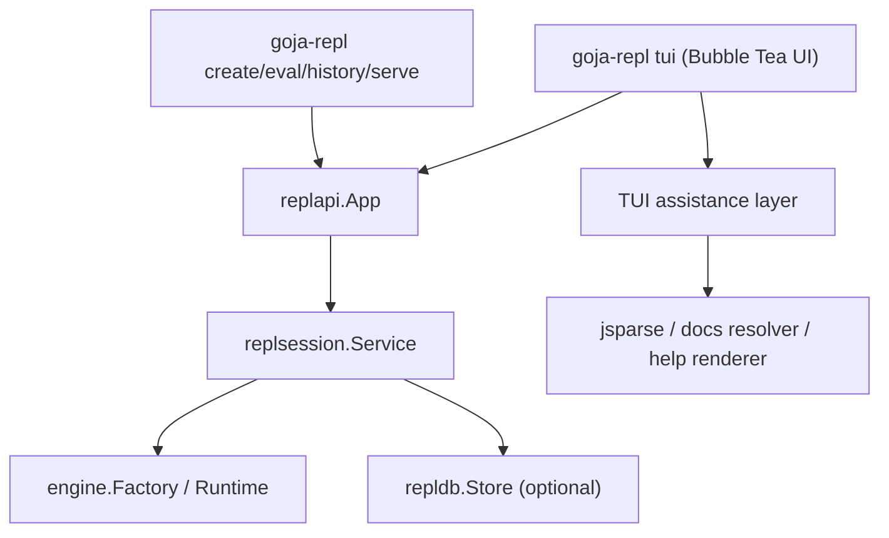

# js-repl migration to replapi and goja-repl tui unification guide

## Executive Summary

This ticket is the integration phase that turns the new REPL core into the actual product baseline. The repository currently has two strong but incomplete halves:

1. a modern shared session stack built around `replapi`, `replsession`, `repldb`, and `goja-repl`
2. a richer interactive Bubble Tea interface in `cmd/js-repl` that still runs through the older monolithic JavaScript evaluator stack

The core recommendation is:

- move `cmd/js-repl` execution and session ownership onto `replapi`
- keep the Bubble Tea UI, completion, help bar, and help drawer behavior
- fold the TUI into the `goja-repl` binary as `goja-repl tui`
- after migration, delete the obsolete standalone `cmd/js-repl` entrypoint and the remaining prototype-only execution paths

This design is intentionally not a rewrite of the UI. It is a backend migration and product-surface consolidation. The Bobatea UI remains the interactive surface. `replapi` becomes the single execution/session boundary. `goja-repl` becomes the single user-facing binary for:

- persistent CLI commands
- JSON server mode
- rich interactive TUI mode

For a new engineer, the crucial idea is that this ticket is not about inventing a third REPL architecture. It is about removing the last major mismatch between the repository's best UI and its best runtime/session model.

## Problem Statement

The repository currently exposes three overlapping REPL entrypoints, and they do not share one execution model:

- `cmd/js-repl` is the rich Bubble Tea UI
- `cmd/repl` is the simple line REPL
- `cmd/goja-repl` is the persistent CLI and JSON server

The problem is not simply that there are multiple binaries. The real problem is that the richest frontend still uses the older evaluator stack instead of the new shared session architecture.

### Observed current state

The Bubble Tea frontend in `/home/manuel/workspaces/2026-04-03/js-repl-smailnail/go-go-goja/cmd/js-repl/main.go:42-125` constructs:

- plugin/runtime help setup
- a JavaScript evaluator config
- a Bobatea evaluator adapter
- a `repl.NewModel(...)` Bubble Tea model
- an event bus and timeline forwarder

The key architectural boundary there is that the UI talks to `pkg/repl/adapters/bobatea/javascript.go`, which is only a thin adapter over `pkg/repl/evaluators/javascript/evaluator.go`:

- adapter creation in `/home/manuel/workspaces/2026-04-03/js-repl-smailnail/go-go-goja/pkg/repl/adapters/bobatea/javascript.go:15-27`
- streaming evaluation passthrough in `/home/manuel/workspaces/2026-04-03/js-repl-smailnail/go-go-goja/pkg/repl/adapters/bobatea/javascript.go:34-63`

That evaluator still owns all of these responsibilities at once:

- runtime construction
- console setup
- evaluation
- top-level await wrapping
- promise polling
- runtime declaration observation
- completion
- help bar generation
- help drawer generation
- docs resolution

This concentration is visible in `/home/manuel/workspaces/2026-04-03/js-repl-smailnail/go-go-goja/pkg/repl/evaluators/javascript/evaluator.go:58-85` and `/home/manuel/workspaces/2026-04-03/js-repl-smailnail/go-go-goja/pkg/repl/evaluators/javascript/evaluator.go:234-418`.

By contrast, `goja-repl` already has the desired architectural split. In `/home/manuel/workspaces/2026-04-03/js-repl-smailnail/go-go-goja/cmd/goja-repl/root.go:40-122`, the root command:

- defines one binary surface
- builds a runtime factory
- opens the SQLite store
- constructs `replapi.New(...)`
- explicitly chooses `replapi.ProfilePersistent`

`replapi` itself is already profile-based and intended as the stable product boundary:

- profile definitions in `/home/manuel/workspaces/2026-04-03/js-repl-smailnail/go-go-goja/pkg/replapi/config.go:12-19`
- profile presets in `/home/manuel/workspaces/2026-04-03/js-repl-smailnail/go-go-goja/pkg/replapi/config.go:45-84`
- app/session operations in `/home/manuel/workspaces/2026-04-03/js-repl-smailnail/go-go-goja/pkg/replapi/app.go:22-206`

The line REPL has already made the simpler migration. In `/home/manuel/workspaces/2026-04-03/js-repl-smailnail/go-go-goja/cmd/repl/main.go:92-99` and `/home/manuel/workspaces/2026-04-03/js-repl-smailnail/go-go-goja/cmd/repl/main.go:102-180`, it now uses `replapi.ProfileInteractive` and delegates evaluation to `app.Evaluate(...)`.

### Why this matters

As long as `cmd/js-repl` stays on the old path, the repository has:

- two different notions of REPL execution
- two different promise/await paths
- two different console behaviors
- two different session-ownership stories
- duplicated runtime wiring logic

That blocks the end-state the earlier tickets were aiming for:

- one session kernel
- one configurable API
- one primary CLI binary
- prototype-only code removed

## Proposed Solution

The proposed solution has two parts that should be implemented in one ticket because they reinforce each other:

1. Migrate the Bubble Tea TUI from the monolithic evaluator stack to `replapi`
2. Merge the TUI into the `goja-repl` binary as `goja-repl tui`

The migration should preserve the UI and assistance surfaces while replacing the execution/session backend.

### Product shape after this ticket

After this ticket, the repository should expose the following user-facing model:

```text
goja-repl
  create
  eval
  sessions
  snapshot
  history
  bindings
  docs
  export
  restore
  serve
  tui
```

The old `cmd/js-repl` binary should no longer be the primary entrypoint. It can either:

- become a very small transitional wrapper around `goja-repl tui`, or
- be deleted directly in the cleanup phase of this ticket

The second outcome is preferable unless there is a specific release-management reason to keep the old command for one short transition.

### Architectural target



This diagram captures the main refactor. Execution moves downward into `replapi` and `replsession`. Completion/help stays attached to the TUI assistance layer.

### Core design principle

Do not migrate the TUI by trying to teach `replapi` how to do Bubble Tea-specific UI assistance. That would make `replapi` less clean, not more.

Instead, split the current `js-repl` backend into two conceptual roles:

- **session execution role**
  - create session
  - evaluate source
  - access history/bindings/docs
  - restore persisted sessions
- **editor assistance role**
  - complete input
  - build help bar payloads
  - build help drawer documents
  - resolve doc metadata for input under the cursor

The execution role should move to `replapi`.
The editor assistance role should remain TUI-local at first.

### Recommended internal package shape

The cleanest implementation is to introduce a new TUI-facing adapter package rather than forcing Bobatea to talk directly to `replapi.App`.

Suggested package:

```text
pkg/repl/adapters/bobatea/replapi
```

Suggested responsibilities:

- own one `*replapi.App`
- own one live session ID
- implement the Bobatea `Evaluator` contract for execution
- optionally depend on a separate assistance provider for completion/help
- translate `EvaluateResponse` into Bobatea timeline events

Suggested components:

```go
type RuntimeAdapter struct {
    app       *replapi.App
    sessionID string
    assist    *AssistanceProvider
}

type AssistanceProvider struct {
    parser       *jsparse.TSParser
    docsResolver *docsResolver
    runtimeHints RuntimeHintSource
}
```

The important point is that the TUI adapter should stop owning the JavaScript runtime directly. It should own a session handle, not a VM.

### API shape for the TUI command

Within `cmd/goja-repl`, add a dedicated `tui` command with flags that mirror the existing `cmd/js-repl` operational needs while using the unified root command style:

```go
goja-repl tui \
  --db-path goja-repl.sqlite \
  --profile interactive \
  --plugin-dir ... \
  --allow-plugin-module ... \
  --log-level error
```

Recommended command semantics:

- default profile: `interactive`
- optional `--db-path`: if present and profile is persistent, enable durable sessions
- optional `--session-id`: restore or attach to a specific session
- optional `--new-session`: force creation of a fresh session
- optional `--no-alt-screen`: mirror current `BOBATEA_NO_ALT_SCREEN` behavior with an explicit flag
- keep plugin discovery flags on the unified root command so CLI/server/TUI all share them

### TUI execution behavior

When the user submits input in the Bubble Tea interface:

1. the adapter calls `app.Evaluate(ctx, sessionID, source)`
2. the returned cell response is converted into Bobatea timeline events
3. console events are rendered into timeline output
4. the final result is rendered into timeline output
5. if the current profile is persistent, the UI can also surface session/history metadata later without inventing another backend

Conceptual pseudocode:

```go
func (a *RuntimeAdapter) EvaluateStream(ctx context.Context, code string, emit func(repl.Event)) error {
    resp, err := a.app.Evaluate(ctx, a.sessionID, code)
    if err != nil {
        emit(markdownError(err))
        return nil
    }

    for _, event := range resp.Cell.Execution.Console {
        emit(consoleEventToTimeline(event))
    }

    if resp.Cell.Execution.Error != "" {
        emit(markdownError(errors.New(resp.Cell.Execution.Error)))
        return nil
    }

    if strings.TrimSpace(resp.Cell.Execution.Result) != "" &&
        resp.Cell.Execution.Result != "undefined" {
        emit(markdownResult(resp.Cell.Execution.Result))
    }

    return nil
}
```

### TUI completion/help behavior

The existing completion and help stack should not be thrown away. It is one of the repository's strongest UI features.

Today it relies on:

- Tree-sitter parsing
- `jsparse.Analyze(...)`
- runtime candidate augmentation
- docs resolver lookups

This logic currently lives mostly in `/home/manuel/workspaces/2026-04-03/js-repl-smailnail/go-go-goja/pkg/repl/evaluators/javascript/evaluator.go:386-420` and later sections of the file. The migration should keep the algorithms but relocate ownership.

Recommended approach:

- extract the assistance logic into a smaller package or helper type
- make it accept explicit dependencies rather than a monolithic evaluator
- feed it the minimum required runtime hints

One likely intermediate design is:

```go
type AssistanceProvider struct {
    parser       *jsparse.TSParser
    docsResolver *docsResolver
    runtimeHints func() map[string]jsparse.CompletionCandidate
}

func (p *AssistanceProvider) CompleteInput(...) (...)
func (p *AssistanceProvider) GetHelpBar(...) (...)
func (p *AssistanceProvider) GetHelpDrawer(...) (...)
```

That lets the TUI keep its assistance behavior while evaluation moves to `replapi`.

### Session model inside the TUI

The TUI should stop behaving like "one anonymous evaluator instance". It should behave like "one UI attached to one `replapi` session".

That unlocks future user-visible features cleanly:

- reopen a prior session
- switch between fresh and durable sessions
- expose history and bindings views
- show current profile in the UI
- restore a session after process restart

For this ticket, the minimal requirement is:

- one active session per TUI run
- explicit creation or restore at startup
- no hidden evaluator-owned runtime state outside the session core

### Binary unification details

`goja-repl` already has the right shape for the unified binary:

- Cobra root command
- shared plugin flags
- shared logging setup
- help integration
- one `commandSupport.newApp()` path

The TUI command should be added there rather than re-creating a separate `flag`-based main. That eliminates one of the repository's current structural mismatches:

- `cmd/goja-repl` is already command-oriented and shared-runtime-aware
- `cmd/js-repl` still parses flags independently and rebuilds runtime setup manually

This means the migration is also a CLI hygiene improvement.

## Current-State Analysis

### 1. `cmd/js-repl` is UI-rich but backend-monolithic

Observed behavior from `/home/manuel/workspaces/2026-04-03/js-repl-smailnail/go-go-goja/cmd/js-repl/main.go:59-112`:

- it builds plugin/runtime help sources directly
- it constructs a `js.DefaultConfig()`
- it creates the Bobatea evaluator adapter
- it constructs the Bubble Tea model and timeline bus directly

Implication:

- the entrypoint is tightly coupled to the old evaluator implementation
- command-line surface and runtime construction are not shared with `goja-repl`

### 2. The current Bobatea adapter is only a thin wrapper over the old evaluator

Observed behavior from `/home/manuel/workspaces/2026-04-03/js-repl-smailnail/go-go-goja/pkg/repl/adapters/bobatea/javascript.go:15-71`:

- the adapter owns `*js.Evaluator`
- it simply delegates evaluate/completion/help calls
- it does not understand `replapi`, sessions, persistence, or restore

Implication:

- the adapter layer is the best place to swap in the new backend without touching the Bubble Tea model itself

### 3. The old evaluator still conflates too many concerns

Observed behavior from `/home/manuel/workspaces/2026-04-03/js-repl-smailnail/go-go-goja/pkg/repl/evaluators/javascript/evaluator.go:103-176` and `/home/manuel/workspaces/2026-04-03/js-repl-smailnail/go-go-goja/pkg/repl/evaluators/javascript/evaluator.go:234-383`:

- runtime ownership lives in the evaluator
- console wiring lives in the evaluator
- top-level await wrapping lives in the evaluator
- promise polling lives in the evaluator
- streaming timeline conversion lives in the evaluator

Implication:

- migration is mainly an extraction/decomposition task, not a UI task

### 4. `goja-repl` already has the right binary and app-construction pattern

Observed behavior from `/home/manuel/workspaces/2026-04-03/js-repl-smailnail/go-go-goja/cmd/goja-repl/root.go:40-122`:

- one root command owns flags and logging
- one helper constructs the runtime factory and `replapi`
- subcommands are registered in one place

Implication:

- `tui` belongs here
- the existing root command is the natural host for unification

### 5. `replapi` already expresses the needed execution profiles

Observed behavior from `/home/manuel/workspaces/2026-04-03/js-repl-smailnail/go-go-goja/pkg/replapi/config.go:21-183` and `/home/manuel/workspaces/2026-04-03/js-repl-smailnail/go-go-goja/pkg/replapi/app.go:59-206`:

- sessions can be raw, interactive, or persistent
- restore is already supported through `ensureLiveSession(...)`
- bindings/docs/history/export are already modeled

Implication:

- the TUI does not need a special execution engine anymore
- it needs a frontend adapter for the already-existing app layer

## Gap Analysis

The gap between current state and desired state is concrete and finite.

### Gap 1: TUI execution path is not using session-aware evaluation

Current:

- `cmd/js-repl` evaluates through `js.Evaluator`

Desired:

- TUI evaluation uses `app.Evaluate(...)`

Missing work:

- new Bobatea adapter backed by `replapi`

### Gap 2: TUI assistance logic is trapped inside the old evaluator type

Current:

- completion/help logic depends on the evaluator owning runtime + parser + docs resolver

Desired:

- assistance logic can survive independently of the old execution path

Missing work:

- extract or re-host assistance functionality into a separate provider

### Gap 3: Binary surfaces are split across Cobra and `flag`

Current:

- `cmd/goja-repl` uses Cobra/Glazed
- `cmd/js-repl` uses raw `flag`

Desired:

- `goja-repl tui` under the same root

Missing work:

- move TUI startup into a new `tui` subcommand

### Gap 4: Operational settings are duplicated

Current:

- plugin flags and help-system setup are duplicated across binaries

Desired:

- one construction path

Missing work:

- share runtime/plugin/help setup under the unified binary

## Proposed Architecture and APIs

### New package and command layout

Recommended file-level target:

```text
cmd/goja-repl/
  main.go
  root.go
  tui.go                # new tui command and startup

pkg/repl/adapters/bobatea/
  replapi.go            # new runtime-backed Bobatea adapter
  assistance.go         # extracted completion/help provider

cmd/js-repl/
  # delete, or reduce to a tiny wrapper during a very short transition

pkg/repl/evaluators/javascript/
  # shrink or delete after assistance extraction
```

The exact file names can vary, but the ownership split should not.

### Adapter contract

The Bobatea-facing adapter should implement the same interfaces the current adapter implements:

```go
var _ bobarepl.Evaluator = (*RuntimeAdapter)(nil)
var _ bobarepl.InputCompleter = (*RuntimeAdapter)(nil)
var _ bobarepl.HelpBarProvider = (*RuntimeAdapter)(nil)
var _ bobarepl.HelpDrawerProvider = (*RuntimeAdapter)(nil)
```

That keeps the Bubble Tea model stable.

### App construction contract

Add a root-level helper in `cmd/goja-repl` that can construct a configured `replapi.App` without forcing persistence for every use case.

Suggested shape:

```go
type appProfile string

const (
    appProfileInteractive appProfile = "interactive"
    appProfilePersistent  appProfile = "persistent"
)

func (s commandSupport) newAppForProfile(profile replapi.Profile) (*replapi.App, *repldb.Store, error)
```

This is important because `goja-repl` currently assumes persistent mode in `newApp()`. The TUI should normally default to interactive mode, with an explicit persistent option when desired.

### TUI command contract

Suggested fields:

```go
type tuiSettings struct {
    Profile     string `glazed:"profile"`
    SessionID   string `glazed:"session-id"`
    NewSession  bool   `glazed:"new-session"`
    NoAltScreen bool   `glazed:"no-alt-screen"`
}
```

Behavior:

- `profile=interactive`:
  - no store required
  - fresh in-memory session unless `session-id` is explicitly supplied and a store is configured
- `profile=persistent`:
  - store required
  - if `session-id` exists, restore/attach
  - otherwise create a new durable session

### Startup flow pseudocode

```go
func runTUI(ctx context.Context, settings tuiSettings) error {
    profile := chooseProfile(settings.Profile)
    app, store, err := support.newAppForProfile(profile)
    if err != nil {
        return err
    }
    defer closeStoreIfPresent(store)

    sessionID, err := resolveInitialSession(ctx, app, settings)
    if err != nil {
        return err
    }

    evaluator := bobatea_replapi.NewRuntimeAdapter(
        app,
        sessionID,
        bobatea_replapi.WithAssistance(newAssistanceProvider(...)),
    )
    defer evaluator.Close()

    model := repl.NewModel(evaluator, buildTUIConfig(...), publisher)
    return runBubbleTeaProgram(ctx, model, settings.NoAltScreen)
}
```

### Session-resolution pseudocode

```go
func resolveInitialSession(ctx context.Context, app *replapi.App, settings tuiSettings) (string, error) {
    switch {
    case settings.NewSession:
        s, err := app.CreateSession(ctx)
        if err != nil {
            return "", err
        }
        return s.ID, nil
    case strings.TrimSpace(settings.SessionID) != "":
        if _, err := app.Snapshot(ctx, settings.SessionID); err == nil {
            return settings.SessionID, nil
        }
        s, err := app.Restore(ctx, settings.SessionID)
        if err != nil {
            return "", err
        }
        return s.ID, nil
    default:
        s, err := app.CreateSession(ctx)
        if err != nil {
            return "", err
        }
        return s.ID, nil
    }
}
```

### Timeline event mapping

The old evaluator currently formats evaluation output directly into Bobatea markdown result events. The new adapter should do the same translation from `EvaluateResponse`.

Recommended mapping:

- console messages -> `EventResultMarkdown` or dedicated console-style event if Bobatea supports it
- execution error -> error markdown event
- non-empty result -> result markdown event
- optional future enhancement:
  - bindings/history/session metadata -> richer timeline sidecar events

### Assistance extraction plan

Do not try to fully redesign completion/help in this ticket. That would enlarge the scope unnecessarily.

Instead:

1. extract existing assistance logic into one helper type
2. make that helper independent of direct evaluation
3. let it consume runtime hints from the live session runtime if needed
4. keep behavioral parity first

This keeps the migration tractable.

## Design Decisions

### Decision 1: Keep Bubble Tea UI, replace backend

Rationale:

- it preserves the best part of `js-repl`
- it avoids rewriting the Bobatea model
- it attacks the duplication at the right layer

### Decision 2: Make `goja-repl` the one primary binary

Rationale:

- `goja-repl` already has the best command/root structure
- the persistent CLI/server work already lives there
- adding `tui` makes the product surface coherent

### Decision 3: Keep assistance logic out of `replapi`

Rationale:

- completion/help are frontend concerns
- `replapi` should stay transport-neutral and session-focused
- TUI logic should not distort the shared execution API

### Decision 4: Prefer an adapter migration over Bobatea model changes

Rationale:

- lower risk
- easier to test
- simpler rollback if needed

### Decision 5: Delete the old standalone command after the migration is validated

Rationale:

- the user's stated end-state is removal
- keeping both commands indefinitely reintroduces ambiguity
- this ticket should materially reduce architectural duplication

## Implementation Plan

### Phase 1: Introduce a `replapi`-backed Bobatea adapter

Goal:

- keep the current Bubble Tea model untouched
- swap execution/session handling underneath it

Work:

1. add `pkg/repl/adapters/bobatea/replapi.go`
2. define `RuntimeAdapter` around `*replapi.App` and `sessionID`
3. implement `EvaluateStream(...)`
4. initially stub or forward assistance behavior from extracted helpers
5. add adapter-focused tests

Files:

- `/home/manuel/workspaces/2026-04-03/js-repl-smailnail/go-go-goja/pkg/repl/adapters/bobatea`
- `/home/manuel/workspaces/2026-04-03/js-repl-smailnail/go-go-goja/pkg/replapi`

### Phase 2: Extract completion/help into an assistance provider

Goal:

- preserve `js-repl` UX without keeping evaluator-owned execution

Work:

1. move completion/help logic out of `pkg/repl/evaluators/javascript/evaluator.go`
2. introduce explicit dependencies:
   - parser
   - docs resolver
   - runtime hint source
3. keep behavior-compatible tests

Files:

- `/home/manuel/workspaces/2026-04-03/js-repl-smailnail/go-go-goja/pkg/repl/evaluators/javascript`
- `/home/manuel/workspaces/2026-04-03/js-repl-smailnail/go-go-goja/pkg/repl/adapters/bobatea`

### Phase 3: Add `goja-repl tui`

Goal:

- make the unified binary the official user-facing entrypoint

Work:

1. add `tui` command in `cmd/goja-repl`
2. share plugin/help/runtime setup with the root command
3. support interactive and persistent profiles
4. support startup session selection
5. verify that the TUI still works under tmux as recommended by project instructions

Files:

- `/home/manuel/workspaces/2026-04-03/js-repl-smailnail/go-go-goja/cmd/goja-repl/root.go`
- `/home/manuel/workspaces/2026-04-03/js-repl-smailnail/go-go-goja/cmd/goja-repl`

### Phase 4: Switch users off `cmd/js-repl`

Goal:

- remove split ownership and duplicated runtime bootstrap

Work:

1. remove `cmd/js-repl`, or make it a very short-lived wrapper if absolutely necessary
2. update docs/help text/examples
3. confirm no tests or docs still rely on the old path

### Phase 5: Cleanup old evaluator ownership

Goal:

- reduce the old evaluator to assistance-only code, or delete it if fully superseded

Work:

1. delete unused evaluation/runtime code from the old evaluator package
2. delete dead tests
3. keep only the assistance pieces that are still genuinely needed

## Testing and Validation Strategy

This migration needs three test layers.

### 1. Adapter-level tests

Test the new Bobatea adapter directly:

- `EvaluateStream(...)` emits result events for successful evaluation
- console events are surfaced correctly
- execution errors are surfaced correctly
- session reuse works across multiple evaluations
- persistent mode can restore an existing session

### 2. TUI command integration tests

Focus on startup and wiring, not pixel-perfect UI behavior:

- `goja-repl tui` can start with interactive profile
- `goja-repl tui --profile persistent --db-path ...` can start and attach a session
- plugin/help flags still flow through

Use tmux for manual smoke tests per repository guidance.

Recommended manual validation commands:

```bash
tmux new-session -d -s goja-repl-tui 'cd /home/manuel/workspaces/2026-04-03/js-repl-smailnail/go-go-goja && go run ./cmd/goja-repl tui --log-level error'
tmux capture-pane -pt goja-repl-tui
tmux send-keys -t goja-repl-tui '1 + 2' Enter
tmux capture-pane -pt goja-repl-tui
tmux kill-session -t goja-repl-tui
```

### 3. Regression tests for assistance behavior

Focus on preserving the best current UX:

- completion still resolves runtime identifiers
- completion still resolves documented plugin/module entries
- help bar still renders current symbol information
- help drawer still builds useful context documents

### 4. End-to-end persistent flow

At least one test should cover:

1. `goja-repl tui --profile persistent`
2. evaluate stateful cells
3. exit
4. reopen by session ID
5. verify restore behavior

## Risks, Alternatives, and Open Questions

### Main risks

#### Risk 1: Assistance extraction could become a rabbit hole

This is the sharpest edge in the ticket. The old evaluator has execution and assistance logic mixed together. The migration should resist redesigning completions/help from scratch.

Mitigation:

- preserve behavior first
- extract mechanically before improving
- keep adapter and assistance work as separate commits

#### Risk 2: Persistent/in-memory TUI semantics could get muddled

If the TUI tries to be both "always persistent" and "usually scratch" without a clear startup contract, the command surface will get confusing.

Mitigation:

- default to `interactive`
- make persistence explicit with profile and `--db-path`

#### Risk 3: Temporary duplication during migration

There may be a short period where both the old evaluator and the new adapter coexist.

Mitigation:

- keep the migration phases tight
- delete the old entrypoint in the same ticket once the new path is validated

### Alternatives considered

#### Alternative A: Keep `cmd/js-repl` as a separate binary forever

Rejected because:

- it preserves duplicate bootstrap logic
- it leaves product ownership split
- it weakens the "one binary" goal the user explicitly asked for

#### Alternative B: Teach `replapi` about completions/help directly

Rejected because:

- completions/help are frontend/editor concerns
- it would pollute the shared session API
- it would make CLI/server layers carry UI-specific concepts

#### Alternative C: Rewrite the Bubble Tea UI around a new model

Rejected because:

- unnecessary scope
- higher risk
- no clear payoff compared to an adapter migration

### Open questions

1. Should `goja-repl tui` expose a visible session selector UI in this ticket, or only startup flags?
2. Should `cmd/repl` remain after `goja-repl tui` exists, or be folded away later?
3. Is a one-release compatibility shim for `cmd/js-repl` useful, or should removal be immediate?

Recommended answers for this ticket:

- no in-UI session selector yet; use startup flags first
- keep `cmd/repl` for now, decide later
- remove `cmd/js-repl` directly if tests and docs are updated cleanly

## References

### Key code files

- `/home/manuel/workspaces/2026-04-03/js-repl-smailnail/go-go-goja/cmd/js-repl/main.go`
- `/home/manuel/workspaces/2026-04-03/js-repl-smailnail/go-go-goja/cmd/goja-repl/root.go`
- `/home/manuel/workspaces/2026-04-03/js-repl-smailnail/go-go-goja/cmd/repl/main.go`
- `/home/manuel/workspaces/2026-04-03/js-repl-smailnail/go-go-goja/pkg/repl/adapters/bobatea/javascript.go`
- `/home/manuel/workspaces/2026-04-03/js-repl-smailnail/go-go-goja/pkg/repl/evaluators/javascript/evaluator.go`
- `/home/manuel/workspaces/2026-04-03/js-repl-smailnail/go-go-goja/pkg/replapi/app.go`
- `/home/manuel/workspaces/2026-04-03/js-repl-smailnail/go-go-goja/pkg/replapi/config.go`
- `/home/manuel/workspaces/2026-04-03/js-repl-smailnail/go-go-goja/pkg/replsession/policy.go`

### Preceding ticket docs

- `/home/manuel/workspaces/2026-04-03/js-repl-smailnail/go-go-goja/ttmp/2026/04/03/GOJA-20-WEBREPL-ARCHITECTURE--web-repl-architecture-analysis-and-third-party-integration-guide/design-doc/02-cli-and-server-first-persistent-repl-architecture-and-implementation-guide.md`
- `/home/manuel/workspaces/2026-04-03/js-repl-smailnail/go-go-goja/ttmp/2026/04/03/GOJA-22-PERSISTENT-REPL-CLI-SERVER--persistent-repl-cli-and-json-server-surfaces/design-doc/01-cli-and-json-server-implementation-plan.md`
- `/home/manuel/workspaces/2026-04-03/js-repl-smailnail/go-go-goja/ttmp/2026/04/03/GOJA-23-CONFIGURABLE-REPLAPI--configurable-replapi-profiles-and-policies/design-doc/01-configurable-replapi-profiles-and-policies-implementation-plan.md`

## Design Decisions

<!-- Document key design decisions and rationale -->

## Alternatives Considered

<!-- List alternative approaches that were considered and why they were rejected -->

## Implementation Plan

<!-- Outline the steps to implement this design -->

## Open Questions

<!-- List any unresolved questions or concerns -->

## References

<!-- Link to related documents, RFCs, or external resources -->
