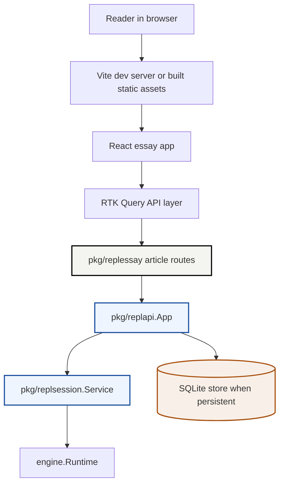
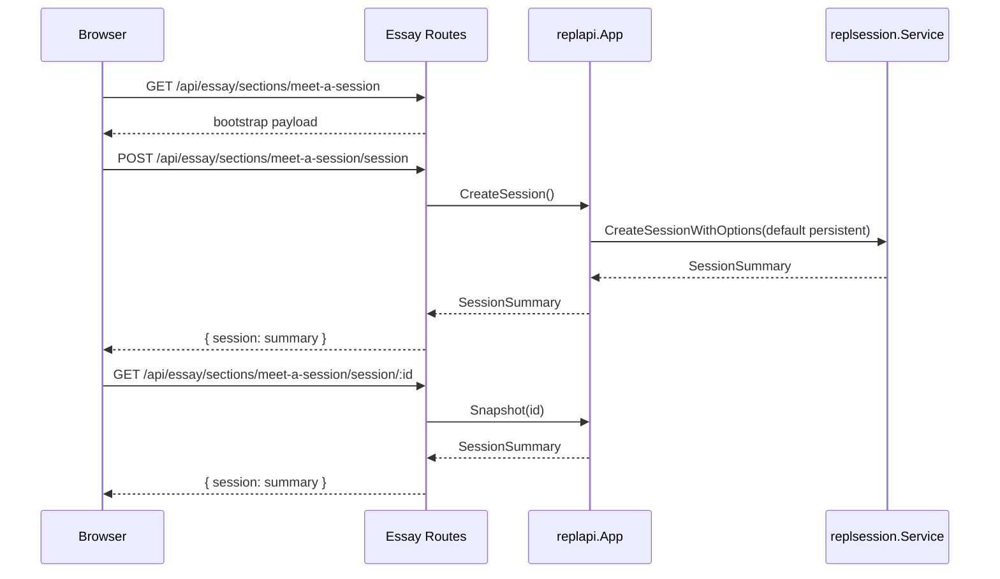
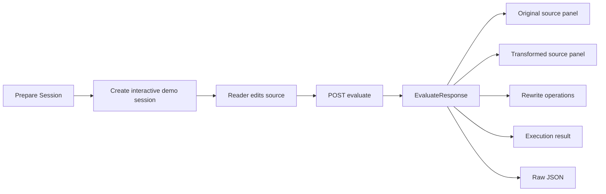

# Goja REPL Essay

This project is an implementation of a live technical essay for the new `goja-repl` session system. The essay is not meant to be a marketing page or a mock demo. It is meant to be a teaching surface that exercises the real backend API so a reader can learn how the REPL works while simultaneously validating that the implementation behaves as designed.

> [!summary]
> The essay currently has two concrete identities:
> 1. a new backend mode, `goja-repl essay`, that exposes article-specific routes around the real REPL app
> 2. a React + RTK Query + Storybook frontend that renders the essay as a readable technical document with live backend instruments
>
> As of this note:
> - Section 1 is committed and working
> - Section 2 and Section 3 are implemented locally but not yet committed

## Why this project exists

The new REPL subsystem became substantially more capable after the persistence fixes, timeout work, and cleanup/refactor passes. That improved the implementation, but it did not by itself produce a good teaching artifact. A new engineer still had to read multiple packages and multiple ticket docs just to answer basic questions such as:

- what exactly is a session?
- which part of the system owns profile selection?
- what does the browser call?
- what comes back from evaluation besides a final result?
- where does the transformed source come from?
- which behaviors are REPL conveniences and which are actual backend invariants?

The essay project exists to close that gap. The page should behave like a technical chapter with live instruments. The correct reader experience is: read a paragraph, press a button, and see the exact backend object or report that the paragraph was describing.

## Current project status

### Committed and stable

The committed baseline is `36e57b9 feat(essay): add section 1 interactive article shell`.

That commit introduced:

- a new CLI command:
  - `go run ./cmd/goja-repl essay`
- a new backend package:
  - `pkg/replessay`
- a new frontend workspace:
  - `web/`
- a Storybook/MSW design-and-development loop for the article UI
- a real Section 1:
  - “Meet a Session”

Section 1 already does real work against the backend:

- loads article bootstrap metadata
- creates a real session through an article-scoped route
- fetches a live session snapshot
- renders:
  - a compact session summary
  - a policy view
  - the raw JSON payload
  - a long field-guide style technical explanation

### Implemented locally but not yet committed

The current working tree also contains a second implementation slice that extends the essay with:

- Section 2:
  - “Profiles Change Behavior”
- Section 3:
  - “What Happened To My Code?”

That local work adds:

- article-only profile override creation routes
- profile comparison bootstrap data
- code-evaluation bootstrap data
- article-specific evaluation session creation
- article-specific evaluate route wiring
- new frontend feature modules for profile comparison and evaluation reporting
- new stories for those features and their primitives

At the time of writing this note, those changes are in the working tree and compile locally, but they are not yet committed.

## Project shape

At a high level, the essay now has four layers:

1. the real REPL application layer
2. a thin article-specific backend adapter layer
3. a React client that treats the page as a technical essay rather than a dashboard
4. a Storybook/MSW layer that lets the frontend be inspected independently of the live backend

The important architectural decision is that the essay does **not** reimplement REPL semantics in the browser. The backend remains the source of truth. The frontend is responsible for:

- orchestration
- presentation
- prose
- synchronized visualization of backend responses

The backend remains responsible for:

- session creation
- policy selection
- evaluation
- rewrite reporting
- runtime reporting
- persistence behavior

## Architecture



The architectural boundary to pay attention to is `pkg/replessay`. That package is intentionally small. It should not become a second REPL implementation. Its job is to expose article-friendly route groupings, stable section bootstrap payloads, and minimal wrapper endpoints around the real `replapi.App`.

## Backend architecture

The backend essay entry point lives in `cmd/goja-repl/essay.go`.

It does four things:

1. builds the same underlying app/store combination as the normal REPL commands
2. constructs a `pkg/replessay` handler
3. starts a small HTTP server
4. shuts it down cleanly on `SIGINT` / `SIGTERM`

This is intentionally boring. The command should be operational glue, not a second application framework.

### Key backend files

- `cmd/goja-repl/essay.go`
- `cmd/goja-repl/root.go`
- `pkg/replessay/handler.go`
- `pkg/replessay/handler_test.go`
- `pkg/replapi/app.go`
- `pkg/replhttp/handler.go`
- `pkg/replsession/types.go`
- `pkg/replsession/policy.go`

### Current backend route shape

#### Committed

Section 1 route family:

- `GET /essay/meet-a-session`
- `GET /api/essay/sections/meet-a-session`
- `POST /api/essay/sections/meet-a-session/session`
- `GET /api/essay/sections/meet-a-session/session/:id`

Raw REPL routes are also mounted underneath the essay server:

- `POST /api/sessions`
- `GET /api/sessions/:id`
- `POST /api/sessions/:id/evaluate`
- and related history/bindings/docs/export routes

That raw mounting matters because it preserves trust. A reader or debugger can compare the article layer against the underlying REPL routes directly.

#### Implemented locally

Section 2 route family:

- `GET /api/essay/sections/profiles-change-behavior`
- `POST /api/essay/sections/profiles-change-behavior/session`
- `GET /api/essay/sections/profiles-change-behavior/session/:id`

Section 3 route family:

- `GET /api/essay/sections/what-happened-to-my-code`
- `POST /api/essay/sections/what-happened-to-my-code/session`
- `GET /api/essay/sections/what-happened-to-my-code/session/:id`
- `POST /api/essay/sections/what-happened-to-my-code/session/:id/evaluate`

The important design constraint here is that the essay routes are **narrow wrappers**. They should do small amounts of payload shaping and section-specific defaults, but the real evaluation semantics must continue to live under `replapi` and `replsession`.

## Frontend architecture

The frontend lives in `web/` and uses:

- React
- TypeScript
- Redux Toolkit
- RTK Query
- Storybook
- MSW
- Vite

This is a deliberate split between three concerns:

1. **live runtime**
   - `pnpm -C web dev`
   - talks to the essay backend through proxied `/api/*` calls
2. **production-style build**
   - `pnpm -C web build`
   - emitted to `web/dist/public`
   - served by the Go backend under `/static/essay/*`
3. **component design loop**
   - `pnpm -C web build-storybook`
   - Storybook + MSW for isolated component work

### Key frontend files

- `web/src/app/EssayApp.tsx`
- `web/src/app/api/essayApi.ts`
- `web/src/app/store.ts`
- `web/src/mocks/handlers.ts`
- `web/src/storybook/withEssayProviders.tsx`
- `web/src/theme/tokens.css`
- `web/src/theme/primitives.css`
- `web/src/theme/essay.css`

### Section 1 frontend shape

Section 1 is implemented as `MeetSessionPage`, which currently still acts as the top-level essay composition surface.

Key files:

- `web/src/features/meet-session/MeetSessionPage.tsx`
- `web/src/features/meet-session/components/EssayMasthead.tsx`
- `web/src/features/meet-session/components/AboutEssayCallout.tsx`
- `web/src/features/meet-session/components/SessionSummaryCard.tsx`
- `web/src/features/meet-session/components/PolicyCard.tsx`
- `web/src/features/meet-session/components/SessionJsonPanel.tsx`
- `web/src/features/meet-session/components/MeetSessionFieldGuide.tsx`

The field guide was deliberately rewritten away from “product-card copy” into a more textbook-like article flow. That was an important correction: the user wanted a technical essay, not a dashboard that happened to contain some prose.

### Section 2 and 3 frontend shape

The in-progress second slice introduces two new feature areas:

- `web/src/features/profile-comparison/`
- `web/src/features/code-flow/`

Section 2 introduces:

- a profile selector
- a comparison table
- article-level prose explaining what a profile means
- live session creation using a selected profile override

Section 3 introduces:

- a live source editor
- source-vs-transformed-source panels
- rewrite operation rendering
- execution result summaries
- raw evaluate-response inspection

## Implementation details

This is the part that matters most if someone needs to extend the essay safely.

### Core backend pattern

The essay backend pattern is:

```text
browser action
  -> article route
  -> small request decode / payload shaping
  -> replapi.App call
  -> replsession / engine does the real work
  -> article route returns backend object mostly unchanged
  -> frontend renders prose + instrument panels from the same payload
```

In pseudocode:

```text
HandleArticleCreateSession(request):
    profileOverride = decodeOptionalProfile(request.body)
    summary = app.CreateSessionWithOptions(profileOverride)
    return { session: summary }

HandleArticleEvaluate(request, sessionID):
    source = decodeSource(request.body)
    report = app.Evaluate(sessionID, source)
    return report
```

That may look almost too small, but that is correct. The article layer should stay narrow. The deeper logic belongs elsewhere:

- profile defaults live in `replapi.ConfigForProfile`
- session behavior lives in `replsession.SessionPolicy`
- evaluation semantics live in `replsession`
- persistence semantics live in `repldb`

### Section 1 request flow



The frontend then renders the same `SessionSummary` in three synchronized ways:

- summary card
- policy card
- raw JSON

The teaching point is that the prose is tied to an actual backend object, not to a mocked concept.

### Section 2 request flow

The design improvement introduced by the in-progress slice is an **article-only profile override**. This is the correct place for it because it avoids broadening the general raw HTTP contract prematurely while still letting the essay validate raw vs interactive vs persistent behavior honestly.

In pseudocode:

```text
selected = "raw" | "interactive" | "persistent"
POST /api/essay/sections/profiles-change-behavior/session { profile: selected }
    -> parseProfile(selected)
    -> app.CreateSessionWithOptions(Profile: selected)
    -> return SessionSummary
```

That gives the article an honest demonstration path without forcing the generic `/api/sessions` route to become a more general configuration surface before the product wants it.

### Section 3 request flow

The evaluation walkthrough is built around an explicit live session:



This is the right shape for two reasons.

First, it mirrors the real REPL architecture: evaluations happen inside sessions, not as stateless ad-hoc calls. Second, it creates the correct teaching order. The reader has to understand that the evaluation report belongs to a session with policy and state, not to a detached parser demo.

## Typography and article presentation

The frontend work spent non-trivial effort on typography and article chrome because this project is trying to teach through reading, not only through widgets.

One concrete technical choice was to match the imported reference artifact closely:

- body stack:
  - `Geneva, ChicagoFLF, Chicago, ui-monospace, "SF Mono", Monaco, monospace`
- mono stack:
  - `Monaco, Menlo, "Courier New", monospace`

The important implementation detail is that the active CSS now uses the same literal stack as the reference, but does **not** force a bundled blocky Chicago face as a local override. That was a deliberate correction after a first pass looked too heavy and too synthetic.

The callout text and spacing were also brought back in line with the imported reference. This matters because the article’s credibility depends on quiet readability. Over-designed chrome would work against the goal.

## Storybook and MSW strategy

Storybook is not incidental here. It is a core part of how the essay is being built.

The current Storybook structure covers:

- primitives:
  - `Button`
  - `Card`
  - `Typography`
- essay-specific pieces:
  - `Heading`
  - `Prose`
  - `Callout`
  - `PolicyRow`
- Section 1 widgets:
  - `SessionSummaryCard`
  - `PolicyCard`
  - `SessionJsonPanel`
  - article-section compositions
- in-progress Section 2 and 3 widgets:
  - profile selector
  - profile comparison table
  - source-transform panels
  - rewrite operation list
  - execution result summary

That decomposition is important because the first implementation tried to treat the article body as a single large widget. That was the wrong shape. Splitting the article into smaller parts made the essay inspectable and made the design work more precise.

## Validation strategy

The validation model for this project intentionally uses multiple layers.

### Static / build validation

- `go test ./pkg/replessay`
- `pnpm -C web check`
- `pnpm -C web build`
- `pnpm -C web build-storybook`

### Live validation

- run backend in tmux
- run Vite in tmux
- use Playwright against the real page and real routes

This matters because the essay’s value comes from honest synchronization between prose and behavior. A component that looks correct in Storybook but drifts from the live backend contract is a failure for this project.

## Main design decisions

### 1. Use real backend objects, not frontend reenactments

This is the central decision of the project.

The article should not “explain” a rewrite by synthesizing a fake transformed-source block in the browser. It should read it from the real `EvaluateResponse`.

### 2. Keep the article backend wrapper narrow

`pkg/replessay` should remain a route-shaping layer, not a new domain model. If it grows too much logic, the article stops being a teaching surface and starts becoming a forked application.

### 3. Keep the page prose-first

The page is not a control panel. The live widgets matter, but the dominant reading experience should still be essay flow.

### 4. Let Storybook own component refinement

If design and article-quality iteration happen only in the full live page, the system becomes too hard to tune. Storybook is therefore part of the implementation architecture, not a cosmetic add-on.

## Important project docs

- `ttmp/2026/04/08/GOJA-043-INTERACTIVE-REPL-ESSAY--design-an-interactive-repl-essay-for-learning-and-validating-the-new-repl/index.md`
- `ttmp/2026/04/08/GOJA-043-INTERACTIVE-REPL-ESSAY--design-an-interactive-repl-essay-for-learning-and-validating-the-new-repl/design-doc/01-interactive-repl-essay-analysis-design-and-implementation-guide.md`
- `ttmp/2026/04/08/GOJA-043-INTERACTIVE-REPL-ESSAY--design-an-interactive-repl-essay-for-learning-and-validating-the-new-repl/design-doc/02-ux-handoff-for-the-interactive-repl-essay.md`
- `ttmp/2026/04/08/GOJA-043-INTERACTIVE-REPL-ESSAY--design-an-interactive-repl-essay-for-learning-and-validating-the-new-repl/design-doc/03-frontend-implementation-guide-for-modular-storybook-repl-essay-ui.md`
- `ttmp/2026/04/08/GOJA-043-INTERACTIVE-REPL-ESSAY--design-an-interactive-repl-essay-for-learning-and-validating-the-new-repl/reference/01-investigation-diary.md`
- `ttmp/2026/04/08/repl-hardening-project-report.md`

## Open questions

- Should the top-level page keep using `MeetSessionPage` as its composition root, or should it be renamed now that it contains multiple sections?
- Should the article-only profile override route remain private to the essay, or should the general raw HTTP surface eventually grow a first-class profile-create contract?
- How much more of the evaluation report should be rendered in article-friendly form before the page becomes too dense?
- Should later sections cover history/export/restore directly, or should those be a second essay?

## Near-term next steps

- commit the current Section 2 and Section 3 slice after final live validation
- update the GOJA-043 ticket diary/changelog/tasks to reflect the implemented state
- decide whether the essay should keep one long page or grow into multiple article routes
- continue with later sections only if they preserve the same “real API, prose-first” standard

## Working rule

The essay should always remain a **thin lens over the real REPL**. If a future implementation choice makes the article easier to build but less faithful to the backend contract, that is the wrong tradeoff for this project.
