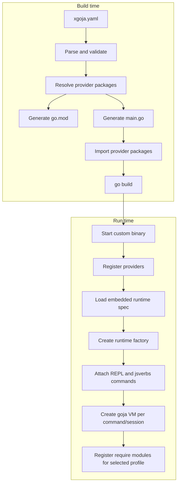

# xgoja Analysis Design and Implementation Guide

## Executive summary

`xgoja` is a builder for Go programs that embed a `goja` JavaScript runtime. Its job is to take a declarative build specification, generate a small Go program that imports selected goja module provider packages, and compile a custom binary where those modules are already present. The user experience should feel like `xcaddy build --with ...`, but the target domain is `goja` native modules, JavaScript verb repositories, REPL commands, and Cobra command trees.

The central design decision is that Go-backed goja modules are selected at **build time**, not loaded into an arbitrary already-built binary. JavaScript files and command metadata can remain runtime inputs, because they do not add new Go machine code. Go native modules, by contrast, become normal Go source dependencies of the generated program. This gives us a single module graph, a normal `go build`, readable generated code, and predictable in-process access to `*goja.Runtime`, `require.Registry`, runtime owners, event loops, Cobra commands, and host services.

The article that motivated this ticket makes the same claim in precise terms: for in-process Go extensions, the reliable boundary is not "load new binary module code into an old process". The reliable boundary is "generate a new Go program that imports the requested modules and build it once." This guide turns that article into an implementation plan for a new intern.

The first implementation should be deliberately small:

1. Parse `xgoja.yaml` into typed structs.
2. Validate the target, packages, runtime profiles, module aliases, and JS verb sources.
3. Generate a temporary build module containing `go.mod`, `main.go`, embedded spec files, and optional embedded JS verb files.
4. Run `go mod tidy` and `go build`.
5. Produce a binary that can run a REPL and/or mount jsverbs commands with the configured runtime profile.

Do not start with native Go `.so` plugins. The repository already has an out-of-process HashiCorp plugin path for plugin-backed modules, and the article explains why native Go plugin compatibility is fragile. `xgoja` should make rebuilds cheap, explicit, and reproducible instead of promising binary surgery.

## Problem statement and scope

A goja host needs to answer a simple user-facing question: "Which JavaScript capabilities are available when my command runs?" Some capabilities are pure JavaScript source files. Others are Go-backed modules such as filesystem, database, HTTP, websocket, UI DSL, or other service bindings. The two classes look similar from JavaScript because both are loaded through `require(...)`, but they have different lifecycle and distribution rules.

A JavaScript verb can be loaded from disk or from an embedded filesystem. It can be edited without rebuilding the host. A Go-backed module cannot be added to a running Go binary in a robust general-purpose way if it needs direct access to host Go types. It must be compiled into the process or isolated behind an explicit protocol.

The requested `xgoja` tool should solve the build-time composition problem:

- It should build a custom binary with multiple goja module provider packages registered.
- It should let users declare packages, versions, replacements, runtime profiles, and command surfaces in YAML.
- It should support dynamic or embedded JS verbs as command definitions.
- It should offer a pure `xgoja` target first, then adapter and Cobra attach modes later.
- It should include diagnostics explaining what was selected and why a build cannot proceed.

Out of scope for the first release:

- Loading arbitrary native Go `.so` plugins into an installed binary.
- Reconstructing a safe plugin build recipe from `debug/buildinfo` alone.
- A stable sandbox ABI for Wasm guests.
- A package manager or remote registry for provider packages.
- Mutating an installed STDBIN in place.

## Reader orientation: the current system in one page

The existing codebase already contains most of the runtime concepts `xgoja` needs. The missing piece is a builder that moves the selection of external provider packages into generated source code.

### Native modules

`go-go-goja/modules/common.go` defines the current native module contract. A native module has a JavaScript require name, documentation, and a `Loader(*goja.Runtime, *goja.Object)` compatible with `goja_nodejs/require`:

- `modules.NativeModule` is defined at `/home/manuel/workspaces/2026-05-22/xgoja/go-go-goja/modules/common.go:28-32`.
- `modules.Registry` stores `NativeModule` values and can enable them on a require registry at `/home/manuel/workspaces/2026-05-22/xgoja/go-go-goja/modules/common.go:34-89`.
- `modules.DefaultRegistry` is a global registry populated by module package `init()` functions at `/home/manuel/workspaces/2026-05-22/xgoja/go-go-goja/modules/common.go:92-114`.

The current pattern is easy to understand: import a module package so its `init()` runs, then register its loader with a `require.Registry`. `xgoja` should preserve compatibility with this pattern, but it should prefer explicit provider registration for external packages because YAML needs to select, alias, configure, and explain modules.

### Runtime factories

`go-go-goja/engine` already has a builder/factory split. A builder accumulates module specs, module middlewares, runtime-scoped registrars, and initializers. `Build()` validates and freezes the plan. A factory creates concrete runtime instances.

Important evidence:

- `FactoryBuilder` and `Factory` hold module specs, module middlewares, runtime registrars, and initializers at `/home/manuel/workspaces/2026-05-22/xgoja/go-go-goja/engine/factory.go:26-44`.
- `WithModules`, `UseModuleMiddleware`, `WithRuntimeModuleRegistrars`, and `WithRuntimeInitializers` are the composition hooks at `/home/manuel/workspaces/2026-05-22/xgoja/go-go-goja/engine/factory.go:68-109`.
- `Build()` validates nil entries and duplicate IDs before returning an immutable plan at `/home/manuel/workspaces/2026-05-22/xgoja/go-go-goja/engine/factory.go:127-192`.
- `NewRuntime()` creates the goja VM, event loop, runtime owner, require registry, runtime module context, default modules, and initializers at `/home/manuel/workspaces/2026-05-22/xgoja/go-go-goja/engine/factory.go:195-288`.

This is the runtime layer `xgoja` should target. The generated binary should not hand-register every low-level goja feature. It should build an `engine.Factory` or a closely related `xgoja/runtime.Factory` from a validated runtime profile.

### Module specs and safe defaults

`engine.ModuleSpec` is the current static registration abstraction. It registers into a `require.Registry` at factory creation time:

```go
type ModuleSpec interface {
    ID() string
    Register(reg *require.Registry) error
}
```

The code also supports default registry selection and safety-oriented module sets:

- `ModuleSpec`, `RuntimeInitializer`, and `NativeModuleSpec` are defined at `/home/manuel/workspaces/2026-05-22/xgoja/go-go-goja/engine/module_specs.go:16-83`.
- Default registry modules can be selected by name and aliases such as `database`/`db`, `fs`/`node:fs`, and `path`/`node:path` at `/home/manuel/workspaces/2026-05-22/xgoja/go-go-goja/engine/module_specs.go:124-172`.
- Data-only defaults are named at `/home/manuel/workspaces/2026-05-22/xgoja/go-go-goja/engine/module_specs.go:210-220`.

This matters because `xgoja` should treat capability selection as a first-class safety boundary. A runtime profile for a REPL may expose more modules than a profile used to execute distributed JS verbs.

### Runtime lifecycle

A runtime is not just a `*goja.Runtime`. It is an owned object with a `require` module, event loop, runtime owner, context, runtime values, and closers:

- The `Runtime` struct is defined at `/home/manuel/workspaces/2026-05-22/xgoja/go-go-goja/engine/runtime.go:31-46`.
- `AddCloser` registers cleanup hooks at `/home/manuel/workspaces/2026-05-22/xgoja/go-go-goja/engine/runtime.go:65-83`.
- `Close` cancels the runtime context, deletes runtime bridge bindings, runs closers, shuts down the owner, and stops the event loop at `/home/manuel/workspaces/2026-05-22/xgoja/go-go-goja/engine/runtime.go:85-122`.

An intern implementing `xgoja` should not bypass this lifecycle. Every generated command path that creates a runtime must close it. Persistent REPL paths may keep a runtime alive longer, but that should be explicit in the command options.

### JS verbs

`jsverbs` turns JavaScript functions and metadata into Glazed/Cobra commands. This is the dynamic command layer `xgoja` should mount into generated binaries.

Key files:

- `jsverbs.ScanDir` and `ScanFS` scan filesystem and embedded repositories at `/home/manuel/workspaces/2026-05-22/xgoja/go-go-goja/pkg/jsverbs/scan.go:17-123`.
- Scan results become a `Registry` with files, diagnostics, shared sections, and verb specs at `/home/manuel/workspaces/2026-05-22/xgoja/go-go-goja/pkg/jsverbs/scan.go:159-192`.
- `jsverbs.Registry.InvokeInRuntime` runs a verb inside a caller-owned runtime at `/home/manuel/workspaces/2026-05-22/xgoja/go-go-goja/pkg/jsverbs/runtime.go:46-110`.
- The source loader injects a small overlay so the runtime can find captured functions at `/home/manuel/workspaces/2026-05-22/xgoja/go-go-goja/pkg/jsverbs/runtime.go:169-214`.
- `jsverbscli.NewCommand` scans repositories, builds a list command, and mounts discovered verbs as Cobra commands at `/home/manuel/workspaces/2026-05-22/xgoja/go-go-goja/pkg/jsverbscli/command.go:49-100`.
- `jsverbscli.newRuntimeFactory` currently hard-codes a runtime module set for verbs: fs, path, time, timer, yaml, optional database aliases, and UI DSL registrar at `/home/manuel/workspaces/2026-05-22/xgoja/go-go-goja/pkg/jsverbscli/runtime.go:44-90`.

For `xgoja`, `jsverbscli` needs one new integration seam: build commands using a caller-provided runtime factory/profile instead of always constructing its own fixed builder.

### Existing dynamic plugin path

The repository also has a HashiCorp go-plugin path. It is out-of-process, not native Go `.so` loading:

- `host.Registrar` discovers plugin binaries and registers plugin-backed runtime modules at `/home/manuel/workspaces/2026-05-22/xgoja/go-go-goja/pkg/hashiplugin/host/registrar.go:11-84`.
- The SDK module definition validates manifests and dispatch tables at `/home/manuel/workspaces/2026-05-22/xgoja/go-go-goja/pkg/hashiplugin/sdk/module.go:34-148`.

This plugin path is useful, but it is not the same as compile-time module composition. It isolates extension code in subprocesses and communicates over a contract. `xgoja` is for direct in-process Go modules that need normal Go imports and direct goja runtime access.

### Current `goja-repl` CLI

The `goja-repl` binary already exposes module selection flags:

- `--plugin-dir`, `--allow-plugin-module`, `--enable-module`, `--disable-module`, and `--safe-mode` are declared at `/home/manuel/workspaces/2026-05-22/xgoja/go-go-goja/cmd/goja-repl/root.go:49-54`.
- `commandSupport.moduleMiddleware()` turns those flags into engine middlewares at `/home/manuel/workspaces/2026-05-22/xgoja/go-go-goja/cmd/goja-repl/root.go:112-126`.
- `newAppWithOptions` creates a builder, applies module middleware, attaches doc access and plugin runtime registrars, builds a factory, and creates a `replapi.App` at `/home/manuel/workspaces/2026-05-22/xgoja/go-go-goja/cmd/goja-repl/root.go:135-178`.

This is useful evidence: the runtime architecture already supports composing modules before runtime creation. `xgoja` should lift that composition up from CLI flags to a declarative build spec and generated source code.

## The mental model: build time versus run time

The most important concept in `xgoja` is the split between build-time composition and runtime instantiation.

Build time decides what Go code exists in the binary. If `web-stuff` provides `fetch`, `websocket`, and `express` as Go-backed modules, the generated program must import `web-stuff` and call a registration function. That import is what brings the machine code into the executable.

Run time decides which profile to use for a specific VM. A built binary may contain many modules, but a given command can expose only a subset. This distinction lets one binary support a broad operator REPL and a narrower JS verb command surface.



This split prevents a common mistake: treating module installation as command invocation. `xgoja build` installs Go-backed capabilities into a binary. Running the binary later chooses a runtime profile and command path.

## Proposed architecture

The project should be organized around four layers: build specification, provider registry, generation/build execution, and generated runtime application.

```text
xgoja/
  cmd/xgoja/                  # CLI: build, doctor, inspect, list-modules
  pkg/buildspec/              # YAML schema, defaults, normalization, validation
  pkg/providerapi/            # Provider Register contract and metadata types
  pkg/runtimeplan/            # Runtime profiles independent of YAML syntax
  pkg/generate/               # go.mod/main.go/embed manifest generation
  pkg/buildexec/              # go command execution, temp dirs, logs
  pkg/app/                    # default generated app/root command helpers
  pkg/cobrax/                 # AttachRepl, AttachJSVerbs, attach-to-root utilities
  pkg/inspect/                # debug/buildinfo inspection and diagnostic reports
  pkg/doctor/                 # spec/build validation without full execution
  testdata/                   # provider stubs, xgoja.yaml fixtures, golden output
```

Provider packages live outside the `xgoja` repo. A provider package can be in `go-go-goja`, `web-stuff`, a user module, or an application-specific repository. The important part is that it exposes a stable registration function.

```text
web-stuff/
  xgoja/
    register.go              # func Register(*providerapi.Registry) error
    fetch.go                 # module provider adapter
    websocket.go             # module provider adapter
    express.go               # module provider adapter
    verbs/
      serve.js               # optional provider-shipped JS verb source
      ws-client.js
```

A generated build directory is disposable. It should be readable enough for debugging, but users should not edit it by hand.

```text
/tmp/xgoja-build-1234/
  go.mod
  main.go
  xgoja.gen.json             # normalized runtime/build subset embedded in binary
  verbs/
    local/...                # copied only for embedded JS verb sources
```

## Core API contracts

### Provider registration contract

The provider API should be explicit. Avoid relying only on package `init()` for external providers because `init()` is global and cannot answer questions like "which modules did this package advertise?", "what config schema does this module expect?", and "what JS verb sources are available?"

Recommended first API:

```go
package providerapi

import (
    "context"
    "encoding/json"

    "github.com/dop251/goja"
    "github.com/dop251/goja_nodejs/require"
)

type RegisterFunc func(*Registry) error

type Registry struct {
    packages map[string]*Package
}

type Package struct {
    ID          string
    ImportPath  string
    Modules     map[string]Module
    VerbSources map[string]VerbSource
}

type Module struct {
    Name        string
    DefaultAs   string
    Description string
    ConfigSchema json.RawMessage
    New         ModuleFactory
}

type ModuleFactory func(ModuleContext) (require.ModuleLoader, error)

type ModuleContext struct {
    Context context.Context
    Name    string
    As      string
    Config  json.RawMessage
    Host    HostServices
    Logger  Logger
}

type VerbSource struct {
    Name        string
    Description string
    FS          fs.FS
    Root        string
}
```

A provider package then looks like this:

```go
package xgoja

import "github.com/go-go-golems/xgoja/pkg/providerapi"

func Register(reg *providerapi.Registry) error {
    return reg.Package("web",
        providerapi.Module{
            Name: "fetch",
            DefaultAs: "fetch",
            Description: "WHATWG-like fetch bindings for goja",
            New: NewFetchModule,
        },
        providerapi.Module{
            Name: "websocket",
            DefaultAs: "ws",
            Description: "WebSocket client bindings",
            New: NewWebSocketModule,
        },
        providerapi.VerbSource{
            Name: "default-verbs",
            Description: "Web command helpers shipped by web-stuff",
            FS: verbsFS,
            Root: "verbs",
        },
    )
}
```

The intern should notice the deliberate separation:

- `Package` means "this Go import can provide capabilities".
- `Module` means "this package advertises a possible require-able native module".
- `Runtime profile module instance` means "this generated binary should expose this module under this alias with this config for this profile".
- `VerbSource` means "this provider can supply JS command files, but YAML decides whether to mount them".

### Runtime plan contract

The runtime plan should be independent of YAML. YAML decoding should produce this structure, but tests should be able to construct it directly.

```go
type BuildSpec struct {
    Name     string
    Go       GoSpec
    Target   TargetSpec
    Packages []PackageSpec
    Runtimes map[string]RuntimeSpec
    Commands CommandSpec
    JSVerbs  []JSVerbSourceSpec
    Replace  []ReplaceSpec
}

type PackageSpec struct {
    ID       string
    Import   string
    Version  string
    Register string // default "Register"
    Replace  string
}

type RuntimeSpec struct {
    Modules []ModuleInstanceSpec
}

type ModuleInstanceSpec struct {
    Package string
    Name    string
    As      string
    Config  map[string]any
}

type CommandSpec struct {
    Repl    ReplCommandSpec
    JSVerbs JSVerbCommandSpec
}
```

The runtime plan should validate these invariants before generation:

- Package IDs are unique.
- Package import paths are non-empty and valid enough to write into Go code.
- Runtime profile names are unique and non-empty.
- Every module instance references a known package ID.
- Every module instance references a module advertised by that package. This requires either running generated provider inspection code or validating in the generated binary startup path for v1.
- Aliases are unique within a runtime profile.
- Command runtime references exist.
- Embedded JS verb source paths exist at build time.
- Disk JS verb source paths either exist during `doctor` or are marked as runtime-only.
- `replace` directives are explicit and only written to the generated main module.

### YAML schema

The YAML is the user interface. It must be stable, boring, and explicit.

```yaml
name: webrepl

go:
  version: "1.26"
  module: example.com/generated/webrepl
  tags: []
  ldflags: []

target:
  kind: xgoja
  output: ./dist/webrepl

packages:
  - id: core
    import: github.com/go-go-golems/go-go-goja/xgoja
    version: v0.1.0

  - id: web
    import: github.com/go-go-golems/web-stuff/xgoja
    version: v0.3.0
    replace: ../web-stuff

runtimes:
  repl:
    modules:
      - package: core
        name: fs
      - package: core
        name: path
      - package: core
        name: yaml
      - package: web
        name: fetch
      - package: web
        name: websocket
        as: ws
        config:
          maxMessageSize: 1048576

  verbs:
    modules:
      - package: core
        name: path
      - package: core
        name: yaml
      - package: web
        name: fetch

commands:
  repl:
    enabled: true
    runtime: repl
    name: repl

  jsverbs:
    enabled: true
    runtime: verbs
    name: verbs
    mount: /

jsverbs:
  - id: builtin
    package: core
    source: builtin

  - id: local
    path: ./verbs
    embed: true

  - id: user
    path: ~/.config/webrepl/verbs
    embed: false
```

A package declaration is not a module declaration. This is worth repeating because it prevents accidental overexposure. A package tells the build which Go import to include. Runtime profiles tell the binary which module instances each command can use.

### Generated `main.go`

The generated `main.go` should be deterministic and readable. A failed build should leave enough information for an intern to understand what happened.

```go
package main

import (
    "context"
    "log"

    "github.com/go-go-golems/xgoja/pkg/app"
    "github.com/go-go-golems/xgoja/pkg/providerapi"
    "github.com/go-go-golems/xgoja/pkg/runtimeplan"

    core "github.com/go-go-golems/go-go-goja/xgoja"
    web "github.com/go-go-golems/web-stuff/xgoja"
)

func main() {
    ctx := context.Background()

    providers := providerapi.NewRegistry()
    must(core.Register(providers))
    must(web.Register(providers))

    spec := runtimeplan.MustDecodeEmbedded(embeddedSpecJSON)

    root, err := app.NewRootCommand(ctx, app.Options{
        Providers: providers,
        Spec: spec,
    })
    if err != nil {
        log.Fatal(err)
    }

    if err := root.ExecuteContext(ctx); err != nil {
        log.Fatal(err)
    }
}

func must(err error) {
    if err != nil {
        log.Fatal(err)
    }
}
```

This code should not import every possible provider. It imports exactly what `xgoja.yaml` selected. That is the whole point of compile-time composition.

### Generated `go.mod`

The generated `go.mod` should be equally simple:

```go.mod
module example.com/generated/webrepl

go 1.26

require (
    github.com/go-go-golems/xgoja v0.1.0
    github.com/go-go-golems/go-go-goja v0.1.0
    github.com/go-go-golems/web-stuff v0.3.0
)

replace github.com/go-go-golems/web-stuff => ../web-stuff
```

The Go modules reference says `replace` directives in the main module replace module contents used in the module graph. That is exactly what local provider development needs. `xgoja` should not hide replacements in generated shell scripts; they belong in the generated main module's `go.mod` where `go list`, `go mod tidy`, and `go build` can see them.

## Command design

The first `xgoja` CLI should have four commands.

```text
xgoja build   -f xgoja.yaml [--work-dir DIR] [--keep-work] [--verbose]
xgoja doctor  -f xgoja.yaml [--json]
xgoja inspect /path/to/binary [--json]
xgoja list-modules -f xgoja.yaml [--profile PROFILE]
```

### `xgoja build`

`build` is the main path:

```text
read spec
normalize paths
validate local shape
create work dir
write go.mod
write embedded spec
copy embedded JS verbs
write main.go
run go mod tidy
run go build -o target.output
optionally remove work dir
```

Pseudocode:

```go
func RunBuild(ctx context.Context, path string, opts BuildOptions) error {
    raw, err := os.ReadFile(path)
    if err != nil { return err }

    spec, err := buildspec.Parse(raw, buildspec.WithBaseDir(filepath.Dir(path)))
    if err != nil { return err }

    report, err := doctor.ValidateSpec(ctx, spec)
    if err != nil { return err }
    if !report.OK() { return report.AsError() }

    work, err := generate.NewWorkspace(spec, opts.WorkDir)
    if err != nil { return err }
    if !opts.KeepWork { defer work.Cleanup() }

    if err := generate.WriteAll(ctx, work, spec); err != nil { return err }
    if err := buildexec.GoModTidy(ctx, work.Dir); err != nil { return err }
    if err := buildexec.GoBuild(ctx, work.Dir, spec.Target.Output, spec.Go.Tags, spec.Go.LDFlags); err != nil { return err }

    return nil
}
```

### `xgoja doctor`

`doctor` should catch obvious errors before invoking `go build`:

- YAML parses.
- Target kind is supported.
- Output path is writable or parent directory can be created.
- Package IDs and runtime profiles are unique.
- Module aliases are unique per runtime profile.
- Local replacement paths exist.
- Embedded JS verb source paths exist.
- Disk JS verb paths either exist or are marked runtime-only.
- Generated import aliases are valid Go identifiers.
- `go list -m` can resolve each module when network access and credentials are available.

For v1, doctor may not be able to prove that a provider package advertises a module until generated code runs. That is acceptable if the error message says exactly what failed.

Example output:

```text
✓ spec parses
✓ target xgoja is supported
✓ package IDs are unique
✓ package web import github.com/go-go-golems/web-stuff/xgoja has replace ../web-stuff
✓ runtime repl aliases are unique
✓ runtime verbs aliases are unique
✓ embedded JS source ./verbs exists
! provider module verification deferred until generated build starts
```

### `xgoja inspect`

`inspect` should use `debug/buildinfo` to explain an installed binary. It must not imply that build info is enough to safely extend that binary in process.

Example:

```text
Binary: /usr/local/bin/stdbin
Go: go1.26.3
Main module: github.com/acme/stdbin
Deps: 143
Modified: false

In-process extension status: not guaranteed from build metadata.
Recommended mode: rebuild through an xgoja adapter package.
```

This command exists because users will ask, "Can I add modules to this existing binary?" The honest answer is: only if the source-level target exposes a hook that `xgoja` can import and rebuild.

### `xgoja list-modules`

`list-modules` should tell users what a spec selects. There are two useful modes:

1. Static mode: list modules requested in `xgoja.yaml`.
2. Provider mode: compile/run a tiny generated inspector that calls provider `Register` functions and prints advertised modules.

Start with static mode and add provider mode after the provider API stabilizes.

## Target modes

### Mode 1: pure xgoja binary

This is the first target to implement.

```yaml
target:
  kind: xgoja
  output: ./dist/webrepl
```

The generated binary owns the root command. It can mount a REPL, mount jsverbs, and expose a list/doctor subcommand if useful. It does not need to coordinate with an existing application.

### Mode 2: STDBIN adapter

This is the correct way to add modules to an existing Go application while preserving in-process execution. The installed binary is not modified. Instead, `xgoja` imports an adapter package and builds a new binary.

```yaml
target:
  kind: adapter
  import: github.com/acme/stdbin/xgojaadapter
  version: v0.9.0
  output: ./dist/stdbin-web
```

Adapter API sketch:

```go
package xgojaadapter

func Build(ctx context.Context, host *xgoja.Host) (*cobra.Command, error) {
    root := NewOriginalRootCommand()
    host.AttachRepl(root, "repl")
    host.AttachJSVerbs(root, "verbs")
    return root, nil
}
```

The adapter package is a source-level hook. If a STDBIN does not expose an importable adapter or root constructor, it cannot be extended in process by `xgoja` reliably.

### Mode 3: Cobra attach

This mode is a convenience for applications that export a root command constructor.

```yaml
target:
  kind: cobra
  import: github.com/acme/mytool/cmd
  root: NewRootCommand
  output: ./dist/mytool-js
```

Generated code:

```go
root := target.NewRootCommand()
xgoja.AttachRepl(root, factory, opts.Repl)
xgoja.AttachJSVerbs(root, factory, opts.JSVerbs)
return root.ExecuteContext(ctx)
```

This is less integrated than adapter mode. It can attach commands but cannot alter the target application's internals unless the root constructor exposes appropriate hooks.

## JS verbs integration

The existing `jsverbscli` package nearly does what `xgoja` needs, but it currently constructs its own runtime factory with a hard-coded module list. `xgoja` needs a caller-owned factory path.

Recommended change:

```go
type RuntimeFactory interface {
    NewRuntime(ctx context.Context, profile string) (*engine.Runtime, error)
}

type JSVerbCommandOptions struct {
    Name           string
    RuntimeProfile string
    Sources        []jsverbrepos.Repository
    Factory        RuntimeFactory
}

func NewCommandWithFactory(opts JSVerbCommandOptions) (*cobra.Command, error) {
    // scan sources exactly as NewCommand does today
    // build commands with invoker factory that calls opts.Factory.NewRuntime(ctx, opts.RuntimeProfile)
}
```

This preserves the current scanning and Glazed command wrapping logic while moving runtime policy to `xgoja`.

Runtime lifetime should default to one runtime per command invocation:

```go
func invoker(factory RuntimeFactory, profile string) jsverbs.VerbInvoker {
    return func(ctx context.Context, registry *jsverbs.Registry, verb *jsverbs.VerbSpec, vals *values.Values) (any, error) {
        rt, err := factory.NewRuntime(ctx, profile)
        if err != nil { return nil, err }
        defer rt.Close(context.Background())
        return registry.InvokeInRuntime(ctx, rt, verb, vals)
    }
}
```

This default prevents accidental cross-command state leakage. Persistent sessions can be added later with an explicit YAML field such as `lifetime: persistent`.

## Module aliasing and collisions

`require` names are a shared namespace inside a runtime profile. `xgoja` must make collisions explicit.

Bad spec:

```yaml
runtimes:
  main:
    modules:
      - package: web
        name: fetch
        as: http
      - package: internal
        name: http
        as: http
```

Expected error:

```text
runtime main: duplicate require alias "http": web.fetch and internal.http
```

A good error message names the runtime profile, alias, previous module, and conflicting module. Do not let the later module silently win.

## Configuration validation

Module config is where drift will happen. A YAML object is easy to write and hard to validate unless providers participate.

For v1, support basic raw JSON config:

```go
type ModuleContext struct {
    Config json.RawMessage
}
```

Provider modules decode their own config:

```go
type WebSocketConfig struct {
    MaxMessageSize int  `json:"maxMessageSize"`
    Compression    bool `json:"compression"`
}

func NewWebSocketModule(ctx providerapi.ModuleContext) (require.ModuleLoader, error) {
    cfg := WebSocketConfig{MaxMessageSize: 1 << 20}
    if len(ctx.Config) > 0 {
        if err := json.Unmarshal(ctx.Config, &cfg); err != nil {
            return nil, fmt.Errorf("websocket config: %w", err)
        }
    }
    return loaderFromConfig(cfg), nil
}
```

For v2, let providers expose JSON Schema or a typed validation hook:

```go
type ConfigValidator interface {
    ValidateConfig(json.RawMessage) error
    ConfigSchema() json.RawMessage
}
```

The intern should not build a schema engine before v1 works. Raw JSON plus provider-side validation is enough to prove the architecture.

## Build directory generation details

Generation should be deterministic. Determinism makes golden tests useful and makes build failures easier to compare.

Rules:

- Sort packages by YAML order for generated imports, not map order.
- Sort maps before writing JSON if possible.
- Sanitize Go import aliases from package IDs; keep a collision table.
- Generate comments that name the source package and package ID.
- Copy embedded JS verb sources into stable paths such as `verbs/<source-id>/...`.
- Never write absolute local machine paths into the embedded runtime spec unless the source is intentionally runtime-loaded from disk.
- Include `--keep-work` so failed generated code can be inspected.

Generated import alias algorithm:

```go
func importAlias(packageID string, importPath string, used map[string]bool) string {
    base := sanitizeIdentifier(packageID)
    if base == "" { base = sanitizeIdentifier(path.Base(importPath)) }
    if base == "" { base = "provider" }
    alias := base
    for i := 2; used[alias]; i++ { alias = fmt.Sprintf("%s%d", base, i) }
    used[alias] = true
    return alias
}
```

## Failure modes and design responses

| Failure mode | Likely cause | Design response |
|---|---|---|
| Unknown package ID in runtime profile | Typo in `package:` field. | `doctor` fails before generation with runtime/profile path. |
| Duplicate module alias | Two instances select same `as` name. | Validation error; no implicit overwrite. |
| Provider import does not compile | Bad import path, missing version, private module auth, broken provider. | Keep workdir, print `go` command, stderr, and generated file paths. |
| Provider does not expose expected `Register` | Wrong package or API version drift. | Generated compile error in v1; add provider inspection/doctor in v2. |
| JS verb source path missing | Wrong `path` or base dir. | `doctor` error for embedded sources; warning/error policy for runtime disk sources. |
| Runtime profile overexposes host modules | User selected too broad a profile. | Profiles are explicit; docs show separate REPL and jsverbs profiles. |
| Installed STDBIN cannot be extended | No source-level adapter. | `inspect` reports limitation and recommends adapter rebuild. |
| Long-lived VM leaks resources | Persistent runtime used where per-command was expected. | Default jsverbs lifetime is per invocation; persistent mode must be explicit. |
| Build uses local `replace` accidentally | Developer relied on workspace state not declared in YAML. | Require replacements in spec for generated go.mod; doctor prints them. |

## Implementation plan for an intern

### Phase 0: Read and run the current system

Goal: understand current runtime composition before writing `xgoja`.

Actions:

1. Read `modules/common.go`, `engine/factory.go`, `engine/module_specs.go`, `engine/runtime.go`, `pkg/jsverbs/runtime.go`, and `pkg/jsverbscli/runtime.go`.
2. Run go-go-goja tests:

   ```bash
   cd /home/manuel/workspaces/2026-05-22/xgoja/go-go-goja
   go test ./engine ./pkg/jsverbs ./pkg/jsverbscli -count=1
   ```

3. Run the jsverbs example:

   ```bash
   go run ./cmd/jsverbs-example --help
   go run ./cmd/goja-repl --safe-mode run ./testdata/yaml.js
   ```

Deliverable: a short note in the ticket diary explaining the runtime flow in your own words.

### Phase 1: Create the xgoja module and CLI skeleton

Goal: build a small CLI that can parse commands but does not generate code yet.

Files to create:

```text
xgoja/go.mod
xgoja/cmd/xgoja/main.go
xgoja/pkg/buildspec/spec.go
xgoja/pkg/buildspec/parse.go
xgoja/pkg/buildspec/validate.go
```

CLI behavior:

```text
xgoja --help
xgoja build -f xgoja.yaml
xgoja doctor -f xgoja.yaml
xgoja inspect ./some-binary
```

Acceptance criteria:

- `go test ./...` passes in the new module.
- `xgoja doctor -f testdata/minimal.yaml` parses and prints a basic report.
- Invalid YAML returns a precise error with file path and line/field if possible.

### Phase 2: Implement buildspec parsing and validation

Goal: make `xgoja.yaml` a real contract.

Implement:

- Typed structs with YAML tags.
- Defaults for `go.version`, `go.module`, package `register`, command names, and `target.kind`.
- Base-directory-aware path normalization.
- Duplicate package/runtime/source/alias checks.
- Replacement path validation.
- Embedded JS source path validation.

Test fixtures:

```text
testdata/spec/minimal.yaml
testdata/spec/two-profiles.yaml
testdata/spec/duplicate-package.yaml
testdata/spec/duplicate-alias.yaml
testdata/spec/missing-jsverbs-path.yaml
```

Acceptance criteria:

- Tests cover every validation error in the table above.
- Validation errors include enough context to fix the YAML without reading code.

### Phase 3: Define provider API

Goal: create the stable contract provider packages implement.

Files:

```text
pkg/providerapi/registry.go
pkg/providerapi/module.go
pkg/providerapi/verbs.go
pkg/providerapi/validate.go
```

Key behavior:

- `Registry.Package(id string, entries ...Entry) error` records advertised modules and verb sources.
- Duplicate package IDs fail.
- Duplicate module names within a package fail.
- Duplicate verb source names within a package fail.
- Empty names fail.

Acceptance criteria:

- Unit tests prove duplicate detection and happy path registration.
- Example provider in `testdata/providers/basic` registers two modules.

### Phase 4: Generate `go.mod` and `main.go`

Goal: turn a spec into a compilable generated program.

Files:

```text
pkg/generate/workspace.go
pkg/generate/gomod.go
pkg/generate/main.go
pkg/generate/embed.go
pkg/generate/templates/*.tmpl
```

Pseudocode:

```go
func WriteAll(ctx context.Context, ws Workspace, spec buildspec.Spec) error {
    if err := WriteGoMod(ws, spec); err != nil { return err }
    if err := WriteEmbeddedSpec(ws, spec); err != nil { return err }
    if err := CopyEmbeddedVerbSources(ws, spec); err != nil { return err }
    if err := WriteMain(ws, spec); err != nil { return err }
    return nil
}
```

Golden tests should compare generated `go.mod` and `main.go` for stable fixtures. Do not invoke `go build` in every unit test. Keep build execution as integration tests.

### Phase 5: Implement pure xgoja app runtime

Goal: make the generated pure `xgoja` binary do useful work.

Files:

```text
pkg/app/root.go
pkg/app/repl.go
pkg/app/jsverbs.go
pkg/runtimeplan/factory.go
pkg/cobrax/jsverbs.go
pkg/cobrax/repl.go
```

Runtime factory pseudocode:

```go
func (f *Factory) NewRuntime(ctx context.Context, profile string) (*engine.Runtime, error) {
    spec, ok := f.Plan.Runtimes[profile]
    if !ok { return nil, fmt.Errorf("unknown runtime profile %q", profile) }

    builder := engine.NewBuilder()

    for _, inst := range spec.Modules {
        providerModule, err := f.Providers.Resolve(inst.Package, inst.Name)
        if err != nil { return nil, err }

        loader, err := providerModule.New(providerapi.ModuleContext{
            Context: ctx,
            Name: inst.Name,
            As: inst.AsName(),
            Config: inst.ConfigJSON,
            Host: f.Host,
        })
        if err != nil { return nil, err }

        builder = builder.WithModules(engine.NativeModuleSpec{
            ModuleID: inst.Package + "." + inst.Name + " as " + inst.AsName(),
            ModuleName: inst.AsName(),
            Loader: loader,
        })
    }

    factory, err := builder.Build()
    if err != nil { return nil, err }
    return factory.NewRuntime(ctx)
}
```

Acceptance criteria:

- A generated binary can run `repl --eval 'require("fixture").hello()'` or equivalent smoke command.
- A generated binary can mount a simple JS verb source and execute a verb.
- Runtime profile selection is tested: a module available in `repl` but not `verbs` fails in the `verbs` command path.

### Phase 6: Build execution

Goal: make `xgoja build` produce a binary.

Implement:

- `go mod tidy` runner with captured stdout/stderr.
- `go build` runner with `-tags`, `-ldflags`, and output path.
- `--keep-work` and `--work-dir`.
- Error wrapping that prints the generated workspace path.

Acceptance criteria:

- Integration test builds a fixture provider binary.
- Failed provider import leaves a useful error and work directory when `--keep-work` is set.

### Phase 7: Diagnostics and inspect

Goal: make failures understandable.

Implement:

- `doctor` static checks.
- `inspect` using `debug/buildinfo.ReadFile`.
- `list-modules` static mode.
- JSON report format for tools.

Acceptance criteria:

- `inspect` prints Go version, main module, deps count, and explicit warning that in-process extension is not guaranteed from metadata.
- `doctor --json` is stable enough for tests.

### Phase 8: Adapter and Cobra attach modes

Goal: extend existing applications by rebuilding source-level targets.

Implement only after pure mode works.

Acceptance criteria:

- Fixture adapter package receives a host object and returns a root command.
- Fixture Cobra package exposes `NewRootCommand`; generated binary attaches `repl` and `verbs` commands.
- Documentation clearly says adapter mode is preferred for STDBINs and Cobra mode is less integrated.

## Testing strategy

### Unit tests

- Buildspec parsing, defaults, and validation.
- Provider registry duplicate detection.
- Import alias generation.
- `go.mod` generation.
- `main.go` generation.
- Runtime profile resolution and alias collision errors.

### Integration tests

- Build a minimal generated binary with one fixture provider.
- Run the generated binary and require a module.
- Build with two runtime profiles and prove profile isolation.
- Build with embedded JS verbs and execute a generated command.
- Build with a local `replace` provider.
- Run `inspect` on a known Go binary.

### Golden tests

Golden tests are appropriate for generated files. Keep them stable by sorting output and avoiding absolute paths.

```text
testdata/golden/minimal/go.mod.golden
testdata/golden/minimal/main.go.golden
testdata/golden/two-profiles/main.go.golden
```

### Manual smoke tests

```bash
xgoja doctor -f examples/webrepl/xgoja.yaml
xgoja build -f examples/webrepl/xgoja.yaml --keep-work
./dist/webrepl --help
./dist/webrepl repl --eval 'const fetch = require("fetch"); console.log(typeof fetch)'
./dist/webrepl verbs list
```

## Security and capability model

`xgoja` is not a sandbox by itself. A generated binary can expose powerful modules. The security boundary is the runtime profile and the provider implementation.

Rules:

- A JS verb profile should be narrower than an operator REPL profile by default.
- Modules that expose filesystem, process, network, database writes, or secrets should document capabilities.
- Provider modules should validate config before registering loaders.
- Commands should create fresh runtimes unless persistence is explicitly requested.
- `inspect` should not claim safety from build metadata.
- Build specs should be reviewed like code because they decide what native capabilities enter the binary.

## Alternatives considered

### Native Go plugins

Go's `plugin` package can load `.so` files built with `-buildmode=plugin`, but it is strict about package identity, toolchain, build tags, local replacements, generated files, CGO environment, and module graph compatibility. The article explains this in detail. Native plugins can work in a tightly controlled build system, but they are a poor default extension mechanism for users who want to add rich goja modules to arbitrary installed binaries.

Decision: do not use native Go plugins as the default `xgoja` mechanism.

### Build metadata reconstruction

`debug/buildinfo` can read Go version and module information from an installed binary. This is useful evidence for `xgoja inspect`, but it cannot reconstruct dirty source trees, private module contents, local replacements, generated files, build tags, or CGO environment well enough to guarantee in-process plugin compatibility.

Decision: use build info for diagnostics only.

### Out-of-process plugins

The repository already has a HashiCorp plugin path. It is robust for process-isolated extensions, but the API must become an explicit protocol. It does not solve the direct in-process module composition use case.

Decision: keep out-of-process plugins as a separate mechanism and allow generated binaries to include their registrars if desired.

### Wasm

Wasm can be a good sandbox boundary, but a Wasm module still needs a Go wrapper if it is exposed as a goja native module. It does not remove the need to compile the wrapper into the host.

Decision: treat Wasm as a possible implementation detail behind a compiled provider module, not the core v1 architecture.

### Pure embedded scripting

Embedded JavaScript is perfect for JS verbs and command logic. It cannot add new Go machine code.

Decision: keep JS verbs dynamic; keep Go-backed module availability static per binary.

## Open questions

1. Should `xgoja` live as a new repository `github.com/go-go-golems/xgoja`, or start inside `go-go-goja` and split later?
2. Should provider modules return `require.ModuleLoader` directly, or should they return a higher-level object that `xgoja` converts to a loader?
3. How much config schema support is needed for v1?
4. Should runtime profiles support inheritance, or should v1 require explicit full profiles?
5. What is the first real provider package: `go-go-goja` core modules, `web-stuff`, or a small fixture provider?
6. Should generated binaries include a self-inspection command such as `xgoja-info` showing embedded profiles and providers?
7. What minimal STDBIN adapter API is acceptable for existing binaries?

## References

### Primary design source

- `/home/manuel/code/wesen/go-go-golems/go-go-parc/Projects/2026/05/08/ARTICLE - Go Plugin Strategies - xgoja Compile-Time Module Composition.md`

### Code references

- `/home/manuel/workspaces/2026-05-22/xgoja/go-go-goja/modules/common.go` — current `NativeModule` and registry contract.
- `/home/manuel/workspaces/2026-05-22/xgoja/go-go-goja/engine/factory.go` — runtime factory builder, validation, and runtime creation.
- `/home/manuel/workspaces/2026-05-22/xgoja/go-go-goja/engine/module_specs.go` — module specs, default registry selection, safe modules, aliases.
- `/home/manuel/workspaces/2026-05-22/xgoja/go-go-goja/engine/runtime.go` — runtime lifecycle and cleanup.
- `/home/manuel/workspaces/2026-05-22/xgoja/go-go-goja/pkg/jsverbs/scan.go` — JS verb scanning from filesystem or embedded FS.
- `/home/manuel/workspaces/2026-05-22/xgoja/go-go-goja/pkg/jsverbs/runtime.go` — invoking JS verbs inside caller-owned runtimes.
- `/home/manuel/workspaces/2026-05-22/xgoja/go-go-goja/pkg/jsverbscli/command.go` — jsverbs-to-Cobra command mounting.
- `/home/manuel/workspaces/2026-05-22/xgoja/go-go-goja/pkg/jsverbscli/runtime.go` — current hard-coded jsverbs runtime factory path.
- `/home/manuel/workspaces/2026-05-22/xgoja/go-go-goja/pkg/hashiplugin/host/registrar.go` — out-of-process plugin-backed runtime modules.
- `/home/manuel/workspaces/2026-05-22/xgoja/go-go-goja/cmd/goja-repl/root.go` — current REPL module selection flags and app construction.

### External API references

- Go `plugin` package: https://pkg.go.dev/plugin
- Go `debug/buildinfo`: https://pkg.go.dev/debug/buildinfo
- goja Node.js `require`: https://pkg.go.dev/github.com/dop251/goja_nodejs/require
- Cobra: https://pkg.go.dev/github.com/spf13/cobra
- Go modules `replace` directive: https://go.dev/ref/mod
