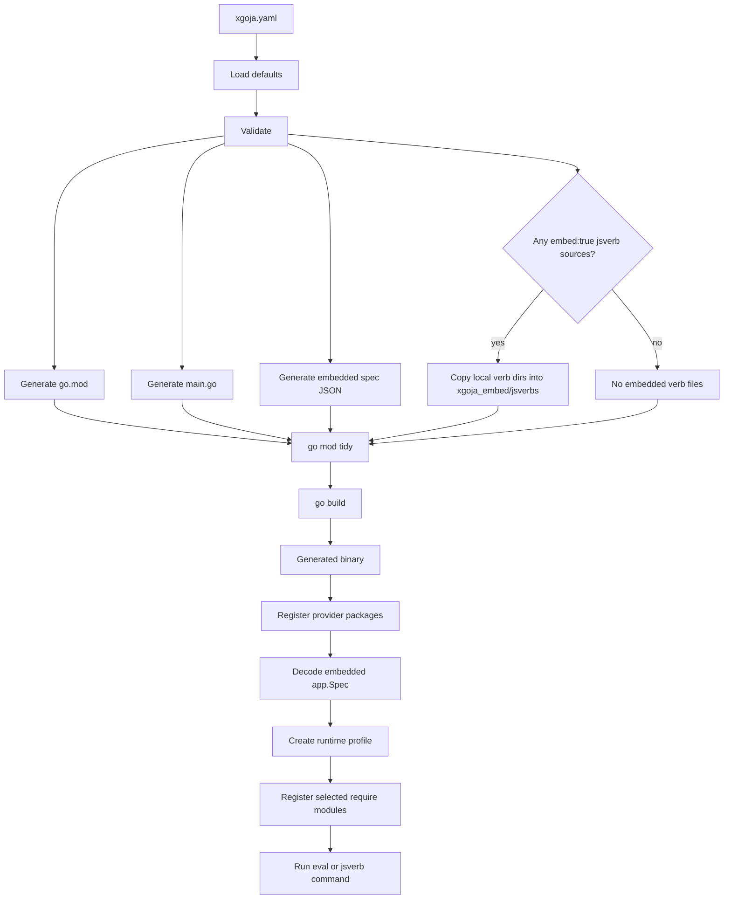

# xgoja Intern System Guide

## Executive Summary

`xgoja` is a builder for custom goja-powered Go binaries. It takes a declarative YAML build specification, generates a temporary Go module, imports selected provider packages, embeds a runtime specification, optionally copies and embeds JavaScript verb files, and runs the normal Go toolchain to produce a binary.

The purpose of xgoja is to make native Go-backed JavaScript modules composable at build time. JavaScript source files can be loaded dynamically, but Go modules are compiled into a binary. xgoja makes that compile-time boundary explicit and repeatable. A user chooses provider packages and runtime profiles in `xgoja.yaml`; xgoja turns that choice into generated Go source.

The system has four important contracts:

- The **buildspec contract** describes what the generated binary should contain and expose.
- The **provider contract** describes how Go packages publish native JavaScript modules and provider-owned verb sources.
- The **generated runtime contract** describes how a generated binary creates a goja VM, a `require()` registry, runtime-owner bindings, and command surfaces.
- The **jsverbs source contract** describes where JavaScript command files live and when they are copied or scanned.

A new contributor should understand those contracts before changing the implementation. Most bugs found during review came from crossing a contract boundary without making the boundary explicit: assuming a local checkout during builds, treating a runtime as only `*goja.Runtime`, ignoring command enable flags from the spec, or using a display ID as a generated filesystem path.

## Problem Statement

A goja-based application often wants JavaScript extensibility and Go-backed native modules at the same time. The JavaScript side can be loaded from source files, embedded files, or provider-owned filesystems. The Go side cannot be loaded safely in the same way. Go packages must be selected before compilation unless the application adopts a much more complex plugin boundary.

xgoja solves this by generating source code. The generated code imports provider packages directly and compiles them into a new binary. That generated binary then uses a runtime profile to decide which of the compiled-in modules are registered into a particular goja runtime.

The key problem is therefore not only code generation. The key problem is preserving a declarative specification across several layers:

```text
xgoja.yaml
  -> validation report
  -> generated go.mod
  -> generated main.go
  -> generated embedded spec JSON
  -> generated binary
  -> runtime profile
  -> goja runtime
  -> Cobra/Glazed command tree
```

Every layer must preserve the user's intent. If `commands.repl.enabled` is false, the generated command must not expose evaluation. If `jsverbs[].embed` is true, the generated binary must not depend on the original local directory at runtime. If a provider module needs runtime-owner bindings, the generated runtime must install them or reject the module clearly.

## Repository Map

The implementation lives inside the `go-go-goja` repository.

```text
cmd/xgoja/
  main.go                         # CLI entrypoint
  root.go                         # Cobra root, Glazed command wiring, help system
  cmd_build.go                    # xgoja build command
  cmd_doctor.go                   # xgoja doctor command
  cmd_inspect.go                  # binary build-info inspection command
  cmd_list_modules.go             # runtime profile module listing command
  doc/                            # bundled Glazed help pages
  internal/
    buildexec/                    # go mod tidy / go build wrappers
    buildspec/                    # xgoja.yaml model, loader, defaults, validation
    generate/                     # generated go.mod, main.go, embedded spec, copied assets
    testprovider/                 # older internal fixture provider

pkg/xgoja/
  providerapi/                    # public provider registration API
  app/                            # public generated-app runtime and command helpers
  testprovider/                   # public fixture provider used by generated tests/examples
  testcobra/                      # fixture target for Cobra attach mode
  testadapter/                    # fixture target for adapter mode

pkg/jsverbs/
  scan.go                         # JS source scanning and metadata extraction
  command.go                      # Glazed command construction from verbs
  runtime.go                      # JS verb invocation paths

pkg/runtimebridge/
  runtimebridge.go                # per-VM runtime owner/event-loop bindings

pkg/runtimeowner/
  runner.go, types.go             # owner-thread scheduling abstraction

examples/xgoja/
  runtime-filesystem/             # verb files stay on disk and scan at runtime
  embedded-jsverbs/               # local verb files copied and embedded into binary
  provider-shipped-jsverbs/       # verb files embedded inside a provider package
```

The public split matters. `cmd/xgoja/internal/...` can change freely because only the builder imports it. `pkg/xgoja/providerapi` and `pkg/xgoja/app` are imported by generated programs, so those packages form the public runtime surface of generated xgoja binaries.

## Core Concepts

### Build Time Versus Runtime

xgoja separates two decisions.

At **build time**, the spec decides which Go provider packages are imported into the generated program. This is controlled by `packages:`. The generated `main.go` imports those packages and calls their registration functions.

At **runtime**, a command decides which registered provider modules are installed into a goja VM. This is controlled by `runtimes:` and `commands:`. A provider package can be compiled into the binary while only some of its modules are enabled in a specific runtime profile.



The build-time layer decides what can exist. The runtime profile decides what is active for one invocation.

### Provider Packages

A provider package contributes modules and optional verb sources to an xgoja binary. It exports a registration function, usually named `Register`.

```go
func Register(registry *providerapi.Registry) error {
    return registry.Package("fixture",
        providerapi.Module{
            Name:        "hello",
            DefaultAs:   "hello",
            Description: "Example module",
            New:         newHelloModule,
        },
        providerapi.VerbSource{
            Name: "verbs",
            FS:   verbsFS,
            Root: "verbs",
        },
    )
}
```

The provider registry stores packages by ID. Inside each package, module names and verb source names must be unique. This makes runtime resolution deterministic.

Important provider API files:

- `/home/manuel/workspaces/2026-05-22/xgoja/go-go-goja/pkg/xgoja/providerapi/module.go`
- `/home/manuel/workspaces/2026-05-22/xgoja/go-go-goja/pkg/xgoja/providerapi/registry.go`
- `/home/manuel/workspaces/2026-05-22/xgoja/go-go-goja/pkg/xgoja/providerapi/verbs.go`

### Runtime Profiles

A runtime profile selects modules from registered providers.

```yaml
runtimes:
  repl:
    modules:
      - package: fixture
        name: hello
        as: hello
```

The `as` field controls the JavaScript `require()` name. If `as` is omitted, the module name is used.

```js
const hello = require("hello")
```

A runtime profile is a capability boundary. If a module is not selected by the profile, it is not registered in that runtime even if its provider package is compiled into the binary.

### jsverbs

`jsverbs` turns JavaScript functions into Glazed/Cobra commands. It scans JavaScript files for metadata calls such as `__package__` and `__verb__`, builds a command schema, and invokes the JavaScript function with values parsed from CLI flags.

A minimal verb file looks like this:

```js
__package__({ name: "tools" })
__verb__("greet", {
  name: "greet",
  output: "text",
  fields: {
    name: { type: "string", required: true }
  }
})
function greet(name) {
  const hello = require("hello")
  return hello.greet(name)
}
```

When mounted under a generated binary's `verbs` command, this can run as:

```bash
./dist/myapp verbs tools greet --name intern
```

The verb is loaded through the jsverbs source overlay loader rather than by raw `RunString`. The overlay injects no-op metadata functions and captures exported function references in `globalThis.__glazedVerbRegistry`.

## Buildspec Reference

The buildspec model lives in:

- `/home/manuel/workspaces/2026-05-22/xgoja/go-go-goja/cmd/xgoja/internal/buildspec/spec.go`

A typical spec is:

```yaml
name: provider-shipped-jsverbs
target:
  kind: xgoja
  output: dist/provider-shipped-jsverbs
packages:
  - id: fixture
    import: github.com/go-go-golems/go-go-goja/pkg/xgoja/testprovider
runtimes:
  repl:
    modules:
      - package: fixture
        name: hello
        as: hello
      - package: fixture
        name: owner-check
        as: owner-check
commands:
  repl:
    enabled: true
    runtime: repl
  jsverbs:
    enabled: true
    runtime: repl
    name: verbs
jsverbs:
  - id: provider-defaults
    package: fixture
    source: verbs
```

The main sections are:

| Section | Purpose | Important fields |
| --- | --- | --- |
| `name` | Names the generated binary/application. | Defaults to `xgoja-app`. |
| `go` | Controls generated module settings. | `version`, `module`, `tags`, `ldflags`. |
| `target` | Controls generated binary integration mode. | `kind`, `import`, `root`, `output`. |
| `packages` | Selects provider packages imported into generated code. | `id`, `import`, `version`, `register`, `replace`. |
| `runtimes` | Selects provider modules per runtime profile. | `modules[].package`, `modules[].name`, `modules[].as`, `modules[].config`. |
| `commands` | Enables generated command families and runtime profile selection. | `repl`, `jsverbs`. |
| `jsverbs` | Configures JavaScript verb source locations. | `id`, `path`, `embed`, `package`, `source`. |

### Loader and Defaults

The loader lives in:

- `/home/manuel/workspaces/2026-05-22/xgoja/go-go-goja/cmd/xgoja/internal/buildspec/load.go`

It resolves the spec path, unmarshals YAML, stores `BaseDir`, applies defaults, and validates the result.

Important defaults:

```text
name                  -> xgoja-app
go.version            -> 1.26
go.module             -> example.com/generated/<name>
target.kind           -> xgoja
target.output         -> dist/<name>
packages[].register   -> Register
commands.repl.name    -> repl/eval command fallback depending generated command implementation
commands.jsverbs.name -> verbs
```

### Validation

Validation lives in:

- `/home/manuel/workspaces/2026-05-22/xgoja/go-go-goja/cmd/xgoja/internal/buildspec/validate.go`

The validator reports structured checks rather than a single string. The `doctor` command renders that report.

Validation checks include:

- supported target kind: `xgoja`, `cobra`, or `adapter`;
- required target output;
- required target import/root fields for target modes;
- unique provider package IDs;
- provider import presence;
- existing package `replace` paths;
- at least one runtime profile;
- runtime modules referencing known package IDs;
- non-empty runtime module aliases;
- duplicate aliases inside a runtime profile;
- command runtime references for enabled commands;
- unique jsverb source IDs;
- provider jsverb sources specifying both `package` and `source`;
- embedded local jsverb source paths existing at build time.

A good validation rule checks the earliest stable boundary. For example, duplicate runtime aliases should be rejected in the buildspec layer because the runtime cannot safely register two modules to the same `require()` name. Missing provider verb `FS` cannot be validated from YAML because it is provider runtime metadata, so it is checked when mounting verbs.

## Builder CLI

The xgoja CLI root lives in:

- `/home/manuel/workspaces/2026-05-22/xgoja/go-go-goja/cmd/xgoja/root.go`

The root command wires four Glazed commands and the bundled help system:

```text
xgoja build
xgoja doctor
xgoja inspect
xgoja list-modules
xgoja help <topic>
```

Bundled help entries live in:

- `/home/manuel/workspaces/2026-05-22/xgoja/go-go-goja/cmd/xgoja/doc/01-overview.md`
- `/home/manuel/workspaces/2026-05-22/xgoja/go-go-goja/cmd/xgoja/doc/02-buildspec.md`
- `/home/manuel/workspaces/2026-05-22/xgoja/go-go-goja/cmd/xgoja/doc/03-tutorial.md`

The help topics are intentionally few:

```text
overview
buildspec
tutorial
```

### `xgoja build`

The build command lives in:

- `/home/manuel/workspaces/2026-05-22/xgoja/go-go-goja/cmd/xgoja/cmd_build.go`

It performs this sequence:

```pseudocode
settings := decode Glazed flags
spec, report := buildspec.LoadFile(settings.File)
output := settings.Output or spec.Target.Output
workDir := settings.WorkDir or temp dir

generate.WriteAll(workDir, spec, Options{
    XGojaModuleVersion: settings.XGojaVersion,
    XGojaReplace:       settings.XGojaReplace,
})

if settings.DryRun:
    print plan
    return

buildexec.GoModTidy(workDir)
outputPath := absolute(output)
mkdir parent(outputPath)
buildexec.GoBuild(workDir, outputPath, spec.Go.Tags, spec.Go.LDFlags)
```

The review-hardening point is the `XGojaReplace` option. Earlier code always found a local repository root and forced a replace. That made installed-tool usage fail. The current model is explicit:

- released xgoja binaries should use a published `go-go-goja` module version;
- local branch testing should pass `--xgoja-replace /path/to/go-go-goja`;
- generated `go.mod` should not silently assume a source-tree location.

### `xgoja doctor`

The doctor command loads and validates the spec, then prints the structured report. It is the first command to run when a build fails.

### `xgoja list-modules`

The list-modules command shows runtime profile module selections. It is useful for confirming that a `require()` alias exists before running a generated binary.

### `xgoja inspect`

The inspect command reads Go build information from an existing binary. This helps debug generated binaries and installed xgoja binaries.

## Code Generation

Generation lives in:

- `/home/manuel/workspaces/2026-05-22/xgoja/go-go-goja/cmd/xgoja/internal/generate/gomod.go`
- `/home/manuel/workspaces/2026-05-22/xgoja/go-go-goja/cmd/xgoja/internal/generate/main.go`
- `/home/manuel/workspaces/2026-05-22/xgoja/go-go-goja/cmd/xgoja/internal/generate/generate.go`

### Generated `go.mod`

`RenderGoMod` writes a temporary module. It always requires `github.com/go-go-golems/go-go-goja` because generated code imports `pkg/xgoja/app` and `pkg/xgoja/providerapi`.

It also adds provider module requirements when versions are specified and replaces when requested.

```pseudocode
requires := {
    "github.com/go-go-golems/go-go-goja": opts.XGojaModuleVersion,
}

for each target/provider with version:
    requires[modulePath(import)] = version

replaces := {}
if opts.XGojaReplace != "":
    replaces["github.com/go-go-golems/go-goja"] = opts.XGojaReplace

for each provider with replace:
    replaces[modulePath(import)] = provider.Replace
```

A detail to review later: provider module path inference is heuristic. If an import path ends in `/xgoja`, the module path is treated as the parent; otherwise the import path itself is used. This is practical for current provider packages but may need an explicit `module:` field if provider layouts become more varied.

### Generated `main.go`

`RenderMain` writes a generated entrypoint. The generated entrypoint:

1. imports `pkg/xgoja/app` and `pkg/xgoja/providerapi`;
2. imports every provider package selected in `packages:`;
3. imports a target package for `adapter` or `cobra` target modes;
4. creates a provider registry;
5. calls each provider registration function;
6. constructs the root command according to target mode;
7. executes the command.

For pure xgoja mode, the generated shape is:

```go
registry := providerapi.NewRegistry()
must(fixture.Register(registry))
root, err := app.NewRootCommand(app.Options{
    Providers: registry,
    SpecJSON:  embeddedSpecJSON,
})
must(err)
must(root.Execute())
```

When local embedded jsverbs are present, generated main adds:

```go
//go:embed xgoja_embed/jsverbs/*
var embeddedJSVerbs embed.FS
```

and passes `EmbeddedJSVerbs: embeddedJSVerbs` into the app or host options.

### Embedded source path allocation

Embedded local jsverb paths are generated paths, not user-facing IDs. A source ID such as `local-dev` is meaningful to users, but it is not safe to use directly as a generated directory without a collision strategy. Distinct IDs can normalize to the same filesystem segment.

The safe design is to allocate embed roots as generated artifacts, for example:

```pseudocode
for i, source in embeddedLocalSources:
    safeID := sanitizePathComponent(source.ID)
    root := sprintf("xgoja_embed/jsverbs/%03d-%s", i, safeID)
    embeddedRoots[source.ID] = root
```

The important invariant is that two distinct sources must never copy to the same generated directory and must never rewrite to the same runtime path.

## Generated App Runtime

The generated app runtime lives in:

- `/home/manuel/workspaces/2026-05-22/xgoja/go-go-goja/pkg/xgoja/app/factory.go`
- `/home/manuel/workspaces/2026-05-22/xgoja/go-go-goja/pkg/xgoja/app/root.go`
- `/home/manuel/workspaces/2026-05-22/xgoja/go-go-goja/pkg/xgoja/app/host.go`
- `/home/manuel/workspaces/2026-05-22/xgoja/go-go-goja/pkg/xgoja/app/spec.go`

### RuntimeFactory

`RuntimeFactory.NewRuntime` creates a fresh runtime from a named profile.

The runtime must do more than create a `*goja.Runtime`. Provider modules can be synchronous or asynchronous. Asynchronous modules need an owner path so background goroutines can settle promises on the VM owner context.

The runtime creation sequence is:

```pseudocode
func NewRuntime(ctx, profile, requireOptions...) (*JSRuntime, error):
    runtimeSpec := spec.Runtimes[profile]

    vm := goja.New()
    loop := eventloop.NewEventLoop()
    go loop.Start()

    owner := runtimeowner.NewRunner(vm, loop, RecoverPanics=true)
    runtimeCtx, cancel := context.WithCancel(context.Background())

    runtimebridge.Store(vm, Bindings{
        Context: runtimeCtx,
        Loop:    loop,
        Owner:   owner,
    })

    registry := require.NewRegistry(requireOptions...)

    for instance in runtimeSpec.Modules:
        module := providers.ResolveModule(instance.Package, instance.Name)
        config := json.Marshal(instance.Config)
        loader := module.New(ModuleContext{
            Context: runtimeCtx,
            Name:    instance.Name,
            As:      instance.Alias(),
            Config:  config,
        })
        registry.RegisterNativeModule(instance.Alias(), loader)

    req := registry.Enable(vm)
    return JSRuntime{VM: vm, Require: req, Loop: loop, Owner: owner}
```

`JSRuntime.Close` cancels the runtime context, deletes runtimebridge bindings, shuts down the owner, and stops the event loop. Command paths that create a runtime should close it after use.

### Host

`Host` is the adapter between generated code and application roots. It stores:

```go
type Host struct {
    Providers       *providerapi.Registry
    Spec            *Spec
    Factory         *RuntimeFactory
    EmbeddedJSVerbs fs.FS
}
```

Target packages in adapter mode receive `*app.Host` and decide how to attach xgoja capabilities. Cobra attach mode creates a root command from a target package and calls `host.AttachDefaultCommands(root)`.

The command attachment code must obey the spec. If `commands.repl.enabled` is false, the generated app should not expose JavaScript evaluation. If `commands.jsverbs.enabled` is false, it should not expose the verb tree. This is a security and correctness property, not only a UI preference.

### Eval command

The current generated app has an `eval`-style command. It creates a runtime profile and evaluates one JavaScript source string.

The naming contract should be spec-driven:

```pseudocode
name := commandName(spec.Commands.Repl, "eval")
cmd.Use = name + " [source]"
```

The enable contract should also be spec-driven:

```pseudocode
if spec.Commands.Repl.Enabled:
    root.AddCommand(newEvalCommand(...))
```

This avoids exposing an execution surface when the spec disables it and keeps scripted invocations stable when the spec chooses a custom command name.

## jsverbs Integration

The jsverbs integration spans scanning, command construction, and runtime invocation.

Important files:

- `/home/manuel/workspaces/2026-05-22/xgoja/go-go-goja/pkg/jsverbs/scan.go`
- `/home/manuel/workspaces/2026-05-22/xgoja/go-go-goja/pkg/jsverbs/command.go`
- `/home/manuel/workspaces/2026-05-22/xgoja/go-go-goja/pkg/jsverbs/runtime.go`
- `/home/manuel/workspaces/2026-05-22/xgoja/go-go-goja/pkg/xgoja/app/root.go`

### Scanning

`ScanDir` reads JavaScript files from a directory. `ScanFS` reads JavaScript files from an `fs.FS`. Both produce a `*jsverbs.Registry` containing files, package metadata, sections, fields, and finalized verb specs.

The scanner computes default command parents from package metadata and file paths. It also records a module path for each file so the invocation layer can load the source through `require()`.

### Source overlay loader

The registry exposes:

```go
func (r *Registry) RequireLoader() func(modulePath string) ([]byte, error)
```

This loader injects a prelude and suffix into the JavaScript source. The prelude defines metadata functions such as `__package__`, `__section__`, `__verb__`, and `doc`. The suffix captures discovered functions into `globalThis.__glazedVerbRegistry`.

This is why verb invocation uses `req.Require(verb.File.ModulePath)` instead of raw source evaluation. The source must pass through the overlay loader for the captured function registry to exist.

### Invocation

There are two invocation paths:

```go
InvokeInRuntime(ctx, runtime *engine.Runtime, verb, values)
InvokeInGojaRuntime(ctx, vm *goja.Runtime, req *require.RequireModule, verb, values)
```

`InvokeInRuntime` uses `engine.Runtime.Owner.Call` because engine runtimes are owned. `InvokeInGojaRuntime` is the lightweight host path used by xgoja. It now checks runtimebridge bindings. If owner bindings exist, it invokes through the owner and polls promise state through the owner. If owner bindings do not exist, it falls back to direct invocation.

The invocation sequence is:

```pseudocode
plan := buildVerbBindingPlan(registry, verb)
args := buildArguments(parsedValues, plan, registry.RootDir)

ret := ownerOrDirectCall(func(vm):
    req.Require(verb.File.ModulePath)
    entry := vm.Get("__glazedVerbRegistry")[verb.File.ModulePath]
    fn := entry[verb.FunctionName]
    return fn(undefined, args...)
)

if ret is Promise:
    poll promise.State and promise.Result on owner path if available
else:
    return ret
```

## The Three jsverb Source Modes

The source mode determines where JavaScript command files live and when they are read.

### Runtime filesystem source

```yaml
jsverbs:
  - id: local-dev
    path: ./verbs
    embed: false
```

This mode scans files from disk when the generated binary starts. It is useful for local development because editing JavaScript files does not require rebuilding the binary. The runtime must be able to access the directory.

### Embedded local source

```yaml
jsverbs:
  - id: local
    path: ./verbs
    embed: true
```

This mode treats `path` as a build-time input. The generator copies files into the generated workspace and emits `go:embed` plumbing. The generated binary scans its embedded filesystem. The original source directory is not needed at runtime.

### Provider-shipped source

```yaml
jsverbs:
  - id: provider-defaults
    package: fixture
    source: verbs
```

This mode selects a verb source registered by a provider package. The provider owns the JavaScript files, usually through `go:embed`, and exposes them as `providerapi.VerbSource{FS, Root}`.

### Comparison

| Mode | Build-time input | Runtime input | Rebuild after editing JS? | Typical use |
| --- | --- | --- | --- | --- |
| Runtime filesystem | `path` value only | Files at `path` | No | Local development, external verb packs |
| Embedded local | Files under `path` | Embedded generated filesystem | Yes | Self-contained binaries |
| Provider-shipped | Provider package source | Provider package filesystem | Yes | Default provider commands |

## Target Modes

xgoja supports three generated binary shapes.

### Pure xgoja

```yaml
target:
  kind: xgoja
  output: dist/myapp
```

The generated program owns the root command and uses `app.NewRootCommand`.

### Cobra attach

```yaml
target:
  kind: cobra
  import: example.com/myapp
  root: NewRootCommand
  output: dist/myapp
```

The generated program imports a target package, calls `target.NewRootCommand()`, and attaches xgoja commands to the returned root.

### Adapter

```yaml
target:
  kind: adapter
  import: example.com/myapp/xgojaadapter
  output: dist/myapp
```

The generated program imports a target package and calls:

```go
Build(context.Context, *app.Host) (*cobra.Command, error)
```

Adapter mode gives the target package the most control over where and how xgoja capabilities are mounted.

## Runnable Examples

Examples live in:

- `/home/manuel/workspaces/2026-05-22/xgoja/go-go-goja/examples/xgoja/runtime-filesystem`
- `/home/manuel/workspaces/2026-05-22/xgoja/go-go-goja/examples/xgoja/embedded-jsverbs`
- `/home/manuel/workspaces/2026-05-22/xgoja/go-go-goja/examples/xgoja/provider-shipped-jsverbs`

Each example has:

```text
README.md
Makefile
xgoja.yaml
```

The filesystem and embedded examples also have local `verbs/tools.js` files. The provider-shipped example uses the provider fixture's embedded source in `pkg/xgoja/testprovider/verbs/tools.js`.

Run all examples from the repo root:

```bash
for dir in runtime-filesystem embedded-jsverbs provider-shipped-jsverbs; do
  make -C examples/xgoja/$dir smoke
done
```

The Makefiles use two important development flags:

```bash
GOWORK=off
--xgoja-replace <repo-root>
```

`GOWORK=off` avoids the local workspace dependency mismatch. `--xgoja-replace` makes generated builds import this local checkout instead of a released module version.

## Workspace Dependency Mismatch

The workspace copy at:

```text
/home/manuel/workspaces/2026-05-22/xgoja/go-go-goja
```

is inside a larger `go.work` that includes:

```go
use (
    ./go-go-goja
    ./goja
    ./go-minitrace
)
```

`go-minitrace` requires a newer `goja_nodejs`. The workspace also forces `github.com/dop251/goja` to come from the local `./goja` checkout. That local checkout does not provide symbols expected by the newer `goja_nodejs/goutil`:

```text
goja.IsNumber
goja.IsBigInt
goja.IsString
```

The symptom is a typecheck failure such as:

```text
# github.com/dop251/goja_nodejs/goutil
argtypes.go:14:10: undefined: goja.IsNumber
argtypes.go:81:11: undefined: goja.IsBigInt
argtypes.go:94:10: undefined: goja.IsString
```

The canonical repo copy at:

```text
/home/manuel/code/wesen/go-go-golems/go-go-goja
```

does not have this issue because it is not using that workspace and resolves compatible versions from its own `go.mod`.

Use this during validation in the workspace copy:

```bash
GOWORK=off go test ./cmd/xgoja ./pkg/xgoja/app ./pkg/jsverbs -count=1
```

The long-term fix is to make the workspace internally consistent: update `./goja`, remove `./goja` from the workspace, remove the module pulling in the incompatible `goja_nodejs`, or align all modules on compatible versions.

## Code Review Issues and Underlying Causes

PR review found several issues. Each one points at a contract boundary.

### Mandatory local replace

Problem: The build command forced a local repository replacement. That made `xgoja build` behave like a source-tree-only workflow.

Underlying cause: Builder provenance was not modeled. The implementation assumed local development instead of distinguishing released usage from unreleased branch testing.

Correct model:

```pseudocode
if user supplied --xgoja-replace:
    use replace
else if binary has released module version:
    require that version
else:
    fail early with clear message or require explicit version
```

### Missing runtime-owner bindings

Problem: The generated runtime created a plain `*goja.Runtime` and `require` registry. Modules requiring `runtimebridge.Lookup(vm).Owner` could panic.

Underlying cause: The runtime abstraction was too thin. In this codebase, a useful runtime often means VM plus owner plus event loop plus lifecycle context.

Correct model:

```pseudocode
runtime := NewOwnedRuntime()
runtimebridge.Store(runtime.VM, Bindings{Owner, Loop, Context})
register selected modules
close runtime after command
```

### Command enable/name drift

Problem: The generated app attached eval even when `commands.repl.enabled` was false and used a hardcoded `eval` command name.

Underlying cause: Command attachment was not fully spec-driven. The spec became documentation rather than the source of truth.

Correct model:

```pseudocode
if spec.Commands.Repl.Enabled:
    root.AddCommand(newEvalCommand(name=commandName(spec.Commands.Repl, "eval")))
```

### Embedded source path collision

Problem: Distinct jsverb source IDs can normalize to the same generated directory name.

Underlying cause: Logical IDs, Go identifiers, and filesystem path components were treated as the same identity space.

Correct model:

```pseudocode
root := sprintf("xgoja_embed/jsverbs/%03d-%s", index, sanitizePathComponent(id))
```

The generated path should be collision-proof even when display IDs normalize to the same text.

## Design Rules for Future Work

The implementation should follow these rules.

### Rule 1: The buildspec is the source of generated behavior

If a command is disabled in the spec, do not attach it. If a command has a configured name, use it. If a runtime profile does not select a module, do not register it.

### Rule 2: Builder environment must be explicit

Do not infer local repository paths unless the user supplied a local replacement option. An installed xgoja binary should work outside a source checkout.

### Rule 3: Runtime means lifecycle, not only VM

A goja VM that can host asynchronous provider modules needs owner-thread scheduling and runtimebridge bindings. Code that creates a runtime must also define how it closes.

### Rule 4: Generated artifact paths need allocation rules

Do not reuse display names as generated paths without a collision strategy. A generated path is an implementation artifact and should be stable, safe, and unique.

### Rule 5: Examples should remain executable

The examples are the easiest manual smoke tests. Keep them small, keep their Makefiles current, and make sure each source mode has a direct `make smoke` path.

## Implementation Checklist for a New Contributor

When changing xgoja, work through this checklist.

1. Identify which contract is affected: buildspec, provider API, generator, runtime, command surface, or jsverbs.
2. Add or update validation if the error can be caught from YAML alone.
3. Add or update generated-program tests if the behavior affects generated source or generated binaries.
4. Add or update app-level tests if the behavior affects `pkg/xgoja/app` command mounting or runtime creation.
5. Run focused tests with `GOWORK=off` in the workspace copy.
6. Run at least one relevant example with `make smoke`.
7. Update bundled help docs if user-facing spec behavior changes.

Recommended validation command:

```bash
GOWORK=off go test \
  ./pkg/runtimebridge \
  ./pkg/jsverbs \
  ./pkg/xgoja/app \
  ./cmd/xgoja/internal/generate \
  ./cmd/xgoja \
  ./cmd/xgoja/internal/buildspec \
  ./pkg/xgoja/providerapi \
  ./pkg/xgoja/testprovider \
  ./pkg/xgoja/testcobra \
  ./pkg/xgoja/testadapter \
  -count=1
```

Recommended example smoke command:

```bash
for dir in runtime-filesystem embedded-jsverbs provider-shipped-jsverbs; do
  make -C examples/xgoja/$dir smoke
done
```

## API Reference

### `providerapi.Registry`

File:

- `/home/manuel/workspaces/2026-05-22/xgoja/go-go-goja/pkg/xgoja/providerapi/registry.go`

Important methods:

```go
func NewRegistry() *Registry
func (r *Registry) Package(id string, entries ...Entry) error
func (r *Registry) ResolveModule(packageID, moduleName string) (Module, bool)
func (r *Registry) ResolveVerbSource(packageID, sourceName string) (VerbSource, bool)
func (r *Registry) Packages() []Package
```

### `providerapi.Module`

File:

- `/home/manuel/workspaces/2026-05-22/xgoja/go-go-goja/pkg/xgoja/providerapi/module.go`

Shape:

```go
type Module struct {
    Name        string
    DefaultAs   string
    Description string
    New         ModuleFactory
}

type ModuleFactory func(ModuleContext) (require.ModuleLoader, error)
```

### `providerapi.VerbSource`

File:

- `/home/manuel/workspaces/2026-05-22/xgoja/go-go-goja/pkg/xgoja/providerapi/verbs.go`

Shape:

```go
type VerbSource struct {
    Name        string
    Description string
    FS          fs.FS
    Root        string
}
```

`FS` and `Root` are required for executable provider-shipped verb sources.

### `app.RuntimeFactory`

File:

- `/home/manuel/workspaces/2026-05-22/xgoja/go-go-goja/pkg/xgoja/app/factory.go`

Important method:

```go
func (f *RuntimeFactory) NewRuntime(ctx context.Context, profile string, opts ...require.Option) (*JSRuntime, error)
```

`opts` are used by jsverbs to inject a scanned source loader:

```go
require.WithLoader(registry.RequireLoader())
```

### `app.Host`

File:

- `/home/manuel/workspaces/2026-05-22/xgoja/go-go-goja/pkg/xgoja/app/host.go`

Important methods:

```go
func NewHost(providers *providerapi.Registry, spec *Spec) *Host
func NewHostWithOptions(providers *providerapi.Registry, spec *Spec, opts HostOptions) *Host
func (h *Host) AttachDefaultCommands(root *cobra.Command)
func (h *Host) AttachEval(root *cobra.Command)
func (h *Host) AttachModules(root *cobra.Command)
func (h *Host) AttachVerbs(root *cobra.Command)
```

### `jsverbs.Registry`

Files:

- `/home/manuel/workspaces/2026-05-22/xgoja/go-go-goja/pkg/jsverbs/scan.go`
- `/home/manuel/workspaces/2026-05-22/xgoja/go-go-goja/pkg/jsverbs/command.go`
- `/home/manuel/workspaces/2026-05-22/xgoja/go-go-goja/pkg/jsverbs/runtime.go`

Important functions and methods:

```go
func ScanDir(root string, opts ...ScanOptions) (*Registry, error)
func ScanFS(fsys fs.FS, root string, opts ...ScanOptions) (*Registry, error)
func (r *Registry) RequireLoader() func(modulePath string) ([]byte, error)
func (r *Registry) CommandForVerbWithInvoker(...)
func (r *Registry) InvokeInRuntime(...)
func (r *Registry) InvokeInGojaRuntime(...)
```

## Review Path for the Current PR

Read files in this order:

1. `cmd/xgoja/internal/buildspec/spec.go` and `validate.go` to understand the user contract.
2. `cmd/xgoja/cmd_build.go` to understand build command flags and module replacement/version policy.
3. `cmd/xgoja/internal/generate/gomod.go`, `main.go`, and `generate.go` to understand generated artifacts.
4. `pkg/xgoja/providerapi/registry.go`, `module.go`, and `verbs.go` to understand provider registration.
5. `pkg/xgoja/app/factory.go` to understand runtime creation and owner bindings.
6. `pkg/xgoja/app/root.go` and `host.go` to understand command attachment and jsverb mounting.
7. `pkg/jsverbs/runtime.go` to understand direct invocation and promise handling.
8. `examples/xgoja/*` to run behavior from the user's point of view.

This order starts at the declarative contract and ends at executable examples. It avoids reading implementation details before understanding what the system promises to do.

## Current Status

The implementation can now:

- parse and validate xgoja build specs;
- generate deterministic `go.mod`, `main.go`, and embedded runtime spec JSON;
- build generated binaries through the Go toolchain;
- register provider modules and provider-owned verb sources;
- create owned lightweight goja runtimes with runtimebridge bindings;
- mount runtime filesystem jsverbs;
- copy and embed local jsverb sources;
- mount provider-shipped jsverbs;
- support pure xgoja, Cobra attach, and adapter target modes;
- ship bundled Glazed help topics;
- provide runnable smoke examples for the three jsverb source modes.

The remaining hardening work is contract work, not concept proof work. The most important items are making command enable/name behavior fully spec-driven, making embedded source root allocation collision-proof, keeping local module replacement explicit, and preserving runtime-owner semantics as more provider modules are tested inside generated binaries.
