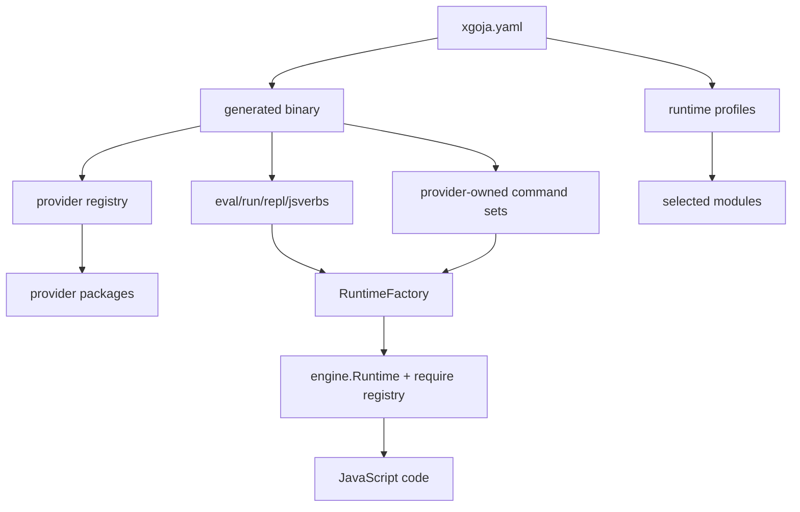
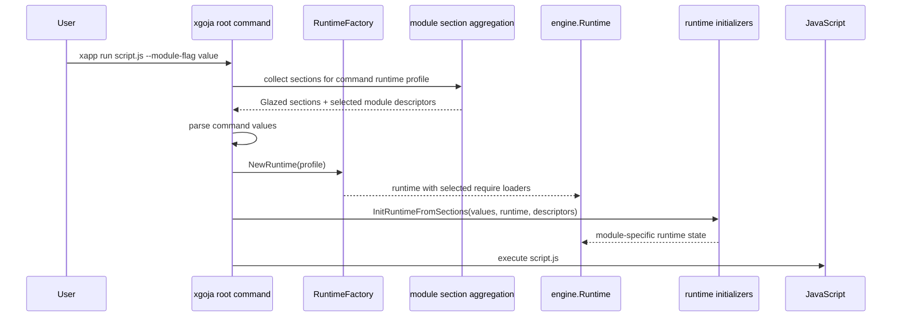
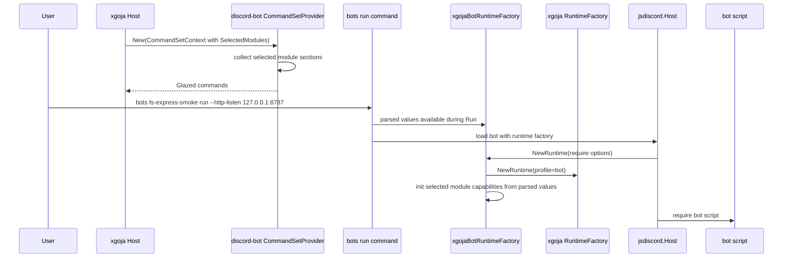

# xgoja Provider Architecture Review and Onboarding Guide

## 1. Purpose of this review

This report is written for the next maintainer who is taking over xgoja after a burst of implementation work. The previous phase added a lot: provider packages across sibling repositories, module capabilities, Glazed command set providers, runtime-profile section aggregation, runtime initializers, runtime closers, a first-party HTTP/Express provider, and a real `discord-bot` adapter that runs xgoja-selected modules inside an existing Discord JavaScript runner.

That is enough functionality to be useful, but it is also enough abstraction to get lost. The goal of this document is to make the system legible. It explains what was built, how the main pieces fit together, which ideas are solid, which ideas are still rough, where the code is duplicated or confusing, and what a new intern should fix first.

The tone of this report is intentionally half textbook and half code inspection. The textbook half builds the mental model. The inspection half points to concrete files and gives cleanup sketches.

## 2. Executive summary

The xgoja architecture is fundamentally sound. The strongest idea is the separation between **provider registration**, **runtime profile selection**, **command schema construction**, **runtime initialization**, and **JavaScript execution**. That separation lets generated binaries compose modules from unrelated packages without making each package know about every other package.

The most important working example is `discord-bot`. It already had its own JavaScript runner, CLI, and Discord session lifecycle. The xgoja adapter did not replace that runner. Instead, it let the runner ask xgoja for a runtime profile named `bot`. That runtime profile can include `discord`, `ui`, `fs`, and `express`, even though those modules come from different packages. The Discord bot script then composes them in JavaScript.

The main risks are not in the concept. The risks are in ergonomics and clarity:

- Some abstractions have names that are technically accurate but hard to teach quickly, especially `ModuleDescriptor`, `ModuleCapability`, `RuntimeInitializerCapability`, and `ComponentInitializerCapability`.
- The app layer and a real external adapter (`discord-bot`) now duplicate section aggregation and runtime-initializer logic.
- The provider API is still partly unstable: `CommandSetContext.RuntimeFactory` is `any`, capabilities are package-scoped, and the command-provider helper story is not yet public.
- Documentation exists but has at least one stale signature and does not yet have a single “start here as a provider author” path.
- Generated examples are valuable but uneven. Some demonstrate features well; others are smoke-test oriented and do not fully explain the design choices.

The recommended next phase is not another feature. It is a stabilization phase: release the provider APIs, repair docs, extract shared helper logic, improve naming/onboarding, and add regression tests around side effects and lifecycle.

## 3. Source map

The xgoja system is spread across a few conceptual layers.

### 3.1 Provider API layer

Files:

- `go-go-goja/pkg/xgoja/providerapi/module.go`
- `go-go-goja/pkg/xgoja/providerapi/capabilities.go`
- `go-go-goja/pkg/xgoja/providerapi/commands.go`
- `go-go-goja/pkg/xgoja/providerapi/registry.go`
- `go-go-goja/pkg/xgoja/providerapi/verbs.go`

This layer defines what provider packages can contribute. It should stay small, stable, and easy to explain.

### 3.2 App/runtime assembly layer

Files:

- `go-go-goja/pkg/xgoja/app/factory.go`
- `go-go-goja/pkg/xgoja/app/spec.go`
- `go-go-goja/pkg/xgoja/app/module_sections.go`
- `go-go-goja/pkg/xgoja/app/command_providers.go`
- `go-go-goja/pkg/xgoja/app/root.go`
- `go-go-goja/pkg/xgoja/app/run.go`
- `go-go-goja/pkg/xgoja/app/tui.go`

This layer turns the generated embedded spec into a working CLI. It builds runtime profiles, attaches built-in commands, mounts provider-owned command sets, and initializes module capabilities.

### 3.3 Buildspec and code generation layer

Files:

- `go-go-goja/cmd/xgoja/internal/buildspec/spec.go`
- `go-go-goja/cmd/xgoja/internal/buildspec/validate.go`
- `go-go-goja/cmd/xgoja/internal/generate/generate.go`
- `go-go-goja/cmd/xgoja/internal/generate/gomod.go`
- `go-go-goja/cmd/xgoja/internal/generate/templates/main.go.tmpl`

This layer reads `xgoja.yaml`, validates it, generates a temporary Go module, writes `main.go` and `go.mod`, and builds a binary.

### 3.4 First-party providers

Files:

- `go-go-goja/pkg/xgoja/providers/core/core.go`
- `go-go-goja/pkg/xgoja/providers/host/host.go`
- `go-go-goja/pkg/xgoja/providers/http/http.go`

These providers demonstrate the intended API surface. `core` is safe helper modules, `host` is guarded host-capability modules such as `fs`, and `http` is a stateful/lifecycle provider for `express`.

### 3.5 HTTP/Express runtime substrate

Files:

- `go-go-goja/modules/express/express.go`
- `go-go-goja/pkg/gojahttp/host.go`
- `go-go-goja/pkg/gojahttp/request_response.go`
- `go-go-goja/pkg/gojahttp/body.go`
- `go-go-goja/pkg/gojahttp/route_registry.go`

This layer is not xgoja-specific, but it became important because the HTTP provider wraps it. It handles Express-style route registration and safe invocation of JavaScript handlers from Go HTTP requests.

### 3.6 Discord adapter case study

Files:

- `discord-bot/pkg/xgoja/provider/provider.go`
- `discord-bot/internal/jsdiscord/runtime.go`
- `discord-bot/internal/jsdiscord/host.go`
- `discord-bot/internal/jsdiscord/bot_ops.go`
- `discord-bot/internal/jsdiscord/host_ops_channels.go`
- `discord-bot/internal/bot/bot.go`
- `discord-bot/examples/xgoja/discord-bot-provider/xgoja.yaml`
- `discord-bot/examples/xgoja/discord-bot-provider/bots/fs-express-smoke/index.js`

This is the best example of inserting xgoja into an existing host-owned runner.

## 4. The core mental model

xgoja has three major nouns: **provider packages**, **runtime profiles**, and **commands**.

A provider package is a Go package that says, “I know how to register one or more JavaScript modules or command sets.” It is imported by generated code. It registers itself into a `providerapi.Registry`.

A runtime profile is a named selection of modules from the registered providers. It answers the question: “When JavaScript runs under this profile, which `require()` names should exist?”

A command is a user-facing way to create and use a runtime. Built-in commands include `eval`, `run`, `repl`, and `jsverbs`. Provider-owned commands are contributed by packages such as `discord-bot`, which contributes `bots list`, `bots help`, and `bots run`.

The generated binary is the assembly point:



The clean mental model is:

1. `packages` compile providers into the generated binary.
2. `runtimes` choose modules from those providers.
3. `commands` choose runtime profiles.
4. Commands parse flags.
5. Runtime initializers consume parsed flags.
6. JavaScript runs with the selected modules.

If a future contributor keeps these six steps separate, most of the system remains understandable.

## 5. Provider packages and modules

The simplest provider contribution is a module. The API is in `providerapi/module.go`:

```go
type ModuleFactory func(ModuleContext) (require.ModuleLoader, error)

type Module struct {
    Name        string
    DefaultAs   string
    Description string
    New         ModuleFactory
}
```

A module factory is called when a runtime profile is instantiated. It receives `ModuleContext`, including the selected alias and JSON config. It returns a Goja Node-style `require.ModuleLoader`.

This is a good abstraction. It is small, maps directly onto `require()`, and is easy to teach. It also creates a useful security boundary: compiling a provider package into the binary does not make every module visible to every command. The runtime profile must select the module.

Example from `discord-bot/pkg/xgoja/provider/provider.go`:

```go
providerapi.Module{
    Name:        "discord",
    DefaultAs:   "discord",
    Description: "Discord bot definition module for JavaScript bot scripts",
    New: func(ctx providerapi.ModuleContext) (require.ModuleLoader, error) {
        moduleName := strings.TrimSpace(ctx.As)
        if moduleName == "" {
            moduleName = "discord"
        }
        return jsdiscord.NewLoader(jsdiscord.Config{ModuleName: moduleName}), nil
    },
}
```

The module API should be treated as stable. It is the foundation everything else builds on.

## 6. Capabilities: the useful but harder layer

Modules alone are not enough for stateful integrations. Some modules need flags. Some need runtime initialization. Some need cleanup. That led to capabilities in `providerapi/capabilities.go`.

```go
type ModuleCapability interface {
    CapabilityID() string
}

type ConfigSectionCapability interface {
    ModuleCapability
    ConfigSections(SectionContext) ([]schema.Section, error)
}

type RuntimeInitializerCapability interface {
    ModuleCapability
    InitRuntimeFromSections(context.Context, *values.Values, RuntimeHandle) error
}
```

The design is strong because it separates schema from behavior. A provider can say, “When a command uses my module, add these Glazed flags.” Later, once the command has parsed values and the runtime exists, the same provider can say, “Initialize my runtime state from those parsed flags.”

The HTTP provider is the clearest example:

- `ConfigSections(...)` contributes `--http-enabled` and `--http-listen`.
- `InitRuntimeFromSections(...)` decodes the `http` section and stores settings for the runtime.
- `NewExpressLoader()` starts the server lazily when JavaScript calls `require("express")`.
- `RuntimeCloserRegistry` registers server shutdown with the runtime lifecycle.

This is the right conceptual split. The risk is that the naming makes it feel abstract before the reader sees a concrete example. New maintainers should read the HTTP provider immediately after reading the capability interfaces.

## 7. Runtime section aggregation

The app layer collects module-provided sections in `pkg/xgoja/app/module_sections.go`.

```go
func (f *RuntimeFactory) sectionsForRuntimeProfile(commandName, profile string) ([]schema.Section, []providerapi.ModuleDescriptor, error) {
    descriptors, err := f.selectedModuleDescriptors(profile)
    // ...
    for _, descriptor := range descriptors {
        for _, capability := range descriptor.Capabilities {
            sectionCapability, ok := capability.(providerapi.ConfigSectionCapability)
            if !ok { continue }
            moduleSections, err := sectionCapability.ConfigSections(providerapi.SectionContext{...})
            // append unique sections
        }
    }
    return sections, descriptors, nil
}
```

That function returns both the sections and the descriptors. Returning both is important: the command first needs sections to build its schema, and later needs the same descriptors to run initializers.

The runtime initializer path is:

```go
func initRuntimeFromSections(ctx context.Context, vals *values.Values, rt *JSRuntime, descriptors []providerapi.ModuleDescriptor) error {
    handle := runtimeHandle{rt: rt}
    for _, descriptor := range descriptors {
        for _, capability := range descriptor.Capabilities {
            initializer, ok := capability.(providerapi.RuntimeInitializerCapability)
            if !ok { continue }
            initializer.InitRuntimeFromSections(ctx, vals, handle)
        }
    }
    return nil
}
```

This is good code, but it has become a pattern that external command providers also need. `discord-bot` now has its own version of `collectModuleSections` and `initSelectedModules`. That duplication is the first cleanup candidate.

## 8. Command providers

Command providers were introduced because generic xgoja commands are not enough for every host. Some packages own domain-specific commands. `discord-bot` owns `bots list`, `bots help`, and `bots run`.

The API is in `providerapi/commands.go`:

```go
type CommandSetProviderFactory func(CommandSetContext) (*CommandSet, error)

type CommandSetProvider struct {
    Name         string
    DefaultMount string
    Description  string
    ConfigSchema json.RawMessage
    New          CommandSetProviderFactory
}

type CommandSet struct {
    Commands     []cmds.Command
    ParserConfig *cli.CobraParserConfig
}
```

The key context fields are:

```go
type CommandSetContext struct {
    RuntimeProfile  string
    Config          json.RawMessage
    Providers       *Registry
    RuntimeFactory  any
    SelectedModules []ModuleDescriptor
}
```

The system mounts provider commands in `pkg/xgoja/app/command_providers.go`. That code resolves the command provider, determines the mount path, builds the command set, wraps commands to add the mount prefix, and adds them to the root command through Glazed.

The abstraction is powerful and necessary. It lets xgoja generate a binary that feels like the domain package rather than a generic JavaScript shell. The weakness is `RuntimeFactory any`. The type is intentionally loose, but it pushes type assertions into real adapters.

In `discord-bot/pkg/xgoja/provider/provider.go`:

```go
type xgojaRuntimeFactory interface {
    NewRuntime(ctx context.Context, profile string, opts ...require.Option) (*engine.Runtime, error)
}

if factory, ok := ctx.RuntimeFactory.(xgojaRuntimeFactory); ok {
    runtimeFactory = &xgojaBotRuntimeFactory{factory: factory, profile: profile, selectedModules: ctx.SelectedModules}
}
```

This worked and avoided premature coupling, but it is not a satisfying long-term public API. A new adapter author has to guess what `RuntimeFactory` actually is.

## 9. The Discord bot case study

The Discord adapter is the most valuable example because it inserted xgoja into an existing runner. The existing runner already had:

- bot discovery and repositories in `pkg/botcli`;
- JavaScript bot definition and dispatch in `internal/jsdiscord`;
- Discord session lifecycle in `internal/bot`;
- user-facing commands built with Glazed.

The xgoja provider registers modules and a command set:

```go
return registry.Package(PackageID,
    providerapi.Module{Name: "discord", ...},
    providerapi.Module{Name: "ui", ...},
    providerapi.CommandSetProvider{Name: "bots", ...},
)
```

The generated example then selects modules from multiple packages:

```yaml
runtimes:
  bot:
    modules:
      - package: discord-bot
        name: discord
      - package: discord-bot
        name: ui
      - package: go-go-goja-host
        name: fs
      - package: go-go-goja-http
        name: express
```

The actual bot script composes the modules:

```js
const discord = require("discord")
const fs = require("fs")
const express = require("express")

const app = express.app()

app.get("/", (_req, res) => {
  res.type("text/html; charset=utf-8").send(fs.readFileSync("./web/index.html", "utf8"))
})

app.post("/say", async (req, res) => {
  await discord.channels.send(req.body.channelId, { content: req.body.content })
  res.json({ ok: true })
})
```

The architectural win is that `discord-bot` does not know about Express, and the HTTP provider does not know about Discord. The application JavaScript composes them.

## 10. Runtime flow diagrams

### 10.1 Built-in command flow



### 10.2 Provider-owned command flow



The provider-owned flow is more complex because the package owns the domain command and creates the runtime inside its own code. That is why the adapter has to carry parsed values down into runtime creation.

## 11. What is solid

### 11.1 Runtime profiles are the right composition boundary

Runtime profiles are easy to explain and useful in practice. They let one generated binary have a safe profile, a host-capability profile, a bot profile, or any other named module set. Commands can point at profiles without knowing individual module details.

This is a keeper.

### 11.2 Module loaders remain simple

The `providerapi.Module` abstraction is small and maps cleanly onto Goja's `require` model. Simple providers remain simple. The capability layer did not pollute the basic module API.

This is also a keeper.

### 11.3 Glazed sections are the right way to surface provider flags

Provider-owned flags need schemas, help output, defaults, and typed decoding. Glazed sections provide that. Using `values.Values.DecodeSectionInto` keeps settings local to the provider.

The HTTP provider is a good example:

```go
type settings struct {
    Enabled bool   `glazed:"enabled"`
    Listen  string `glazed:"listen"`
}
```

The principle is sound: providers own their settings schemas.

### 11.4 Runtime initializers are necessary

There must be a hook after command values are parsed and after the runtime exists. Without that hook, modules such as HTTP cannot configure runtime-scoped state from flags.

This abstraction is justified.

### 11.5 Runtime closers are a good minimal lifecycle hook

`RuntimeCloserRegistry` is small and useful. It avoids inventing a full lifecycle framework while still letting providers attach cleanup. HTTP server shutdown is the motivating example.

### 11.6 Command set providers are necessary for real host adapters

The Discord adapter proves this. Without command set providers, every domain package would be forced through generic `run` or `jsverbs`, losing domain-specific commands.

The abstraction should stay, but the context type should be tightened.

## 12. What is confusing, rough, or over-architected

### 12.1 `RuntimeFactory any` is too vague for a public API

**Problem:** `CommandSetContext.RuntimeFactory` is typed as `any`. Real providers need to type assert it to an interface with `NewRuntime(...)`. This was acceptable while the API was being discovered, but it is confusing for new provider authors.

**Where to look:**

- `go-go-goja/pkg/xgoja/providerapi/commands.go`, `CommandSetContext.RuntimeFactory any`
- `discord-bot/pkg/xgoja/provider/provider.go`, local `xgojaRuntimeFactory` interface and type assertion

**Example:**

```go
type CommandSetContext struct {
    RuntimeFactory  any
    SelectedModules []ModuleDescriptor
}
```

```go
if factory, ok := ctx.RuntimeFactory.(xgojaRuntimeFactory); ok {
    runtimeFactory = &xgojaBotRuntimeFactory{factory: factory, profile: profile, selectedModules: ctx.SelectedModules}
}
```

**Why it matters:** A provider author cannot know what to expect from `RuntimeFactory` without reading xgoja internals or copying `discord-bot`. This weakens onboarding and makes the API feel unfinished.

**Cleanup sketch:** define a providerapi-level runtime factory interface that does not expose the concrete app package.

```go
// providerapi/commands.go or runtime.go
type RuntimeFactory interface {
    NewRuntime(ctx context.Context, profile string, opts ...require.Option) (Runtime, error)
}

type Runtime interface {
    RuntimeHandle
    RequireModule() *require.RequireModule // optional if needed
    Close(context.Context) error
}
```

If exposing `engine.Runtime` is acceptable, use that directly:

```go
type RuntimeFactory interface {
    NewRuntime(ctx context.Context, profile string, opts ...require.Option) (*engine.Runtime, error)
}
```

The first option is cleaner but more work. The second option is pragmatic.

### 12.2 Section aggregation is duplicated between app and Discord adapter

**Problem:** Built-in commands use `sectionsForRuntimeProfile` and `initRuntimeFromSections` in `go-go-goja/pkg/xgoja/app/module_sections.go`. The Discord adapter has its own `collectModuleSections` and `initSelectedModules` in `discord-bot/pkg/xgoja/provider/provider.go`.

**Where to look:**

- `go-go-goja/pkg/xgoja/app/module_sections.go`
- `discord-bot/pkg/xgoja/provider/provider.go`

**Example:**

```go
func collectModuleSections(descriptors []providerapi.ModuleDescriptor, profile string, commandProvider string) ([]schema.Section, error) {
    sections := []schema.Section{}
    seen := map[string]string{schema.DefaultSlug: "bot command schema"}
    // repeats capability scanning and duplicate slug checks
}
```

**Why it matters:** The duplication is already small but semantically important. If duplicate slug handling, SectionContext fields, or initializer behavior changes in one place, the other place can drift.

**Cleanup sketch:** move generic helpers into `providerapi` or a small `xgoja/providerutil` package that external providers can import without depending on `app`.

```go
package providerutil

func CollectConfigSections(descriptors []providerapi.ModuleDescriptor, ctx providerapi.SectionContext, existing map[string]string) ([]schema.Section, error)

func InitRuntime(ctx context.Context, vals *values.Values, handle providerapi.RuntimeHandle, descriptors []providerapi.ModuleDescriptor) error
```

Then both xgoja app and `discord-bot` use the same helper.

### 12.3 Capabilities are package-scoped, but the type name says module capability

**Problem:** `ModuleCapability` values are registered with `providerapi.WithCapability(...)` at package level. During descriptor construction, xgoja attaches package capabilities to selected modules from that package once per package. The type name says “module capability,” but the registration semantics are package-level.

**Where to look:**

- `go-go-goja/pkg/xgoja/providerapi/capabilities.go`, `WithCapability`
- `go-go-goja/pkg/xgoja/app/module_sections.go`, `selectedModuleDescriptors`

**Example:**

```go
func WithCapability(capability ModuleCapability) Entry {
    return capabilityEntry{capability: capability}
}
```

```go
if _, ok := capabilitiesUsed[instance.Package]; !ok {
    capabilities, _ = f.providers.ResolveCapabilities(instance.Package)
    capabilitiesUsed[instance.Package] = struct{}{}
}
```

**Why it matters:** This is subtle. A provider package with multiple modules may not want every capability associated with every module. The current deduplication avoids duplicate application per package, but the conceptual model is not obvious.

**Cleanup sketch:** either rename the abstraction or add module-scoped registration.

Option A: rename for honesty:

```go
type PackageCapability interface { CapabilityID() string }
```

Option B: support both:

```go
type ModuleCapabilityBinding struct {
    Modules []string // empty means package-wide
    Capability Capability
}
```

Option A is simpler. Option B is more expressive.

### 12.4 Component initializers exist but are not yet exercised enough

**Problem:** `ComponentInitializerCapability` exists in `providerapi/capabilities.go`, but the main implemented flow uses `ConfigSectionCapability` and `RuntimeInitializerCapability`. Component initializers may be the right idea for future domain objects, but today they add conceptual weight without many examples.

**Where to look:**

- `go-go-goja/pkg/xgoja/providerapi/capabilities.go`
- `go-go-goja/pkg/xgoja/testprovider/provider.go`

**Why it matters:** New readers see another initializer concept and have to ask: “When do I use runtime initializer vs component initializer?” The answer is not obvious from docs.

**Cleanup sketch:** document the decision table or defer the abstraction until a real adapter uses it.

```text
Use RuntimeInitializerCapability when:
  - the runtime already exists
  - you need to mutate JS globals, register cleanup, or configure runtime-scoped resources

Use ComponentInitializerCapability when:
  - a provider-owned command needs a Go object that is not a JS runtime mutation
  - the object may be used before or without creating JS runtime
```

If no non-test provider uses component initializers soon, consider marking it experimental in docs.

### 12.5 Discovery vs execution side effects are under-documented

**Problem:** The HTTP provider had to guard against starting a server during discovery/help/list operations. The current fix treats `vals == nil` as a discovery phase and keeps HTTP disabled. This is a useful convention but not documented as a general rule.

**Where to look:**

- `go-go-goja/pkg/xgoja/providers/http/http.go`, `InitRuntimeFromSections`
- `discord-bot/pkg/xgoja/provider/provider.go`, `newRuntime` and command wrappers

**Example:**

```go
cfg := settings{Enabled: false, Listen: "127.0.0.1:8787"}
if vals != nil {
    cfg.Enabled = true
    if err := vals.DecodeSectionInto("http", &cfg); err != nil {
        return err
    }
}
```

**Why it matters:** Other providers may have side effects: opening serial devices, connecting to databases, creating windows, starting servers. They need a clear pattern for “schema/discovery should not start side effects.”

**Cleanup sketch:** define a convention in provider docs and maybe encode it in `SectionContext` or `RuntimeInitializerContext`.

```go
type RuntimeInitContext struct {
    Phase RuntimePhase // Discovery, Execution
    Values *values.Values
    Handle RuntimeHandle
}
```

This may be too much API for now. At minimum, document: `vals == nil` means no parsed command invocation is available; providers must avoid irreversible side effects.

### 12.6 Docs contain stale API signatures

**Problem:** The provider authoring doc has stale examples. It shows `ConfigSections(context.Context, providerapi.SectionContext)` and `InitRuntimeFromSections(_ context.Context, handle providerapi.RuntimeHandle, values *values.Values)`, but the actual interfaces are `ConfigSections(SectionContext)` and `InitRuntimeFromSections(context.Context, *values.Values, RuntimeHandle)`.

**Where to look:**

- `go-go-goja/cmd/xgoja/doc/04-providers.md`
- `go-go-goja/pkg/xgoja/providerapi/capabilities.go`

**Stale doc snippet:**

```go
func (Capability) ConfigSections(context.Context, providerapi.SectionContext) ([]schema.Section, error) { ... }

func (Capability) InitRuntimeFromSections(_ context.Context, handle providerapi.RuntimeHandle, values *values.Values) error { ... }
```

**Actual API:**

```go
type ConfigSectionCapability interface {
    ConfigSections(SectionContext) ([]schema.Section, error)
}

type RuntimeInitializerCapability interface {
    InitRuntimeFromSections(context.Context, *values.Values, RuntimeHandle) error
}
```

**Why it matters:** This is exactly the kind of issue that blocks onboarding. A new provider author will copy the doc and get compiler errors.

**Cleanup sketch:** add a doc test or example provider that the docs are generated from. At minimum, fix the signatures immediately.

### 12.7 The generated examples are useful but not yet arranged as an onboarding path

**Problem:** `examples/xgoja` contains many examples, but the sequence is more of a smoke-test collection than a curriculum. The reader has to infer which example to read first and which one teaches which abstraction.

**Where to look:**

- `go-go-goja/examples/xgoja/README.md`
- example directories under `go-go-goja/examples/xgoja/*`
- `discord-bot/examples/xgoja/discord-bot-provider`

**Why it matters:** The system is now sophisticated enough that examples are the onboarding path. If they are not ordered and narrated, maintainers will cargo-cult the most complex example.

**Cleanup sketch:** rewrite the examples README as a learning path:

```text
1. core-provider: simplest safe modules
2. host-provider: guarded host capabilities
3. multiple-runtimes: runtime profile boundaries
4. module-sections: provider flags + runtime initializers
5. command-provider: Glazed command sets
6. discord-bot-provider: existing runner integration case study
```

Each example README should answer: “what abstraction does this teach?” and “what should you copy from it?”

### 12.8 HTTP provider logging and lifecycle observability are too quiet

**Problem:** The HTTP provider currently prints server failures with `fmt.Printf`. It does not clearly log server start, runtime association, or shutdown.

**Where to look:**

- `go-go-goja/pkg/xgoja/providers/http/http.go`, `start`

**Example:**

```go
go func() {
    if err := server.ListenAndServe(); err != nil && !errors.Is(err, stdhttp.ErrServerClosed) {
        fmt.Printf("xgoja http server failed on %s: %v\n", cfg.Listen, err)
    }
}()
```

**Why it matters:** Long-running generated applications need understandable logs. When a port is bound, a route fails, or a runtime closes, users should not have to guess which provider did it.

**Cleanup sketch:** use structured logging if the project has a standard logger, or at least provide callback/logging hooks. Also return early bind errors by using `net.Listen` synchronously before starting `Serve` in a goroutine.

```go
ln, err := net.Listen("tcp", cfg.Listen)
if err != nil {
    return fmt.Errorf("start xgoja http listener %s: %w", cfg.Listen, err)
}
go server.Serve(ln)
```

This catches port conflicts during `require("express")` instead of only printing from a goroutine later.

## 13. Documentation and onboarding assessment

The current docs are valuable but fragmented.

### 13.1 What exists

- `cmd/xgoja/doc/01-overview.md` gives the product overview.
- `cmd/xgoja/doc/02-buildspec.md` explains `xgoja.yaml`.
- `cmd/xgoja/doc/04-providers.md` explains provider authoring.
- `examples/xgoja/*` provide runnable smoke tests.
- Ticket docs XGOJA-007 through XGOJA-011 explain the implementation history.
- The Obsidian article in the Parc vault explains the large pattern using the Discord bot case study.

### 13.2 What is missing

The missing piece is a single maintainer-oriented onboarding guide that says:

1. Read this first.
2. Then run this example.
3. Then implement this tiny provider.
4. Then add a config section.
5. Then add a runtime initializer.
6. Then adapt an existing runner.

The provider authoring doc should be more explicit about choosing the right abstraction.

Suggested table:

| Need | Use | Do not use |
|---|---|---|
| Expose pure JS-callable Go functions | `providerapi.Module` | Command provider |
| Add command flags for a module | `ConfigSectionCapability` | raw Cobra flags |
| Configure runtime from parsed flags | `RuntimeInitializerCapability` | module factory config if value is command-specific |
| Clean up runtime-owned resources | `RuntimeCloserRegistry` | global process hooks |
| Add package-owned domain commands | `CommandSetProvider` | built-in `run` command |
| Create a non-runtime Go object for domain commands | `ComponentInitializerCapability` | hidden globals |

### 13.3 Docs should distinguish three config channels

There are now three different “config” concepts:

1. `packages[].version/replace/register`: build-time Go module config.
2. `runtimes[].modules[].config`: static module factory config.
3. Glazed sections: command-time parsed flags for runtime initialization.

This distinction is important and easy to miss.

Suggested wording:

```text
Use module config for static settings baked into a runtime profile.
Use Glazed sections for command-time settings that users should see as flags.
Use command provider config for domain command setup such as repository paths.
```

The Discord example uses all three, so it should become the canonical explanation.

## 14. Recommended cleanup plan

### Phase 1: Documentation correctness and release readiness

Low risk, high leverage.

- Fix stale API signatures in `cmd/xgoja/doc/04-providers.md`.
- Add a provider capability decision table.
- Rewrite `examples/xgoja/README.md` as a learning path.
- Add the Discord adapter example to xgoja docs as the “existing runner” case study, even if the example lives in `discord-bot`.
- Tag/release `go-go-goja` so external adapters can depend on the provider APIs without local replaces.

### Phase 2: Shared provider utilities

Medium risk, high leverage.

- Extract `CollectConfigSections` and `InitRuntime` helpers into a small importable package.
- Replace duplicate logic in xgoja app and `discord-bot` provider.
- Add tests for helper behavior: duplicate slugs, nil sections, initializer error wrapping.

Suggested package:

```text
pkg/xgoja/providerutil/
  sections.go
  init.go
  sections_test.go
  init_test.go
```

### Phase 3: Tighten command-provider runtime factory API

Medium risk.

- Replace `RuntimeFactory any` with a named interface, or add a typed accessor helper.
- Update `discord-bot` to use the typed interface.
- Document how host adapters should request xgoja runtimes.

If full typing causes import cycles, add a small facade type rather than falling back to `any`.

### Phase 4: Capability scoping and naming review

Medium to high risk; do after release if possible.

- Decide whether capabilities are package-scoped or module-scoped.
- Rename or extend APIs accordingly.
- Mark `ComponentInitializerCapability` experimental unless it gets a real production user.

### Phase 5: Lifecycle and side-effect hardening

Medium risk.

- Make HTTP provider bind errors synchronous with `net.Listen`.
- Add structured lifecycle logs.
- Add tests for discovery commands not starting HTTP.
- Add tests for runtime close shutting down HTTP.

## 15. Suggested intern onboarding exercise

A good intern exercise should touch the core abstractions without requiring Discord credentials.

Build a tiny provider named `counter-provider`:

1. Module `counter` exposes `increment()` and `value()`.
2. Config section `counter` exposes `--counter-start`.
3. Runtime initializer sets the initial counter value from `--counter-start`.
4. Command provider `counter-tools` exposes `counter show` using a runtime profile.
5. Example `xgoja.yaml` enables `eval`, `run`, and the command provider.

Expected JS:

```js
const counter = require("counter")
counter.increment()
console.log(counter.value())
```

Expected command:

```bash
./dist/counter eval 'require("counter").value()' --counter-start 41
```

This exercise forces the intern to understand modules, runtime profiles, config sections, runtime initializers, and command providers without the complexity of Discord sessions or HTTP servers.

## 16. Final assessment

The current xgoja architecture is not accidental complexity. Most of the abstractions were introduced because a real integration needed them. The Discord bot case study justifies command providers, selected module descriptors, runtime initializers, and runtime closers. The HTTP provider justifies module-provided Glazed sections and lifecycle hooks. The earlier sibling provider rollout justifies a small, stable module provider API.

The system is, however, at the point where implementation history is leaking into the public API. The next maintainer should resist adding new abstractions until the existing ones are named, documented, tested, and released. The best next work is cleanup and onboarding, not expansion.

The short version for the new intern is:

- Start with `providerapi.Module`; it is the root of the system.
- Understand runtime profiles; they are the composition boundary.
- Learn `ConfigSectionCapability` and `RuntimeInitializerCapability` together; they are two halves of command-time module configuration.
- Read `pkg/xgoja/providers/http/http.go`; it is the clearest stateful provider.
- Read `discord-bot/pkg/xgoja/provider/provider.go`; it is the clearest existing-runner adapter.
- Fix the docs before copying them.
- Be suspicious of any change that makes one domain provider know about another provider's semantics. Composition should happen in `xgoja.yaml` and JavaScript, not as Go package cross-product glue.
