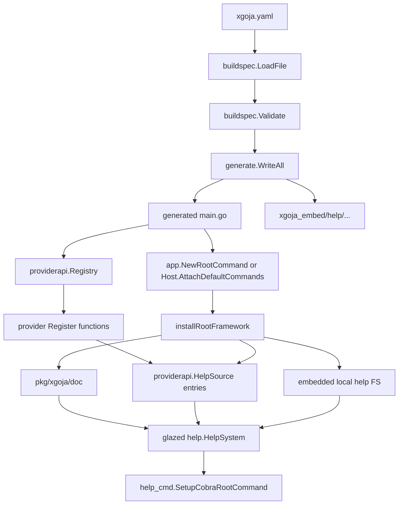
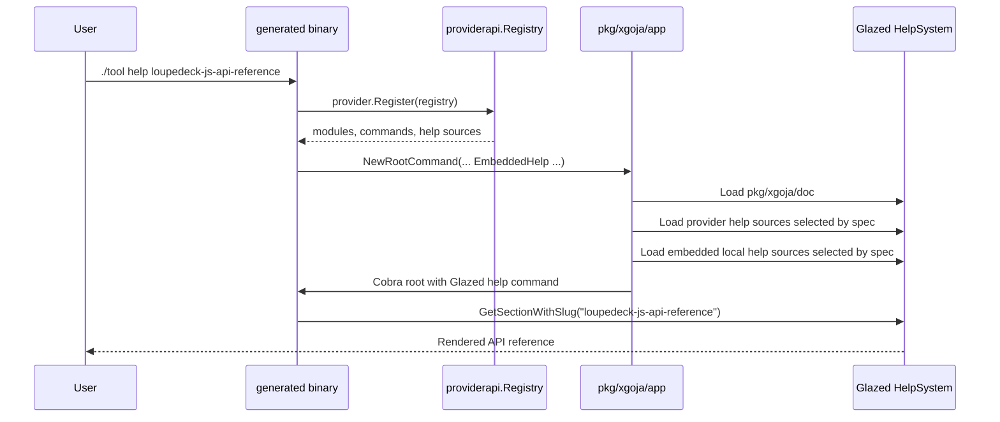

# Glazed Help Documents for xgoja Binaries Implementation Guide

## Executive summary

This guide explains how to extend `xgoja` so generated binaries can bundle extra Glazed help entries, such as API references and tutorials for the provider packages selected by `xgoja.yaml`. The motivating example is the Loupedeck API reference at `loupedeck/docs/help/topics/01-loupedeck-js-api-reference.md`, which is already written in Glazed help format and should become available from an xgoja-generated Loupedeck binary as `help loupedeck-js-api-reference`.

The current system already has the right foundation. The standalone `xgoja` CLI loads embedded help pages from `cmd/xgoja/doc` and registers them with `help_cmd.SetupCobraRootCommand(...)` (`go-go-goja/cmd/xgoja/root.go:57-61`). Generated binaries also install a root framework that loads generic generated-runtime help pages from `pkg/xgoja/doc` (`go-go-goja/pkg/xgoja/app/framework.go:35-39`). Provider packages can currently contribute modules, JavaScript verb sources, package capabilities, and command sets through `providerapi.Registry` (`go-go-goja/pkg/xgoja/providerapi/registry.go:18-24`), but they cannot contribute help sources. The buildspec can currently declare `packages`, `runtimes`, `commands`, `commandProviders`, and `jsverbs`, but it has no `help` or `helpDocs` field (`go-go-goja/cmd/xgoja/internal/buildspec/spec.go:5-14`).

The recommended implementation is to add one new documentation path that mirrors the existing JavaScript verb source path:

1. A provider-facing `providerapi.HelpSource` entry that stores `fs.FS` + root directory metadata in the registry.
2. A buildspec `help.sources` list that can point either at provider-shipped help sources or local filesystem help directories.
3. A generated-binary embed path under `xgoja_embed/help/<source-id>` for local help directories that should be bundled into the binary.
4. An app-layer loader that always loads generic xgoja docs first, then loads provider/spec help sources into the same `*help.HelpSystem`, then calls `help_cmd.SetupCobraRootCommand(...)` exactly once.

The design keeps documentation close to the package that owns the API, while preserving xgoja's compile-time model. Provider packages describe their native modules and their documentation in one registration function. Application authors opt into the help sources they want in `xgoja.yaml`, just as they already opt into modules, command providers, and JavaScript verb sources.

## Problem statement and scope

Generated xgoja binaries are increasingly domain-specific. A Loupedeck-generated binary is not just a generic JavaScript shell; it exposes `loupedeck/state`, `loupedeck/ui`, `loupedeck/anim`, `loupedeck/easing`, scene verbs, hardware flags, and provider-owned commands. Users need a way to discover that API from the binary they are running, not by browsing the source repository.

Today, the help story is split:

- The `xgoja` builder CLI has its own embedded help docs.
- Generated xgoja binaries have generic runtime help docs.
- Domain repositories such as `loupedeck` already contain rich Glazed help docs, but those docs are wired only into their standalone CLI.
- Provider registration exposes modules and commands to xgoja, but not documentation.

The goal is **not** to invent a second documentation format. The goal is to make existing Glazed help entries bundle cleanly into generated xgoja binaries.

In scope:

- buildspec schema for declaring help sources,
- provider API for provider-shipped help sources,
- generation-time copying and embedding of local help directories,
- generated root loading of built-in, provider, and local help entries,
- tests and smoke commands to prove `help <slug>` works from generated binaries,
- guidance for writing good Glazed help pages.

Out of scope for the first implementation:

- dynamic documentation fetched from a network service,
- non-Markdown documentation formats,
- a web documentation renderer,
- automatic API extraction from Go or JavaScript source,
- backwards-compatible aliases for old, undocumented config shapes.

## System overview for a new intern

### What Glazed help is

Glazed help entries are Markdown files with YAML frontmatter. Each file becomes a searchable help section. The frontmatter gives the section a title, slug, short summary, tags, related commands, related flags, top-level visibility, and a section type.

The Loupedeck API reference is a good example. Its first lines define a user-facing API reference with slug `loupedeck-js-api-reference`, topics such as `loupedeck`, `javascript`, and `goja`, command/flag tags, and `SectionType: GeneralTopic` (`loupedeck/docs/help/topics/01-loupedeck-js-api-reference.md:1-27`). The body then explains the runtime model in prose before listing module APIs (`loupedeck/docs/help/topics/01-loupedeck-js-api-reference.md:29-45`).

A help package usually embeds Markdown files and exposes an `AddDocToHelpSystem` helper. Loupedeck does exactly this:

```go
// loupedeck/docs/help/doc.go
//go:embed topics/*.md tutorials/*.md
var docFS embed.FS

func AddDocToHelpSystem(helpSystem *help.HelpSystem) error {
    return helpSystem.LoadSectionsFromFS(docFS, ".")
}
```

The standalone Loupedeck CLI creates a help system, loads those docs, and registers the enhanced help command on its Cobra root (`loupedeck/cmd/loupedeck/main.go:31-33`). That is the pattern xgoja should reproduce for generated binaries.

### What xgoja is

`xgoja` builds custom Goja-powered binaries from a declarative `xgoja.yaml`. The builder reads the spec, generates a temporary Go module, writes a generated `main.go`, embeds a normalized JSON spec, imports provider packages, calls provider registration functions, and then builds a binary with the Go toolchain.

The generated binary has three important pieces:

- a provider registry containing the packages that were compiled into the binary,
- a runtime spec that says which provider modules are selected by each runtime profile,
- a Cobra root command with built-in and provider-owned commands.

At runtime, the generated binary does not discover arbitrary Go packages dynamically. The provider packages are normal Go imports in generated source. This compile-time model is why documentation should also be registered through provider packages or copied into the generated build workspace before compilation.

### Current generated-binary startup flow

The generated `main.go` template imports the selected providers, registers them, constructs the app root, and executes it (`go-go-goja/cmd/xgoja/internal/generate/templates/main.go.tmpl:32-54`). In pure xgoja target mode, it calls `app.NewRootCommand(...)` (`go-go-goja/cmd/xgoja/internal/generate/templates/main.go.tmpl:47-49`). In Cobra target mode, it builds a host and calls `host.AttachDefaultCommands(root)` (`go-go-goja/cmd/xgoja/internal/generate/templates/main.go.tmpl:42-46`).

The app root decodes the embedded JSON spec, creates a `Host`, creates a Cobra root, and asks the host to attach the default commands (`go-go-goja/pkg/xgoja/app/root.go:25-49`). The host installs the root framework first, then attaches `eval`, `run`, `repl`, `modules`, `verbs`, and provider commands (`go-go-goja/pkg/xgoja/app/host.go:38-59`). The root framework adds logging flags and installs the help command (`go-go-goja/pkg/xgoja/app/framework.go:29-40`).

Current flow:

```text
xgoja.yaml
  -> buildspec.LoadFile + Validate
  -> generate.WriteAll
       -> generated go.mod
       -> generated main.go
       -> xgoja.gen.json
       -> optional embedded JS verbs
  -> go build
  -> generated binary starts
       -> providerapi.NewRegistry()
       -> provider.Register(registry)
       -> app.NewRootCommand(...) or host.AttachDefaultCommands(...)
       -> installRootFramework(...)
       -> load pkg/xgoja/doc only
       -> help_cmd.SetupCobraRootCommand(...)
```

The missing piece is visible in `installRootFramework`: it loads only `pkg/xgoja/doc` (`go-go-goja/pkg/xgoja/app/framework.go:35-37`). It does not see the provider registry, the spec's desired documentation sources, or an embedded help filesystem.

## Current-state evidence

### xgoja already knows how to load embedded Glazed help

The standalone builder CLI embeds Markdown help pages in `cmd/xgoja/doc` and exposes `AddDocToHelpSystem` (`go-go-goja/cmd/xgoja/doc/doc.go:9-13`). The root command then creates a `help.NewHelpSystem()`, loads the docs, and calls `help_cmd.SetupCobraRootCommand(helpSystem, root)` (`go-go-goja/cmd/xgoja/root.go:57-61`).

Generated binaries use the same idea through `pkg/xgoja/doc` and `installRootFramework` (`go-go-goja/pkg/xgoja/app/framework.go:35-39`). This means the new work does not need to teach xgoja what Glazed help is. It needs to broaden which docs are loaded before the one existing `SetupCobraRootCommand` call.

### The provider registry has extensible package entries, but no help entry

The registry package currently stores four maps per package: modules, verb sources, package capabilities, and command set providers (`go-go-goja/pkg/xgoja/providerapi/registry.go:18-24`). It can resolve verb sources and command set providers by package/name (`go-go-goja/pkg/xgoja/providerapi/registry.go:73-106`). It has validation helpers for duplicate verb sources and command set providers (`go-go-goja/pkg/xgoja/providerapi/registry.go:149-185`).

That shape is ideal for help sources: provider-shipped help documents should be another package entry, just like `VerbSource` (`go-go-goja/pkg/xgoja/providerapi/verbs.go:5-13`).

### The buildspec has a source-list pattern already

The buildspec already has `JSVerbSourceSpec`, which can reference a filesystem path or a provider source (`go-go-goja/cmd/xgoja/internal/buildspec/spec.go:87-93`). Validation enforces IDs, provider source shape, known packages, and filesystem path existence for embedded sources (`go-go-goja/cmd/xgoja/internal/buildspec/validate.go:197-235`). Generation copies embedded JS verb directories into `xgoja_embed/jsverbs/<source-id>` (`go-go-goja/cmd/xgoja/internal/generate/generate.go:49-65`) and rewrites the embedded runtime spec so the generated binary points at the embedded path.

Help docs can reuse this pattern almost exactly, with one important difference: help docs are loaded during root initialization, not when a JavaScript verb command is invoked.

### Loupedeck has the target documentation already

The Loupedeck provider registers runtime modules and a command set under package ID `loupedeck` (`loupedeck/runtime/js/provider/provider.go:49-68`). Its docs live in `loupedeck/docs/help`, and the standalone CLI already loads them (`loupedeck/docs/help/doc.go:9-13`, `loupedeck/cmd/loupedeck/main.go:31-33`). The design should let this same documentation package be surfaced through the xgoja provider without copying the Markdown into go-go-goja.

## Gap analysis

The current system lacks four contracts:

1. **Provider documentation contract.** There is no `providerapi.HelpSource` equivalent to `providerapi.VerbSource`.
2. **Buildspec documentation contract.** There is no `help.sources` list for local or provider-shipped help docs.
3. **Generated embed path.** The generator embeds JavaScript verb directories, but not help directories (`go-go-goja/cmd/xgoja/internal/generate/templates/main.go.tmpl:27-30`).
4. **Root help loading context.** `installRootFramework` currently receives only `root` and `spec`; it needs provider registry and embedded help filesystem information to load additional docs.

These gaps explain why `loupedeck help loupedeck-js-api-reference` works in the standalone CLI while a generated xgoja Loupedeck binary cannot show the same page.

## Proposed architecture

### Design principle

Treat documentation as a first-class xgoja package contribution, but keep user choice in the buildspec.

Provider packages should be able to say, "I have a help source named `runtime-api`." The generated binary author should then be able to say, "Include `loupedeck.runtime-api` in this binary." This keeps large or specialized docs opt-in while making them easy to wire.

### New concepts

| Concept | Owner | Purpose |
|---|---|---|
| Built-in generated help | `go-go-goja/pkg/xgoja/doc` | Generic help for all generated xgoja binaries. |
| Provider help source | Provider package | Package-owned docs such as Loupedeck API references. |
| Local help source | `xgoja.yaml` author | Project-specific docs shipped with one generated binary. |
| Embedded help filesystem | Generated `main.go` | Bundled copy of local docs under `xgoja_embed/help/...`. |
| Help loader | `pkg/xgoja/app` | Merges built-in, provider, and local docs into one Glazed help system. |

### Target user experience

A Loupedeck-oriented `xgoja.yaml` should be able to declare:

```yaml
name: loupedeck-workbench
packages:
  - id: loupedeck
    import: github.com/go-go-golems/loupedeck/pkg/xgoja/provider
    version: v0.0.0

runtimes:
  scene:
    modules:
      - package: loupedeck
        name: loupedeck/state
        as: loupedeck/state
      - package: loupedeck
        name: loupedeck/ui
        as: loupedeck/ui

commands:
  run:
    enabled: true
    runtime: scene

help:
  sources:
    - id: loupedeck-runtime-api
      package: loupedeck
      source: runtime-api
```

After building, the generated binary should support:

```bash
./loupedeck-workbench help
./loupedeck-workbench help loupedeck-js-api-reference
./loupedeck-workbench help type:tutorial
./loupedeck-workbench run --help
```

For project-local docs:

```yaml
help:
  sources:
    - id: project-tutorials
      path: ./docs/help
      embed: true
```

The generated build workspace should contain:

```text
xgoja_embed/
  help/
    project_tutorials/
      topics/
        01-api.md
      tutorials/
        01-getting-started.md
```

The embedded runtime spec should point at `xgoja_embed/help/project_tutorials`, so the generated app loader can load it from `embeddedHelp`.

### Architecture diagram



### Sequence diagram



## API design

### Provider API: HelpSource

Add a new file such as `pkg/xgoja/providerapi/help.go`:

```go
package providerapi

import (
    "fmt"
    "io/fs"
    "strings"
)

type HelpSource struct {
    Name        string
    Description string
    FS          fs.FS
    Root        string
}

func (s HelpSource) applyToPackage(pkg *Package) error {
    return pkg.addHelpSource(s)
}

func normalizeHelpSource(source HelpSource) (HelpSource, error) {
    name := strings.TrimSpace(source.Name)
    if name == "" {
        return HelpSource{}, fmt.Errorf("help source name is required")
    }
    if source.FS == nil {
        return HelpSource{}, fmt.Errorf("help source %q filesystem is required", name)
    }
    source.Name = name
    source.Description = strings.TrimSpace(source.Description)
    source.Root = strings.TrimSpace(source.Root)
    if source.Root == "" {
        source.Root = "."
    }
    return source, nil
}
```

Extend `Package` and `Registry`:

```go
type Package struct {
    ID                  string
    Modules             map[string]Module
    VerbSources         map[string]VerbSource
    HelpSources         map[string]HelpSource
    PackageCapabilities map[string]PackageCapability
    CommandSetProviders map[string]CommandSetProvider
}

func (r *Registry) ResolveHelpSource(packageID, sourceName string) (HelpSource, bool) {
    if r == nil {
        return HelpSource{}, false
    }
    pkg := r.packages[strings.TrimSpace(packageID)]
    if pkg == nil {
        return HelpSource{}, false
    }
    source, ok := pkg.HelpSources[strings.TrimSpace(sourceName)]
    return source, ok
}

func (p *Package) addHelpSource(source HelpSource) error {
    source, err := normalizeHelpSource(source)
    if err != nil {
        return err
    }
    if _, ok := p.HelpSources[source.Name]; ok {
        return fmt.Errorf("duplicate help source %q", source.Name)
    }
    p.HelpSources[source.Name] = source
    return nil
}
```

Rationale:

- This mirrors `VerbSource`, so provider authors learn one pattern.
- It keeps provider docs package-owned and compile-time safe.
- It avoids importing `github.com/go-go-golems/glazed/pkg/help` into provider registration code; the app layer owns loading into `HelpSystem`.
- It gives the registry enough information to report duplicates early.

### Buildspec API: help.sources

Add to `cmd/xgoja/internal/buildspec/spec.go`:

```go
type Spec struct {
    Name             string                    `yaml:"name"`
    Go               GoSpec                    `yaml:"go"`
    Target           TargetSpec                `yaml:"target"`
    Packages         []PackageSpec             `yaml:"packages"`
    Runtimes         map[string]Runtime        `yaml:"runtimes"`
    Commands         CommandsSpec              `yaml:"commands"`
    CommandProviders []CommandProviderInstance `yaml:"commandProviders"`
    JSVerbs          []JSVerbSourceSpec        `yaml:"jsverbs"`
    Help             HelpSpec                  `yaml:"help"`
    BaseDir          string                    `yaml:"-"`
}

type HelpSpec struct {
    Sources []HelpSourceSpec `yaml:"sources" json:"sources,omitempty"`
}

type HelpSourceSpec struct {
    ID      string `yaml:"id" json:"id"`
    Path    string `yaml:"path" json:"path,omitempty"`
    Embed   bool   `yaml:"embed" json:"embed"`
    Package string `yaml:"package" json:"package,omitempty"`
    Source  string `yaml:"source" json:"source,omitempty"`
}
```

Add corresponding runtime types to `pkg/xgoja/app/spec.go`:

```go
type Spec struct {
    // existing fields...
    Help HelpSpec `json:"help,omitempty"`
}

type HelpSpec struct {
    Sources []HelpSourceSpec `json:"sources,omitempty"`
}

type HelpSourceSpec struct {
    ID      string `json:"id"`
    Path    string `json:"path,omitempty"`
    Embed   bool   `json:"embed"`
    Package string `json:"package,omitempty"`
    Source  string `json:"source,omitempty"`
}
```

Rationale:

- `help.sources` leaves space for future help-level settings without flattening the top-level spec.
- The source shape intentionally matches `JSVerbSourceSpec`; users can transfer their mental model.
- `Package` + `Source` means "load a provider-registered help source".
- `Path` + `Embed` means "load docs from a local directory, optionally bundled into the binary".

### Provider docs package API

Provider packages need access to an `fs.FS`. The existing Loupedeck docs package exposes only `AddDocToHelpSystem`, and its embedded `docFS` is private (`loupedeck/docs/help/doc.go:9-13`). Add one small export:

```go
package doc

import "io/fs"

func FS() fs.FS {
    return docFS
}
```

Then provider registration can include:

```go
import helpdoc "github.com/go-go-golems/loupedeck/docs/help"

func Register(registry *providerapi.Registry) error {
    hardware := newHardwareCapability()
    return registry.Package(PackageID,
        // existing modules/capabilities/command providers...
        providerapi.HelpSource{
            Name:        "runtime-api",
            Description: "Loupedeck JavaScript runtime API reference and tutorials",
            FS:          helpdoc.FS(),
            Root:        ".",
        },
        providerapi.WithPackageCapability(hardware),
    )
}
```

Do not import the standalone `cmd/loupedeck` package from provider registration. The provider should depend on a small docs package, not on the application entrypoint.

### App-layer loading API

Extend app options:

```go
type Options struct {
    Providers       *providerapi.Registry
    SpecJSON        string
    Out             io.Writer
    EmbeddedJSVerbs fs.FS
    EmbeddedHelp    fs.FS
}

type HostOptions struct {
    EmbeddedJSVerbs fs.FS
    EmbeddedHelp    fs.FS
    Out             io.Writer
}
```

Change `installRootFramework` so it can load selected provider/local help sources:

```go
type frameworkOptions struct {
    Providers    *providerapi.Registry
    EmbeddedHelp fs.FS
}

func installRootFramework(root *cobra.Command, spec *Spec, opts frameworkOptions) error {
    // existing logging setup...

    helpSystem := help.NewHelpSystem()
    if err := xgojadoc.AddDocToHelpSystem(helpSystem); err != nil {
        return fmt.Errorf("load generated xgoja help docs: %w", err)
    }
    if err := loadConfiguredHelpSources(helpSystem, spec, opts); err != nil {
        return err
    }
    help_cmd.SetupCobraRootCommand(helpSystem, root)
    return nil
}
```

Loader pseudocode:

```go
func loadConfiguredHelpSources(hs *help.HelpSystem, spec *Spec, opts frameworkOptions) error {
    if spec == nil {
        return nil
    }
    seenIDs := map[string]struct{}{}

    for _, source := range spec.Help.Sources {
        id := strings.TrimSpace(source.ID)
        if id == "" {
            return fmt.Errorf("help source id is required")
        }
        if _, ok := seenIDs[id]; ok {
            return fmt.Errorf("duplicate help source %q", id)
        }
        seenIDs[id] = struct{}{}

        switch {
        case source.Package != "" || source.Source != "":
            if source.Package == "" || source.Source == "" {
                return fmt.Errorf("help source %s: provider sources require both package and source", id)
            }
            providerSource, ok := opts.Providers.ResolveHelpSource(source.Package, source.Source)
            if !ok {
                return fmt.Errorf("help source %s: unknown provider help source %s.%s", id, source.Package, source.Source)
            }
            if err := hs.LoadSectionsFromFS(providerSource.FS, defaultRoot(providerSource.Root)); err != nil {
                return fmt.Errorf("load provider help source %s (%s.%s): %w", id, source.Package, source.Source, err)
            }

        case source.Path != "" && source.Embed:
            if opts.EmbeddedHelp == nil {
                return fmt.Errorf("help source %s: embedded help filesystem is not configured", id)
            }
            if err := hs.LoadSectionsFromFS(opts.EmbeddedHelp, source.Path); err != nil {
                return fmt.Errorf("load embedded help source %s: %w", id, err)
            }

        case source.Path != "":
            if err := hs.LoadSectionsFromFS(os.DirFS(source.Path), "."); err != nil {
                return fmt.Errorf("load filesystem help source %s: %w", id, err)
            }

        default:
            return fmt.Errorf("help source %s: path or provider source is required", id)
        }
    }
    return nil
}
```

Important detail: for non-embedded filesystem paths, resolve relative paths at buildspec load time or store an absolute path in the runtime spec. A generated binary might run from a different working directory than the original `xgoja.yaml`. The safer first implementation is to support `embed: true` for local docs and treat non-embedded docs as a developer-only mode with an absolute path in the generated spec.

### Code-generation API

Split the current `HasEmbedded` boolean into purpose-specific booleans, because a generated binary can embed JS verbs, help docs, or both:

```go
type mainTemplateData struct {
    SpecJSON          string
    HasEmbedded       bool // any embed.FS needed
    HasEmbeddedJSVerb bool
    HasEmbeddedHelp   bool
    // existing fields...
}
```

Template sketch:

```go
{{- if .HasEmbeddedJSVerb }}
//go:embed xgoja_embed/jsverbs/*
var embeddedJSVerbs embed.FS
{{- end }}

{{- if .HasEmbeddedHelp }}
//go:embed xgoja_embed/help/*
var embeddedHelp embed.FS
{{- end }}
```

Host construction sketch:

```go
host := app.NewHostWithOptions(registry, spec, app.HostOptions{
    EmbeddedJSVerbs: embeddedJSVerbs,
    EmbeddedHelp:    embeddedHelp,
})

root, err := app.NewRootCommand(app.Options{
    Providers:       registry,
    SpecJSON:        embeddedSpecJSON,
    EmbeddedJSVerbs: embeddedJSVerbs,
    EmbeddedHelp:    embeddedHelp,
})
```

Generator changes mirror existing JS verb helpers:

- `hasEmbeddedHelpSources(spec)`
- `embeddedHelpRoots(spec)`
- `copyEmbeddedHelpSources(dir, spec)`
- `runtimeSpec(spec)` rewrites embedded local help paths to `xgoja_embed/help/<source-id>`
- `RenderEmbeddedSpec` includes `Help` in the JSON payload

### Buildspec validation

Add `validateHelp(report, spec, packageIDs)` after `validateJSVerbs(...)` or next to it.

Validation rules:

1. Each help source requires a non-empty `id`.
2. IDs must be unique within `help.sources`.
3. A provider source requires both `package` and `source`.
4. Provider package IDs must refer to declared packages.
5. A filesystem source requires `path`.
6. If `embed: true`, the path must exist and be a directory.
7. If `embed: false`, warn/OK as "runtime filesystem source" and document that relative paths should be normalized.
8. `package/source` and `path` should not be mixed in one entry.

Pseudocode:

```go
func validateHelp(report *Report, spec *Spec, packageIDs map[string]PackageSpec) {
    ids := map[string]struct{}{}
    for i, source := range spec.Help.Sources {
        path := fmt.Sprintf("help.sources[%d]", i)
        id := strings.TrimSpace(source.ID)
        // id checks...

        hasProvider := strings.TrimSpace(source.Package) != "" || strings.TrimSpace(source.Source) != ""
        hasPath := strings.TrimSpace(source.Path) != ""

        if hasProvider && hasPath {
            report.AddError("help-source-shape", path, "help source cannot combine provider source and filesystem path")
            continue
        }
        if hasProvider {
            // package/source checks...
            continue
        }
        if !hasPath {
            report.AddError("help-path", path+".path", "filesystem help source requires path")
            continue
        }
        if source.Embed {
            // requireExistingPath + directory check
        }
    }
}
```

## Implementation plan

### Phase 1: Add provider API support

Files:

- `go-go-goja/pkg/xgoja/providerapi/help.go` (new)
- `go-go-goja/pkg/xgoja/providerapi/registry.go`
- `go-go-goja/pkg/xgoja/providerapi/registry_test.go`

Steps:

1. Add `HelpSource` to `providerapi`.
2. Add `HelpSources map[string]HelpSource` to `Package`.
3. Initialize `HelpSources` in `Registry.Package` and `Package.clone`.
4. Add `ResolveHelpSource`.
5. Add duplicate-name tests.
6. Add nil-filesystem tests.

Expected test command:

```bash
cd go-go-goja
go test ./pkg/xgoja/providerapi -count=1
```

### Phase 2: Add buildspec and runtime spec support

Files:

- `go-go-goja/cmd/xgoja/internal/buildspec/spec.go`
- `go-go-goja/cmd/xgoja/internal/buildspec/validate.go`
- `go-go-goja/cmd/xgoja/internal/buildspec/load_test.go`
- `go-go-goja/pkg/xgoja/app/spec.go`

Steps:

1. Add `HelpSpec` and `HelpSourceSpec` to both buildspec and app runtime spec.
2. Add `validateHelp(...)`.
3. Add load tests for valid embedded local help source.
4. Add validation tests for duplicate IDs, missing path, missing provider source, unknown provider package, and mixed path/provider source.
5. Decide how non-embedded filesystem paths are normalized. The recommended first implementation is absolute-path normalization during `runtimeSpec` for `embed: false`, plus documentation warning that bundled binaries should use `embed: true`.

Expected test command:

```bash
cd go-go-goja
go test ./cmd/xgoja/internal/buildspec -count=1
```

### Phase 3: Add generator embedding support

Files:

- `go-go-goja/cmd/xgoja/internal/generate/generate.go`
- `go-go-goja/cmd/xgoja/internal/generate/main.go`
- `go-go-goja/cmd/xgoja/internal/generate/templates.go`
- `go-go-goja/cmd/xgoja/internal/generate/templates/main.go.tmpl`
- `go-go-goja/cmd/xgoja/internal/generate/generate_test.go`

Steps:

1. Add `copyEmbeddedHelpSources` and call it from `WriteAll` next to `copyEmbeddedJSVerbs`.
2. Add `embeddedHelpRoots` using the same collision-avoidance scheme as `embeddedJSVerbRoots`.
3. Include `Help` in `RenderEmbeddedSpec`.
4. Rewrite embedded local help paths in `runtimeSpec`.
5. Update template data to distinguish JS verb and help embeds.
6. Add template tests for generated `embed` import, `//go:embed xgoja_embed/help/*`, `EmbeddedHelp: embeddedHelp`, and embedded spec path rewriting.
7. Add `WriteAll` tests that a local help directory is copied into the generated workspace.

Expected test command:

```bash
cd go-go-goja
go test ./cmd/xgoja/internal/generate -count=1
```

### Phase 4: Load configured help sources in generated roots

Files:

- `go-go-goja/pkg/xgoja/app/root.go`
- `go-go-goja/pkg/xgoja/app/host.go`
- `go-go-goja/pkg/xgoja/app/framework.go`
- `go-go-goja/pkg/xgoja/app/root_test.go`

Steps:

1. Add `EmbeddedHelp` to `app.Options`, `HostOptions`, and `Host`.
2. Pass `Providers` and `EmbeddedHelp` into `installRootFramework`.
3. Implement `loadConfiguredHelpSources`.
4. Keep `help_cmd.SetupCobraRootCommand` in one place. Do not let provider commands call it independently.
5. Add tests where a generated root loads:
   - built-in `runtime-overview`,
   - a provider help source from a test provider,
   - an embedded local help source from `fstest.MapFS`.
6. Test failure paths for unknown provider help sources.

Expected test command:

```bash
cd go-go-goja
go test ./pkg/xgoja/app -count=1
```

### Phase 5: Wire Loupedeck provider docs

Files:

- `loupedeck/docs/help/doc.go`
- `loupedeck/runtime/js/provider/provider.go`
- `loupedeck/pkg/xgoja/provider/provider.go` if the wrapper needs test coverage

Steps:

1. Export `FS() fs.FS` from `loupedeck/docs/help`.
2. Add a `providerapi.HelpSource{Name: "runtime-api", ...}` entry to `loupedeck/runtime/js/provider.Register`.
3. Confirm `loupedeck/pkg/xgoja/provider.Register` delegates correctly to the runtime provider.
4. Add a provider test that resolves `loupedeck.runtime-api` from the registry.
5. Build a generated fixture with `help.sources` referencing `loupedeck.runtime-api` and verify `help loupedeck-js-api-reference` includes the expected title.

Expected test command:

```bash
cd loupedeck
go test ./runtime/js/provider ./pkg/xgoja/provider -count=1
```

### Phase 6: Update docs and examples

Files:

- `go-go-goja/cmd/xgoja/doc/02-user-guide.md`
- `go-go-goja/cmd/xgoja/doc/06-buildspec-reference.md`
- `go-go-goja/cmd/xgoja/doc/08-playbook-adding-xgoja-support.md`
- `go-go-goja/examples/xgoja/...` (new or existing help-docs example)

Add documentation for:

- `help.sources` schema,
- local embedded help docs,
- provider-shipped help docs,
- expected Glazed help frontmatter,
- how to test a help page with `help <slug>`,
- Loupedeck-style API reference pages.

Example help entry template:

```markdown
---
Title: My package JavaScript API reference
Slug: my-package-js-api-reference
Short: Reference for modules exposed by the my-package xgoja provider.
Topics:
- my-package
- javascript
- goja
- api
Commands:
- my-tool
Flags: []
IsTopLevel: true
IsTemplate: false
ShowPerDefault: true
SectionType: GeneralTopic
---

This reference explains the JavaScript API available in generated xgoja binaries
that include the `my-package` provider. It documents the current implemented
surface, not brainstormed future APIs.
```

## File-by-file implementation checklist

### `pkg/xgoja/providerapi/registry.go`

Add storage and duplicate validation for help sources.

Review focus:

- initialization in `Registry.Package`,
- clone behavior,
- deterministic `Packages()` snapshots,
- duplicate error wording.

### `pkg/xgoja/providerapi/help.go`

Add the new provider-facing API. Keep it close to `verbs.go` in style.

Review focus:

- nil `fs.FS` handling,
- default `Root` behavior,
- no dependency on concrete xgoja app types.

### `cmd/xgoja/internal/buildspec/spec.go`

Add YAML-facing spec types. Keep JSON tags because `RenderEmbeddedSpec` emits runtime JSON from the buildspec.

Review focus:

- field names match the intended YAML exactly,
- no accidental collision with existing `commands` or `jsverbs` fields.

### `cmd/xgoja/internal/buildspec/validate.go`

Add schema validation before generation.

Review focus:

- filesystem sources and provider sources are mutually exclusive,
- embedded local paths exist,
- provider sources refer only to declared package IDs,
- errors point to `help.sources[i]` paths.

### `cmd/xgoja/internal/generate/main.go`

Update runtime spec rendering and path rewriting.

Review focus:

- embedded help paths are rewritten only for local `embed: true` entries,
- provider help entries remain `package/source`,
- source ID sanitization avoids collisions.

### `cmd/xgoja/internal/generate/generate.go`

Copy local help directories into the build workspace.

Review focus:

- same path resolution semantics as JS verbs,
- skips `.git`, dot directories, and `node_modules` consistently,
- preserves nested help subdirectories such as `topics/` and `tutorials/`.

### `cmd/xgoja/internal/generate/templates/main.go.tmpl`

Embed help docs and pass the filesystem to app options.

Review focus:

- `embed` import appears if either JS verbs or help docs are embedded,
- generated code compiles in all four combinations: neither, JS verbs only, help only, both,
- adapter and cobra target modes receive `EmbeddedHelp` through `HostOptions`.

### `pkg/xgoja/app/framework.go`

Merge all help sources into one `HelpSystem`.

Review focus:

- `help_cmd.SetupCobraRootCommand` is still called once,
- built-in generated docs always load first,
- errors mention which configured source failed,
- duplicate Glazed slugs fail during `LoadSectionsFromFS` and are not swallowed.

### `loupedeck/docs/help/doc.go`

Export the embedded filesystem for provider registration.

Review focus:

- keep `AddDocToHelpSystem` for the standalone CLI,
- add `FS()` without changing existing CLI behavior.

### `loupedeck/runtime/js/provider/provider.go`

Register a `HelpSource` beside modules and commands.

Review focus:

- avoid importing `cmd/loupedeck`,
- use a stable source name such as `runtime-api`,
- include all existing topics/tutorials under root `.`.

## Pseudocode: complete root help loader

```go
func installRootFramework(root *cobra.Command, spec *Spec, opts frameworkOptions) error {
    if root == nil {
        return fmt.Errorf("root command is nil")
    }
    if alreadyInstalled(root) {
        return nil
    }

    appName := appNameFromSpec(spec)
    if err := logging.AddLoggingSectionToRootCommand(root, appName); err != nil {
        return err
    }
    chainPersistentPreRun(root, logging.InitLoggerFromCobra)

    hs := help.NewHelpSystem()
    if err := xgojadoc.AddDocToHelpSystem(hs); err != nil {
        return fmt.Errorf("load generated xgoja help docs: %w", err)
    }
    if err := loadConfiguredHelpSources(hs, spec, opts); err != nil {
        return err
    }

    help_cmd.SetupCobraRootCommand(hs, root)
    markInstalled(root)
    return nil
}
```

## Pseudocode: generated `main.go` cases

No embedded docs:

```go
root, err := app.NewRootCommand(app.Options{
    Providers: registry,
    SpecJSON:  embeddedSpecJSON,
})
```

Help docs only:

```go
//go:embed xgoja_embed/help/*
var embeddedHelp embed.FS

root, err := app.NewRootCommand(app.Options{
    Providers:    registry,
    SpecJSON:     embeddedSpecJSON,
    EmbeddedHelp: embeddedHelp,
})
```

JS verbs and help docs:

```go
//go:embed xgoja_embed/jsverbs/*
var embeddedJSVerbs embed.FS

//go:embed xgoja_embed/help/*
var embeddedHelp embed.FS

root, err := app.NewRootCommand(app.Options{
    Providers:       registry,
    SpecJSON:        embeddedSpecJSON,
    EmbeddedJSVerbs: embeddedJSVerbs,
    EmbeddedHelp:    embeddedHelp,
})
```

## Authoring guidance for help pages

The Glazed help topics `glaze help how-to-write-good-documentation-pages` and `glaze help writing-help-entries` are the style authority. The key operational rules are:

- Lead with why the page exists.
- Keep one concept per section.
- Make code examples runnable.
- Use comments to explain why, not obvious mechanics.
- End with troubleshooting and `See Also` sections for long tutorial/reference pages.
- Use unique slugs; the slug is the `help <slug>` lookup key.
- Do not add a top-level `#` heading in the content; Glazed renders the title.

For xgoja provider API references, the Loupedeck page demonstrates the right level of specificity. It states that it documents the currently implemented runtime, warns against raw transport ownership, gives a runtime model diagram, then enumerates module exports. New provider docs should follow that pattern: describe the boundary first, then list the JavaScript API.

Recommended provider API reference outline:

```markdown
---
Title: <Provider> JavaScript runtime API reference
Slug: <provider>-js-api-reference
Short: Reference for modules exposed by the <provider> xgoja provider.
Topics:
- <provider>
- xgoja
- javascript
- goja
- api
Commands:
- <generated command or provider command>
Flags: []
IsTopLevel: true
IsTemplate: false
ShowPerDefault: true
SectionType: GeneralTopic
---

This reference documents the currently implemented JavaScript API for generated
xgoja binaries that include the `<provider>` package. It intentionally describes
runtime behavior and failure modes, not planned future APIs.

## Runtime model

```text
script -> goja runtime -> require("<module>") -> Go provider -> host resources
```

## Module overview

| Module | Purpose | Main exports |
|---|---|---|
| `<module>` | ... | ... |

## `<module>`

Explain what the module is, why it exists, when to use it, examples, and failure modes.

## Troubleshooting

| Problem | Cause | Solution |
|---|---|---|
| `Cannot find module` | Runtime profile did not select the module. | Add the module to `runtimes.<name>.modules`. |

## See also

- `help runtime-overview`
- `help buildspec-reference`
```

## Testing and validation strategy

### Unit tests

Run these after each phase:

```bash
cd go-go-goja
go test ./pkg/xgoja/providerapi -count=1
go test ./cmd/xgoja/internal/buildspec -count=1
go test ./cmd/xgoja/internal/generate -count=1
go test ./pkg/xgoja/app -count=1
```

### Generated binary integration test

Add a fixture provider help source in `pkg/xgoja/testprovider`, then extend generation tests:

```go
func TestGeneratedProgramLoadsProviderHelpSource(t *testing.T) {
    spec := buildableSpec("xgoja", "", "")
    spec.Help.Sources = []buildspec.HelpSourceSpec{
        {ID: "fixture-docs", Package: "fixture", Source: "docs"},
    }
    _, out := runGeneratedCommandWithOutput(t, spec, "help", "fixture-js-api-reference")
    if !strings.Contains(string(out), "Fixture JavaScript API reference") {
        t.Fatalf("expected provider help page, got %s", out)
    }
}
```

Add an embedded local docs test:

```go
func TestGeneratedProgramLoadsEmbeddedLocalHelpSource(t *testing.T) {
    baseDir := t.TempDir()
    writeHelpPage(baseDir, "docs/help/topics/01-local.md", `---
Title: Local API
Slug: local-api
Short: Local help.
IsTopLevel: true
IsTemplate: false
ShowPerDefault: true
SectionType: GeneralTopic
---

Local body.
`)

    spec := buildableSpec("xgoja", "", "")
    spec.BaseDir = baseDir
    spec.Help.Sources = []buildspec.HelpSourceSpec{
        {ID: "local-docs", Path: "docs/help", Embed: true},
    }

    dir, out := runGeneratedCommandWithOutput(t, spec, "help", "local-api")
    assertContains(t, string(out), "Local API")
    assertFileExists(t, filepath.Join(dir, "xgoja_embed", "help", "local_docs", "topics", "01-local.md"))
}
```

### Manual smoke test with Loupedeck

After Loupedeck registers a help source, create a local spec:

```yaml
name: loupedeck-help-smoke
packages:
  - id: loupedeck
    import: github.com/go-go-golems/loupedeck/pkg/xgoja/provider
    replace: ../../loupedeck
runtimes:
  scene:
    modules:
      - package: loupedeck
        name: loupedeck/state
        as: loupedeck/state
commands:
  run:
    enabled: true
    runtime: scene
help:
  sources:
    - id: loupedeck-runtime-api
      package: loupedeck
      source: runtime-api
```

Smoke commands:

```bash
cd go-go-goja
GOWORK=off go run ./cmd/xgoja build -f /tmp/loupedeck-help-smoke.yaml \
  --xgoja-replace "$(pwd)" \
  --output /tmp/loupedeck-help-smoke \
  --keep-work

/tmp/loupedeck-help-smoke help loupedeck-js-api-reference
/tmp/loupedeck-help-smoke help type:generaltopic
```

Expected result:

- The first command prints the Loupedeck JavaScript runtime API reference title.
- The output includes the runtime model text from the Loupedeck help page.
- Generic `runtime-overview` help still works.

## Risks and review notes

### Slug collisions

Glazed help slugs are global within one `HelpSystem`. If `pkg/xgoja/doc`, provider docs, and local docs all define the same slug, loading should fail loudly. Do not silently override sections. A generated binary with ambiguous help would be worse than a build/test failure.

### Duplicate source IDs versus duplicate help slugs

Source IDs are xgoja config identifiers. Slugs are Glazed help identifiers inside Markdown frontmatter. Validate source IDs in `buildspec.Validate`. Let `LoadSectionsFromFS` report duplicate slugs when it parses docs.

### Root framework idempotence

`installRootFramework` has an annotation guard (`go-go-goja/pkg/xgoja/app/framework.go:13-23`). Keep that guard. Cobra target mode and adapter mode should not install multiple `help` commands if a host calls xgoja attachment more than once.

### Runtime filesystem docs

Non-embedded local docs are useful during development, but they weaken the "bundle into the binary" goal. Prefer `embed: true` in examples and docs. If non-embedded mode is kept, normalize relative paths to absolute paths before embedding the runtime JSON, or document that paths are resolved relative to the generated binary's working directory.

### Provider package dependencies

Provider registration should import docs packages, not command entrypoints. For Loupedeck, import `github.com/go-go-golems/loupedeck/docs/help`, not `cmd/loupedeck`.

### Template combinations

Generated code must compile for all embed combinations:

| JS verbs embedded | Help embedded | Expected import/vars |
|---|---|---|
| no | no | no `embed` import |
| yes | no | `embeddedJSVerbs` only |
| no | yes | `embeddedHelp` only |
| yes | yes | both vars |

This deserves explicit tests because Go fails builds on unused imports and unused variables.

## Alternatives considered

### Alternative 1: Copy provider docs into go-go-goja

This would place pages such as the Loupedeck API reference under `go-go-goja/pkg/xgoja/doc`. It is simple but wrong ownership. The Loupedeck package owns its JavaScript API and should update docs when the API changes. Copying docs into go-go-goja creates drift.

### Alternative 2: Automatically load all provider docs

The provider registry could load every provider help source automatically. This is convenient but too broad. Some generated binaries may want small help output, or provider packages may ship multiple doc sets for different audiences. Keep provider docs opt-in through `help.sources`.

### Alternative 3: Reuse `jsverbs` for docs

Glazed help docs are not JavaScript verb definitions. Reusing `jsverbs` would confuse users and code. The source shape can be similar, but the buildspec field and app loader should be explicit.

### Alternative 4: Let provider command sets install help themselves

A provider command set could receive a root command and call `SetupCobraRootCommand`. This breaks the one-root-one-help-system invariant and risks duplicate `help` commands. The app layer should remain the single owner of help system installation.

### Alternative 5: Store `func(*help.HelpSystem) error` in providerapi

This is flexible and matches existing `AddDocToHelpSystem` helpers, but `fs.FS` is more inspectable, testable, and consistent with `VerbSource`. Start with `fs.FS`. If a future provider needs dynamic help generation, add a second capability deliberately.

## Open questions

1. Should the buildspec field be named `help` or `helpDocs`? This guide recommends `help` with nested `sources` because it reads naturally and leaves room for future help-level settings.
2. Should provider help sources be opt-in only, or should selected command providers imply help sources? This guide recommends opt-in only for the first implementation.
3. Should runtime filesystem docs (`embed: false`) be supported in the first implementation? If schedule is tight, implement only `embed: true` and provider docs; add non-embedded docs later.
4. Should `docs/help/doc.go` packages standardize on `FS() fs.FS` across repositories? This guide recommends yes, but existing `AddDocToHelpSystem` should remain for standalone CLIs.

## References

- `go-go-goja/cmd/xgoja/root.go:57-61` — standalone xgoja help system setup.
- `go-go-goja/cmd/xgoja/doc/doc.go:9-13` — embedded docs loader pattern.
- `go-go-goja/pkg/xgoja/app/framework.go:35-39` — generated-binary root help setup.
- `go-go-goja/pkg/xgoja/app/host.go:38-59` — generated host command attachment sequence.
- `go-go-goja/cmd/xgoja/internal/buildspec/spec.go:5-14` — current top-level buildspec fields.
- `go-go-goja/cmd/xgoja/internal/buildspec/validate.go:197-235` — existing source-list validation pattern for JS verbs.
- `go-go-goja/cmd/xgoja/internal/generate/generate.go:49-65` — current embedded source copying pattern.
- `go-go-goja/cmd/xgoja/internal/generate/templates/main.go.tmpl:27-49` — current generated embed/root construction template.
- `go-go-goja/pkg/xgoja/providerapi/registry.go:18-24` — provider package contribution maps.
- `go-go-goja/pkg/xgoja/providerapi/verbs.go:5-13` — minimal provider source entry pattern.
- `loupedeck/docs/help/doc.go:9-13` — Loupedeck embedded Glazed help package.
- `loupedeck/cmd/loupedeck/main.go:31-33` — Loupedeck standalone CLI help setup.
- `loupedeck/docs/help/topics/01-loupedeck-js-api-reference.md:1-45` — target API reference style and frontmatter.
- `loupedeck/runtime/js/provider/provider.go:49-68` — Loupedeck xgoja provider registration point.
