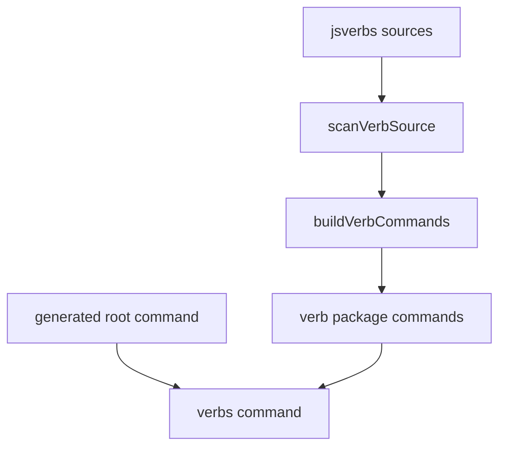

# Root-mounted JavaScript verbs design and implementation guide

## Executive summary

xgoja already supports JavaScript verbs through a generated container command, usually `verbs`. A generated binary can expose commands such as `myapp verbs tools greet`. That shape is safe because it isolates all JavaScript-defined commands below one namespace, but it is not ideal for a self-contained helper binary whose primary command surface is made of JavaScript verbs.

This ticket adds a small buildspec option:

```yaml
commands:
  jsverbs:
    enabled: true
    runtime: main
    mount: root
```

When `mount: root` is set, xgoja scans the configured JavaScript verb sources exactly as before, but mounts the discovered verb packages directly under the generated root command. A command that previously ran as `myapp verbs tools greet` can then run as `myapp tools greet`.

## Problem statement

The default jsverbs behavior is intentionally conservative. It creates a single Cobra command for JavaScript verbs and mounts all scanned verb commands under it. This avoids root command collisions with built-in generated commands such as `help`, `eval`, `run`, `repl`, and `modules`.

Some binaries, however, are designed to be verb-first. In those binaries the `verbs` prefix is noise. A `goja-text` binary that bundles useful Markdown, sanitize, and extract verbs should feel like a normal CLI:

```bash
goja-text markdown toc README.md
goja-text sanitize json broken.json
goja-text extract validate response.md
```

rather than:

```bash
goja-text verbs markdown toc README.md
goja-text verbs sanitize json broken.json
goja-text verbs extract validate response.md
```

The missing capability is not a new JavaScript verb scanner or runtime. It is a mount location option for the commands that already exist.

## Current architecture

The generated xgoja root command is assembled by `pkg/xgoja/app.Host.AttachDefaultCommands`. Built-in commands are attached in sequence:

```text
AttachDefaultCommands(root):
    install root framework/help/logging
    attach eval if enabled
    attach run if enabled
    attach repl if enabled
    attach modules
    attach jsverbs if enabled
    attach command providers
```

The existing jsverbs path calls `AttachVerbs`, which adds `newVerbsCommand(...)` as one child of the root command. `newVerbsCommand` builds all verb commands, then mounts them below that container command using Glazed/Cobra command wiring.



The new option keeps `scanVerbSource` and `buildVerbCommands` unchanged. It only changes the final attachment point.

## Proposed solution

Add semantics to the existing `CommandSpec.Mount` field for `commands.jsverbs`:

| Value | Meaning |
| --- | --- |
| omitted / empty | Keep current behavior: mount verbs under `commands.jsverbs.name`, defaulting to `verbs`. |
| `root` | Mount discovered JavaScript verb package commands directly under the generated root command. |
| `/` | Alias for `root`. |
| `.` | Alias for `root`. |

The aliases make YAML ergonomics simple while keeping the documented value `root` clear.

Implementation shape:

```text
AttachVerbs(root):
    if commands.jsverbs.mount normalizes to root:
        commands = buildVerbCommands(...)
        AddCommandsToRootCommand(root, commands)
        return

    root.AddCommand(newVerbsCommand(...))
```

Validation shape:

```text
validateCommands(spec):
    validate command runtimes as before
    if commands.jsverbs.mount is non-empty:
        accept root, /, .
        reject anything else
```

## Design decisions

### Decision 1: Reuse `commands.jsverbs.mount`

`CommandSpec` already has a `Mount` field. Using it avoids adding another buildspec shape and aligns jsverbs with the command-provider vocabulary. The field was not previously used by built-in jsverbs, so this is an additive behavior.

### Decision 2: Keep container mode as the default

Root mounting increases the chance of command collisions. A JavaScript package named `help`, `eval`, `run`, `repl`, or `modules` would be confusing and may fail during command registration. The default remains the conservative `verbs` container.

### Decision 3: Do not change scanning or invocation

The scanner, runtime factory, module-section initialization, and JavaScript invocation path stay the same. This reduces risk: root-mounted verbs receive the same runtime profile, module initializers, provider config sections, and relative `require()` behavior as container-mounted verbs.

### Decision 4: Validate typos

A misspelled mount value such as `top-level` should fail `xgoja doctor` instead of silently falling back to container mode. The validator accepts only `root`, `/`, and `.` for now.

## Implementation plan

1. Add a `commandMount` helper in `pkg/xgoja/app/root.go` that normalizes `root`, `/`, and `.`.
2. Update `Host.AttachVerbs` in `pkg/xgoja/app/host.go`:
   - root mount: call `buildVerbCommands` and add the resulting commands to the generated root command.
   - default mount: preserve `newVerbsCommand` behavior.
3. Add validation in `cmd/xgoja/internal/buildspec/validate.go` for `commands.jsverbs.mount`.
4. Add tests:
   - root-mounted embedded jsverbs execute without the `verbs` prefix.
   - `commands.jsverbs.mount` accepts root aliases.
   - unknown mount values fail validation.
5. Update xgoja docs:
   - user guide
   - tutorial
   - buildspec reference
6. Use the option in `goja-text/cmd/goja-text/xgoja.yaml` so `goja-text markdown toc ...` works directly.

## Risks and constraints

- Root mounting can collide with built-in command names or command-provider mounts. The option is explicit so callers choose that risk.
- Root mounting does not make JavaScript verbs equivalent to Go command providers. Go command providers are still the right choice for commands that need custom Go services, long-lived state, or non-JavaScript behavior.
- The `sources` helper command remains available only in the default container mode. Root-mounted binaries can inspect configured sources through buildspec/docs, but there is no root-level `sources` command added by this feature.

## Validation strategy

Run targeted tests in `go-go-goja`:

```bash
go test ./cmd/xgoja ./cmd/xgoja/internal/buildspec ./pkg/xgoja/app -count=1
```

Then validate the downstream `goja-text` binary:

```bash
cd /home/manuel/workspaces/2026-06-02/goja-text/goja-text
make build-xgoja
./dist/goja-text markdown toc examples/markdown/sample.md --output json
./dist/goja-text sanitize json examples/json/broken.json --output json
./dist/goja-text extract validate examples/text/structured-data-sample.md --output json
```

## File references

- `/home/manuel/workspaces/2026-06-02/goja-text/go-go-goja/pkg/xgoja/app/host.go`
- `/home/manuel/workspaces/2026-06-02/goja-text/go-go-goja/pkg/xgoja/app/root.go`
- `/home/manuel/workspaces/2026-06-02/goja-text/go-go-goja/pkg/xgoja/app/root_test.go`
- `/home/manuel/workspaces/2026-06-02/goja-text/go-go-goja/cmd/xgoja/internal/buildspec/validate.go`
- `/home/manuel/workspaces/2026-06-02/goja-text/go-go-goja/cmd/xgoja/internal/buildspec/validate_test.go`
- `/home/manuel/workspaces/2026-06-02/goja-text/go-go-goja/cmd/xgoja/doc/02-user-guide.md`
- `/home/manuel/workspaces/2026-06-02/goja-text/go-go-goja/cmd/xgoja/doc/03-tutorial-using-xgoja-yaml.md`
- `/home/manuel/workspaces/2026-06-02/goja-text/go-go-goja/cmd/xgoja/doc/06-buildspec-reference.md`
