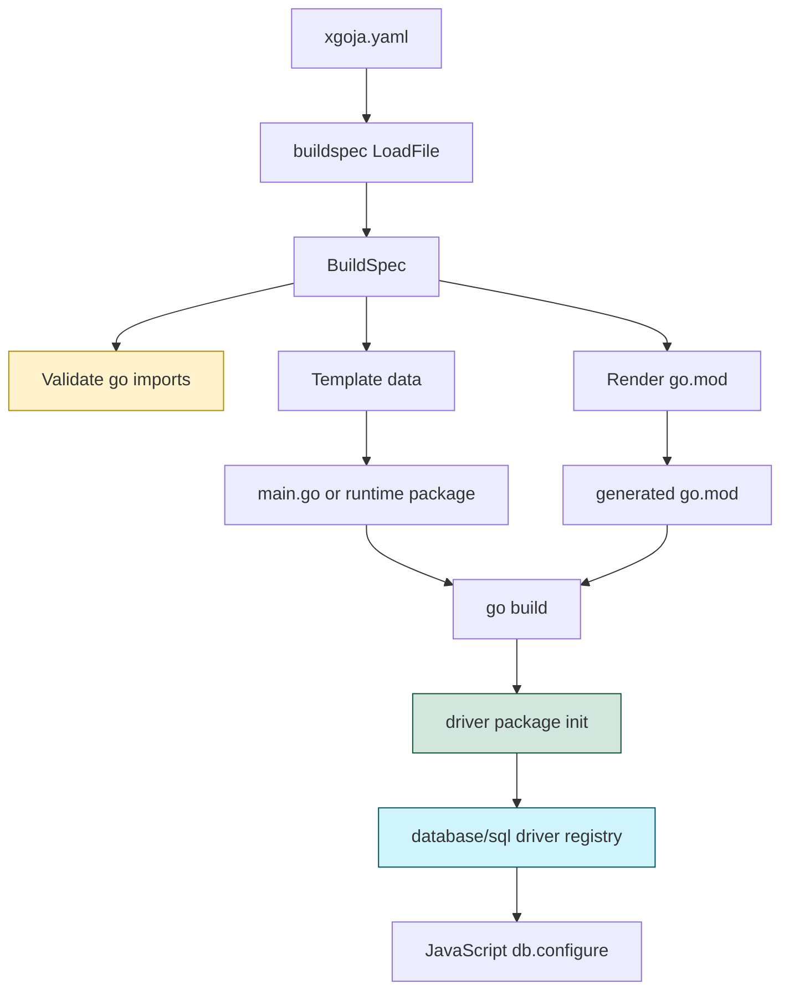

# xgoja build-time imports design and implementation guide

## Executive summary

`xgoja` generates Go binaries and Go runtime packages from `xgoja.yaml`. The YAML can already choose provider packages, modules, command providers, embedded assets, JavaScript verb sources, and generated target modes. It cannot yet say: "compile this extra Go package into the generated code even though no Go identifier from that package is referenced."

That missing feature matters for database drivers. The goja database module is generic over Go's `database/sql`, but SQL drivers are registered by Go package initialization. A generated binary that wants Postgres, MySQL, DuckDB, or another driver must include a blank import such as:

```go
import _ "github.com/lib/pq"
```

Without that blank import, JavaScript can still call:

```javascript
db.configure("postgres", dsn)
```

but `database/sql` will fail because no driver named `postgres` was registered in the binary. Runtime module config chooses a driver name; compile-time imports determine which driver packages are actually linked and initialized.

The recommended feature is a build-time `go.imports` list in `xgoja.yaml`:

```yaml
go:
  version: "1.26.1"
  module: example.com/generated/app
  imports:
    - import: github.com/lib/pq
      alias: _
      version: v1.10.9
```

This should generate:

```go
import (
    _ "github.com/lib/pq"
)
```

and add `github.com/lib/pq v1.10.9` to generated `go.mod`.

## Problem statement

The database module now supports transactions and generic `database/sql` usage. However, an `xgoja.yaml` file can configure the host database module with a driver name and DSN without also causing the generated binary to import the driver package that registers that driver. The configuration and the compiled program can therefore disagree:

```yaml
modules:
  - package: go-go-goja-host
    name: db
    as: db
    config:
      driverName: postgres
      dataSourceName: ${DATABASE_URL}
```

This YAML is declaratively reasonable, but it is incomplete at build time. Go SQL drivers register themselves from package `init()` functions. If the generated Go program never imports `github.com/lib/pq`, `github.com/jackc/pgx/v5/stdlib`, `github.com/go-sql-driver/mysql`, or another driver package, then `sql.Open(driverName, dataSourceName)` has no registered implementation for the requested driver.

The same problem can appear outside databases. Some Go packages are useful because their `init()` registers codecs, plugins, schemas, or side-effect state. xgoja needs an explicit way to compile those packages into generated output.

## Current architecture

### Buildspec schema

The build-time YAML schema lives in `cmd/xgoja/internal/buildspec/build_spec.go`. The top-level `BuildSpec` includes a `Go` field:

```go
type BuildSpec struct {
    Name     string `yaml:"name"`
    Go       GoSpec `yaml:"go"`
    Target   TargetSpec `yaml:"target"`
    Packages []PackageSpec `yaml:"packages"`
    Modules  []ModuleInstanceSpec `yaml:"modules"`
    // ...
}
```

`GoSpec` currently contains only module-level generation settings:

```go
type GoSpec struct {
    Version string   `yaml:"version" json:"version"`
    Module  string   `yaml:"module" json:"module"`
    Tags    []string `yaml:"tags" json:"tags,omitempty"`
    LDFlags []string `yaml:"ldflags" json:"ldflags,omitempty"`
}
```

This is the right place for build-time imports because the imports affect generated Go source and generated `go.mod`, not runtime module config.

### Validation

`cmd/xgoja/internal/buildspec/validate.go` validates the `BuildSpec`. It currently checks the name, app settings, config layers, target mode, packages, modules, commands, command providers, JavaScript verbs, help sources, and assets.

There is no validation pass for `go.imports`, because the field does not exist yet. The new validation should be small and deterministic:

- `import` is required;
- `alias` is optional, but if present must be `_`, `.`, or a valid Go identifier;
- `module` is optional and defaults to the import path's module root heuristic when omitted;
- `version` is optional, but if present gets rendered into generated `go.mod`;
- duplicate generated import aliases should not matter for blank imports, but duplicate non-blank aliases should be rejected.

### Template data

`cmd/xgoja/internal/generate/templates.go` converts the build spec into template data. Provider imports are already modeled:

```go
type providerImport struct {
    Alias    string
    Import   string
    Register string
}
```

`providerImportsFromSpec` computes deterministic provider aliases from `packages[]`. Generated templates use those aliases to import providers and call `Register`.

Build-time imports should follow the same pattern but with no registration call:

```go
type extraImport struct {
    Alias  string
    Import string
}
```

### Generated source templates

Generated main binaries use `cmd/xgoja/internal/generate/templates/main.go.tmpl`. The import block currently includes standard packages, xgoja app packages, target imports, and provider imports.

Generated runtime packages use `runtime_package.go.tmpl`, and source-fragment generation uses templates such as `providers_fragment.go.tmpl`. Extra imports should be emitted in any generated file that is compiled into the generated package:

- `main.go.tmpl` for `target.kind: xgoja`, `adapter`, and `cobra` builds;
- `runtime_package.go.tmpl` for `target.kind: package`;
- `providers_fragment.go.tmpl` for `target.kind: source`, because it has an import block and is always part of the generated fragment set.

Custom template mode should expose the extra imports in `TemplateDataJSON` / `packageTemplateData`, but a custom template author decides where to emit them.

### go.mod rendering

`cmd/xgoja/internal/generate/gomod.go` renders generated `go.mod`. It currently adds requirements for:

- `github.com/go-go-golems/go-go-goja`;
- target imports for adapter/cobra modes when a version is set;
- provider packages with `packages[].version`.

Extra imports must be added here too. Otherwise generated source can import a driver but the generated module may not know which dependency version to require. If no version is specified, `go mod tidy` can still resolve the module, but generated `go.mod` is less reproducible. The implementation should support both, but examples should prefer explicit versions.

## Proposed YAML API

Add `go.imports`:

```yaml
go:
  version: "1.26.1"
  module: example.com/generated/app
  imports:
    - import: github.com/lib/pq
      alias: _
      version: v1.10.9
```

Fields:

| Field | Required | Meaning |
| --- | --- | --- |
| `import` | yes | Go import path to add to generated source. |
| `alias` | no | Optional import alias. Use `_` for side-effect imports such as SQL drivers. Empty means normal import. |
| `module` | no | Module path to require in generated `go.mod`. Defaults to a module-root heuristic based on `import`. |
| `version` | no | Version for generated `go.mod`. If omitted, xgoja emits only the source import and lets `go mod tidy` resolve the module. |
| `replace` | no, future | Local replacement path. This can be added later if needed, but provider `replace` already covers most local development. |

For SQL drivers, the common shape is:

```yaml
go:
  imports:
    - import: github.com/mattn/go-sqlite3
      alias: _
      version: v1.14.32
    - import: github.com/lib/pq
      alias: _
      version: v1.10.9
```

Then database module config chooses the runtime driver:

```yaml
packages:
  - id: go-go-goja-host
    import: github.com/go-go-golems/go-go-goja/pkg/xgoja/providers/host
modules:
  - package: go-go-goja-host
    name: db
    as: db
    config:
      driverName: postgres
      dataSourceName: ${DATABASE_URL}
```

The separation is deliberate: `go.imports` is compile-time linking, while `modules[].config.driverName` is runtime database configuration.

## Why not provider-driven automatic imports first?

A provider-driven design sounds attractive: the host provider could inspect database module config and contribute imports automatically. That is harder than it looks because providers are imported and registered by the generated program, not by the generator process. The generator currently reads YAML and writes Go code; it does not execute provider code to ask for build-time contributions.

There are ways to add provider-driven contributions later:

- a static provider manifest file;
- a provider-side CLI introspection command;
- a Go plugin-like registry loaded by the generator;
- a new build-capability schema in `packages[]`.

Each option adds a larger contract. The explicit `go.imports` list is smaller, easier to test, and immediately solves the database driver problem.

## System diagram



## Implementation plan

### Step 1: Ticket, design, diary, tasks, and reMarkable upload

Create the ticket workspace and document the design before editing code. Relate the main generator/buildspec files so the next engineer can start from concrete anchors.

### Step 2: Extend buildspec schema and validation

Files:

- `cmd/xgoja/internal/buildspec/build_spec.go`
- `cmd/xgoja/internal/buildspec/validate.go`
- `cmd/xgoja/internal/buildspec/validate_test.go`
- `cmd/xgoja/internal/buildspec/load_test.go` if YAML decode coverage needs an explicit test

Add:

```go
type GoImportSpec struct {
    Import  string `yaml:"import" json:"import"`
    Alias   string `yaml:"alias" json:"alias,omitempty"`
    Module  string `yaml:"module" json:"module,omitempty"`
    Version string `yaml:"version" json:"version,omitempty"`
}

type GoSpec struct {
    Version string         `yaml:"version" json:"version"`
    Module  string         `yaml:"module" json:"module"`
    Tags    []string       `yaml:"tags" json:"tags,omitempty"`
    LDFlags []string       `yaml:"ldflags" json:"ldflags,omitempty"`
    Imports []GoImportSpec `yaml:"imports" json:"imports,omitempty"`
}
```

Validation pseudocode:

```go
func validateGoImports(report *Report, imports []GoImportSpec) {
    aliases := map[string]int{}
    seenImports := map[string]int{}
    for i, imp := range imports {
        path := fmt.Sprintf("go.imports[%d]", i)
        if strings.TrimSpace(imp.Import) == "" {
            report.AddError("go-import", path+".import", "import path is required")
        }
        if !validImportAlias(imp.Alias) {
            report.AddError("go-import-alias", path+".alias", "alias must be _, ., or a Go identifier")
        }
        if imp.Alias not in ["", "_", "."] and alias already seen {
            report.AddError("go-import-alias", path+".alias", "duplicate import alias")
        }
        if import path already seen with same alias {
            report.AddWarning or OK; duplicates can be deduplicated in generation
        }
    }
}
```

### Step 3: Extend generator template data and generated imports

Files:

- `cmd/xgoja/internal/generate/templates.go`
- `cmd/xgoja/internal/generate/templates/main.go.tmpl`
- `cmd/xgoja/internal/generate/templates/runtime_package.go.tmpl`
- `cmd/xgoja/internal/generate/templates/providers_fragment.go.tmpl`
- `cmd/xgoja/internal/generate/generate_test.go`

Add an `ExtraImports` slice to both main and package template data. Deduplicate imports by alias+path so repeated entries do not produce duplicate import lines.

Template shape:

```gotemplate
{{- range .ExtraImports }}
    {{ .Alias }} "{{ .Import }}"
{{- end }}
```

For blank imports, `.Alias` should be `_`. For normal imports, `.Alias` is empty, so the template must avoid printing a leading empty alias. Use a display field if needed:

```go
type extraImport struct {
    Alias string
    Import string
}

func (i extraImport) Prefix() string {
    if strings.TrimSpace(i.Alias) == "" { return "" }
    return i.Alias + " "
}
```

Or precompute `AliasPrefix` in template data.

### Step 4: Extend generated go.mod requirements

File:

- `cmd/xgoja/internal/generate/gomod.go`

Add imports with versions to `requires`:

```go
for _, imp := range buildSpec.Go.Imports {
    if strings.TrimSpace(imp.Version) == "" { continue }
    module := strings.TrimSpace(imp.Module)
    if module == "" { module = providerModulePath(imp.Import) }
    requires[module] = imp.Version
}
```

This reuses the existing module-root heuristic. For `github.com/lib/pq`, the module path is the import path. For subpackages, users can override with `module`.

### Step 5: Update docs and examples

Files:

- `cmd/xgoja/doc/06-buildspec-reference.md`
- possibly `cmd/xgoja/doc/03-tutorial-using-xgoja-yaml.md`

Document:

- `go.imports` syntax;
- SQL driver example;
- the distinction between compile-time driver imports and runtime `driverName` config;
- advice to use explicit versions for reproducibility.

### Step 6: Validate and commit

Focused tests:

```bash
go test ./cmd/xgoja/internal/buildspec ./cmd/xgoja/internal/generate -count=1
```

Full tests:

```bash
go test ./cmd/xgoja ./cmd/xgoja/internal/buildspec ./cmd/xgoja/internal/generate ./pkg/xgoja/app ./pkg/xgoja/providers/host -count=1
```

Then run `go test ./... -count=1` if time allows.

## Testing strategy

Add tests that assert exact generated output where possible:

1. **Buildspec load test**: YAML with `go.imports` decodes into `BuildSpec.Go.Imports`.
2. **Validation accepts blank imports**: `_` alias is valid.
3. **Validation rejects bad alias**: aliases such as `bad-alias` fail.
4. **Render main includes import**: generated main source contains `_ "github.com/lib/pq"`.
5. **Render package includes import**: generated runtime package source contains the same blank import.
6. **Render source fragments include import**: generated `providers.gen.go` or equivalent contains the blank import.
7. **Render go.mod includes versioned module**: generated `go.mod` contains `github.com/lib/pq v1.10.9`.

## Risks and review notes

- **Import formatting risk:** Go templates must not emit malformed import lines for empty aliases. Generated source should always pass `go/format`.
- **Module path risk:** Import path and module path are often the same, but not always. The `module` override is important for subpackages.
- **Provider confusion risk:** Users may expect db module config alone to pull in drivers. Documentation must explain compile-time imports separately from runtime driver selection.
- **Custom template risk:** Custom template users need access to `ExtraImports`, but xgoja cannot force them to render those imports.
- **Version reproducibility risk:** If `version` is omitted, `go mod tidy` can resolve the dependency, but generated `go.mod` is less deterministic.

## File references

| File | Why it matters |
| --- | --- |
| `cmd/xgoja/internal/buildspec/build_spec.go` | Defines `xgoja.yaml` schema; add `go.imports` here. |
| `cmd/xgoja/internal/buildspec/validate.go` | Validates YAML shape; add import and alias validation here. |
| `cmd/xgoja/internal/buildspec/validate_test.go` | Add validation coverage for accepted/rejected import specs. |
| `cmd/xgoja/internal/buildspec/load.go` | YAML loading path; no major change expected, but tests should prove decode works. |
| `cmd/xgoja/internal/generate/templates.go` | Converts buildspec into template data; add `ExtraImports`. |
| `cmd/xgoja/internal/generate/templates/main.go.tmpl` | Generated binary import block. |
| `cmd/xgoja/internal/generate/templates/runtime_package.go.tmpl` | Generated runtime package import block. |
| `cmd/xgoja/internal/generate/templates/providers_fragment.go.tmpl` | Source-fragment generation import block. |
| `cmd/xgoja/internal/generate/gomod.go` | Generated `go.mod`; add versioned extra imports. |
| `cmd/xgoja/internal/generate/generate_test.go` | Existing generated output tests; add exact import/go.mod checks. |
| `cmd/xgoja/doc/06-buildspec-reference.md` | User-facing YAML reference. |
| `pkg/xgoja/providers/host/host.go` | Database module config currently accepts `driverName` and `dataSourceName`; docs should connect this runtime config to build-time imports. |

## Definition of done

- `go.imports` decodes from YAML.
- `xgoja doctor` validates import entries and reports bad aliases.
- Generated main/source/package targets can emit blank imports.
- Generated `go.mod` includes explicitly versioned extra import modules.
- Buildspec reference documents SQL driver usage.
- Ticket diary records failures, validation, commits, and review instructions.
