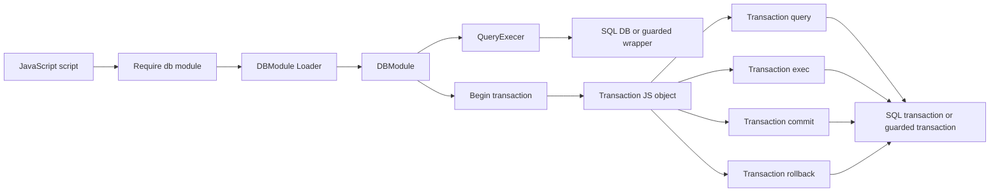

# Database module transaction support design and implementation guide

## Executive summary

The `modules/database` package exposes SQL database access to JavaScript through `require("database")` and `require("db")`. Today it supports three operations: `configure(driverName, dataSourceName)`, `query(sql, ...args)`, and `exec(sql, ...args)`. The module can own a `*sql.DB` created by JavaScript configuration, or it can wrap a Go-provided database-like object through `WithPreconfiguredDB`.

This ticket adds transaction support. The recommended API is an explicit JavaScript transaction handle:

```javascript
const db = require("db");
const tx = db.begin();
try {
  tx.exec("INSERT INTO users(name) VALUES (?)", "Ada");
  tx.exec("INSERT INTO users(name) VALUES (?)", "Grace");
  tx.commit();
} catch (err) {
  tx.rollback();
  throw err;
}
```

The transaction handle should expose `query`, `exec`, `commit`, and `rollback`. It should use the same result shapes and argument flattening rules as the root module. `commit()` and `rollback()` must be idempotency-safe at the API boundary: after one close operation succeeds, later operations on the same handle should return a clear error instead of issuing SQL on a closed transaction.

## Problem statement

JavaScript code currently cannot make a set of writes atomic through the Go-backed database module. Scripts can call `exec()` repeatedly, but every statement is independently committed by the database driver. That is insufficient for workflows such as:

- inserting a parent row and several child rows;
- updating an index table and a metadata table together;
- staging rows during a RAG import and rolling back on validation failure;
- using jsverbs against a SQLite database where partial writes must not persist when later steps fail.

The Go standard library already provides `*sql.Tx`, but the module abstraction only stores a `QueryExecer` and does not expose `Begin`/`BeginTx`. We need to extend the module without breaking preconfigured guarded database wrappers and without changing the existing `query`/`exec` behavior.

## Current-state architecture

### Runtime and module registration

The database module is a Go native module registered with go-go-goja's module registry. `modules/database/database.go:355-358` registers two default module names:

```go
func init() {
    modules.Register(New())
    modules.Register(New(WithName("db")))
}
```

That means runtime builders using module middleware can expose either name. Tests already confirm `require("database")` works through the engine middleware path.

### DBModule shape

`modules/database/database.go:65-71` defines the module state:

```go
type DBModule struct {
    name           string
    queryExecer    QueryExecer
    closeFn        func() error
    allowConfigure bool
}
```

The key point for transactions is that `queryExecer` is deliberately narrow. It only needs `Query` and `Exec`, and optionally context-aware `QueryContext` and `ExecContext` through `QueryExecerContext` at `modules/database/database.go:21-24`. This lets host wrappers such as `guardedDB` participate without being a full `*sql.DB`.

### JavaScript exports

`DBModule.Loader` at `modules/database/database.go:159-170` exposes functions into CommonJS exports:

```go
modules.SetExport(exports, m.Name(), "query", func(query string, args ...any) ([]map[string]any, error) {
    return m.QueryContext(runtimebridge.CurrentOwnerContext(vm), query, args...)
})
modules.SetExport(exports, m.Name(), "exec", func(query string, args ...any) (map[string]any, error) {
    return m.ExecContext(runtimebridge.CurrentOwnerContext(vm), query, args...)
})
```

The `runtimebridge.CurrentOwnerContext(vm)` call matters. It preserves the current runtime owner call context, including contexts that survive an `await` in existing tests. Transaction operations should use the same context pattern.

### Query and exec implementation

`QueryContext` and `ExecContext` live at `modules/database/database.go:210-309`. They share these invariants:

- return a clear error if the module is not configured;
- default nil contexts to `context.Background()`;
- call helpers that prefer context-aware database methods;
- flatten JS array arguments using `flattenArgs` at `modules/database/database.go:343-353`;
- log query/exec lifecycle events;
- return JavaScript-friendly result maps.

The implementation should reuse or factor this behavior instead of duplicating it in a transaction-specific way.

### Host provider integration

`pkg/xgoja/providers/host/host.go:49-53` defines database provider configuration:

```go
type DatabaseConfig struct {
    AllowConfigure bool   `json:"allowConfigure"`
    DriverName     string `json:"driverName,omitempty"`
    DataSourceName string `json:"dataSourceName,omitempty"`
}
```

`pkg/xgoja/providers/host/host.go:203-244` exposes guarded `database` and `db` modules through xgoja. When `driverName` and `dataSourceName` are provided, the provider opens a `*sql.DB` and passes it into `dbm.New(... WithPreconfiguredDB(db), WithCloseFn(db.Close))`. That preconfigured path can support transactions if the wrapped object implements the new transaction interface.

### jsverbs guarded database integration

`pkg/jsverbscli/runtime.go:106-119` defines a `guardedDB` wrapper around `*sql.DB`. Its `Exec` method rejects writes unless the CLI was started with write permissions:

```go
func (g *guardedDB) Exec(query string, args ...any) (sql.Result, error) {
    if !g.allowWrites {
        return nil, fmt.Errorf("database writes are disabled; rerun with --readonly=false --allow-writes")
    }
    return g.db.Exec(query, args...)
}
```

If transaction support is exposed through this wrapper, transaction `exec()` must preserve the same write guard. A transaction begun on a read-only guarded DB must either be unavailable or return guarded errors for writes. The simplest safe implementation is to make `guardedDB` implement transaction begin with a guarded transaction wrapper.

## System diagram



## Proposed JavaScript API

### Root module

Add one root function:

```typescript
begin(options?: TransactionOptions): Transaction
```

Initial implementation can ignore options or accept a small subset later. To keep this ticket focused and predictable, implement `begin()` first. Leave isolation/read-only options for a follow-up unless they are easy to wire through `sql.TxOptions` without complicating host wrappers.

### Transaction object

```typescript
interface Transaction {
  query(sql: string, ...args: unknown[]): Array<Record<string, unknown>>;
  exec(sql: string, ...args: unknown[]): ExecResult;
  commit(): { success: true };
  rollback(): { success: true };
}

interface ExecResult {
  success: boolean;
  rowsAffected?: number;
  lastInsertId?: number;
  error?: string;
}
```

### Usage examples

#### Commit on success

```javascript
const db = require("db");
db.configure("sqlite3", ":memory:");
db.exec("CREATE TABLE users(name TEXT NOT NULL)");

const tx = db.begin();
tx.exec("INSERT INTO users(name) VALUES (?)", "Ada");
tx.exec("INSERT INTO users(name) VALUES (?)", "Grace");
tx.commit();

console.log(db.query("SELECT name FROM users ORDER BY name"));
```

#### Roll back on error

```javascript
const tx = db.begin();
try {
  tx.exec("INSERT INTO users(name) VALUES (?)", "Ada");
  tx.exec("INSERT INTO missing_table(name) VALUES (?)", "boom");
  tx.commit();
} catch (err) {
  tx.rollback();
  throw err;
}
```

## Go API design

### New begin-capable interfaces

Add interfaces next to `QueryExecer` and `QueryExecerContext`:

```go
type TransactionBeginner interface {
    Begin() (*sql.Tx, error)
}

type TransactionBeginnerContext interface {
    BeginTx(ctx context.Context, opts *sql.TxOptions) (*sql.Tx, error)
}
```

However, `guardedDB` needs to preserve write guards inside transactions. Returning a concrete `*sql.Tx` from the interface makes that impossible because a wrapper cannot intercept `tx.Exec`. A better extensible design is to define abstract transaction interfaces:

```go
type Transaction interface {
    Query(query string, args ...any) (*sql.Rows, error)
    Exec(query string, args ...any) (sql.Result, error)
    Commit() error
    Rollback() error
}

type TransactionContext interface {
    QueryContext(ctx context.Context, query string, args ...any) (*sql.Rows, error)
    ExecContext(ctx context.Context, query string, args ...any) (sql.Result, error)
    Commit() error
    Rollback() error
}

type TransactionBeginner interface {
    Begin() (Transaction, error)
}

type TransactionBeginnerContext interface {
    BeginTx(ctx context.Context, opts *sql.TxOptions) (Transaction, error)
}
```

`*sql.DB` can be adapted by a small `sqlDBBeginner` path because `*sql.Tx` already satisfies the transaction interfaces. Wrappers such as `guardedDB` can implement `BeginTx` and return their own guarded transaction object.

### DBModule methods

Add public methods:

```go
func (m *DBModule) Begin() (*TransactionHandle, error) {
    return m.BeginContext(context.Background())
}

func (m *DBModule) BeginContext(ctx context.Context) (*TransactionHandle, error) {
    // validate configured
    // prefer TransactionBeginnerContext
    // fall back to TransactionBeginner
    // return handle with module name and Transaction
}
```

The handle should use a mutex because Goja code is mostly single-threaded but host callbacks and future async integrations can interleave. The mutex also makes closed-state errors deterministic.

```go
type TransactionHandle struct {
    moduleName string
    tx         Transaction
    closed     bool
    mu         sync.Mutex
}
```

Methods:

```go
func (tx *TransactionHandle) QueryContext(ctx context.Context, query string, args ...any) ([]map[string]any, error)
func (tx *TransactionHandle) ExecContext(ctx context.Context, query string, args ...any) (map[string]any, error)
func (tx *TransactionHandle) Commit() (map[string]any, error)
func (tx *TransactionHandle) Rollback() (map[string]any, error)
```

### Loader export

Add `begin` in `DBModule.Loader`:

```go
modules.SetExport(exports, m.Name(), "begin", func() (*goja.Object, error) {
    tx, err := m.BeginContext(runtimebridge.CurrentOwnerContext(vm))
    if err != nil {
        return nil, err
    }
    return tx.ToObject(vm), nil
})
```

`ToObject(vm)` should construct a JS object with closures that call the handle with `runtimebridge.CurrentOwnerContext(vm)`. That mirrors root `query` and `exec` behavior.

## Implementation pseudocode

### Shared row conversion

Current `QueryContext` does both SQL execution and row conversion. Transaction support will benefit from extracting row conversion:

```go
func rowsToRecords(moduleName string, rows *sql.Rows) ([]map[string]any, error) {
    defer rows.Close()
    cols, err := rows.Columns()
    if err != nil { return nil, err }
    result := []map[string]any{}
    for rows.Next() {
        // scan into []any and map columns to values
    }
    if err := rows.Err(); err != nil { return nil, err }
    return result, nil
}
```

This also fixes a current sharp edge: `QueryContext` does not check `rows.Err()` after iteration. Add the check while extracting the helper.

### Shared exec result conversion

```go
func resultToMap(result sql.Result) map[string]any {
    rowsAffected, _ := result.RowsAffected()
    lastInsertID, _ := result.LastInsertId()
    return map[string]any{
        "success": true,
        "rowsAffected": rowsAffected,
        "lastInsertId": lastInsertID,
    }
}
```

### Begin helper

```go
func beginTransaction(ctx context.Context, qe QueryExecer) (Transaction, error) {
    if ctx == nil { ctx = context.Background() }
    if beginner, ok := qe.(TransactionBeginnerContext); ok {
        return beginner.BeginTx(ctx, nil)
    }
    if beginner, ok := qe.(TransactionBeginner); ok {
        return beginner.Begin()
    }
    return nil, fmt.Errorf("database does not support transactions")
}
```

### Transaction handle closed-state enforcement

```go
func (h *TransactionHandle) withOpen(fn func(Transaction) error) error {
    h.mu.Lock()
    defer h.mu.Unlock()
    if h.closed || h.tx == nil {
        return fmt.Errorf("database transaction is closed")
    }
    return fn(h.tx)
}

func (h *TransactionHandle) Commit() (map[string]any, error) {
    h.mu.Lock()
    defer h.mu.Unlock()
    if h.closed || h.tx == nil {
        return nil, fmt.Errorf("database transaction is closed")
    }
    err := h.tx.Commit()
    h.closed = true
    h.tx = nil
    if err != nil { return map[string]any{"success": false, "error": err.Error()}, err }
    return map[string]any{"success": true}, nil
}
```

## Design decisions

### Decision 1: explicit transaction handle rather than callback-only transaction helper

- **Context:** JavaScript transaction APIs often use either explicit handles (`tx = db.begin()`) or callback helpers (`db.transaction(fn)`).
- **Options considered:**
  - only `db.begin()` with explicit `commit`/`rollback`;
  - only `db.transaction(fn)` that auto-commits/rolls back;
  - implement both immediately.
- **Decision:** Implement explicit `db.begin()` first.
- **Rationale:** It is simple, easy to test synchronously, compatible with existing Goja export patterns, and does not require reasoning about async callback lifetimes.
- **Consequences:** Users must remember to rollback on errors. A future `db.transaction(fn)` helper can be layered on top.
- **Status:** Proposed.

### Decision 2: transaction abstraction rather than hard-coding `*sql.Tx`

- **Context:** `WithPreconfiguredDB` accepts wrappers, not only `*sql.DB`. The jsverbs CLI uses a `guardedDB` wrapper to reject writes.
- **Options considered:**
  - require `*sql.DB` for transactions;
  - add `Begin() (*sql.Tx, error)` only;
  - define abstract `Transaction` and `TransactionBeginner` interfaces.
- **Decision:** Use abstract transaction interfaces.
- **Rationale:** Wrappers can return guarded transaction handles that preserve security/write policy.
- **Consequences:** Slightly more code, but much safer for host integrations.
- **Status:** Proposed.

### Decision 3: keep transaction support independent of `configure()` policy

- **Context:** `allowConfigure` controls whether JavaScript may open a new database connection. It does not mean JavaScript may or may not use an already configured database.
- **Options considered:**
  - disable transactions on preconfigured modules by default;
  - let any transaction-capable configured database expose `begin()`;
  - add a new `allowTransactions` config flag.
- **Decision:** Let transaction-capable configured databases expose `begin()`.
- **Rationale:** Transactions are part of using a configured database, not a new host capability. Host wrappers can still deny writes.
- **Consequences:** Read-only wrappers must be transaction-aware if they expose `begin()`.
- **Status:** Proposed.

## Implementation plan

### Step 1: Document and ticket setup

- Create this design doc and a diary document.
- Relate files that define current database behavior and host integration.
- Add implementation tasks.
- Upload the design doc bundle to reMarkable.

### Step 2: Add transaction interfaces and handle plumbing

Files:

- `modules/database/database.go`
- `modules/database/database_test.go`

Actions:

- Add transaction interfaces.
- Add `DBModule.Begin` and `DBModule.BeginContext`.
- Add `TransactionHandle` with `query`, `exec`, `commit`, and `rollback` methods.
- Add `begin` export in `Loader`.
- Extract reusable row and result conversion helpers.
- Add tests for commit, rollback, closed transaction errors, and unconfigured database errors.

### Step 3: Preserve context propagation

Files:

- `modules/database/database.go`
- `modules/database/database_test.go`

Actions:

- Ensure `db.begin()` uses `runtimebridge.CurrentOwnerContext(vm)`.
- Ensure `tx.query` and `tx.exec` also use current owner context.
- Add a test similar to the existing async context test: begin a transaction after an `await`, run `tx.exec`, and assert the wrapped DB received the original owner context.

### Step 4: Update guarded database integration

Files:

- `pkg/jsverbscli/runtime.go`
- tests under `pkg/jsverbscli` if existing test harness supports database runtime checks.

Actions:

- Implement transaction begin on `guardedDB`.
- Return a guarded transaction wrapper whose `Exec`/`ExecContext` enforces `allowWrites`.
- Add tests for read-only transaction write rejection and allowed transaction commit if practical.

### Step 5: Update TypeScript declarations and docs

Files:

- `modules/database/database.go`
- generated declaration golden files if `go test` indicates they changed.

Actions:

- Add `begin` to `TypeScriptModule()`.
- Add transaction object shape if the current `tsgen/spec` model supports object/interface modeling; otherwise use `spec.Unknown()` and update raw docs.
- Update `Doc()` output with transaction examples.

### Step 6: Validate and commit

Commands:

```bash
gofmt -w modules/database/database.go pkg/jsverbscli/runtime.go
go test ./modules/database ./pkg/jsverbscli ./pkg/xgoja/providers/host -count=1
go test ./... -count=1
```

Commit at logical boundaries:

1. docs/ticket setup;
2. core database transaction API;
3. guarded jsverbs integration;
4. docs/typescript polish, if separate.

## Testing strategy

### Core database module tests

Add tests for:

- commit persists writes;
- rollback discards writes;
- calling `query` or `exec` after `commit` fails;
- calling `commit` after `rollback` fails;
- `begin()` on unconfigured module fails with a helpful message;
- begin falls back to legacy non-context begin interface when needed;
- begin prefers context-aware begin when available.

### Runtime integration tests

Add Goja runtime tests that execute JavaScript:

```javascript
const db = require("database");
db.configure("sqlite3", path);
db.exec("CREATE TABLE users(name TEXT)");
const tx = db.begin();
tx.exec("INSERT INTO users(name) VALUES (?)", "Ada");
tx.commit();
JSON.stringify(db.query("SELECT name FROM users"));
```

### Guarded database tests

For `pkg/jsverbscli/runtime.go`, verify:

- `tx.exec(...)` is rejected when writes are disabled;
- `tx.query(...)` still works in a transaction when the driver supports it;
- writes succeed when `--readonly=false --allow-writes` behavior produces `allowWrites=true`.

## Risks and review notes

- **Security/write policy risk:** If transaction support bypasses `guardedDB.Exec`, read-only jsverbs mode could accidentally allow writes. Review `pkg/jsverbscli/runtime.go` carefully.
- **Context propagation risk:** If transaction methods use `context.Background()` instead of `runtimebridge.CurrentOwnerContext(vm)`, request-scoped cancellation and metadata will be lost.
- **Closed transaction risk:** `*sql.Tx` returns driver errors after close, but the JS API should return a stable, understandable error.
- **Async callback risk:** This design avoids callback-style transactions for now because async callback commit/rollback semantics require a separate design.
- **Rows error risk:** While extracting row conversion, check `rows.Err()` so iteration failures surface.

## API references

- Go `database/sql.DB.Begin`: starts a transaction without explicit context/options.
- Go `database/sql.DB.BeginTx`: starts a transaction with context and optional `sql.TxOptions`.
- Go `database/sql.Tx`: exposes `Query`, `QueryContext`, `Exec`, `ExecContext`, `Commit`, and `Rollback`.
- Goja native module loader pattern: `func(vm *goja.Runtime, moduleObj *goja.Object)` exports functions into `module.exports`.
- go-go-goja runtime context bridge: `runtimebridge.CurrentOwnerContext(vm)`.

## File references

| File | Why it matters |
| --- | --- |
| `modules/database/database.go` | Main database module implementation, exports, TypeScript declarations, query/exec helpers, and default module registration. |
| `modules/database/database_test.go` | Existing integration tests for configured/preconfigured modules and context propagation. |
| `pkg/xgoja/providers/host/host.go` | xgoja host provider wiring for guarded/preconfigured database modules. |
| `pkg/jsverbscli/runtime.go` | CLI database wrapper that enforces read-only/write policy and must not be bypassed by transactions. |
| `cmd/gen-dts/main.go` | Includes `database` in generated TypeScript declaration generation. |
| `cmd/goja-repl/root_test.go` | Smoke coverage that checks the database module can be enabled in the REPL command path. |

## Open questions

1. Should `begin(options)` support `readOnly`, `isolation`, or both in this first ticket?
2. Should the module also provide a convenience `transaction(fn)` helper after explicit handles are implemented?
3. Should host provider database config gain an explicit `allowTransactions` flag, or are transaction-capable wrappers enough policy control?
4. Should TypeScript declarations model `Transaction` as a named interface, or is the current declaration generator limited to function signatures?
