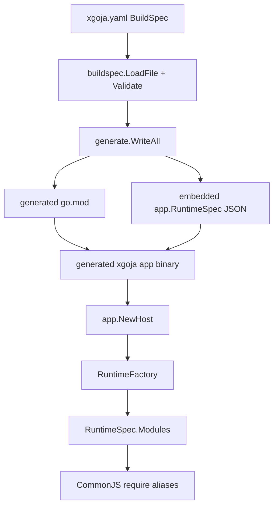
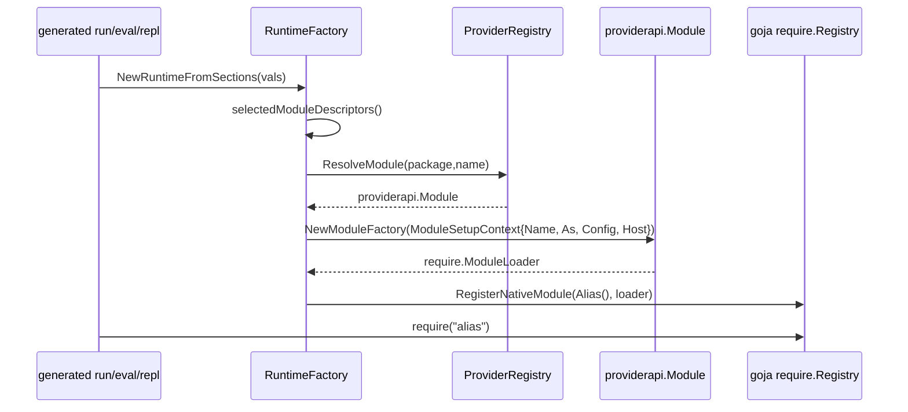
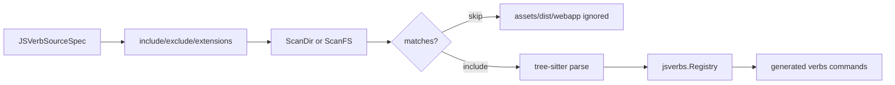
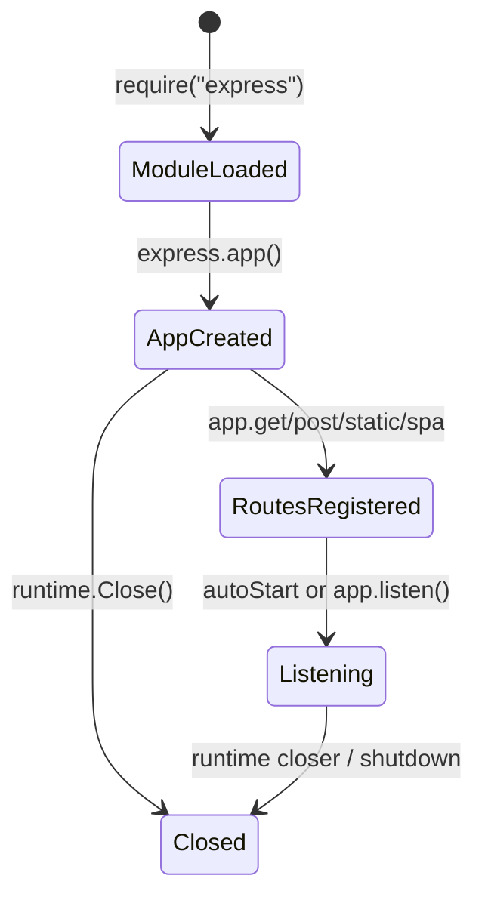

# XGoja ClubMedMeetup Module Improvements Implementation Guide

## Executive summary

ClubMedMeetup's `minitrace-viz` site is a strong real-world integration test for `go-go-goja` because it uses a generated `xgoja` binary as an application server, not just as a toy scripting shell. The source analysis in the ClubMedMeetup ticket shows that the site selects thirteen runtime modules from seven provider packages, serves a React SPA from embedded assets, registers HTTP routes with `require("express")`, exposes local JavaScript verbs, and relies on two differently configured filesystem aliases (`fs:host` and `fs:assets`). That combination uncovered several concrete improvements that belong in `go-go-goja`.

This ticket focuses on the `go-go-goja` side of the issue. The goal is not to rewrite ClubMedMeetup. The goal is to make generated xgoja applications easier to inspect, safer to operate, and less surprising for interns and application authors. The work should produce reusable behavior in `go-go-goja`: JSVerb source include/exclude filters, a runtime command that lists selected module aliases, a doctor warning for unpinned provider packages, safer Express/HTTP lifecycle semantics, and capability metadata for read-only filesystem modules.

The most important implementation rule is to preserve the existing provider contract while improving observability around it. Existing xgoja applications already depend on provider packages registering modules through `providerapi.Module`, xgoja selecting instances through `ModuleInstanceSpec`, and the generated runtime registering CommonJS loaders under the selected `as` alias. Do not bypass that model. Instead, add small, well-tested extensions around the current seams.

## Problem statement and scope

The ClubMedMeetup source document reported the following go-go-goja issues from actual usage:

- `jsverbs.path: .` caused the JSVerb scanner to walk bundled Vite assets under `assets/public`, eventually producing a duplicate generated verb path. This is a source hygiene and scanner configurability problem.
- `xgoja list-modules -f xgoja.yaml` lists selected `require()` aliases, but the generated binary's `modules` command lists compiled provider modules. A new user can confuse provider catalog entries such as `go-go-goja-host.fs` with actual aliases such as `fs:host` and `fs:assets`.
- Generated builds depend on provider package `version` and `replace` settings. If an xgoja buildspec selects provider packages without `version` or `replace`, builds can drift across workstations, CI, and Docker.
- `require("express")` in the generated runtime starts or touches the xgoja HTTP listener. That makes eval/repl introspection fail when the default port is already in use, even when the user only wants to inspect module exports.
- A read-only embedded filesystem module exposes the same method list and TypeScript declaration as a host filesystem module. Mutating methods correctly fail with read-only errors, but discovery does not explain that writes are impossible.

This ticket is scoped to `go-go-goja`. It should not implement the ClubMedMeetup app changes, the `go-minitrace` upstream consolidation, or `goja-text` document helpers. Those are related follow-up tickets in sibling repositories. This ticket can, however, provide the `go-go-goja` runtime affordances those follow-ups depend on.

## Current-state architecture

### Build-time model: xgoja.yaml as declarative input

The xgoja buildspec schema lives in `cmd/xgoja/internal/buildspec/build_spec.go`. The top-level `BuildSpec` contains build-only information such as Go module settings, provider packages, selected module instances, commands, JavaScript verb sources, help sources, and embedded assets. Lines 12-30 define the top-level structure, and lines 68-74 define `PackageSpec` with `ID`, `Import`, `Version`, `Register`, and `Replace`.

The most important part for module selection is `ModuleInstanceSpec` at `cmd/xgoja/internal/buildspec/build_spec.go:76-84`:

```go
type ModuleInstanceSpec struct {
    Package string         `yaml:"package" json:"package"`
    Name    string         `yaml:"name" json:"name"`
    As      string         `yaml:"as" json:"as,omitempty"`
    Config  map[string]any `yaml:"config" json:"config,omitempty"`
}
```

`Alias()` at lines 86-91 returns `As` when present and falls back to `Name`. This is the semantic center of xgoja module selection: `as` is not a label; it is the actual CommonJS `require()` name installed into the generated runtime.

The JSVerb schema is currently too small for source hygiene. `JSVerbSourceSpec` at `build_spec.go:124-130` only has `id`, `path`, `embed`, `package`, and `source`. There is no way to say "scan only `site.js`" or "scan this directory except `assets/**` and `dist/**`." The scanner therefore has to treat a configured directory as the entire source tree.

### Build execution and generated go.mod

`cmd/xgoja/cmd_build.go` implements the `xgoja build` command. It loads the buildspec, validates it, writes generated Go files, runs `go mod tidy`, and builds the generated module. Lines 92-106 are the high-level orchestration: load the spec, reject source-only target kinds, compute the output/work directory, and write generated files. Lines 128-140 run `go mod tidy`, resolve the output path, and run `go build`.

Generated module dependency determinism is controlled by `cmd/xgoja/internal/generate/gomod.go`. `RenderGoMod` always requires the xgoja runtime module (`github.com/go-go-golems/go-go-goja`) at the selected xgoja version. It only adds provider package modules when the provider's `PackageSpec.Version` is non-empty (`gomod.go:28-34`). It only adds replacements for packages whose `PackageSpec.Replace` is non-empty (`gomod.go:63-67`). Therefore an unpinned provider package is not explicitly recorded in the generated `require` block by this code path. Go can still resolve it transitively, but the buildspec is not self-describing or deterministic.

The required improvement is not to force every local development build to pin versions. Instead, `xgoja doctor` should warn when a provider package has neither `version` nor `replace`, and the documentation should explain when the warning is acceptable.

### Runtime model: embedded RuntimeSpec and provider modules

Generated binaries do not use the full buildspec at runtime. `pkg/xgoja/app/runtime_spec.go` defines the runtime-side `RuntimeSpec`, which intentionally omits build-only fields such as provider import paths, provider versions, replacements, target root, and base directories. It keeps packages by ID, selected modules, commands, command providers, JSVerb sources, help sources, and assets.

Runtime module selection is implemented by `pkg/xgoja/app/factory.go`. The key flow is:

1. `RuntimeFactory.NewRuntimeFromSections` loads selected module descriptors from the runtime spec (`factory.go:74-81`).
2. It asks provider package capabilities to contribute host services (`factory.go:82-85`, `factory.go:143-173`).
3. It iterates every selected `RuntimeSpec.Modules` entry, resolves the provider module by `package` and `name`, merges config, and creates a `providerRuntimeModuleRegistrar` (`factory.go:96-110`).
4. The registrar calls the provider module's `NewModuleFactory` with `ModuleSetupContext`, including `Name`, `As`, static/merged config, host services, runtime owner, and closer registration (`factory.go:46-54`).
5. The registrar installs the loader under `s.instance.Alias()` with `reg.RegisterNativeModule` (`factory.go:58`).

This means a selected module entry like:

```yaml
modules:
  - package: go-go-goja-host
    name: fs
    as: fs:assets
    config:
      embedded:
        allow: true
```

produces `require("fs:assets")`, not `require("fs")`. The provider module name remains `fs`; the runtime alias is `fs:assets`.

### Provider API contract

Provider packages register entries in `providerapi.ProviderRegistry`. `providerapi.Module` at `pkg/xgoja/providerapi/module.go:40-49` is the selected native module contract. It has a provider-owned `Name`, optional `DefaultAs`, description, config schema, and `NewModuleFactory`.

`ModuleSetupContext` at `module.go:12-22` is the runtime setup context passed to provider modules. The important fields for this ticket are:

- `Name`: provider module name from the package, for example `fs`.
- `As`: selected runtime alias, for example `fs:assets`.
- `Config`: selected module config after xgoja/glazed config merging.
- `Host`: runtime host services such as asset resolution.
- `RuntimeOwner` and `AddCloser`: lifecycle hooks.

Package capabilities are defined in `pkg/xgoja/providerapi/capabilities.go`. The important interfaces are:

- `GlazedConfigSectionCapability` (`capabilities.go:39-46`) exposes public command/config sections.
- `XGojaConfigSectionCapability` (`capabilities.go:60-68`) maps public values into provider-internal module config.
- `HostServiceContributionCapability` (`capabilities.go:91-98`) contributes Go-backed services before the runtime is constructed.
- `RuntimeInitializerCapability` (`capabilities.go:109-115`) initializes a runtime after the VM exists.

The proposed Express lifecycle changes should use this existing capability model instead of adding ad hoc globals.

### Generated runtime commands

`pkg/xgoja/app/root.go` attaches generated runtime commands. The generated `modules` command currently lists provider modules compiled into the binary, not selected runtime aliases. `newModulesCommand` ignores `runtimeSpec` (`root.go:159-161`) and iterates `providers.Packages()`. It emits rows with columns `package`, `module`, and `require`, where `require` is currently a provider-qualified string like `go-go-goja-host.fs` (`root.go:174-187`).

This is technically a provider catalog, not a runtime module inventory. The command name and `require` column make it too easy to believe the row is a valid CommonJS import. The intern should implement a separate selected-module command and rename the existing provider catalog column to avoid implying `require("go-go-goja-host.fs")` works.

The xgoja CLI already has a buildspec-level command for selected modules. `cmd/xgoja/cmd_list_modules.go` loads `xgoja.yaml` and emits `file`, `package`, `module`, and `alias` for each selected module. The generated runtime needs an equivalent that uses embedded `RuntimeSpec`, so it works after distribution without the original YAML file.

### JSVerb scanning

JSVerb scanning is split between runtime source selection and scanner implementation:

- `pkg/xgoja/app/root.go:270-302` chooses provider, embedded, or filesystem JSVerb sources and then calls `jsverbs.ScanFS` or `jsverbs.ScanDir`.
- `pkg/jsverbs/scan.go:17-73` implements `ScanDir` by walking every file under the configured root whose extension matches the scanner options.
- `pkg/jsverbs/scan.go:40-48` skips only `node_modules` and dot-directories via `shouldSkipDir`; normal directories like `assets`, `dist`, `webapp`, and `lib` are scanned.
- `pkg/jsverbs/scan.go:50-66` appends every supported JavaScript source into the scanner input list.

The scanner is correct for a carefully scoped source directory. It is too broad for application roots that also contain bundled assets. The right fix is to make the scanner configurable and make xgoja expose that config in `JSVerbSourceSpec`.

### HTTP provider and Express lifecycle

The HTTP provider lives in `pkg/xgoja/providers/http/http.go`. It registers provider package `go-go-goja-http` and module `express` (`http.go:25-35`). The provider also registers an HTTP config capability and a `serve` command provider (`http.go:36-44`).

The current lifecycle surprise is visible in `NewExpressLoader` (`http.go:109-123`). Loading the module:

1. Gets or creates a runtime entry.
2. Creates a `gojahttp.Host` if needed.
3. Calls `c.start(vm, entry)` immediately.
4. Delegates to `express.NewLoader(host)`.

`start` binds a TCP listener if HTTP is enabled (`http.go:137-164`). Because the default runtime entry has `settings{Enabled: true, Listen: "127.0.0.1:8787"}` (`http.go:126-134`), simply requiring Express can attempt to bind the default port. The `InitRuntimeFromSections` path can set HTTP disabled when values exist (`http.go:87-107`), but a user inspecting exports may not expect `require("express")` to perform network IO at all.

### Filesystem module and read-only assets

The host provider registers `fs` and `node:fs` as guarded modules in `pkg/xgoja/providers/host/host.go`. The module config schema explicitly supports either host access (`allow: true`) or embedded read-only mounts (`embedded.allow: true`) and rejects combining both in one alias (`host.go:101-123`). This is a good design: applications should use distinct aliases such as `fs:host` and `fs:assets`.

The filesystem module's TypeScript declaration and exported method list are backend-independent. `modules/fs/fs.go:43-65` declares read and write methods. `modules/fs/fs.go:97-139` exports async read/write/mkdir/remove methods, and `fs.go:142-190` exports sync methods. The read-only embedded backend correctly rejects mutations: `modules/fs/backend_embed.go:49-63` returns a mutation error for write and mkdir, and `backend_embed.go:90-118` returns mutation errors for remove, append, rename/copy write targets, and recursive remove.

The gap is discoverability. A developer can inspect `Object.keys(require("fs:assets"))` and see methods that cannot succeed. The implementation should expose capabilities such as `isReadOnly`, `capabilities()`, or a backend descriptor so the API is self-describing.

## Proposed solution

### Overview

Implement five small `go-go-goja` improvements:

1. **JSVerb source filters:** Extend buildspec and runtime `JSVerbSourceSpec` with `include`, `exclude`, and optional `extensions`, then apply those patterns in `jsverbs.ScanDir` and `ScanFS`.
2. **Selected runtime module inventory:** Add a generated runtime command, tentatively `selected-modules`, that lists `RuntimeSpec.Modules` with actual aliases and config summaries. Adjust the existing `modules` command wording/columns so it is clearly a provider catalog.
3. **Provider pin doctor warning:** Add an `xgoja doctor`/validation warning for provider packages without `version` or `replace`, preferably suppressible for intentional workspace builds.
4. **Lazy or explicit Express start:** Change the HTTP provider so `require("express")` creates module exports but does not bind a port until HTTP is initialized and an app registers routes/static handlers or explicitly calls `listen`.
5. **Filesystem capability metadata:** Add read-only/backend capability metadata to the fs module exports and TypeScript declarations.

These changes share one architectural principle: each feature is metadata/configuration around existing contracts. Do not add a second module registry, a second HTTP host model, or a new filesystem module for assets. Extend the existing seams.

## Target architecture diagrams

### Build-to-runtime path



The intern should remember that `PackageSpec.Version` and `PackageSpec.Replace` affect `go.mod`, but they do not survive into `RuntimeSpec`. Runtime commands can report selected aliases and static config, but not provider import paths or version pins unless the runtime schema is deliberately extended.

### Runtime module registration



### JSVerb filtered scanning



### HTTP lifecycle target



In the target lifecycle, the `ModuleLoaded` state must not bind a TCP port. Binding should happen at `RoutesRegistered` or explicit `app.listen()` depending on the chosen compatibility policy.

## Detailed design and API references

### Feature 1: JSVerb source filters

#### Public xgoja.yaml API

Extend both build-time and runtime JSVerb source specs:

```go
type JSVerbSourceSpec struct {
    ID         string   `yaml:"id" json:"id"`
    Path       string   `yaml:"path" json:"path,omitempty"`
    Embed      bool     `yaml:"embed" json:"embed"`
    Package    string   `yaml:"package" json:"package,omitempty"`
    Source     string   `yaml:"source" json:"source,omitempty"`
    Include    []string `yaml:"include,omitempty" json:"include,omitempty"`
    Exclude    []string `yaml:"exclude,omitempty" json:"exclude,omitempty"`
    Extensions []string `yaml:"extensions,omitempty" json:"extensions,omitempty"`
}
```

Example buildspec usage:

```yaml
jsverbs:
  - id: minitrace-viz-site
    path: .
    include:
      - site.js
      - jsverbs/**/*.js
    exclude:
      - assets/**
      - dist/**
      - webapp/**
      - node_modules/**
```

`include` should be interpreted relative to the configured source root. If `include` is empty, all supported files are candidates. `exclude` removes candidates after include matching. `extensions` defaults to existing scanner extensions.

#### Scanner API

Extend `pkg/jsverbs` scan options. The current `ScanOptions` definition was not opened in this session, but the implementation already uses `options.Extensions` and `options.FailOnErrorDiagnostics`. Add fields similar to:

```go
type ScanOptions struct {
    Extensions []string
    FailOnErrorDiagnostics bool
    Include []string
    Exclude []string
}
```

Pseudocode for candidate filtering:

```text
for each walked file:
    rel = slash-relative-path(root, file)
    if !supportsExtension(rel, options.Extensions):
        continue
    if len(options.Include) > 0 and !matchesAny(rel, options.Include):
        continue
    if matchesAny(rel, options.Exclude):
        continue
    read and append source input
```

Pattern matching should use a predictable glob helper. If the repo already has a doublestar dependency, use it. Otherwise implement a small helper around `path.Match` plus `**` support, and add tests before using it in scanner code. Do not use OS-specific path separators in matching; convert to slash paths before matching.

#### xgoja app integration

`pkg/xgoja/app/root.go:270-302` currently calls `jsverbs.ScanFS(providerSource.FS, providerSource.Root)`, `jsverbs.ScanFS(embeddedJSVerbs, source.Path)`, or `jsverbs.ScanDir(source.Path)` without options. Construct `ScanOptions` from `source.Include`, `source.Exclude`, and `source.Extensions`, and pass it through in each path.

Provider-supplied JSVerb sources need a design choice:

- Option A: apply the xgoja selected source's include/exclude filters to provider sources too.
- Option B: reject include/exclude on provider sources because provider sources are already curated.

Prefer Option A. It is more general and keeps the schema behavior consistent. Document that paths are relative to the provider source root.

#### Validation and doctor warnings

In `cmd/xgoja/internal/buildspec/validate.go`, validate that include/exclude patterns are non-empty strings when present. Also add a warning when a filesystem JSVerb source uses `path: .` with no include/exclude filters. The warning should say why: scanning an application root can pick up bundled assets, generated files, or unrelated JavaScript.

#### Tests

Add scanner-level tests under `pkg/jsverbs`:

- include only `site.js` while ignoring `assets/public/app.js`.
- exclude `assets/**` and `dist/**` while keeping `site.js`.
- extension override works for `.mjs` or `.cjs` if already supported.
- path matching is slash-normalized.

Add xgoja app tests around `scanVerbSource` if practical:

```go
runtimeSpec := &RuntimeSpec{JSVerbs: []JSVerbSourceSpec{{
    ID: "site", Path: fixtureDir,
    Include: []string{"site.js"},
    Exclude: []string{"assets/**"},
}}}
```

Expected result: the registry contains only verbs from `site.js`.

### Feature 2: selected runtime module inventory

#### User-facing command

Add a generated runtime command named `selected-modules` or add `--selected` to the existing `modules` command. Prefer a separate command first because it avoids breaking users who parse the existing `modules` output.

Rows should include:

| Column | Meaning |
| --- | --- |
| `package` | provider package ID from `RuntimeSpec.Modules[].Package` |
| `module` | provider module name from `RuntimeSpec.Modules[].Name` |
| `alias` | actual `require()` name from `ModuleInstanceSpec.Alias()` |
| `provider_ref` | stable provider reference, for example `go-go-goja-host.fs` |
| `config` | JSON-encoded static config or omitted/summary for table output |

Example JSON output:

```json
[
  {
    "package": "go-go-goja-host",
    "module": "fs",
    "alias": "fs:host",
    "provider_ref": "go-go-goja-host.fs",
    "config": { "allow": true }
  },
  {
    "package": "go-go-goja-host",
    "module": "fs",
    "alias": "fs:assets",
    "provider_ref": "go-go-goja-host.fs",
    "config": { "embedded": { "allow": true } }
  }
]
```

#### Existing provider catalog command

Update `newModulesCommand` in `pkg/xgoja/app/root.go` so the existing command is clearly a provider catalog:

- Short description: "List provider modules compiled into this generated binary".
- Column rename: change `require` to `provider_ref`.
- Optional extra columns: `default_alias` and `description`, if available from `providerapi.Module`.

Do not remove the command or change it to selected modules in place unless the project is ready for a breaking CLI output change.

#### Implementation pseudocode

```go
type selectedModulesCommand struct {
    *cmds.CommandDescription
    runtimeSpec *RuntimeSpec
}

func newSelectedModulesCommand(runtimeSpec *RuntimeSpec) cmds.Command {
    return &selectedModulesCommand{runtimeSpec: runtimeSpec, ...}
}

func (c *selectedModulesCommand) RunIntoGlazeProcessor(ctx context.Context, vals *values.Values, gp middlewares.Processor) error {
    for _, mod := range c.runtimeSpec.Modules {
        configJSON := "{}"
        if mod.Config != nil { configJSON = marshalCompact(mod.Config) }
        gp.AddRow(ctx, types.NewRow(
            types.MRP("package", mod.Package),
            types.MRP("module", mod.Name),
            types.MRP("alias", mod.Alias()),
            types.MRP("provider_ref", mod.Package+"."+mod.Name),
            types.MRP("config", configJSON),
        ))
    }
    return nil
}
```

Attach it in `Host.AttachDefaultCommands` near the existing `modules` command.

#### Tests

Add a test under `pkg/xgoja/app` that constructs a `RuntimeSpec` with two `fs` module instances and asserts the selected command emits both aliases. If command testing infrastructure is awkward, unit-test the row-builder function as a pure helper.

### Feature 3: provider pin doctor warning

#### Rationale

`generate.RenderGoMod` only adds provider modules to generated `go.mod` when `PackageSpec.Version` is set. It only adds provider replacements when `PackageSpec.Replace` is set. This is visible at `cmd/xgoja/internal/generate/gomod.go:28-34` and `gomod.go:63-67`. Therefore a buildspec with neither field can build, but it does not document the intended provider version.

#### Proposed doctor behavior

Add a warning, not an error:

```text
WARN package-version packages[3]: provider package "goja-text" has neither version nor replace; generated builds may drift across environments
```

This belongs in validation/doctor output because:

- local workspace builds may intentionally use `go.work` or a parent module strategy;
- Docker/release builds should pin versions;
- older buildspecs should not become invalid overnight.

#### Implementation notes

Find the `Report` type in `cmd/xgoja/internal/buildspec` and confirm whether it supports warnings. If it only supports OK/error checks, add warning severity carefully and update output consumers. If adding warning severity is too broad for this phase, implement the check in `xgoja doctor` first, where warnings likely already exist or are easier to present.

Pseudocode:

```go
for i, pkg := range buildSpec.Packages {
    if strings.TrimSpace(pkg.Version) == "" && strings.TrimSpace(pkg.Replace) == "" {
        report.AddWarning("package-version", fmt.Sprintf("packages[%d]", i),
            fmt.Sprintf("provider package %q has neither version nor replace", pkg.ID))
    }
}
```

Add an optional suppression flag only if the repo already has a suppression mechanism. Do not invent a large policy system for this ticket.

#### Tests

- Buildspec with `version` only: no warning.
- Buildspec with `replace` only: no warning.
- Buildspec with neither: warning.
- Buildspec with both: no warning, unless an existing validation rule forbids both.

### Feature 4: safer Express lifecycle

#### Current behavior to change

`pkg/xgoja/providers/http/http.go:109-123` starts the HTTP server inside `NewExpressLoader`. This means CommonJS module loading has network side effects. The target behavior is: module loading creates exports; app creation and route registration prepare handlers; listener binding occurs when the runtime has been initialized and the app actually needs serving, or when an explicit `listen()` call occurs.

#### Compatibility policy

Preserve existing `run server.js --keep-alive` behavior. Existing scripts that only do:

```js
const express = require("express")
const app = express.app()
app.get("/healthz", ...)
```

should still serve routes when run normally. The difference is that introspection code such as:

```bash
./dist/app eval 'Object.keys(require("express"))'
```

should not bind the default port just by requiring the module.

A practical compromise:

- `require("express")`: create/get host, export `app`, no bind.
- `express.app()`: return app object, no bind by itself.
- First route/static registration: if HTTP enabled and autostart enabled, start listener.
- `app.listen([addr])`: explicit listener start, optionally overriding configured address.
- `--http-enabled=false`: never start, but allow route registration for tests/introspection.

#### API sketch

```js
const express = require("express")
const app = express.app({ autoStart: true })
app.get("/healthz", (_req, res) => res.json({ ok: true }))

// Optional explicit mode:
const app2 = express.app({ autoStart: false })
app2.get("/healthz", handler)
app2.listen("127.0.0.1:8787")
```

#### Go implementation sketch

Add an autostart hook to the Express registrar rather than making `modules/express` import the HTTP provider package. Keep dependency direction clean:

```go
type StartFunc func(*goja.Runtime) error

type Registrar struct {
    host *gojahttp.Host
    name string
    onUse StartFunc
}

func WithOnUse(fn StartFunc) Option { ... }

func (r *Registrar) appObject(vm *goja.Runtime) goja.Value {
    obj := vm.NewObject()
    for _, method := range methods {
        _ = obj.Set(method, func(pattern string, handler goja.Value) error {
            if r.onUse != nil {
                if err := r.onUse(vm); err != nil { return err }
            }
            r.host.Register(...)
            return nil
        })
    }
    _ = obj.Set("listen", func(optionalListen string) error {
        return r.listen(vm, optionalListen)
    })
    return obj
}
```

In the HTTP provider:

```go
func (c *capability) NewExpressLoader() require.ModuleLoader {
    return func(vm *goja.Runtime, moduleObj *goja.Object) {
        entry := c.entry(vm)
        host := c.ensureHost(entry)
        express.NewLoader(host, express.WithOnUse(func(vm *goja.Runtime) error {
            return c.start(vm, entry)
        }))(vm, moduleObj)
    }
}
```

This changes the side effect boundary from module load to application use. To make pure route registration possible with HTTP disabled, `c.start` already returns nil when `cfg.Enabled` is false (`http.go:140-144`).

#### Tests

- Requiring express without route registration does not bind the configured port.
- Registering a route in normal mode starts the listener and serves the route.
- Registering a route with `--http-enabled=false` succeeds but does not bind.
- Existing `run server.js --keep-alive` smoke still serves registered routes.
- If the port is occupied, the error occurs at route registration or `app.listen`, not at `require("express")`.

### Feature 5: filesystem capability metadata

#### API shape

Expose a simple capability object on every fs module:

```js
const fs = require("fs:assets")
fs.isReadOnly === true
fs.capabilities()
// {
//   backend: "embedded",
//   read: true,
//   write: false,
//   embedded: true,
//   mounts: [{ mount: "/app", root: "public", asset: "minitrace-widget-spa" }]
// }
```

For host fs:

```js
require("fs:host").capabilities()
// { backend: "host", read: true, write: true, embedded: false, mounts: [] }
```

The initial implementation can omit detailed mount metadata if the backend does not expose it yet. The minimum useful API is:

```js
{ backend: "host" | "embedded", read: true, write: boolean, embedded: boolean }
```

#### Go implementation sketch

Add a small interface in `modules/fs`:

```go
type CapabilityReporter interface {
    FSCapabilities() Capabilities
}

type Capabilities struct {
    Backend string `json:"backend"`
    Read bool `json:"read"`
    Write bool `json:"write"`
    Embedded bool `json:"embedded"`
    Mounts []MountInfo `json:"mounts,omitempty"`
}
```

Implement it for `OSBackend` and `ReadOnlyFSBackend`. In `m.Loader`, after `backend := mod.fileSystem()`, export:

```go
caps := capabilitiesForBackend(backend)
modules.SetExport(exports, mod.Name(), "isReadOnly", !caps.Write)
modules.SetExport(exports, mod.Name(), "capabilities", func() Capabilities { return caps })
```

Update `TypeScriptModule()` to include `isReadOnly` and `capabilities()`.

#### Tests

- `fs:assets.isReadOnly` is true for `ReadOnlyFSBackend`.
- `fs:assets.capabilities().write` is false and `embedded` is true.
- `fs:host.capabilities().write` is true and `embedded` is false.
- Existing EROFS behavior remains unchanged.

## Implementation phases for a new intern

### Phase 0: Set up and read the system

Run these commands first:

```bash
cd /home/manuel/workspaces/2026-06-07/club-meetup-site/go-go-goja
go test ./pkg/xgoja/... ./pkg/jsverbs/... ./modules/fs/... ./modules/express/... ./pkg/xgoja/providers/http/... -count=1
```

Then read the files in this order:

1. `cmd/xgoja/internal/buildspec/build_spec.go` — understand buildspec DTOs.
2. `cmd/xgoja/internal/generate/gomod.go` — understand version/replace behavior.
3. `pkg/xgoja/app/runtime_spec.go` — understand runtime DTOs.
4. `pkg/xgoja/app/factory.go` — understand how aliases become `require()` modules.
5. `pkg/xgoja/app/root.go` — understand generated commands and JSVerb scanning.
6. `pkg/jsverbs/scan.go` — understand scanner traversal.
7. `pkg/xgoja/providers/http/http.go` and `modules/express/express.go` — understand HTTP lifecycle.
8. `pkg/xgoja/providers/host/host.go`, `modules/fs/fs.go`, and `modules/fs/backend_embed.go` — understand fs aliases and read-only backend behavior.

Do not start by coding. First draw the alias flow on paper: buildspec module entry -> runtime spec module entry -> provider module resolution -> `RegisterNativeModule(alias, loader)`.

### Phase 1: selected runtime module command

This is the safest first implementation because it is mostly additive.

Steps:

1. Add a `selectedModulesCommand` type in `pkg/xgoja/app/root.go` or a new file such as `selected_modules_command.go`.
2. Attach it from `Host.AttachDefaultCommands` next to `modules`.
3. Emit `package`, `module`, `alias`, `provider_ref`, and `config`.
4. Rename the existing `modules` command's `require` column to `provider_ref`, or add `provider_ref` while keeping `require` for one release if compatibility is important.
5. Add tests.

Validation:

```bash
go test ./pkg/xgoja/app -count=1
```

If you have a generated sample app, verify:

```bash
./dist/app selected-modules --output json
./dist/app modules --output table
```

### Phase 2: JSVerb include/exclude filters

Steps:

1. Add fields to build-time `JSVerbSourceSpec` and runtime `JSVerbSourceSpec`.
2. Ensure generation copies those fields into the embedded runtime spec. If runtime generation uses JSON marshal of a cloned buildspec, this may work automatically after both structs are updated; still add a test.
3. Extend `jsverbs.ScanOptions`.
4. Implement slash-normalized include/exclude matching in `pkg/jsverbs/scan.go`.
5. Pass scan options from `pkg/xgoja/app/root.go:scanVerbSource`.
6. Add validation warnings for `path: .` with no filters.
7. Add scanner and xgoja generation tests.

Validation:

```bash
go test ./pkg/jsverbs ./pkg/xgoja/app ./cmd/xgoja/internal/buildspec ./cmd/xgoja/internal/generate -count=1
```

Regression fixture idea:

```text
fixture/
  site.js                  # contains __package__/__verb__
  assets/public/bundle.js  # contains similar generated names or duplicate path bait
  dist/app.js
```

Expected result: only `site.js` is scanned when configured with `include: [site.js]` or `exclude: [assets/**, dist/**]`.

### Phase 3: provider pin doctor warning

Steps:

1. Inspect `cmd/xgoja/internal/buildspec/report.go` and `cmd/xgoja/cmd_doctor.go`.
2. Decide whether warnings belong in `Validate` or doctor-only logic.
3. Add warning for packages with empty `version` and empty `replace`.
4. Make sure `xgoja build` does not fail on warnings.
5. Add tests.

Validation:

```bash
go test ./cmd/xgoja/internal/buildspec ./cmd/xgoja -count=1
xgoja doctor -f path/to/fixture.yaml
```

### Phase 4: Express lifecycle

Steps:

1. Add an optional `onUse`/`onListen` hook to `modules/express.Registrar` without importing provider/http into modules/express.
2. Move HTTP provider `c.start` call out of `NewExpressLoader` module load and into route/static registration or explicit `listen`.
3. Add `app.listen()` if it does not exist yet.
4. Preserve autostart behavior for normal `run server.js --keep-alive`.
5. Add tests for require-only behavior, route-registration behavior, disabled HTTP behavior, and occupied-port behavior.

Validation:

```bash
go test ./modules/express ./pkg/xgoja/providers/http ./pkg/xgoja/app -count=1
```

Manual smoke:

```bash
# Should not bind or fail if 8787 is busy:
./dist/app eval 'JSON.stringify(Object.keys(require("express")))'

# Should serve routes:
./dist/app run server.js --http-listen 127.0.0.1:18787 --keep-alive
curl -fsS http://127.0.0.1:18787/healthz
```

### Phase 5: fs capability metadata

Steps:

1. Add capability structs/interfaces in `modules/fs`.
2. Implement capability reporting for `OSBackend` and `ReadOnlyFSBackend`.
3. Export `isReadOnly` and `capabilities()` in `fs.go`.
4. Update TypeScript declarations.
5. Add tests.

Validation:

```bash
go test ./modules/fs ./pkg/xgoja/providers/host -count=1
```

Manual JS assertions:

```js
const assets = require("fs:assets")
if (!assets.isReadOnly) throw new Error("expected fs:assets to be read-only")
if (assets.capabilities().write) throw new Error("expected write=false")
```

## Decision records

### Decision: Add selected-module inventory as a new generated command

- **Context:** The generated `modules` command lists compiled provider modules, while users need to know selected aliases.
- **Options considered:** Replace `modules`; add `--selected`; add a new `selected-modules` command.
- **Decision:** Add `selected-modules` first and clarify the existing `modules` command as a provider catalog.
- **Rationale:** This is additive and avoids breaking existing scripts.
- **Consequences:** There are two commands, but their names and descriptions can be explicit.
- **Status:** proposed

### Decision: Implement JSVerb filters in scanner options, not only in xgoja

- **Context:** The immediate failure came from xgoja, but `pkg/jsverbs` is reusable.
- **Options considered:** Filter paths only in `scanVerbSource`; add scanner-level include/exclude options; require users to move JSVerb files.
- **Decision:** Add scanner-level include/exclude options and expose them through xgoja schema.
- **Rationale:** This gives reusable behavior to direct scanner callers and keeps matching near traversal.
- **Consequences:** Requires careful pattern tests and JSON/YAML schema propagation.
- **Status:** proposed

### Decision: Warn, do not fail, on unpinned provider packages

- **Context:** Generated builds can drift when packages lack `version` or `replace`, but local workspace builds may intentionally use ambient module resolution.
- **Options considered:** Make it an error; warn in doctor; ignore.
- **Decision:** Add a doctor/validation warning.
- **Rationale:** It nudges release-quality buildspecs without breaking development workflows.
- **Consequences:** Release pipelines should decide whether warnings are fatal.
- **Status:** proposed

### Decision: Move Express port binding out of module load

- **Context:** `require("express")` currently can bind the default HTTP port.
- **Options considered:** Keep current behavior; require users to pass `--http-enabled=false`; make binding lazy/explicit.
- **Decision:** Make module loading pure and start HTTP on route/static registration or explicit `app.listen()`.
- **Rationale:** CommonJS module loading should be safe for introspection, eval, and REPL usage.
- **Consequences:** The HTTP provider must preserve normal app-server behavior through autostart tests.
- **Status:** proposed

### Decision: Expose fs backend capabilities instead of hiding mutating methods

- **Context:** `fs:assets` is read-only but currently exports mutating methods that fail.
- **Options considered:** Remove mutating methods from read-only modules; create a separate assets fs module; expose capability metadata.
- **Decision:** Expose `isReadOnly` and `capabilities()` while keeping methods stable.
- **Rationale:** This is backward-compatible and improves discovery.
- **Consequences:** TypeScript declarations should document that writes may fail when `write=false`.
- **Status:** proposed

## Testing strategy

Run focused tests after each phase, then run broader xgoja tests before handoff:

```bash
cd /home/manuel/workspaces/2026-06-07/club-meetup-site/go-go-goja
go test ./pkg/jsverbs ./pkg/xgoja/app ./cmd/xgoja/internal/buildspec ./cmd/xgoja/internal/generate ./modules/fs ./modules/express ./pkg/xgoja/providers/http -count=1
```

For an end-to-end check, build or reuse an xgoja sample app that selects:

- two aliases for the same provider module (`fs:host`, `fs:assets`);
- `express`;
- a filtered JSVerb source;
- at least one provider help source if present.

Manual acceptance criteria:

- `selected-modules --output json` shows actual aliases.
- `modules --output table` clearly reads as a provider catalog.
- `verbs list` or generated verb commands ignore `assets/**` when excluded.
- `require("express")` does not bind the default port by itself.
- route registration still serves HTTP in normal run mode.
- `fs:assets.capabilities().write === false` and read-only writes still fail with EROFS.
- `xgoja doctor` warns about unpinned provider packages.

## Risks and open questions

### Risks

- **CLI output compatibility:** Changing `modules` columns may affect scripts. Prefer adding columns before removing old ones.
- **Glob semantics:** Poorly specified include/exclude matching can create cross-platform surprises. Normalize to slash paths and test Windows-style cases if the repo supports them.
- **HTTP lifecycle regressions:** Moving `start` later can accidentally prevent existing apps from serving. Add end-to-end HTTP tests before merging.
- **RuntimeSpec growth:** Adding fields to runtime JSVerb specs is fine, but do not add build-only provider version data to runtime unless a command explicitly needs it.
- **Read-only fs metadata drift:** If capabilities are computed manually, they can diverge from backend behavior. Prefer backend-owned capability reporting.

### Open questions

1. Should `selected-modules` include config values by default, or should config only appear in JSON output to avoid exposing secrets in table output?
2. Should JSVerb include/exclude filters support only glob patterns, or also gitignore-style negation?
3. Should provider pin warnings be part of `Validate` or only `doctor`?
4. Should `app.listen()` accept a port/address override, or only start the configured `--http-listen` address?
5. Should `fs.capabilities()` expose exact embedded asset IDs and mount roots, or only read/write/backend booleans in the first phase?

## References

### Source analysis

- `/home/manuel/workspaces/2026-06-07/club-meetup-site/ClubMedMeetup/ttmp/2026/06/08/xgoja-modules-improvement-second-edition--improve-xgoja-and-goja-modules-from-clubmedmeetup-usage-patterns-second-edition/design-doc/01-xgoja-and-goja-module-improvement-map-second-edition.md`

### go-go-goja files

- `/home/manuel/workspaces/2026-06-07/club-meetup-site/go-go-goja/cmd/xgoja/internal/buildspec/build_spec.go`
- `/home/manuel/workspaces/2026-06-07/club-meetup-site/go-go-goja/cmd/xgoja/internal/buildspec/validate.go`
- `/home/manuel/workspaces/2026-06-07/club-meetup-site/go-go-goja/cmd/xgoja/internal/generate/gomod.go`
- `/home/manuel/workspaces/2026-06-07/club-meetup-site/go-go-goja/cmd/xgoja/cmd_build.go`
- `/home/manuel/workspaces/2026-06-07/club-meetup-site/go-go-goja/cmd/xgoja/cmd_list_modules.go`
- `/home/manuel/workspaces/2026-06-07/club-meetup-site/go-go-goja/pkg/xgoja/app/runtime_spec.go`
- `/home/manuel/workspaces/2026-06-07/club-meetup-site/go-go-goja/pkg/xgoja/app/factory.go`
- `/home/manuel/workspaces/2026-06-07/club-meetup-site/go-go-goja/pkg/xgoja/app/module_sections.go`
- `/home/manuel/workspaces/2026-06-07/club-meetup-site/go-go-goja/pkg/xgoja/app/root.go`
- `/home/manuel/workspaces/2026-06-07/club-meetup-site/go-go-goja/pkg/jsverbs/scan.go`
- `/home/manuel/workspaces/2026-06-07/club-meetup-site/go-go-goja/pkg/xgoja/providerapi/module.go`
- `/home/manuel/workspaces/2026-06-07/club-meetup-site/go-go-goja/pkg/xgoja/providerapi/capabilities.go`
- `/home/manuel/workspaces/2026-06-07/club-meetup-site/go-go-goja/pkg/xgoja/providers/http/http.go`
- `/home/manuel/workspaces/2026-06-07/club-meetup-site/go-go-goja/modules/express/express.go`
- `/home/manuel/workspaces/2026-06-07/club-meetup-site/go-go-goja/pkg/xgoja/providers/host/host.go`
- `/home/manuel/workspaces/2026-06-07/club-meetup-site/go-go-goja/modules/fs/fs.go`
- `/home/manuel/workspaces/2026-06-07/club-meetup-site/go-go-goja/modules/fs/backend_embed.go`
