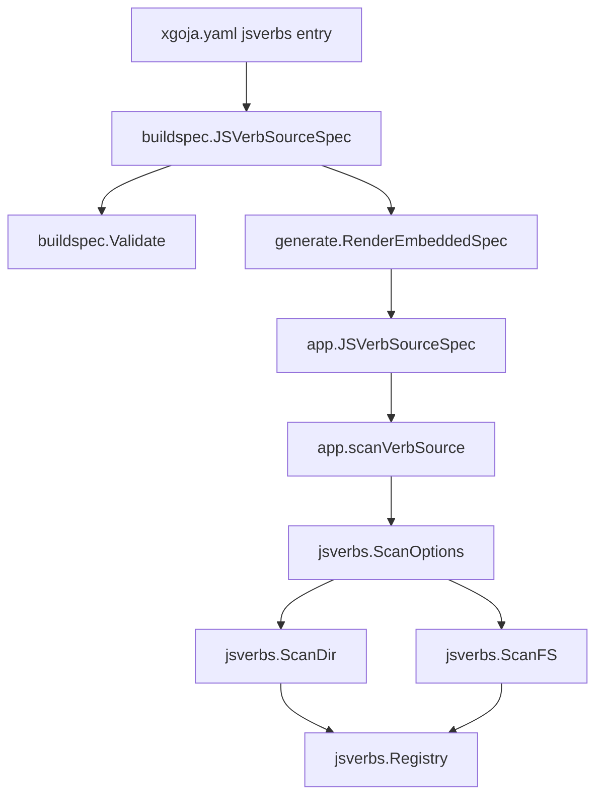

# JSVerb Source Filtering Implementation Guide

## Executive summary

The ClubMedMeetup `minitrace-viz` app configured its JavaScript verb source as `path: .`. That caused the JSVerb scanner to walk the full application tree, including bundled Vite assets under `assets/public`. Those generated assets looked enough like JavaScript source to be parsed and produced a duplicate generated verb path failure. The immediate site workaround is to narrow the source directory, but the reusable `go-go-goja` fix is to let xgoja buildspecs declare explicit scan filters.

This guide focuses only on the JSVerb part of the larger ticket. The implementation should add `include`, `exclude`, and `extensions` to JSVerb source specs, carry those fields into generated runtime specs, and apply the filters in `pkg/jsverbs` for filesystem, embedded, and provider-shipped JSVerb sources.

## Problem statement

Current JSVerb scanning assumes that the configured source root is already clean. `pkg/jsverbs/scan.go` skips only `node_modules` and dot-directories. It does not skip common generated or bundled directories such as `assets`, `dist`, `webapp`, or `public`. That is a reasonable default for small examples, but it is fragile for generated xgoja applications that colocate source files, bundled browser assets, and runtime scripts.

The failure mode is not just performance. Scanning generated bundles can create false commands, duplicate command paths, confusing diagnostics, or parse errors from minified/browser-oriented JavaScript.

## Proposed focused API

Add these optional fields to both build-time and runtime `JSVerbSourceSpec`:

```yaml
jsverbs:
  - id: minitrace-viz-site
    path: .
    include:
      - site.js
      - jsverbs/**/*.js
    exclude:
      - assets/**
      - dist/**
      - webapp/**
    extensions:
      - .js
      - .cjs
```

Semantics:

- `include` is evaluated against slash-normalized paths relative to the configured source root.
- If `include` is empty, every file with a supported extension is initially eligible.
- `exclude` removes files after include matching.
- `extensions` overrides the default scanner extension list.
- Extensions may be written with or without a leading dot; the scanner normalizes them.
- The same filter semantics apply to local filesystem, embedded filesystem, and provider-shipped JSVerb sources.

## Data flow



## Implementation checklist

1. Extend `cmd/xgoja/internal/buildspec.BuildSpec`'s `JSVerbSourceSpec` with `Include`, `Exclude`, and `Extensions`.
2. Extend `pkg/xgoja/app.RuntimeSpec`'s `JSVerbSourceSpec` with matching JSON fields.
3. Extend `providerapi.JSVerbSourceDescriptor` so command providers can inspect the configured filters.
4. Extend `pkg/jsverbs.ScanOptions` with `Include` and `Exclude`.
5. In `pkg/jsverbs/scan.go`, normalize relative paths to slash paths, check extensions, check includes, and then check excludes before reading/parsing each file.
6. In `pkg/xgoja/app/root.go`, translate `JSVerbSourceSpec` into `jsverbs.ScanOptions` and pass the options into all `ScanDir`/`ScanFS` calls.
7. In `cmd/xgoja/internal/buildspec/validate.go`, reject empty include/exclude/extension entries and emit an OK check when filters are declared.
8. Add tests for scanner filtering, runtime spec preservation, and validation.
9. Run focused tests.

## Pseudocode

```text
function shouldScan(relPath, options):
    relPath = slashNormalize(relPath)
    if extension(relPath) not in normalized(options.extensions):
        return false
    if options.include is not empty:
        if relPath does not match any include glob:
            return false
    if relPath matches any exclude glob:
        return false
    return true
```

## Acceptance criteria

- A fixture containing `site.js`, `assets/public/bundle.js`, and `dist/app.js` can scan only `site.js` using include/exclude filters.
- `ScanDir` and `ScanFS` both honor filters.
- Generated runtime JSON preserves `include`, `exclude`, and `extensions` entries.
- `scanVerbSource` applies filters to provider, embedded, and filesystem sources.
- Empty filter strings are validation errors.
- Existing JSVerb tests continue to pass with default options.

## Validation commands

```bash
cd /home/manuel/workspaces/2026-06-07/club-meetup-site/go-go-goja
gofmt -w \
  cmd/xgoja/internal/buildspec/build_spec.go \
  cmd/xgoja/internal/buildspec/validate.go \
  cmd/xgoja/internal/buildspec/validate_test.go \
  cmd/xgoja/internal/generate/generate_test.go \
  pkg/xgoja/app/runtime_spec.go \
  pkg/xgoja/app/root.go \
  pkg/xgoja/app/jsverb_sources.go \
  pkg/xgoja/providerapi/commands.go \
  pkg/jsverbs/model.go \
  pkg/jsverbs/scan.go \
  pkg/jsverbs/jsverbs_test.go

go test ./pkg/jsverbs ./pkg/xgoja/app ./cmd/xgoja/internal/buildspec ./cmd/xgoja/internal/generate -count=1
```
