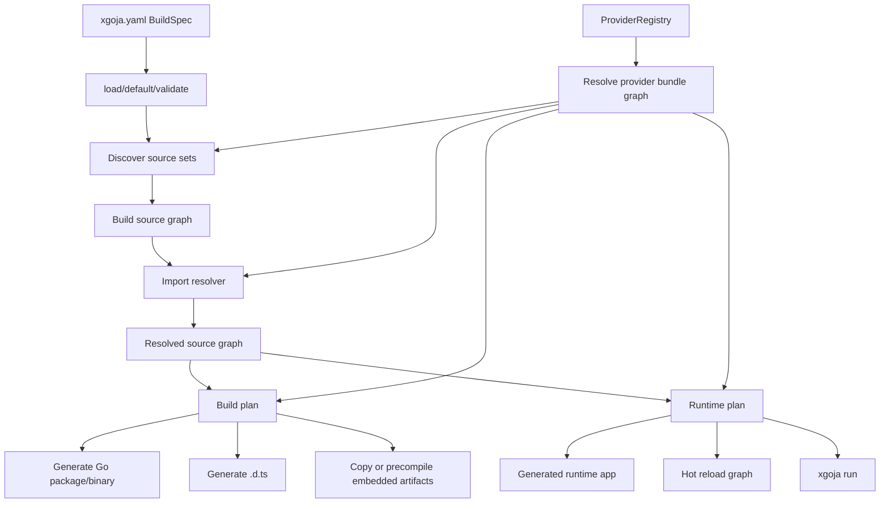
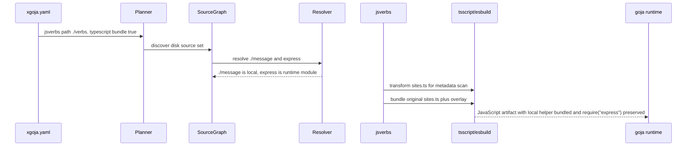
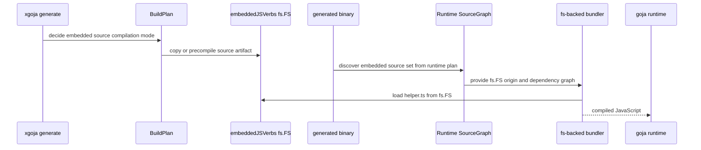
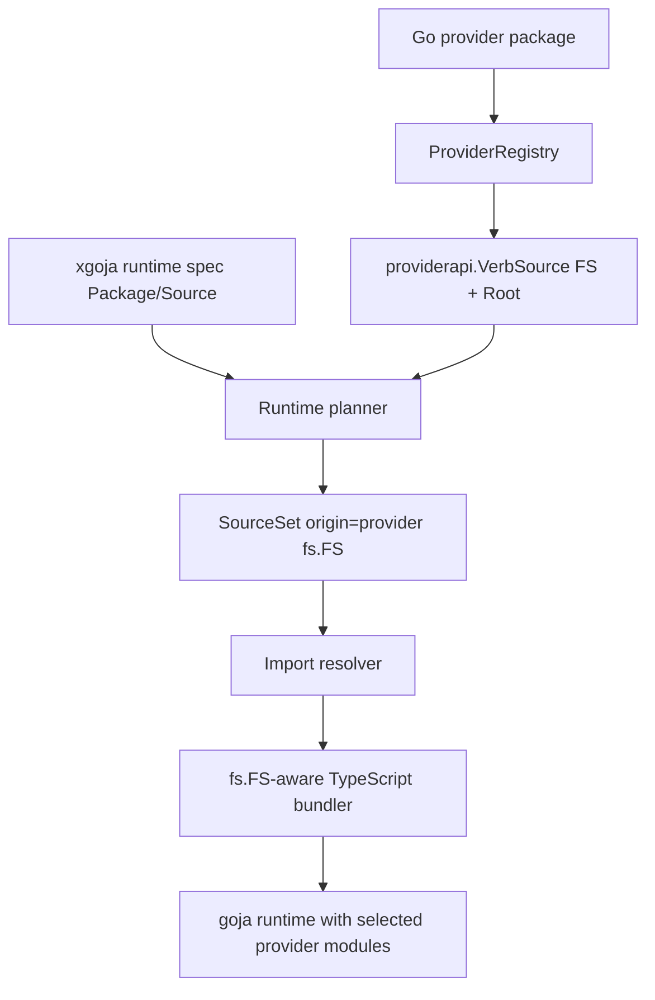

# XGoja source graph and bundler architecture

## Executive summary

xgoja has crossed a boundary. It began as a generator for goja-based binaries that expose selected Go-backed JavaScript modules, but recent work has added TypeScript compilation, jsverb source scanning, runtime bundling, declaration generation, embedded sources, provider-shipped sources, asset and help embedding, command-provider mounting, and HTTP hot reload. These features share one underlying task: xgoja reads a declarative specification, resolves a mixed set of Go and JavaScript inputs, compiles or preserves those inputs according to context, and emits a runnable runtime.

That is a compiler pipeline. It is also close to a bundler, with one important difference: xgoja bundles Go provider packages as runtime capabilities, not only JavaScript files. A provider package can contribute Go-backed CommonJS modules, TypeScript declarations, command sets, jsverb source trees, help files, assets, host services, and runtime initializers. JavaScript/TypeScript source then imports some of those provider modules by alias at runtime.

The current code implements these ideas through several local paths: `ScanDir`, `ScanFS`, `BundleVirtualEntry`, generated embed copying, `typescript.external`, hot reload watch roots, provider registries, and runtime specs. Each feature works in its own area, but the source resolution model is not centralized. The code review issue from `XGOJA-TS-002` is evidence of this: embedded/provider TypeScript sources can be scanned from `fs.FS`, but runtime bundling lacks an `fs.FS` import resolver because source origin and import graph information are not represented as first-class concepts.

This document proposes a step-back architecture for xgoja: introduce a source graph, an import resolver, a provider bundle graph, build plans, runtime plans, and graph-based hot reload inputs. The proposal does not require throwing away the current runtime factory, provider API, jsverbs command model, or generated runtime spec. It instead adds a planning layer between `xgoja.yaml` and the existing execution/generation code.

The recommended next move is not a rewrite. It is a staged refactor:

1. Add a `pkg/xgoja/sourcegraph` package that models source origins, source files, dependencies, and source sets.
2. Add a resolver that classifies imports as local source files, Go-backed runtime modules, explicit externals, package imports, or errors.
3. Add a `pkg/xgoja/plan` package that produces a build plan and runtime plan from `BuildSpec`, provider registry metadata, and source graph resolution.
4. Migrate TypeScript jsverbs and embedded/provider source bundling onto the graph first.
5. Migrate generated embedding, declaration generation, and hot reload watch inputs onto the plan incrementally.

The architectural goal is precise: xgoja should be a Go-backed JavaScript runtime compiler. It should produce generated binaries and runtime packages from a resolved graph of Go providers, JavaScript/TypeScript source, declarations, command metadata, assets, and help files.

## Terms and definitions

A new engineer should use these terms consistently when reading or changing the codebase.

| Term | Meaning |
| --- | --- |
| Build spec | The `xgoja.yaml` DTO loaded into `cmd/xgoja/internal/buildspec.BuildSpec`. It contains build-only information such as provider import paths, Go module versions, output paths, local source paths, and replacement directives. |
| Runtime spec | The smaller JSON DTO embedded into generated binaries and decoded into `pkg/xgoja/app.RuntimeSpec`. It contains runtime-relevant modules, commands, jsverb sources, help, assets, and config. |
| Provider package | A Go package registered through `providerapi.ProviderRegistry`. It can contribute runtime modules, command sets, jsverb sources, help sources, assets, and TypeScript descriptors. |
| Runtime module | A Go-backed CommonJS module selected into a generated runtime. It is imported by JavaScript with `require("alias")`. |
| Source set | A logical group of source files, such as one jsverb directory, one provider-shipped `fs.FS` source tree, or a generated embedded source root. |
| Source graph | A resolved representation of source files, origins, import edges, source-set membership, and language/compilation metadata. |
| Import resolver | The component that classifies an import specifier such as `./helper`, `express`, or `node:fs` as local source, runtime module, explicit external, package dependency, or error. |
| Build plan | The plan used during generation/build. It decides which Go packages to import, which source sets to copy or precompile, which declarations to emit, and which runtime spec to embed. |
| Runtime plan | The plan embedded into, or reconstructed by, a generated binary. It decides which runtime modules are available, which source loaders are used, and how runtime compilation is performed. |
| Compilation mode | The policy for a source set: compile at build time, compile at runtime, preserve source, or reject unsupported inputs. |

## Current-state architecture

### Build-time schema

`cmd/xgoja/internal/buildspec/build_spec.go` defines `BuildSpec` as the top-level build-time document. Its file comment states that the types are declarative DTOs and that generated binaries should use a smaller runtime spec instead (`cmd/xgoja/internal/buildspec/build_spec.go:1-7`). `BuildSpec` includes `Packages`, `Modules`, `Commands`, `CommandProviders`, `JSVerbs`, `Help`, `Assets`, and `BaseDir` (`cmd/xgoja/internal/buildspec/build_spec.go:16-30`).

This is the right separation. Build-only fields such as provider import paths, module versions, replace directives, target imports, and local base directories should not be required at runtime. The issue is that the conversion from build spec to runtime behavior is spread across generation, app wiring, jsverbs scanning, TypeScript transforms, and provider APIs.

`JSVerbSourceSpec` already carries several source-resolution concepts: a local `Path`, an `Embed` flag, provider `Package`/`Source` references, `Include` and `Exclude` globs, `Extensions`, and `TypeScript` configuration (`cmd/xgoja/internal/buildspec/build_spec.go:124-149`). That is a compact user-facing schema, but it is not a resolved graph. It says where a source set might come from; it does not record every file, every import edge, the compilation mode, or the runtime-module externals.

### Runtime schema

`pkg/xgoja/app/runtime_spec.go` defines the runtime-side DTO. Its comments state that it omits build-only fields and describes what generated binaries expose at runtime (`pkg/xgoja/app/runtime_spec.go:1-14`). `RuntimeSpec` contains selected packages, modules, commands, command providers, jsverb sources, help, and assets (`pkg/xgoja/app/runtime_spec.go:15-28`). Runtime `JSVerbSourceSpec` mirrors the source selection fields and TypeScript configuration (`pkg/xgoja/app/runtime_spec.go:89-111`).

This design is useful but underpowered for a bundler-like system. The runtime spec still carries unresolved source references. For embedded sources, generation rewrites `source.Path` to `xgoja_embed/jsverbs/<id>`, but the runtime still scans that path later. For provider sources, runtime code resolves `Package`/`Source` from the provider registry. For filesystem sources, runtime code scans a local directory. The runtime spec tells the runtime what to do, but it does not contain a resolved dependency graph or a precomputed runtime plan.

### Provider packages

`pkg/xgoja/providerapi/module.go` defines Go-backed runtime modules. A module has a name, default alias, config schema, optional TypeScript descriptor, and `NewModuleFactory` that creates a goja_nodejs `require.ModuleLoader` during runtime setup (`pkg/xgoja/providerapi/module.go:41-50`). This is the central difference between xgoja and a normal JavaScript bundler. A bare import such as `express` may not refer to npm. It can refer to a Go-backed module selected by `xgoja.yaml`.

Provider command sets and jsverb source sets extend this model. `CommandSetContext` carries the runtime factory, selected modules, provider registry, host services, and `JSVerbSourceSet` into provider-owned command factories (`pkg/xgoja/providerapi/commands.go:69-90`). `JSVerbSourceSet` lets providers list and scan configured jsverb sources without reimplementing embedded/provider/local resolution (`pkg/xgoja/providerapi/commands.go:60-67`). Provider-shipped jsverb sources are declared as `providerapi.VerbSource` with a name, description, `fs.FS`, and root (`pkg/xgoja/providerapi/verbs.go:5-10`).

This is a strong provider API. The missing layer is a resolved provider bundle model. The registry knows what a provider package can contribute, but xgoja does not yet create a unified graph of provider modules, provider sources, selected aliases, declarations, and source imports.

### Runtime construction

`pkg/engine/factory.go` centralizes goja runtime construction. The builder validates and freezes module composition in `Build()` (`pkg/engine/factory.go:122-180`). `NewRuntime()` constructs a goja VM, starts the event loop, creates a runtime owner, registers runtime services, builds a require registry, registers modules, enables CommonJS `require`, console, buffer, URL, performance globals, and runtime initializers (`pkg/engine/factory.go:182-280`).

This layer should remain stable. xgoja source graph work should not change goja runtime ownership or module registration. The graph and plan layers should decide what source artifacts and module aliases enter the runtime. The engine should continue to execute a frozen runtime composition.

### jsverbs scanning and invocation

`pkg/jsverbs/scan.go` has three entry points: `ScanDir`, `ScanFS`, and `ScanSources`. `ScanDir` walks an OS directory, reads source files, and records `ResolveDir` for each file (`pkg/jsverbs/scan.go:18-83`). `ScanFS` walks an `fs.FS`, reads source files, and records source bytes without filesystem origin metadata (`pkg/jsverbs/scan.go:86-141`). `scanInput` parses JavaScript with tree-sitter after optional source transforms.

`pkg/jsverbs/runtime.go` exposes a require loader and invocation path. `RequireLoader()` returns `sourceLoader` (`pkg/jsverbs/runtime.go:40-43`). `InvokeInRuntime()` requires the verb module path, reads functions from `globalThis.__glazedVerbRegistry`, calls the function, and handles promise results (`pkg/jsverbs/runtime.go:46-109`). `sourceLoader` injects the jsverbs prelude and overlay, or delegates to a `RuntimeTransform` hook (`pkg/jsverbs/runtime.go:160-180`).

This is where the source graph matters most. jsverbs currently has source scanning, metadata extraction, runtime loader generation, and TypeScript transform hooks, but it does not own a general source graph. That means dependency resolution is pushed down into TypeScript bundling and hot reload roots instead of being represented once.

### TypeScript compilation

`pkg/tsscript/compiler.go` wraps esbuild. `TransformSource` transpiles one source string without following imports (`pkg/tsscript/compiler.go:11-38`). `BundleEntry` bundles a real filesystem entry point and dependency graph (`pkg/tsscript/compiler.go:40-67`). `BundleVirtualEntry` bundles in-memory source and resolves relative imports from `Source.ResolveDir` (`pkg/tsscript/compiler.go:69-94`).

`pkg/xgoja/app/typescript.go` wires this into jsverbs. At scan time, TypeScript files are transformed before JavaScript metadata parsing (`pkg/xgoja/app/typescript.go:15-38`). At runtime, original TypeScript source plus the jsverbs prelude/overlay is transformed or bundled before goja loads the module (`pkg/xgoja/app/typescript.go:39-69`).

This was the correct first implementation. The architecture gap is that TypeScript compilation had to infer source resolution from `ResolveDir` and explicit `External` settings. A compiler pipeline should provide the compiler with a resolved import graph and runtime-module external set.

### Generated output

`cmd/xgoja/internal/generate/main.go` renders the embedded runtime spec. It clones the build spec and rewrites embedded jsverb paths to generated roots such as `xgoja_embed/jsverbs/<id>` (`cmd/xgoja/internal/generate/main.go:104-115`). `RenderEmbeddedSpec` then serializes a payload containing runtime-relevant fields (`cmd/xgoja/internal/generate/main.go:64-101`).

`cmd/xgoja/internal/generate/generate.go` writes generated files and copies embedded source directories. `WriteAll` copies embedded jsverbs, help, and assets, then writes `go.mod`, `main.go`, and `xgoja.gen.json` (`cmd/xgoja/internal/generate/generate.go:78-107`). `copyEmbeddedJSVerbs` copies the source directory unchanged into the generated embed root (`cmd/xgoja/internal/generate/generate.go:204-220`).

This is simple and useful, but it encodes a policy decision implicitly: embedded jsverb sources are preserved and scanned at runtime. Once TypeScript, bundling, and generated production binaries are involved, that policy should be explicit in a build plan.

### Direct run and hot reload

`xgoja run` resolves a script path, derives module roots, creates a runtime, initializes selected modules, and then either requires a JavaScript module or bundles/runs a TypeScript script (`pkg/xgoja/app/run.go:85-153`). The TypeScript path already derives external module aliases from selected modules (`pkg/xgoja/app/run.go:136-153`).

HTTP hot reload creates a manager whose `Load` function rescans jsverbs, creates a candidate runtime, registers routes, smoke-tests, and swaps on success (`pkg/xgoja/providers/http/serve.go:126-203`). It appends TypeScript watch extensions when TypeScript-enabled source sets exist (`pkg/xgoja/providers/http/serve.go:188-194`). The hot reload manager itself is robust: `Reload()` builds a candidate runtime, records failures, runs smoke tests, swaps the active snapshot on success, and leaves the old runtime active on failure (`pkg/xgoja/hotreload/manager.go:62-111`).

The hot reload reliability model should remain. The planning layer should improve its inputs: instead of only watching roots and extensions, it should know which source files and dependencies belong to the active runtime graph.

## Problem statement

xgoja is accumulating features that each need source resolution, import classification, generated output policy, runtime module externalization, and hot reload inputs. Without a central graph and plan layer, each feature must reimplement or approximate those decisions.

The symptoms are visible:

1. Filesystem TypeScript jsverbs work because `ScanDir` records `ResolveDir`; embedded/provider TypeScript jsverbs need a separate fs-backed bundler because `ScanFS` does not preserve origin metadata.
2. `xgoja run file.ts` derives esbuild externals from selected runtime module aliases; jsverb TypeScript currently relies on explicit `typescript.external` config.
3. Generated embedded source copying preserves TypeScript and performs runtime compilation; the system has no explicit compilation-mode decision for production vs development.
4. Hot reload watches roots/extensions rather than a dependency graph.
5. Provider packages contribute several kinds of inputs, but there is no resolved provider bundle graph that connects modules, declarations, sources, assets, help, command sets, and host services.
6. Runtime spec generation rewrites embedded paths, but source identity and dependency relationships are not represented in the runtime spec.

The risk is not immediate instability. The current code has working paths. The risk is that every new feature will require another local patch for local directories, `fs.FS` sources, embedded sources, provider sources, TypeScript externals, generated paths, declarations, and hot reload watches.

## Goals and non-goals

### Goals

- Define xgoja as a Go-backed JavaScript runtime compiler with explicit planning phases.
- Introduce a source graph that represents files, source origins, source sets, language, imports, and dependencies.
- Introduce an import resolver that classifies import specifiers consistently across `run`, jsverbs, embedded sources, provider sources, and future source languages.
- Introduce a provider bundle graph that represents selected Go provider packages and the runtime capabilities they contribute.
- Introduce build plans and runtime plans so generation, runtime loading, declaration generation, hot reload, and examples consume the same resolved model.
- Preserve the current goja runtime factory, provider module API, jsverbs command metadata model, and xgoja user-facing spec as much as possible.
- Provide a staged migration plan that can be implemented by a new engineer without a full rewrite.

### Non-goals

- Do not replace goja with another JavaScript runtime.
- Do not execute ECMAScript modules directly in goja as part of this architecture. Source may use `import`, but compiled output should still match the runtime loader model.
- Do not implement npm package management inside xgoja in the first architecture phase.
- Do not remove the existing `xgoja.yaml` schema in a breaking way.
- Do not replace the provider registry with a static manifest-only system. A manifest can be added later, but current provider registration should remain supported.
- Do not force every source set to compile at build time. Runtime compilation remains necessary for development and provider-shipped dynamic sources.

## Proposed architecture

The proposed architecture adds a planning layer between buildspec loading and existing generation/runtime execution.



The important architectural shift is that `BuildSpec` is not used directly by every subsystem. It is compiled into a resolved model first. Existing code can be adapted gradually by creating the resolved model inside current command paths and then replacing local decisions one at a time.

### Package layout

A practical package layout is:

```text
pkg/xgoja/sourcegraph/
  graph.go          // SourceGraph, SourceSet, SourceFile, ImportEdge
  origin.go         // SourceOrigin, disk/fs/provider/embedded origins
  discover.go       // Build source sets from RuntimeSpec/BuildSpec/provider registry
  resolver.go       // Import resolver interfaces and default implementation
  fsresolve.go      // fs.FS path normalization and probing helpers
  language.go       // SourceLanguage, extension mapping
  graph_test.go

pkg/xgoja/plan/
  provider_graph.go // ResolvedProviderPackage, ResolvedRuntimeModule
  build_plan.go     // BuildPlan, BuildArtifact, CompilationMode
  runtime_plan.go   // RuntimePlan, RuntimeSourceSetPlan, RuntimeModulePlan
  compile.go        // Compile BuildSpec + ProviderRegistry into plans
  validate.go       // invariants and diagnostics
  plan_test.go

pkg/xgoja/compile/
  typescript.go     // adapters from plan/sourcegraph to tsscript
  jsverbs.go        // adapters from sourcegraph to jsverbs scanner/loader
  dts.go            // declaration planning helpers
```

The exact names can change. The key separation is source graph vs plan vs existing app/runtime execution.

## Source graph design

The source graph should model files independently from how they will be compiled. Compilation policy belongs to the plan. Source graph responsibility is to say what files exist, where they came from, what language they are, and what they import.

### Core types

```go
package sourcegraph

type SourceGraph struct {
    Sets  map[SourceSetID]*SourceSet
    Files map[SourceFileID]*SourceFile
    Edges []ImportEdge
}

type SourceSetID string
type SourceFileID string

type SourceSet struct {
    ID          SourceSetID
    Kind        SourceSetKind
    Origin      SourceOrigin
    Include     []string
    Exclude     []string
    Extensions  []string
    TypeScript  *TypeScriptPolicy
    Purpose     SourcePurpose
}

type SourceSetKind string

const (
    SourceSetDisk     SourceSetKind = "disk"
    SourceSetFS       SourceSetKind = "fs"
    SourceSetProvider SourceSetKind = "provider"
    SourceSetEmbedded SourceSetKind = "embedded"
    SourceSetVirtual  SourceSetKind = "virtual"
)

type SourcePurpose string

const (
    PurposeJSVerbs SourcePurpose = "jsverbs"
    PurposeRun     SourcePurpose = "run"
    PurposeAssets  SourcePurpose = "assets"
    PurposeHelp    SourcePurpose = "help"
)
```

A source file should separate logical identity from origin-specific location:

```go
type SourceFile struct {
    ID          SourceFileID
    SetID       SourceSetID
    LogicalPath string // e.g. sites.ts, helper.ts
    ModulePath  string // e.g. /sites.ts for jsverbs require loader
    Language    SourceLanguage
    Contents    []byte
    Origin      SourceOrigin
    Imports     []ImportRef
}

type SourceOrigin struct {
    Kind       SourceOriginKind
    DiskRoot   string // absolute OS directory for disk origins
    FS         fs.FS  // fs-backed source, nil for disk origin
    FSRoot     string // root inside FS
    ProviderID string
    SourceName string
    EmbeddedID string
}

type SourceLanguage string

const (
    LanguageJavaScript SourceLanguage = "javascript"
    LanguageTypeScript SourceLanguage = "typescript"
    LanguageJSON       SourceLanguage = "json"
    LanguageMarkdown   SourceLanguage = "markdown"
    LanguageUnknown    SourceLanguage = "unknown"
)
```

The graph should not assume all source files are executable JavaScript. Assets and help docs can enter the same graph later. The first migration should focus on jsverbs because that is where TypeScript and runtime bundling pressure is highest.

### Import edges

An import edge records the raw import and the resolved classification.

```go
type ImportRef struct {
    Specifier string     // raw string: "./helper", "express"
    Kind      ImportKind // static import, require call, dynamic import, side-effect import
    Location  SourceLocation
}

type ImportEdge struct {
    From       SourceFileID
    Specifier  string
    Resolution ImportResolution
}

type ImportResolution struct {
    Kind          ImportResolutionKind
    ToFile        SourceFileID
    RuntimeModule RuntimeModuleRef
    External      string
    Error         *Diagnostic
}

type ImportResolutionKind string

const (
    ImportLocalSource   ImportResolutionKind = "local-source"
    ImportRuntimeModule ImportResolutionKind = "runtime-module"
    ImportExternal      ImportResolutionKind = "external"
    ImportPackage       ImportResolutionKind = "package"
    ImportUnsupported   ImportResolutionKind = "unsupported"
    ImportError         ImportResolutionKind = "error"
)
```

This model resolves the confusion behind `typescript.external`. A bare import is not always external. In xgoja it can be a selected runtime module. The resolver should know selected runtime modules and provider module aliases.

### Source discovery

Source discovery translates current specs and provider registry entries into source sets.

Pseudocode:

```go
func DiscoverSourceSets(spec app.RuntimeSpec, providers *providerapi.ProviderRegistry, embedded EmbeddedInputs) ([]SourceSet, error) {
    var sets []SourceSet

    for _, source := range spec.JSVerbs {
        switch {
        case source.Package != "" || source.Source != "":
            providerSource := providers.ResolveVerbSource(source.Package, source.Source)
            sets = append(sets, SourceSet{
                ID:     SourceSetID(source.ID),
                Kind:   SourceSetProvider,
                Purpose: PurposeJSVerbs,
                Origin: SourceOrigin{Kind: OriginFS, FS: providerSource.FS, FSRoot: providerSource.Root, ProviderID: source.Package, SourceName: source.Source},
            })
        case source.Embed:
            sets = append(sets, SourceSet{
                ID:     SourceSetID(source.ID),
                Kind:   SourceSetEmbedded,
                Purpose: PurposeJSVerbs,
                Origin: SourceOrigin{Kind: OriginFS, FS: embedded.JSVerbs, FSRoot: source.Path, EmbeddedID: source.ID},
            })
        default:
            sets = append(sets, SourceSet{
                ID:     SourceSetID(source.ID),
                Kind:   SourceSetDisk,
                Purpose: PurposeJSVerbs,
                Origin: SourceOrigin{Kind: OriginDisk, DiskRoot: source.Path},
            })
        }
    }

    return sets, nil
}
```

The first implementation can wrap current `ScanDir`/`ScanFS` behavior rather than replacing it. The long-term goal is for jsverbs to scan from `SourceGraph` instead of independently walking roots.

## Import resolver design

The resolver is the central new component. It should classify import specifiers consistently for TypeScript bundling, jsverbs runtime loading, generated build output, declaration generation, and hot reload.

### Resolver inputs

```go
type Resolver struct {
    Graph          *SourceGraph
    RuntimeModules map[string]RuntimeModuleRef // alias -> module ref
    ExplicitExternal map[string]struct{}
    Policy         ResolverPolicy
}

type RuntimeModuleRef struct {
    Package string
    Name    string
    Alias   string
}

type ResolverPolicy struct {
    AllowNodeModules     bool
    UnknownBareImport    UnknownBareImportPolicy
    AllowAbsoluteImports bool
}

type UnknownBareImportPolicy string

const (
    UnknownBareImportError    UnknownBareImportPolicy = "error"
    UnknownBareImportExternal UnknownBareImportPolicy = "external"
)
```

### Resolver rules

The default resolver should use these rules:

1. Relative imports such as `./helper` and `../shared` resolve inside the same source set.
2. Runtime module aliases such as `express` resolve to `ImportRuntimeModule` if selected in the runtime module set.
3. Explicit external imports resolve to `ImportExternal`.
4. Unknown bare imports are errors by default.
5. Absolute imports are errors unless a future policy explicitly enables them.
6. Path escape outside a source set root is always an error.

Pseudocode:

```go
func (r *Resolver) Resolve(from SourceFileID, specifier string) ImportResolution {
    file := r.Graph.Files[from]

    if isRelative(specifier) {
        target, err := r.resolveRelative(file, specifier)
        if err != nil {
            return ImportResolution{Kind: ImportError, Error: DiagnosticFromError(err)}
        }
        return ImportResolution{Kind: ImportLocalSource, ToFile: target.ID}
    }

    if isAbsolute(specifier) && !r.Policy.AllowAbsoluteImports {
        return ImportResolution{Kind: ImportError, Error: Error("absolute imports are not supported")}
    }

    if module, ok := r.RuntimeModules[specifier]; ok {
        return ImportResolution{Kind: ImportRuntimeModule, RuntimeModule: module}
    }

    if _, ok := r.ExplicitExternal[specifier]; ok {
        return ImportResolution{Kind: ImportExternal, External: specifier}
    }

    switch r.Policy.UnknownBareImport {
    case UnknownBareImportExternal:
        return ImportResolution{Kind: ImportExternal, External: specifier}
    default:
        return ImportResolution{Kind: ImportError, Error: Error("unknown bare import; select a runtime module or mark it external")}
    }
}
```

### Extension probing

The resolver must implement deterministic extension probing for local imports. This should be shared by disk and `fs.FS` origins.

```go
var fileExtensions = []string{
    "", ".ts", ".tsx", ".mts", ".cts", ".js", ".jsx", ".mjs", ".cjs", ".json",
}

var indexFiles = []string{
    "index.ts", "index.tsx", "index.mts", "index.cts", "index.js", "index.jsx", "index.mjs", "index.cjs", "index.json",
}
```

Resolution should return a graph file, not only a path. If the file was not discovered because include/exclude filters omitted it, the resolver has two options:

- fail with a diagnostic that says the import target exists but is excluded;
- or allow helper files to be discovered even when they are not jsverb entry files.

The second option is better. jsverb source sets need a distinction between **entry files** and **dependency files**. Include/exclude filters should decide entry scanning by default; dependency resolution should still be allowed to load local helper files unless a stricter policy disables it.

## Provider bundle graph

A provider package is an input to the xgoja compiler. It is not only a Go import. It contributes runtime modules, command sets, source sets, help, assets, and declarations.

### Proposed provider graph types

```go
type ProviderGraph struct {
    Packages map[string]*ResolvedProviderPackage
    Modules  map[RuntimeModuleRef]*ResolvedRuntimeModule
}

type ResolvedProviderPackage struct {
    ID             string
    ImportPath     string
    RegisterFunc   string
    Modules        []ResolvedRuntimeModule
    CommandSets    []ResolvedCommandSet
    VerbSources    []ResolvedProviderSourceSet
    HelpSources    []ResolvedHelpSource
    AssetSources   []ResolvedAssetSource
}

type ResolvedRuntimeModule struct {
    Package       string
    Name          string
    Alias         string
    Config        json.RawMessage
    TypeScript    *spec.Module
    ConfigSchema   json.RawMessage
}
```

The graph is built from `buildspec.Packages`, `buildspec.Modules`, provider registry resolution, and runtime module aliases. It should validate duplicate aliases before compilation starts. `pkg/xgoja/dtsgen/dtsgen.go` already performs a subset of that validation for declarations: it resolves modules, derives aliases, rejects duplicate aliases, and validates TypeScript descriptors (`pkg/xgoja/dtsgen/dtsgen.go:38-83`). The provider graph should make that validation available to all xgoja subsystems.

### Provider graph responsibilities

The provider graph should answer these questions:

- Which Go packages must generated code import?
- Which provider register functions must generated code call?
- Which runtime module aliases exist?
- Which aliases are valid imports for source bundling?
- Which TypeScript declarations should be emitted?
- Which provider source sets are available?
- Which command sets are selected into the generated root?
- Which host services or asset resolvers are required by selected providers?

The graph does not create goja runtimes. It gives the runtime factory and generated code a validated plan.

## Build plan and runtime plan

### Build plan

The build plan is used by `cmd/xgoja/internal/generate` and build commands. It should include everything needed to write generated files and build outputs.

```go
type BuildPlan struct {
    Spec             buildspec.BuildSpec
    RuntimeSpec      app.RuntimeSpec
    ProviderGraph    ProviderGraph
    SourceGraph      SourceGraph
    Artifacts        []BuildArtifact
    DTSPlan          DeclarationPlan
    GeneratedImports []GeneratedImport
}

type BuildArtifact struct {
    ID          string
    Kind        BuildArtifactKind
    SourceSetID sourcegraph.SourceSetID
    Mode        CompilationMode
    OutputPath  string
    EmbedPath   string
}

type CompilationMode string

const (
    CompileAtBuildTime CompilationMode = "build-time"
    CompileAtRuntime   CompilationMode = "runtime"
    PreserveSource     CompilationMode = "preserve-source"
)
```

The build plan should make explicit decisions that are currently implicit:

- Embedded JavaScript source may be copied unchanged.
- Embedded TypeScript source may be copied unchanged for runtime compilation or prebundled to JavaScript.
- Assets are copied with `node_modules` skipped.
- Help sources are copied or loaded from provider `fs.FS`.
- Generated runtime spec paths are derived from artifact IDs, not ad hoc path rewriting.

### Runtime plan

The runtime plan is the data a generated binary needs to execute sources and commands.

```go
type RuntimePlan struct {
    RuntimeSpec     app.RuntimeSpec
    Modules         []RuntimeModulePlan
    CommandSets     []CommandSetPlan
    SourceSets      []RuntimeSourceSetPlan
    Assets          []RuntimeAssetPlan
    Help            []RuntimeHelpPlan
}

type RuntimeSourceSetPlan struct {
    ID              string
    Purpose         sourcegraph.SourcePurpose
    Origin          RuntimeSourceOrigin
    CompilationMode CompilationMode
    LanguagePolicy  LanguagePolicy
    ResolverPolicy  ResolverPolicy
    RuntimeModules  []string // aliases visible as runtime imports
}
```

The runtime plan can initially be represented as derived Go structures rather than serialized JSON. The long-term direction should be to embed enough runtime plan data to avoid recomputing decisions that were already validated at build time.

## Compilation modes

Compilation mode is a policy decision. It should not be hidden inside TypeScript call sites or generation copying.

| Source kind | Development default | Production generated default | Reason |
| --- | --- | --- | --- |
| Filesystem jsverb TypeScript | Runtime compile | Runtime compile if `embed: false` | Files are editable and may hot reload. |
| Embedded jsverb TypeScript | Runtime compile initially; build-time compile later | Build-time compile once stable | Embedded production binaries benefit from earlier errors and fewer runtime compiler dependencies. |
| Provider jsverb TypeScript | Runtime compile | Runtime compile unless provider prebundles | Provider source is owned by provider package and may be distributed as `fs.FS`. |
| `xgoja run file.ts` | Runtime compile | N/A | Direct run is a development execution path. |
| Assets | Preserve/copy | Preserve/copy | Assets are not JS execution units by default. |
| Help | Preserve/copy | Preserve/copy | Help is loaded by help system, not JS runtime. |

The first implementation should not force build-time TypeScript compilation for embedded sources. It should introduce the policy field and keep behavior compatible. Later tickets can add prebundling as an optimization.

## Data flow examples

### Example 1: filesystem TypeScript jsverb in development



### Example 2: embedded TypeScript jsverb in generated binary



### Example 3: provider-shipped jsverb source



The provider case is why prebundling generated embedded source is not enough. Provider sources are supplied at runtime by a provider package. The runtime planner must be able to compile them from `fs.FS` or require providers to ship JavaScript artifacts explicitly.

## Decision records

### Decision: Add a planning layer instead of rewriting runtime execution

- **Context:** xgoja now performs source compilation, provider module selection, generated output, declaration generation, jsverb scanning, and hot reload. The scattered decision points create correctness gaps.
- **Options considered:** Full rewrite; continue local patches; add a planning layer that current code can migrate toward.
- **Decision:** Add a planning layer with source graph, provider graph, build plan, runtime plan, and resolver abstractions.
- **Rationale:** Runtime construction and provider APIs are already useful. The weakness is source/build orchestration, not goja execution. A planning layer can be introduced incrementally.
- **Consequences:** More architecture surface area, but fewer ad hoc local decisions. Existing code can consume the plan one subsystem at a time.
- **Status:** proposed

### Decision: Keep goja runtime ownership unchanged

- **Context:** TypeScript and bundling pressure could tempt a runtime rewrite or ESM execution model.
- **Options considered:** Replace goja/goja_nodejs execution; add direct ESM execution; preserve CommonJS runtime and compile source to compatible JavaScript.
- **Decision:** Preserve goja runtime factory, runtime owner, event loop, module registration, and CommonJS `require()` model.
- **Rationale:** `pkg/engine/factory.go` centralizes lifecycle correctly. xgoja's differentiator is Go-backed runtime modules. Source compilation should feed that runtime, not replace it.
- **Consequences:** Source-level `import` must be compiled or bundled before execution. Runtime modules remain imported by alias through CommonJS-compatible output.
- **Status:** proposed

### Decision: Resolve runtime module aliases centrally

- **Context:** `xgoja run` derives externals from selected module aliases, while jsverb TypeScript currently relies on explicit `typescript.external`.
- **Options considered:** Keep explicit externals per source; derive aliases independently in each command; centralize alias resolution in the provider graph/import resolver.
- **Decision:** Centralize runtime module alias resolution and expose it to all source compilation paths.
- **Rationale:** A bare import such as `express` should mean the same thing in `run`, jsverbs, embedded sources, provider sources, and hot reload.
- **Consequences:** Unknown bare imports can produce earlier and clearer errors. Users need fewer duplicate `external` entries.
- **Status:** proposed

### Decision: Make unknown bare imports errors by default

- **Context:** Bundlers often treat externals flexibly, but xgoja generated binaries may fail later if a bare import is silently preserved and no runtime module exists.
- **Options considered:** Externalize all bare imports; resolve only selected runtime modules and fail unknown imports; attempt npm resolution.
- **Decision:** Resolve selected runtime modules and explicit externals; fail unknown bare imports by default.
- **Rationale:** xgoja does not include a package manager in the first architecture phase. Early diagnostics are safer than generated binaries with hidden runtime failures.
- **Consequences:** Users must select runtime modules or mark explicit externals. Future npm support can add a new resolution kind.
- **Status:** proposed

### Decision: Separate source graph from compilation mode

- **Context:** Source discovery and compilation policy are different concerns. A source file can be TypeScript regardless of whether it compiles at build time or runtime.
- **Options considered:** Store compilation decisions directly on source files; keep policy in TypeScript config only; separate source graph from build/runtime plans.
- **Decision:** Source graph records what exists and what imports what. Build/runtime plans record when and how sources compile.
- **Rationale:** The same source set may need runtime compilation in development and build-time compilation in production.
- **Consequences:** Planning becomes a distinct step, but source discovery remains reusable.
- **Status:** proposed

### Decision: Migrate jsverbs first

- **Context:** jsverbs are where current architecture pressure is highest: scanning, overlay injection, TypeScript transform, embedded/provider fs.FS bundling, command metadata, and hot reload all meet there.
- **Options considered:** Migrate generation first; migrate provider registry first; migrate jsverbs first.
- **Decision:** Migrate jsverbs onto source graph and resolver first.
- **Rationale:** This directly addresses `XGOJA-TS-002` and proves the source graph with a real correctness issue.
- **Consequences:** Early implementation must bridge old jsverbs APIs and new graph APIs. Once stable, generated embedding and hot reload can consume the same graph.
- **Status:** proposed

## Implementation plan

### Phase 0: Add architecture tests around current behavior

Before refactoring, preserve current behavior with targeted tests.

Add tests that verify:

- Filesystem TypeScript jsverbs with local imports still scan and invoke.
- Embedded/provider TypeScript jsverbs with local imports fail today, then pass after `XGOJA-TS-002`.
- `xgoja run file.ts` preserves selected runtime module aliases as externals.
- Hot reload appends TypeScript extensions when any source set has TypeScript enabled.
- Generated embedded runtime specs rewrite source paths to `xgoja_embed/jsverbs/<id>`.

These tests give a baseline for graph migration.

### Phase 1: Create `sourcegraph` with no behavior change

Implement sourcegraph types and discovery helpers. Initially, expose adapters that mirror current behavior.

```go
func DiscoverJSVerbSourceSets(spec app.RuntimeSpec, providers *providerapi.ProviderRegistry, embedded fs.FS) ([]sourcegraph.SourceSet, error)
func LoadSourceSet(set sourcegraph.SourceSet) ([]sourcegraph.SourceFile, error)
```

At the end of Phase 1, no existing command needs to use the graph. Tests should validate graph construction from disk, embedded, and provider source sets.

### Phase 2: Add import resolver and TypeScript fs-backed bundling

Implement resolver helpers for local imports, extension probing, safe path normalization, runtime module alias classification, and explicit externals. Use this work to implement `XGOJA-TS-002`.

This phase should produce a useful immediate fix:

- `pkg/tsscript` gains an fs-backed bundling API.
- `pkg/jsverbs` preserves source origin metadata.
- `pkg/xgoja/app/typescript.go` can bundle embedded/provider TypeScript jsverbs with local imports.

This proves that the source graph is not only documentation. It removes a real defect.

### Phase 3: Add provider graph

Build `ProviderGraph` from `BuildSpec.Packages`, selected modules, and `ProviderRegistry` resolution. Centralize module alias validation and TypeScript descriptor lookup.

Move or wrap declaration-generation preparation so `pkg/xgoja/dtsgen` consumes `ProviderGraph` module plans instead of resolving selected modules independently.

The goal is to make these operations share one alias truth:

- esbuild externals for `xgoja run`;
- esbuild externals for jsverbs;
- `.d.ts` module names;
- selected-modules command output;
- runtime module registration.

### Phase 4: Add build plan and runtime plan

Create planning APIs:

```go
func CompileBuildPlan(buildSpec *buildspec.BuildSpec, registry *providerapi.ProviderRegistry, opts BuildPlanOptions) (*BuildPlan, error)
func CompileRuntimePlan(runtimeSpec *app.RuntimeSpec, registry *providerapi.ProviderRegistry, embedded EmbeddedInputs, opts RuntimePlanOptions) (*RuntimePlan, error)
```

Then migrate generation to use `BuildPlan` for embedded roots and artifacts. Keep generated JSON compatible initially. Add optional debug output:

```bash
xgoja plan -f xgoja.yaml --output json
xgoja graph -f xgoja.yaml --sources --imports
```

These commands are valuable for debugging and for interns learning the system.

### Phase 5: Migrate jsverbs scanning to source graph

Add a jsverbs scan entry point that accepts sourcegraph files:

```go
func ScanGraph(graph *sourcegraph.SourceGraph, setID sourcegraph.SourceSetID, opts ScanOptions) (*Registry, error)
```

This should replace direct `ScanDir`/`ScanFS` calls in xgoja app code. Keep `ScanDir` and `ScanFS` as convenience APIs that build small source graphs internally.

### Phase 6: Migrate hot reload to graph inputs

Hot reload should watch source graph dependencies, not only source roots and extension lists.

Initial graph-based watcher behavior:

- For disk source sets, watch all files in the resolved dependency graph plus relevant roots for new files.
- For embedded/provider source sets, no filesystem watcher exists unless the provider exposes one.
- For TypeScript source sets, helper imports are watched even when they are not jsverb entry files.

Keep the blue/green manager unchanged. Only change the way reload triggers are computed.

### Phase 7: Add optional prebundling for embedded TypeScript

Once runtime graph compilation works, add build-time prebundling as an optimization.

Configuration sketch:

```yaml
jsverbs:
  - id: sites
    path: ./verbs
    embed: true
    typescript:
      enabled: true
      bundle: true
      compile: build-time # runtime | build-time | preserve
```

This should be a separate ticket because it changes generated artifacts and source-map policy.

## API sketches

### Source graph loading API

```go
package sourcegraph

type LoadOptions struct {
    IncludeDependencies bool
    EntryFilters        []EntryFilter
    LanguagePolicy      LanguagePolicy
}

func BuildSourceGraph(sets []SourceSet, opts LoadOptions) (*SourceGraph, error) {
    graph := &SourceGraph{Sets: map[SourceSetID]*SourceSet{}, Files: map[SourceFileID]*SourceFile{}}
    for _, set := range sets {
        files, err := loadSetFiles(set, opts)
        if err != nil {
            return nil, err
        }
        graph.AddSet(set)
        for _, file := range files {
            graph.AddFile(file)
        }
    }
    return graph, nil
}
```

### Resolver API

```go
package sourcegraph

func ResolveImports(graph *SourceGraph, resolver *Resolver) ([]Diagnostic, error) {
    var diagnostics []Diagnostic
    for id, file := range graph.Files {
        imports := ExtractImports(file)
        for _, imp := range imports {
            resolution := resolver.Resolve(id, imp.Specifier)
            graph.Edges = append(graph.Edges, ImportEdge{From: id, Specifier: imp.Specifier, Resolution: resolution})
            if resolution.Kind == ImportError {
                diagnostics = append(diagnostics, *resolution.Error)
            }
        }
    }
    if len(diagnostics) > 0 {
        return diagnostics, &ResolutionError{Diagnostics: diagnostics}
    }
    return nil, nil
}
```

### Plan API

```go
package plan

type Compiler struct {
    Providers *providerapi.ProviderRegistry
}

func (c *Compiler) Build(buildSpec *buildspec.BuildSpec) (*BuildPlan, error) {
    providerGraph, err := ResolveProviderGraph(buildSpec, c.Providers)
    if err != nil { return nil, err }

    sourceSets, err := DiscoverBuildSourceSets(buildSpec, providerGraph)
    if err != nil { return nil, err }

    graph, err := sourcegraph.BuildSourceGraph(sourceSets, sourcegraph.LoadOptions{})
    if err != nil { return nil, err }

    resolver := NewResolver(graph, providerGraph.RuntimeModulesByAlias(), explicitExternals(buildSpec))
    if _, err := sourcegraph.ResolveImports(graph, resolver); err != nil { return nil, err }

    return assembleBuildPlan(buildSpec, providerGraph, graph)
}
```

### jsverbs adapter API

```go
func ScanJSVerbSourceSet(plan RuntimeSourceSetPlan, graph *sourcegraph.SourceGraph) (*jsverbs.Registry, error) {
    scanOptions := jsverbs.DefaultScanOptions()
    scanOptions.SourceTransform = compileScanTransform(plan)
    scanOptions.RuntimeTransform = compileRuntimeTransform(plan, graph)
    return jsverbs.ScanGraph(graph, plan.SourceSetID, scanOptions)
}
```

The adapter can initially convert graph files into `jsverbs.SourceFile` values and call `ScanSources`. Over time, jsverbs can use graph types directly.

## Testing strategy

### Unit tests

Add unit tests for:

- source set discovery from disk, embedded, and provider specs;
- extension probing for `.ts`, `.tsx`, `.js`, `.json`, and index files;
- path escape rejection for disk and `fs.FS` origins;
- runtime module alias resolution;
- unknown bare import diagnostics;
- duplicate module alias diagnostics;
- build plan artifact decisions for embedded vs filesystem sources.

### Integration tests

Add integration tests for:

- filesystem TypeScript jsverb with helper import;
- embedded TypeScript jsverb with helper import;
- provider TypeScript jsverb with helper import;
- generated binary with selected Go-backed runtime module and TypeScript source import preserved as runtime module;
- hot reload triggered by helper file edits;
- declaration generation using the same provider graph aliases used by bundling.

### Golden plan tests

Introduce plan JSON golden tests:

```bash
xgoja plan -f examples/xgoja/15-typescript-jsverbs/xgoja.yaml --output json
```

The golden output should include source sets, runtime module aliases, import classifications, compilation modes, and generated artifacts. Golden tests make architecture changes reviewable because diffs show how planning decisions changed.

### Compatibility tests

Existing examples should remain valid. At minimum run:

```bash
go test ./pkg/tsscript ./pkg/jsverbs ./pkg/xgoja/app ./pkg/xgoja/providers/http -count=1
make -C examples/xgoja/15-typescript-jsverbs smoke
```

When plan commands exist, add smoke tests for `xgoja plan` and `xgoja graph`.

## Migration risks

### Risk: The graph layer becomes too abstract

The graph should start with the concrete jsverbs/TypeScript problem. Do not model every possible future source kind before fixing `XGOJA-TS-002`. Keep the first version small: source sets, source files, origins, imports, runtime-module aliases.

### Risk: Provider graph duplicates ProviderRegistry

The provider graph should not replace registration. It should be a resolved view of selected provider registry entries for one build/runtime plan. Provider registration remains the source of provider capabilities.

### Risk: Runtime plan serialization becomes unstable

The first version can compute runtime plans in Go without embedding a large new JSON schema. Once the plan stabilizes, embed only the fields needed by generated binaries. Keep compatibility with current `RuntimeSpec` until a migration path is clear.

### Risk: Build-time prebundling breaks development workflows

Do not make prebundling the default for editable filesystem sources. Hot reload and direct development should continue to compile from disk at runtime. Build-time prebundling should be explicit or limited to embedded production artifacts.

### Risk: Unknown bare import policy surprises users

Clear diagnostics are required. If a user imports `express` without selecting the runtime module or marking it external, the error should say exactly what to add to `xgoja.yaml`.

## Near-term recommendations

The next three tickets should be ordered like this:

1. `XGOJA-TS-002`: implement fs-backed runtime bundling for embedded/provider TypeScript jsverbs. This fixes the active code review issue and introduces the first source-origin metadata.
2. `XGOJA-ARCH-002`: introduce `sourcegraph` and migrate jsverb source discovery onto it without changing user-facing behavior.
3. `XGOJA-ARCH-003`: introduce provider graph and centralized runtime module alias resolution, then use it for jsverb TypeScript externals, `xgoja run`, and declaration generation.

Do not start with build-time prebundling. It is useful, but it is downstream of source graph and resolver work.

## What a new intern should read first

Read the current implementation in this order:

1. `cmd/xgoja/internal/buildspec/build_spec.go`: understand the user-facing build spec and the distinction between build-time and runtime DTOs.
2. `pkg/xgoja/app/runtime_spec.go`: understand what generated binaries actually decode.
3. `pkg/xgoja/providerapi/module.go`, `commands.go`, and `verbs.go`: understand provider modules, command sets, and provider-shipped sources.
4. `pkg/engine/factory.go`: understand that runtime construction is centralized and should remain stable.
5. `pkg/jsverbs/scan.go` and `pkg/jsverbs/runtime.go`: understand source scanning, metadata extraction, overlay injection, and runtime invocation.
6. `pkg/tsscript/compiler.go` and `pkg/xgoja/app/typescript.go`: understand current TypeScript transform and bundling behavior.
7. `cmd/xgoja/internal/generate/main.go` and `generate.go`: understand generated runtime specs and embedded source copying.
8. `pkg/xgoja/providers/http/serve.go` and `pkg/xgoja/hotreload/manager.go`: understand hot reload composition and blue/green runtime swapping.

After reading those files, read this architecture document again. The architecture should then read as a direct answer to concrete code pressure, not as an abstract rewrite proposal.

## References

- `cmd/xgoja/internal/buildspec/build_spec.go:1-30` — build-time xgoja schema and declared input categories.
- `cmd/xgoja/internal/buildspec/build_spec.go:124-149` — jsverb source and TypeScript configuration fields.
- `pkg/xgoja/app/runtime_spec.go:1-28` — runtime DTO role and top-level runtime fields.
- `pkg/xgoja/app/runtime_spec.go:89-111` — runtime jsverb source and TypeScript fields.
- `pkg/xgoja/providerapi/module.go:41-50` — Go-backed runtime module descriptor and TypeScript descriptor field.
- `pkg/xgoja/providerapi/commands.go:60-82` — JSVerbSourceSet and CommandSetContext provider APIs.
- `pkg/xgoja/providerapi/verbs.go:5-10` — provider-shipped `fs.FS` jsverb source declaration.
- `pkg/engine/factory.go:122-280` — runtime factory build and goja runtime construction.
- `pkg/jsverbs/scan.go:18-141` — current disk and fs source scanning.
- `pkg/jsverbs/runtime.go:40-109` — require loader exposure and runtime invocation.
- `pkg/jsverbs/runtime.go:160-180` — runtime transform handoff for source loading.
- `pkg/tsscript/compiler.go:11-94` — TypeScript transform and bundling facade.
- `pkg/xgoja/app/typescript.go:15-69` — xgoja TypeScript scan/runtime transform adapter.
- `pkg/xgoja/app/run.go:85-153` — direct script execution and TypeScript entry bundling.
- `cmd/xgoja/internal/generate/main.go:64-115` — runtime spec rendering and embedded path rewriting.
- `cmd/xgoja/internal/generate/generate.go:78-107` — generated file writing.
- `cmd/xgoja/internal/generate/generate.go:204-220` — embedded jsverb source copying.
- `pkg/xgoja/dtsgen/dtsgen.go:38-83` — current module alias and TypeScript descriptor validation for declarations.
- `pkg/xgoja/hotreload/manager.go:62-111` — blue/green reload and smoke-test swap behavior.
- `pkg/xgoja/providers/http/serve.go:126-203` — HTTP hot reload load path and watcher setup.
- `ttmp/2026/06/10/XGOJA-TS-001--typescript-support-for-go-go-goja-xgoja-and-hot-reload/design/01-typescript-support-analysis-and-implementation-guide.md` — TypeScript support design.
- `ttmp/2026/06/12/XGOJA-TS-002--runtime-bundling-for-embedded-typescript-jsverbs/design/01-runtime-bundling-for-embedded-typescript-jsverbs.md` — embedded/provider TypeScript runtime bundling design.
