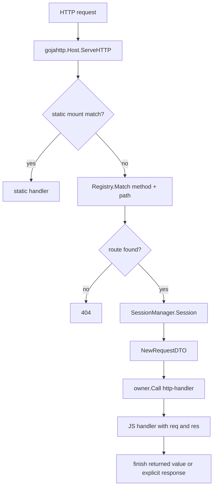
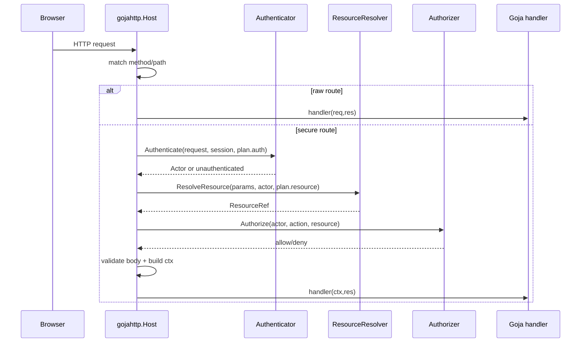

# MVP authentication API design and implementation guide

## Executive summary

The current `express` module is intentionally small: JavaScript creates `const app = express.app()` and registers handlers with `app.get(pattern, handler)`, `app.post(...)`, static mounts, and SPA mounts. That shape is good for examples and lightweight tools, but it gives route authors a raw request object and no Go-owned authentication or authorization envelope. The MVP should add a declarative security route API that lets JavaScript describe route intent while Go owns session loading, actor loading, resource loading, policy checks, CSRF checks, body validation hooks, and audit emission before the JavaScript handler runs.

This document reconciles the preliminary API ideas in `../sources/01-auth-preliminary-api-ideas.md` with the current codebase. The recommended MVP is a staged secure-route builder exposed next to the existing Express-like API:

```js
const express = require("express")
const app = express.app()

app.route("PATCH", "/orgs/:orgId/projects/:projectId")
  .auth(express.user().required())
  .resource(express.resource("project").fromParam("projectId").withinTenantParam("orgId"))
  .allow("project.update")
  .body("project.patch")
  .audit("project.updated")
  .handle(function (ctx) {
    return ctx.projects.byResource(ctx.resource("project")).patch(ctx.body).commit()
  })
```

The old `app.get(pattern, handler)` API should remain available for compatibility and for explicitly simple examples, but security-sensitive docs should teach `app.route(...).public().handle(...)` or `.auth(...).allow(...).handle(...)`. The key MVP property is not full policy-language expressiveness. It is that a route author can no longer accidentally register an authenticated mutating route without declaring its security mode and authorization action.

## Problem statement and scope

### Problem

The existing HTTP host dispatches matched routes directly into Goja with a request map and response object. The request already contains cookies and an opaque session ID, but there is no first-class actor concept, no route security metadata, no resource binding, no permission check, no CSRF enforcement, and no audit context. A JavaScript handler can manually inspect `req.session`, `req.cookies`, or `req.headers`, but manual checks are easy to forget, hard to audit, and impossible for the Go host to validate centrally.

### Scope for the MVP

The MVP should provide:

- A route builder that forces one explicit security mode before `.handle(...)`:
  - `.public()`
  - `.auth(userSpec)`
  - `.system(systemSpec)` as an extension point, possibly stubbed in Phase 1
  - `.capability(capabilitySpec)` as an extension point, possibly limited to one simple token class later
- A Go-owned `RoutePlan` stored with every secure route.
- A host-owned auth pipeline that runs before JavaScript handler invocation.
- Small host interfaces for applications to plug in identity, resources, policy, body validation, and audit.
- A JavaScript `ctx` object for secure handlers, separate from the raw Express `(req, res)` pair.
- TypeScript declarations and documentation.
- Integration tests demonstrating denial by default, success paths, body validation failures, resource ownership failures, and backward-compatible raw routes.

The MVP should not provide:

- A generic policy language like OPA, Casbin, OpenFGA, Zanzibar, or relationship tuples.
- A complete user-management product.
- Generic operation builders for every application domain.
- A full capability algebra for password reset, invites, API tokens, magic links, and one-time approvals.
- NPM Express middleware compatibility or `next()`.

Those ideas are valuable, and the source analysis explores them in detail, but they are larger than the first increment needed by this module.

## Current-state architecture

### High-level runtime flow

The current serving path is small enough to understand as one pipeline:

```text
xgoja generated binary or embedding Go app
  -> selects go-go-goja-http provider/module
  -> provider creates or receives a gojahttp.Host
  -> JavaScript calls require("express").app()
  -> app.get/app.post register goja.Callable handlers in Host registry
  -> net/http request enters Host.ServeHTTP
  -> registry matches method/path and extracts params
  -> SessionManager creates/reuses opaque session cookie
  -> NewRequestDTO builds a plain JS request map
  -> runtime owner calls JS handler(req, res)
  -> Response sends JSON/text/html/redirect/end
```



### Express module surface

`modules/express/express.go` exposes a runtime-scoped module. `RegisterRuntimeModule` requires a `gojahttp.Host`, sets the runtime owner on that host, and registers the CommonJS module name (`express` by default) with goja-nodejs require (`modules/express/express.go:21-65`). `NewLoader` adapts host runtime ownership from `runtimebridge` when the loader is used by generated xgoja integration (`modules/express/express.go:68-78`).

The JavaScript module only exports `app()` (`modules/express/express.go:100-103`). The returned app object registers methods by looping over `get`, `post`, `put`, `patch`, `delete`, and `all`; each method asserts the handler is callable, starts the host if needed, and stores the callable with `r.host.Register(strings.ToUpper(method), pattern, fn)` (`modules/express/express.go:132-146`). Static and asset-backed mounts live on the same app object (`modules/express/express.go:148-187`).

The TypeScript declaration mirrors this minimal API: `App` has HTTP verb methods, static methods, and a `(req, res) => unknown` handler type (`modules/express/typescript.go:21-32`). The request type contains method, URL, path, query, params, headers, cookies, session, IP, body, and rawBody (`modules/express/typescript.go:33-46`).

### gojahttp host and registry

`pkg/gojahttp.Host` stores a route registry, renderer, runtime owner, session manager, and static mounts (`pkg/gojahttp/host.go:14-36`). Raw routes are registered with `Host.Register(method, pattern, handler)`, which delegates to `Registry.Add` (`pkg/gojahttp/host.go:39-42`). The registry stores only method, cleaned pattern, and a `goja.Callable` (`pkg/gojahttp/route_registry.go:10-32`). It matches routes in registration order and supports exact segments, `:params`, wildcard `*`, and `ALL` (`pkg/gojahttp/route_registry.go:47-112`).

`Host.ServeHTTP` checks static mounts first, verifies the runtime owner exists, matches a route, does HEAD-to-GET fallback, creates or reuses a session, builds the request DTO, and calls the JS handler through the runtime owner (`pkg/gojahttp/host.go:94-139`). Promise results are polled until fulfilled or rejected (`pkg/gojahttp/host.go:140-190`). Returned non-string values go through `res.html(...)` if no response was sent, while strings use `res.send(...)` (`pkg/gojahttp/host.go:154-164`).

### Request, response, body, and session model

`RequestDTO` is a transport object, not an auth context. It contains headers and cookies as plain maps, route params, parsed body, raw body, IP, and a `SessionDTO` pointer (`pkg/gojahttp/request_response.go:16-28`). Its `Map()` method exports these fields to JavaScript (`pkg/gojahttp/request_response.go:30-44`). `NewRequestDTO` parses the body, normalizes query values, flattens headers, collects cookies, and derives IP from `RemoteAddr` (`pkg/gojahttp/request_response.go:46-72`).

`Response` wraps `http.ResponseWriter` and exposes chainable `status`, `set`, and `type`, plus `json`, `send`, `html`, `redirect`, and `end` (`pkg/gojahttp/request_response.go:74-104`). Response state is protected by a mutex, and subsequent sends are ignored once `sent` is true (`pkg/gojahttp/request_response.go:152-180`).

The existing session layer is deliberately lightweight. `SessionOptions` configures only cookie name, path, max age, secure flag, SameSite mode, and disabled state (`pkg/gojahttp/session.go:16-26`). `SessionManager.Session` returns nil when disabled, reuses a syntactically valid opaque cookie value, or creates a new random 32-byte base64url ID and sets an HttpOnly cookie (`pkg/gojahttp/session.go:63-84`). The comment is important: the session stores only an opaque ID; application state remains in the application database (`pkg/gojahttp/session.go:16-18`).

### xgoja provider integration

The `go-go-goja-http` provider registers the `express` module and a `serve` command provider (`pkg/xgoja/providers/http/http.go:32-53`). At module setup time, it creates or reuses a per-runtime `gojahttp.Host`; embedding applications can contribute an external host service under `HostServiceKey` (`pkg/xgoja/providers/http/http.go:23-30`, `pkg/xgoja/providers/http/http.go:124-169`). The provider's public config has only `http.enabled` and `http.listen` (`pkg/xgoja/providers/http/http.go:81-95`).

The `serve` command invokes a selected jsverb once so it can register Express routes, then keeps the runtime alive until shutdown. Hot reload creates a fresh candidate `gojahttp.Host`, loads routes into it, smoke-tests it if configured, and swaps it live through the hotreload manager (`pkg/xgoja/providers/http/serve.go:82-116`, `pkg/xgoja/providers/http/serve.go:119-216`). That means auth metadata must be stored in the host and route registry, not in a process-global variable, or hot reload will leak policy across runtime versions.

## Gap analysis against the desired auth model

### What exists and can be reused

- Route registration already centralizes through `modules/express` and `gojahttp.Host.Register`.
- Request dispatch already centralizes through `Host.ServeHTTP`.
- Route matching already extracts params before the handler runs.
- A session cookie already exists and can be used as the browser session correlation key.
- `HostOptions` already carries host-wide services such as renderer and sessions; it is the natural place to add auth services.
- The xgoja HTTP provider already supports host service injection for embedding applications.
- TypeScript declaration generation already has a hook in `modules/express/typescript.go`.

### What is missing

- No `RoutePlan` or per-route metadata beyond method, pattern, and handler.
- No route registration validation.
- No way to declare that a route is public versus authenticated.
- No actor-loading interface from session, bearer token, or other credentials.
- No resource-loading interface using route params.
- No policy interface for `actor + action + resource`.
- No CSRF or method-safety concept.
- No body schema registry or validation hook.
- No audit emission hook.
- No secure handler context object with actor/resource/body/audit identity.
- No TypeScript declarations for secure builders.

### Why raw middleware is not enough

A familiar Express answer would be to add `app.use(authMiddleware)` and then let JavaScript call `next()`. That is the wrong first step for this codebase because the current module intentionally does not implement middleware stacks, routers, `next()`, or npm Express compatibility. More importantly, auth is a security boundary: the preliminary analysis argues that JavaScript should describe intent while Go enforces the security-critical steps. A middleware clone would keep checks optional and handler-owned; the design below makes the Go host the enforcement owner.

## Reconciliation with preliminary API ideas

The imported source argues for a broad, declarative, resource-first API. This design adopts the smallest parts that fit the current module and postpones the rest.

| Source idea | MVP decision | Rationale |
| --- | --- | --- |
| Staged route builder | Adopt now | It maps cleanly to the current `appObject` and can be implemented with Go-backed stage objects whose available methods enforce registration order. |
| Contract-first route API | Defer, but keep compatible | A future `.contract({...})` can compile into the same `RoutePlan`. The builder is more approachable for the current Express-like API. |
| Operation builders | Defer to host applications | go-go-goja does not own app domain models such as users, orgs, and projects. MVP can expose a safe `ctx.resource(...)` and host-injected service objects later. |
| Resource-first authorization | Adopt now | Object-ownership bugs are common; resource resolution before handler execution is a good fit for route params and host-owned policy. |
| Current-user API | Adopt minimally | `ctx.actor` and optional `ctx.me()` can represent the authenticated actor without designing a user-management DSL. |
| Capability builder | Defer | Useful for password reset, invites, API tokens, and magic links, but too broad for the first auth route envelope. Reserve `.capability(...)` as a route security mode. |
| Tenant-scoped builder | Adopt as resource metadata | Support `withinTenantParam("orgId")` or `withinTenantActor()` on resource specs, but avoid a full tenant DSL. |
| Relationship-based permissions / policy registry | Defer | Use a small host-provided `Authorizer` interface. Applications can implement RBAC, ReBAC, OPA, or anything else behind that interface. |
| Route-level intent / command API | Partially adopt | `name`, `allow`, `resource`, `body`, and `audit` become route plan fields. |

The guiding compromise: the MVP is declarative enough for Go to validate and enforce, but generic enough that it does not assume a particular database, user model, tenancy model, or policy engine.

## Proposed architecture

### Target serving flow

The secure flow inserts an auth envelope between route matching and JavaScript invocation.

```text
HTTP request
  -> match route
  -> if raw route: existing behavior
  -> if secure route:
       ensure RoutePlan is valid
       build RequestDTO
       run Authenticator if route requires actor
       run CSRF check if configured and unsafe method
       resolve resources from params/body/session
       authorize actor/action/resource
       validate body schema if declared
       create SecureContextDTO
       emit audit start/denied/completed events
       call secure handler(ctx, res) or handler(ctx)
```



### New core data model

The registry should store a route kind and optional plan.

```go
type Route struct {
    Method  string
    Pattern string
    Handler goja.Callable
    Plan    *RoutePlan // nil for legacy raw routes
}

type RoutePlan struct {
    Name       string
    Method     string
    Pattern    string
    Security   SecuritySpec
    Resources  []ResourceSpec
    Action     string
    BodySchema string
    CSRF       CSRFSpec
    Audit      AuditSpec
}

type SecuritySpec struct {
    Mode          SecurityMode // public, user, system, capability
    Required      bool
    MFAFresh      time.Duration
    Scopes        []string
    CapabilityUse string
}

type ResourceSpec struct {
    Name              string // "project"
    Type              string // "project"
    IDSource          ValueSource // param/body/query/static/currentActor
    TenantSource      *ValueSource
    MustExist         bool
    RequiredForAction bool
}

type ValueSource struct {
    Kind string // param, query, body, session, actor, literal
    Key  string
}
```

The exact Go field names can change during implementation, but the separation should remain:

- `Route` is dispatch data.
- `RoutePlan` is security metadata compiled at registration time.
- `SecuritySpec` answers "who is allowed to enter this route?"
- `ResourceSpec` answers "which object is this route about?"
- `Action` answers "what permission is being requested?"
- `BodySchema` and `Audit` are host-service hooks, not JS-owned enforcement.

### Host-owned service interfaces

The host should be usable in three deployment modes:

1. Demo mode with only public routes.
2. Simple app mode with session-based users and simple RBAC.
3. Embedded production mode where a larger Go application owns identity, database, policy, and audit.

Use small interfaces in `pkg/gojahttp` and attach them to `HostOptions`.

```go
type AuthOptions struct {
    Authenticator Authenticator
    Resources     ResourceResolver
    Authorizer    Authorizer
    BodySchemas   BodyValidator
    Audit         AuditSink
    CSRF          CSRFProtector
    Dev           bool
}

type Authenticator interface {
    Authenticate(ctx context.Context, req *http.Request, session *SessionDTO, spec SecuritySpec) (*Actor, error)
}

type ResourceResolver interface {
    ResolveResource(ctx context.Context, req ResourceRequest) (*ResourceRef, error)
}

type Authorizer interface {
    Authorize(ctx context.Context, req AuthorizationRequest) (AuthorizationDecision, error)
}

type BodyValidator interface {
    ValidateBody(ctx context.Context, schemaName string, body any) (any, error)
}

type AuditSink interface {
    Record(ctx context.Context, event AuditEvent) error
}
```

The interfaces should live in `pkg/gojahttp` rather than `modules/express` because enforcement happens in `Host.ServeHTTP`, outside the JavaScript module loader. The `express` package should be responsible for compiling JS builder calls into a `gojahttp.RoutePlan`, not for authenticating requests.

### Minimal built-in types

Keep built-in models minimal and serializable.

```go
type Actor struct {
    ID        string         `json:"id"`
    Kind      string         `json:"kind"` // user, service, anonymous
    TenantIDs []string       `json:"tenantIds,omitempty"`
    Claims    map[string]any `json:"claims,omitempty"`
}

type ResourceRef struct {
    Name     string         `json:"name"`
    Type     string         `json:"type"`
    ID       string         `json:"id"`
    TenantID string         `json:"tenantId,omitempty"`
    Claims   map[string]any `json:"claims,omitempty"`
}

type SecureContextDTO struct {
    Request   *RequestDTO              `json:"request"`
    Actor     *Actor                   `json:"actor,omitempty"`
    Resources map[string]*ResourceRef  `json:"resources"`
    Body      any                      `json:"body,omitempty"`
    Params    map[string]string        `json:"params"`
    Action    string                   `json:"action,omitempty"`
    RouteName string                   `json:"routeName,omitempty"`
}
```

JavaScript should see `ctx.actor`, `ctx.params`, `ctx.body`, `ctx.request`, and `ctx.resource(name)`. The `ctx.resource(name)` method can be added as a Goja function rather than encoded as JSON. The `ctx.request` field is useful for non-security metadata such as query string and IP, but secure handlers should use `ctx.actor`, `ctx.resource(...)`, and `ctx.body` for security-sensitive decisions.

## JavaScript API design

### MVP API surface

```ts
const express = require("express")
const app = express.app()

app.route(method: string, pattern: string): RouteNeedsSecurity

express.user(): UserAuthSpecBuilder
express.system(): SystemAuthSpecBuilder
express.capability(name: string): CapabilityAuthSpecBuilder
express.resource(type: string): ResourceSpecBuilder
```

Route stage types:

```ts
interface RouteNeedsSecurity {
  name(name: string): RouteNeedsSecurity
  public(): RouteNeedsHandler
  auth(spec: UserAuthSpec): RouteNeedsPolicy
  system(spec?: SystemAuthSpec): RouteNeedsPolicy
  capability(spec: CapabilityAuthSpec): RouteNeedsPolicy
}

interface RouteNeedsPolicy {
  resource(spec: ResourceSpec): RouteNeedsPolicy
  allow(action: string): RouteNeedsHandler
  body(schemaName: string): RouteNeedsPolicy
  csrf(required?: boolean): RouteNeedsPolicy
  audit(eventName: string): RouteNeedsPolicy
}

interface RouteNeedsHandler {
  body(schemaName: string): RouteNeedsHandler
  csrf(required?: boolean): RouteNeedsHandler
  audit(eventName: string): RouteNeedsHandler
  handle(handler: SecureHandler): void
}

type SecureHandler = (ctx: SecureContext, res: Response) => unknown
```

The stage names are implementation guidance. In JavaScript, this is dynamic, but Go-backed objects can omit invalid methods at each stage. For example, the object returned by `app.route(...)` has `.public()`, `.auth(...)`, `.system(...)`, and `.capability(...)`, but no `.handle(...)`. The object returned after `.auth(...)` has `.allow(...)` and `.resource(...)`, but not `.public()`.

### Minimal examples

#### Public route

```js
app.route("GET", "/healthz")
  .public()
  .handle(function () {
    return { ok: true }
  })
```

Public routes require an explicit `.public()` call. This makes public exposure reviewable in route lists and generated route docs.

#### Current user route

```js
app.route("GET", "/me")
  .auth(express.user().required())
  .allow("user.self.read")
  .handle(function (ctx) {
    return {
      id: ctx.actor.id,
      claims: ctx.actor.claims,
    }
  })
```

This route has no external resource. The action is explicitly global/current-user scoped. The implementation should allow authenticated routes with an action and no resource when the action has a recognized prefix such as `user.self.*` or when the authorizer decides the missing resource is acceptable. The validation error should be clear if the host wants to require resources for all non-public actions.

#### Resource-bound route

```js
app.route("PATCH", "/orgs/:orgId/projects/:projectId")
  .auth(express.user().required().mfaFresh("10m"))
  .resource(express.resource("project")
    .named("project")
    .fromParam("projectId")
    .withinTenantParam("orgId")
    .mustExist())
  .allow("project.update")
  .body("project.patch")
  .csrf()
  .audit("project.updated")
  .handle(function (ctx) {
    const project = ctx.resource("project")
    return ctx.projects.byResource(project).patch(ctx.body).commit()
  })
```

The resource loader resolves and authorizes the project before handler execution. The handler should not receive a raw `projectId` and then decide which database row to mutate.

### Registration-time failures

These failures should occur while JavaScript is registering routes, not at first request:

```js
app.route("GET", "/admin").handle(fn)
// TypeError or Go error: route must declare .public(), .auth(), .system(), or .capability() before .handle()

app.route("POST", "/users/:id")
  .auth(express.user().required())
  .handle(fn)
// Error: authenticated mutating route must declare .allow(action)

app.route("PATCH", "/projects/:projectId")
  .auth(express.user().required())
  .resource(express.resource("project").fromParam("id"))
  .allow("project.update")
  .handle(fn)
// Error: resource project references missing path param "id"; available params: projectId
```

Good error messages matter because most users will discover this API inside xgoja scripts and generated binaries.

## Go implementation guide for a new intern

### Step 1: Add route plans to gojahttp

Files to start with:

- `pkg/gojahttp/route_registry.go`
- `pkg/gojahttp/host.go`
- `pkg/gojahttp/route_registry_test.go`

Implementation sketch:

```go
func (h *Host) Register(method, pattern string, handler goja.Callable) {
    h.registry.Add(Route{Method: method, Pattern: pattern, Handler: handler})
}

func (h *Host) RegisterPlanned(plan RoutePlan, handler goja.Callable) error {
    normalized, err := ValidateRoutePlan(plan)
    if err != nil {
        return err
    }
    h.registry.Add(Route{
        Method: normalized.Method,
        Pattern: normalized.Pattern,
        Handler: handler,
        Plan: &normalized,
    })
    return nil
}
```

Keep `Host.Register` for legacy raw routes. Add a second path for planned routes. Avoid changing every caller in the first patch.

Tests:

- `Registry.Routes()` should include security metadata only if desired; if not, add `SecureRoutes()` for diagnostics.
- Matching should return the route with its `Plan` intact.
- Existing route registry tests should continue to pass.

### Step 2: Define `RoutePlan` and validation

Add a new file such as `pkg/gojahttp/auth_plan.go`.

Validation should be deterministic and side-effect free:

```go
func ValidateRoutePlan(plan RoutePlan) (RoutePlan, error) {
    plan.Method = strings.ToUpper(strings.TrimSpace(plan.Method))
    plan.Pattern = cleanPath(plan.Pattern)

    if plan.Method == "" || plan.Pattern == "" { ... }
    if plan.Security.Mode == "" { ... }
    if plan.Security.Mode != SecurityPublic && plan.Action == "" { ... }
    if isUnsafeMethod(plan.Method) && plan.Security.Mode != SecurityPublic && !plan.CSRF.Disabled { ... maybe warn or require ... }

    params := pathParamSet(plan.Pattern)
    for _, resource := range plan.Resources {
        if resource.IDSource.Kind == "param" && !params[resource.IDSource.Key] { ... }
        if resource.TenantSource != nil && resource.TenantSource.Kind == "param" && !params[resource.TenantSource.Key] { ... }
    }
    return plan, nil
}
```

Start strict, but not over-clever. Validation should catch mistakes the builder can know locally: missing security mode, missing path params, missing action for non-public routes, unsupported methods, empty schema names, and invalid duration strings.

### Step 3: Add host auth options and no-op defaults

Add `AuthOptions` to `HostOptions`:

```go
type HostOptions struct {
    Dev      bool
    Renderer Renderer
    Sessions SessionOptions
    Auth     AuthOptions
}
```

Default behavior should be secure:

- Public planned routes work without auth services.
- Authenticated planned routes fail closed with HTTP 500 in dev or a generic 500 in production if required services are missing. This is a host misconfiguration, not a user 401.
- Unauthenticated requests to `.auth(...required...)` routes return 401.
- Authenticated but unauthorized requests return 403.

Do not silently allow authenticated routes when `Authorizer` is nil.

### Step 4: Add the secure dispatch branch

Modify `Host.ServeHTTP` after route matching and request DTO creation:

```go
if route.Plan != nil {
    h.servePlannedRoute(w, r, route, params, session)
    return
}

// existing raw route path
```

Then implement:

```go
func (h *Host) servePlannedRoute(w http.ResponseWriter, r *http.Request, route Route, params map[string]string, session *SessionDTO) {
    req, err := NewRequestDTO(r, params, session)
    if err != nil { bad request }

    envelope, status, err := h.buildSecureEnvelope(r.Context(), r, req, route.Plan)
    if err != nil {
        writeAuthError(w, h.dev, status, err)
        h.auditDenied(...)
        return
    }

    res := NewResponse(w, h.renderer)
    ret, err := h.owner.Call(r.Context(), "http-secure-handler", func(ctx context.Context, vm *goja.Runtime) (any, error) {
        jsCtx := NewSecureContextObject(vm, envelope)
        result, err := route.Handler(goja.Undefined(), jsCtx, res.JSObject(vm))
        if err != nil { return nil, err }
        if promise, ok := result.Export().(*goja.Promise); ok { return promise, nil }
        return nil, h.finishHandlerResult(vm, res, result)
    })
    finishPromiseAndErrors(...)
}
```

Try not to duplicate the existing promise/result logic. A good refactor is to extract a helper:

```go
func (h *Host) callAndFinish(ctx context.Context, op string, res *Response, fn func(*goja.Runtime) (goja.Value, error)) error
```

That refactor is optional for the first patch, but it will keep raw and secure handlers consistent.

### Step 5: Implement the Express staged builder

Files to start with:

- `modules/express/express.go`
- new file `modules/express/auth_builder.go`
- `modules/express/typescript.go`
- `modules/express/express_integration_test.go`

Add exports in `loader`:

```go
_ = exports.Set("app", func() goja.Value { return r.appObject(vm) })
_ = exports.Set("user", func() goja.Value { return newUserSpecBuilder(vm) })
_ = exports.Set("resource", func(kind string) goja.Value { return newResourceSpecBuilder(vm, kind) })
```

Add `app.route(method, pattern)` in `appObject`:

```go
_ = obj.Set("route", func(method, pattern string) goja.Value {
    return newRouteNeedsSecurity(vm, r, method, pattern)
})
```

Stage object implementation pattern:

```go
type routeBuilder struct {
    registrar *Registrar
    vm        *goja.Runtime
    plan      gojahttp.RoutePlan
}

func (b *routeBuilder) needsSecurityObject() *goja.Object {
    obj := b.vm.NewObject()
    _ = obj.Set("name", func(name string) goja.Value { b.plan.Name = name; return obj })
    _ = obj.Set("public", func() goja.Value { b.plan.Security.Mode = gojahttp.SecurityPublic; return b.needsHandlerObject() })
    _ = obj.Set("auth", func(spec goja.Value) goja.Value { b.plan.Security = exportSecuritySpec(spec); return b.needsPolicyObject() })
    return obj
}
```

Be careful with object mutation and chaining: if `.name()` returns the same object, later `.public()` sees the mutated builder. If a method transitions to another stage, return a new object backed by the same builder pointer.

### Step 6: Secure context object

A plain map is enough for `ctx.actor`, `ctx.body`, `ctx.params`, and `ctx.request`, but methods such as `ctx.resource(name)` require a custom object.

```go
func NewSecureContextObject(vm *goja.Runtime, env *SecureEnvelope) *goja.Object {
    obj := vm.NewObject()
    _ = obj.Set("actor", env.Actor)
    _ = obj.Set("body", env.Body)
    _ = obj.Set("params", env.Request.Params)
    _ = obj.Set("request", env.Request.Map())
    _ = obj.Set("action", env.Plan.Action)
    _ = obj.Set("routeName", env.Plan.Name)
    _ = obj.Set("resource", func(name string) goja.Value {
        res := env.Resources[name]
        if res == nil { return goja.Null() }
        return vm.ToValue(res)
    })
    return obj
}
```

Keep `req.cookies`, `req.headers`, and raw request data available under `ctx.request`, but documentation should discourage using them for authorization decisions.

### Step 7: TypeScript declarations

Update `modules/express/typescript.go` with the builder types. The TypeScript file is not only editor help; it is also executable documentation for generated xgoja users.

Minimal declaration addition:

```ts
export function user(): UserAuthSpecBuilder
export function resource(type: string): ResourceSpecBuilder

export interface App {
  route(method: HttpMethod, pattern: string): RouteNeedsSecurity
}

export type HttpMethod = "GET" | "POST" | "PUT" | "PATCH" | "DELETE" | "ALL" | string
```

The declarations should model stage restrictions even if runtime JavaScript remains dynamic. That gives TypeScript users immediate feedback.

### Step 8: Provider and host services

The HTTP provider already accepts host services for an external `gojahttp.Host`. That means production embeddings can configure auth services by constructing the host themselves:

```go
host := gojahttp.NewHost(gojahttp.HostOptions{
    Sessions: gojahttp.SessionOptions{CookieName: "my_app_session", Secure: true},
    Auth: gojahttp.AuthOptions{
        Authenticator: myAuthenticator,
        Resources:     myResources,
        Authorizer:    myAuthorizer,
        BodySchemas:   mySchemas,
        Audit:         myAudit,
        CSRF:          myCSRF,
    },
})
```

For generated binaries that do not inject an external host, the MVP can start with no auth services configured. Planned public routes work. Planned authenticated routes fail closed with an explanatory dev error. A later ticket can add provider-level host service contribution for auth stores and policy objects.

## HTTP status and error semantics

Use consistent statuses:

| Condition | Status | Notes |
| --- | ---: | --- |
| Missing auth services for authenticated route | 500 | Misconfigured host; dev mode can expose detail. |
| Missing credentials on required user route | 401 | Add `WWW-Authenticate` for bearer-based authenticators if relevant. |
| Invalid/expired session or token | 401 | Do not disclose whether user exists. |
| Authenticated actor lacks permission | 403 | Policy denial. |
| Referenced resource does not exist | 404 | Prefer 404 to avoid resource enumeration when resolver says not found. |
| Resource exists but belongs to wrong tenant | 404 or 403 | Let resolver/authorizer choose; document the choice. |
| Body schema validation fails | 400 or 422 | Pick one; 400 is simpler for MVP, 422 is more semantic. |
| CSRF failure | 403 | Unsafe browser request rejected. |
| JS handler throws after auth succeeds | 500 | Existing dev/prod behavior applies. |

## Decision records

### Decision: Add a staged secure route builder instead of Express middleware

- **Context:** The current module is Express-style but not Express-compatible. It does not have middleware stacks, routers, or `next()`.
- **Options considered:** Add `app.use` middleware; add a contract object API; add a staged builder; keep manual checks in JS.
- **Decision:** Add `app.route(method, pattern)` with staged `.public()`, `.auth(...)`, `.resource(...)`, `.allow(...)`, and `.handle(...)`.
- **Rationale:** It fits the existing app object, lets Go validate route plans at registration time, and makes missing auth declarations hard to miss.
- **Consequences:** Existing raw routes remain possible, so docs and route inspection must distinguish raw routes from planned routes. The builder is dynamic at runtime but can still expose stage-specific Goja objects and TypeScript types.
- **Status:** proposed

### Decision: Enforce auth in `pkg/gojahttp`, not `modules/express`

- **Context:** Request dispatch, session creation, route matching, and response writing already happen in `gojahttp.Host.ServeHTTP`.
- **Options considered:** Put all auth in the Express module; put auth in host dispatch; rely on host application middleware outside gojahttp.
- **Decision:** Compile plans in `modules/express`, store them in the registry, and enforce them in `pkg/gojahttp`.
- **Rationale:** The host is the central point that cannot be bypassed by a secure planned route. It also works with xgoja hot reload because each candidate host carries its own route metadata.
- **Consequences:** `gojahttp` gains auth concepts, but they are interface-based and optional for public/raw routes.
- **Status:** proposed

### Decision: Use host-provided interfaces instead of a built-in policy engine

- **Context:** go-go-goja does not own application users, databases, tenants, or permissions.
- **Options considered:** Implement a built-in RBAC engine; adopt OPA/Casbin/OpenFGA; define small interfaces; defer authorization completely.
- **Decision:** Define `Authenticator`, `ResourceResolver`, `Authorizer`, `BodyValidator`, `AuditSink`, and optional `CSRFProtector` interfaces.
- **Rationale:** This makes the module usable by many applications without committing to one policy model.
- **Consequences:** The MVP needs good test doubles and examples because real applications must plug in services.
- **Status:** proposed

### Decision: Keep legacy `app.get(pattern, handler)` routes

- **Context:** Existing docs, examples, and tests use direct route methods.
- **Options considered:** Break direct methods; mark them as public planned routes; keep them as raw legacy routes; require a feature flag.
- **Decision:** Keep them as raw legacy routes for compatibility, while new security-sensitive docs use planned routes.
- **Rationale:** This avoids breaking the current lightweight use cases and allows incremental adoption.
- **Consequences:** A route inspection API should flag raw routes as `securityMode: "raw"` so production hosts can reject or warn on raw routes in a later hardening pass.
- **Status:** proposed

## Testing and validation strategy

### Unit tests

Add tests around pure logic first:

- `ValidateRoutePlan` accepts `.public()` GET health routes.
- `ValidateRoutePlan` rejects missing security mode.
- `ValidateRoutePlan` rejects missing action for non-public unsafe routes.
- `ValidateRoutePlan` rejects resource params not present in the path.
- `SecuritySpec` duration parsing accepts `10m` and rejects invalid strings.
- `ResourceSpec` builders export expected Go structs.

### Host integration tests

Add tests in `pkg/gojahttp` or `modules/express` using `httptest`:

1. Public planned route returns 200 without auth services.
2. Auth planned route with no authenticator fails closed.
3. Auth planned route with no credentials returns 401.
4. Auth planned route with actor but denied action returns 403.
5. Resource resolver not found returns 404.
6. Body validator failure returns 400/422.
7. Successful secure route receives `ctx.actor`, `ctx.body`, and `ctx.resource("...")`.
8. Legacy `app.get` route still works.
9. Promise-returning secure handler is awaited like legacy handlers.
10. HEAD-to-GET fallback still works for planned GET routes.

### xgoja provider tests

Add tests only after core host tests pass:

- Generated HTTP provider can still create an express module with no auth services and serve public planned routes.
- External host service with auth services handles secure routes.
- Hot reload candidate host preserves planned route metadata and smoke tests public planned route.

### Manual smoke script

A minimal smoke script should be placed under an example or ticket script before implementation is merged:

```js
const express = require("express")
const app = express.app()

app.route("GET", "/healthz")
  .public()
  .handle(() => ({ ok: true }))

app.route("GET", "/me")
  .auth(express.user().required())
  .allow("user.self.read")
  .handle((ctx) => ({ actor: ctx.actor.id }))
```

Expected manual checks:

```bash
curl -i http://127.0.0.1:8787/healthz
curl -i http://127.0.0.1:8787/me
curl -i -H 'Authorization: Bearer test-user' http://127.0.0.1:8787/me
```

## Phased implementation plan

### Phase 1: Data model and registry support

- Add `RoutePlan`, specs, and validation in `pkg/gojahttp`.
- Extend `Route` to include `Plan *RoutePlan`.
- Add `Host.RegisterPlanned`.
- Preserve existing `Host.Register` behavior.
- Add registry tests.

### Phase 2: Express staged builder

- Add `app.route(method, pattern)`.
- Add `express.user()` and `express.resource(type)` builders.
- Implement stage objects and registration-time validation.
- Update TypeScript declarations.
- Add builder integration tests.

### Phase 3: Secure dispatch

- Add `AuthOptions` and interfaces.
- Implement public planned route dispatch.
- Implement authenticated dispatch with test fakes.
- Implement resource resolution and authorization hooks.
- Implement secure context object.
- Ensure promise handling matches legacy route behavior.

### Phase 4: Body, CSRF, audit, and diagnostics

- Add body validator hook.
- Add CSRF hook or a minimal default double-submit/session-token interface.
- Add audit sink events for denied and successful requests.
- Extend route descriptors to include route name and security mode for diagnostics.
- Update docs and examples.

### Phase 5: Production hardening follow-up

- Add a host option to reject raw routes in production.
- Add route plan export for docs and audits.
- Add capability route mode for simple signed one-time tokens.
- Add optional contract-first `.contract({...})` API that compiles into `RoutePlan`.

## Risks and review-critical areas

- **Fail-open risk:** Missing auth services must never allow authenticated planned routes. Tests should assert this explicitly.
- **Raw route bypass:** Keeping `app.get` means production apps need a way to inspect or reject raw routes later.
- **Resource mismatch:** The handler should use Go-resolved `ctx.resource(...)`; examples must avoid raw `ctx.params.id` mutations.
- **Hot reload isolation:** Plans and host services must be per-host/per-runtime, not global.
- **Promise and response semantics:** Secure handlers must finish exactly like raw handlers, or users will see inconsistent response behavior.
- **CSRF defaults:** SameSite=Lax helps but is not complete CSRF protection for unsafe methods. The MVP should either require an explicit CSRF hook for browser session auth or document exactly what is not protected.
- **Error disclosure:** Dev mode can explain missing services and JS errors; production mode should keep responses generic.

## Open questions

1. Should `app.get(pattern, handler)` be treated as `raw` forever, or should there be an opt-in host mode that rejects all raw routes?
2. Should body validation failures return 400 or 422?
3. Should missing resources default to 404 even when the actor is authenticated, or should the resolver/authorizer choose 403 versus 404?
4. Should CSRF be mandatory for all unsafe session-authenticated routes in the first MVP, or should `.csrf()` be explicit but strongly documented?
5. Should secure handlers receive `(ctx, res)` or only `ctx` with response helpers? `(ctx, res)` is easiest because it reuses the current `Response` object.

## File reference map

- `modules/express/express.go`: CommonJS `express` loader, app object, raw route methods, static and SPA registration.
- `modules/express/typescript.go`: TypeScript declaration source for the Express module.
- `modules/express/express_integration_test.go`: Existing route/static/promise/HEAD behavior tests that secure routes must not regress.
- `pkg/gojahttp/host.go`: Central HTTP dispatch point and best location for secure route enforcement.
- `pkg/gojahttp/route_registry.go`: Route storage/matching; must carry `RoutePlan`.
- `pkg/gojahttp/request_response.go`: Request and response DTOs reused by secure context.
- `pkg/gojahttp/session.go`: Existing opaque cookie session; useful for actor lookup but not sufficient as authentication.
- `pkg/xgoja/providers/http/http.go`: xgoja provider wiring and external host service injection point.
- `pkg/xgoja/providers/http/serve.go`: jsverb-backed serving and hot reload; planned route metadata must remain per-host.
- `pkg/doc/18-express-module.md`: User-facing Express module docs to update after implementation.
- `ttmp/2026/06/12/XGOJA-EXPRESS-AUTH--add-proper-authentication-to-express-http-module/sources/01-auth-preliminary-api-ideas.md`: Imported preliminary API exploration reconciled by this design.

## Intern checklist

Before opening a PR, verify:

- [ ] Existing tests pass with `go test ./modules/express ./pkg/gojahttp ./pkg/xgoja/providers/http`.
- [ ] New secure route tests cover public, authenticated, denied, resource missing, body invalid, and successful paths.
- [ ] TypeScript declarations include the route builder and secure context.
- [ ] `pkg/doc/18-express-module.md` documents both legacy raw routes and secure planned routes.
- [ ] No authenticated planned route can execute without an `Authenticator` and `Authorizer` unless explicitly public.
- [ ] Route descriptors or diagnostics show which routes are raw, public, authenticated, system, or capability-based.
