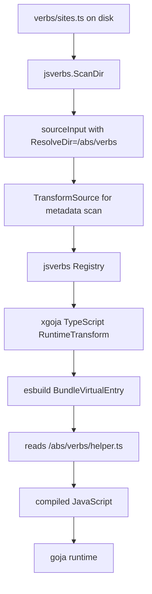
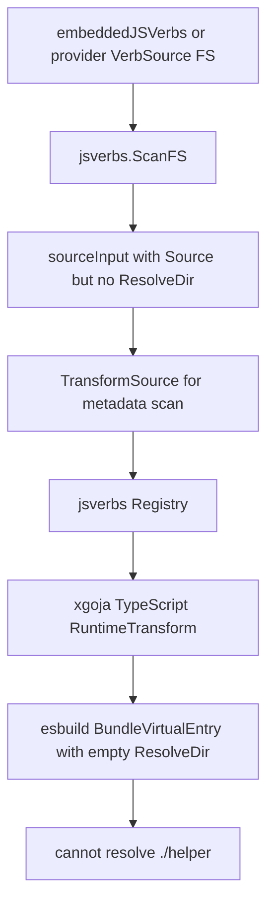

# Runtime bundling for embedded TypeScript jsverbs

## Executive summary

The TypeScript implementation in `XGOJA-TS-001` made filesystem-backed TypeScript jsverbs work by compiling TypeScript before scan and before runtime execution. The implementation works for local directories because `jsverbs.ScanDir` records a real `ResolveDir` for every scanned file. When the runtime transform calls esbuild with `BundleVirtualEntry`, esbuild can resolve `import "./helper"` from that directory.

The code review issue identifies the missing equivalent for sources loaded through `jsverbs.ScanFS`. Embedded jsverbs and provider-shipped jsverbs both use `ScanFS`. Those sources are stored in an `fs.FS`, not necessarily on disk. The scanner reads the entry file from the filesystem abstraction, but it does not currently preserve enough filesystem context for runtime bundling. A TypeScript file with a local value import can therefore be scanned successfully but fail at invocation time because esbuild cannot resolve `./helper` from an empty `ResolveDir`.

The recommended fix is to add an `fs.FS`-backed bundling path to `pkg/tsscript` and thread filesystem metadata through `pkg/jsverbs`. This keeps runtime bundling available for embedded and provider sources. Prebundling before embedding remains a useful future optimization, but it should not be the first fix for this review because provider-shipped runtime sources also need a general `fs.FS` solution.

## Problem statement

The failing scenario is precise:

```ts
// sites.ts
import { message } from "./helper"

__package__({ name: "sites" })
__verb__("demo", { name: "demo", output: "text" })

function demo(): string {
  return message("xgoja")
}
```

```ts
// helper.ts
export function message(name: string): string {
  return "hello " + name
}
```

With a filesystem-backed source directory, `ScanDir` records `ResolveDir` as the actual directory containing `sites.ts` (`pkg/jsverbs/scan.go:70-75`). Runtime bundling in `pkg/xgoja/app/typescript.go` then calls `tsscript.BundleVirtualEntry` with `ResolveDir` (`pkg/xgoja/app/typescript.go:51-58`). esbuild can read `helper.ts` from disk.

With an embedded or provider source, `ScanFS` reads `sites.ts` from `fs.FS` but only stores `RelPath`, `ModulePath`, and `Source` (`pkg/jsverbs/scan.go:126-134`). `ResolveDir` remains empty. The same runtime transform still calls `BundleVirtualEntry`, and esbuild has no directory from which it can read `helper.ts` (`pkg/tsscript/compiler.go:69-88`).

This is not a goja problem. goja still executes JavaScript. The `import` statement exists in user-authored TypeScript and must be resolved by esbuild before goja sees the compiled artifact. If esbuild cannot read the dependency graph, no compiled artifact is produced.

## Scope

### In scope

- Preserve runtime bundling for TypeScript jsverbs loaded from `fs.FS`.
- Support embedded generated jsverbs loaded from `embeddedJSVerbs`.
- Support provider-shipped jsverb sources registered through `providerapi.VerbSource`.
- Preserve existing filesystem-backed `ScanDir` behavior.
- Preserve xgoja native module imports as external runtime `require()` calls.
- Provide tests for local imports, extensionless imports, directory index imports, external module preservation, and path escape rejection.

### Out of scope

- Full TypeScript type checking. esbuild compilation still strips types; `tsc --noEmit` remains a separate workflow.
- Node package resolution from `node_modules` inside embedded filesystems.
- Replacing goja's CommonJS runtime loader with ECMAScript module execution.
- Prebundling all embedded TypeScript before generation as the only fix. Prebundling can be added later as a build-time optimization.

## Current architecture and the failing edge

### Filesystem-backed jsverbs

The filesystem path has enough information for esbuild:



The important code path is:

- `ScanDir` walks the OS directory, reads matching files, and sets `ResolveDir: filepath.Dir(filePath)` (`pkg/jsverbs/scan.go:70-75`).
- `applyTypeScriptScanOptions` preserves that resolve directory in `tsscript.Source` (`pkg/xgoja/app/typescript.go:25-30`).
- The runtime transform passes `input.ResolveDir` into `BundleVirtualEntry` (`pkg/xgoja/app/typescript.go:51-58`).
- `BundleVirtualEntry` forwards that directory to esbuild `StdinOptions.ResolveDir` (`pkg/tsscript/compiler.go:74-88`).

### Embedded and provider-shipped jsverbs

The `fs.FS` path lacks the same information:



Two xgoja source kinds enter this path:

- Provider-shipped source: `scanVerbSource` resolves `providerapi.VerbSource` and calls `jsverbs.ScanFS(providerSource.FS, providerSource.Root, scanOptions)` (`pkg/xgoja/app/root.go:316-331`).
- Embedded generated source: `scanVerbSource` calls `jsverbs.ScanFS(embeddedJSVerbs, source.Path, scanOptions)` when `source.Embed` is true (`pkg/xgoja/app/root.go:336-344`).

Generated embedded source paths are intentionally rewritten. `RenderEmbeddedSpec` clones the build spec and replaces each embedded jsverb source path with a generated root such as `xgoja_embed/jsverbs/local` (`cmd/xgoja/internal/generate/main.go:104-115`). `copyEmbeddedJSVerbs` copies the source directory unchanged into that embed root (`cmd/xgoja/internal/generate/generate.go:204-219`). That means embedded `.ts` files remain `.ts` at runtime today.

## Design decision

### Chosen design: add fs.FS-aware runtime bundling

The chosen design is to make runtime bundling work for `fs.FS` sources by adding an esbuild plugin that resolves and loads relative imports from an `fs.FS`.

This design preserves the current TypeScript contract:

- TypeScript source can remain TypeScript in embedded/provider source trees.
- `typescript.bundle: true` means local value imports are followed at runtime.
- Native xgoja modules remain external and are resolved by goja's `require()` at execution time.
- `ScanDir`, `ScanFS`, and provider source sets continue to share the same jsverbs scanner and registry model.

### Alternative: prebundle before embedding

Prebundling before embedding means compiling embedded `.ts` sources into `.js` during `xgoja generate` or `xgoja build`, then embedding JavaScript instead of TypeScript.

That option has advantages for generated applications:

- Generated binaries do not need to run esbuild for embedded sources.
- Build failures happen earlier.
- Embedded artifacts can be inspected as JavaScript.

It does not fully solve provider-shipped sources. Providers can register `providerapi.VerbSource` with an arbitrary `fs.FS` (`pkg/xgoja/providerapi/verbs.go`). Those sources are scanned at runtime by generated binaries and command providers. A general `fs.FS` bundler is still needed if provider packages are allowed to ship TypeScript verb sources with local imports.

The recommended sequence is therefore:

1. Implement `fs.FS` runtime bundling first.
2. Add prebundling later as an optional build-time optimization for generated embedded sources.

## Proposed API changes

### 1. Preserve fs.FS metadata in jsverbs

Add filesystem metadata to the jsverbs source structures. The fields should be optional so filesystem-backed `ScanDir` callers and `ScanSources` callers continue to work.

```go
// pkg/jsverbs/model.go
type SourceFile struct {
    Path           string
    AbsPath        string
    ResolveDir     string
    Source         []byte
    OriginalSource []byte
    Language       string

    SourceFS fs.FS // nil unless source came from ScanFS or an explicit virtual FS
    FSRoot   string // root argument passed to ScanFS, normalized as an fs path
    FSPath   string // full path inside SourceFS, e.g. xgoja_embed/jsverbs/local/sites.ts
}

type RuntimeTransformInput struct {
    Path           string
    AbsPath        string
    RelPath        string
    ModulePath     string
    Source         []byte
    OriginalSource []byte
    ResolveDir     string
    Language       string
    Prelude        string
    Overlay        string

    SourceFS fs.FS
    FSRoot   string
    FSPath   string
}

type FileSpec struct {
    // existing fields omitted
    SourceFS fs.FS
    FSRoot   string
    FSPath   string
}
```

`ScanFS` should populate these fields when it creates each `sourceInput`:

```go
inputs = append(inputs, sourceInput{
    RelPath:    relPathSlash,
    ModulePath: modulePathFromRelative(relPath),
    Source:     source,
    SourceFS:   fsys,
    FSRoot:     root,
    FSPath:     filepath.ToSlash(filePath),
})
```

`transformSourceInput` should pass the fields into `SourceTransform` and copy them back into `sourceInput`. `scanInput` should copy them into `FileSpec`. `sourceLoader` should copy them into `RuntimeTransformInput`.

The scanner package already imports `io/fs` in `scan.go`. `model.go` will need to import `io/fs` as well.

### 2. Add fs.FS bundle support to tsscript

Add a new tsscript entry point rather than overloading `BundleVirtualEntry` silently:

```go
// pkg/tsscript/compiler.go
func BundleVirtualEntryFS(src Source, fsys fs.FS, root string, opts Options) (*Artifact, error)
```

The new function should:

- accept the same in-memory entry source used by the current runtime transform;
- use `src.Path` or `src.FSPath` as the entry filename for diagnostics;
- resolve relative imports from the supplied `fs.FS`;
- preserve `opts.External` as runtime modules;
- return the same `Artifact` shape as the existing bundlers.

An alternative API is to extend `tsscript.Source`:

```go
type Source struct {
    Path       string
    AbsPath    string
    ResolveDir string
    Contents   []byte

    SourceFS fs.FS
    FSRoot   string
    FSPath   string
}
```

Then `BundleVirtualEntry` could detect `SourceFS != nil`. The explicit `BundleVirtualEntryFS` API is easier for reviewers because call sites state that they expect an `fs.FS` resolver.

### 3. Route runtime TypeScript bundling by source kind

Update `pkg/xgoja/app/typescript.go` so the runtime transform chooses the right bundler:

```go
if source.TypeScript.Bundle {
    if input.SourceFS != nil {
        artifact, err := tsscript.BundleVirtualEntryFS(
            compileSource,
            input.SourceFS,
            input.FSRoot,
            tsOptions,
        )
        if err != nil {
            return nil, fmt.Errorf("bundle TypeScript jsverb %s from fs.FS: %w", input.RelPath, err)
        }
        return artifact.Code, nil
    }

    artifact, err := tsscript.BundleVirtualEntry(compileSource, tsOptions)
    if err != nil {
        return nil, fmt.Errorf("bundle TypeScript jsverb %s: %w", input.RelPath, err)
    }
    return artifact.Code, nil
}
```

The `compileSource.Path` should remain `input.RelPath` for module identity, but `BundleVirtualEntryFS` also needs the full `FSPath` for dependency resolution. If the `Source` type is not extended, pass an additional entry path parameter or encode it in `Source.AbsPath` only for fs-backed virtual sources. Prefer a clear field over reusing `AbsPath` because an `fs.FS` path is not an OS absolute path.

## Esbuild fs.FS resolver design

esbuild's Go API exposes a plugin system. `api.Plugin` has a `Setup` function. `api.PluginBuild` exposes `OnResolve` and `OnLoad` callbacks (`github.com/evanw/esbuild/pkg/api/api.go:563-585`). `OnResolve` receives import paths and returns resolved paths, external decisions, namespaces, and diagnostics (`api.go:626-657`). `OnLoad` receives resolved paths and returns file contents, loaders, and resolve directories (`api.go:660-689`).

The fs-backed bundler should use those callbacks to implement enough module resolution for embedded TypeScript helper imports.

### Resolver responsibilities

The resolver has four responsibilities:

1. Resolve relative imports such as `./helper` from the importing file's directory.
2. Probe TypeScript and JavaScript extensions when the import omits an extension.
3. Preserve xgoja native modules and other configured externals as external imports.
4. Reject paths that escape the configured `fs.FS` root.

### Extension probing

Extension probing means resolving `import "./helper"` to a real file such as `helper.ts`. The resolver should check candidate paths in a deterministic order.

Recommended order:

```go
var extensionCandidates = []string{
    "",
    ".ts", ".tsx", ".mts", ".cts",
    ".js", ".jsx", ".mjs", ".cjs",
    ".json",
}

var indexCandidates = []string{
    "index.ts", "index.tsx", "index.mts", "index.cts",
    "index.js", "index.jsx", "index.mjs", "index.cjs",
    "index.json",
}
```

Pseudocode:

```go
func probeFS(fsys fs.FS, root string, candidate string) (string, bool) {
    if path.Ext(candidate) != "" {
        if exists(fsys, path.Join(root, candidate)) {
            return candidate, true
        }
        return "", false
    }

    for _, ext := range extensionCandidates {
        p := candidate + ext
        if exists(fsys, path.Join(root, p)) {
            return p, true
        }
    }

    for _, name := range indexCandidates {
        p := path.Join(candidate, name)
        if exists(fsys, path.Join(root, p)) {
            return p, true
        }
    }

    return "", false
}
```

The returned path should be relative to the configured source root. `OnLoad` can then read `fs.ReadFile(fsys, path.Join(root, resolvedPath))`.

### External module handling

External module handling decides which imports must not be bundled. In xgoja, imports such as `express` are often Go-backed runtime modules, not npm packages. esbuild should preserve them so goja's runtime `require()` can resolve them.

The rule set should be explicit:

- Relative imports (`./helper`, `../shared`) are bundled from `fs.FS`.
- Absolute fs-style imports are rejected unless a future explicit rule is added.
- Bare imports listed in `opts.External` are returned as `External: true`.
- Bare imports not listed in `opts.External` should fail with a diagnostic that explains how to fix the config.

A useful error message is:

```text
cannot bundle bare import "express" from embedded TypeScript source sites.ts; add it to jsverbs[].typescript.external if it is an xgoja runtime module, or rewrite it as a relative import if it is part of the embedded source tree
```

This is safer than treating every unknown bare import as external. If every bare import is silently external, users may ship generated binaries that fail later at goja runtime because the module was not registered.

### Safe path normalization

`fs.FS` uses slash-separated paths. The resolver should normalize all paths with `path.Clean`, not `filepath.Clean`, because `filepath` is OS-specific.

The resolver must reject import paths that escape the configured source root. Use a helper with clear semantics:

```go
func cleanRelativeImport(importerDir, specifier string) (string, error) {
    if specifier == "" {
        return "", fmt.Errorf("empty import path")
    }
    if strings.HasPrefix(specifier, "/") {
        return "", fmt.Errorf("absolute imports are not supported")
    }
    candidate := path.Clean(path.Join(importerDir, specifier))
    if candidate == "." || strings.HasPrefix(candidate, "../") || candidate == ".." {
        return "", fmt.Errorf("import escapes source root")
    }
    if !fs.ValidPath(candidate) {
        return "", fmt.Errorf("invalid fs path %q", candidate)
    }
    return candidate, nil
}
```

The resolver should store resolved paths relative to the jsverb source root, not relative to the process working directory.

## Detailed implementation plan

### Phase 1: Reproduce the bug with tests

Add tests before changing behavior.

#### Embedded source test

Add a test under `pkg/xgoja/app`, for example `typescript_embedded_jsverbs_test.go`:

```go
func TestEmbeddedTypeScriptBundledImport(t *testing.T) {
    embedded := fstest.MapFS{
        "xgoja_embed/jsverbs/local/sites.ts": {Data: []byte(`
            import { message } from "./helper"
            __package__({ name: "sites" })
            __verb__("demo", { name: "demo", output: "text" })
            function demo(): string { return message("goja") }
        `)},
        "xgoja_embed/jsverbs/local/helper.ts": {Data: []byte(`
            export function message(name: string): string { return "hello " + name }
        `)},
    }

    registry, err := scanVerbSource(providerapi.NewProviderRegistry(), embedded, JSVerbSourceSpec{
        ID:         "local",
        Path:       "xgoja_embed/jsverbs/local",
        Embed:      true,
        Extensions: []string{".ts"},
        TypeScript: &TypeScriptSpec{Enabled: true, Bundle: true, Target: "es2015", Format: "cjs", Platform: "neutral"},
    })
    require.NoError(t, err)

    got := invokeVerb(t, registry, "sites demo")
    require.Equal(t, "hello goja", got)
}
```

The current code should scan successfully and fail during invocation. That proves the review issue.

#### Provider source test

Add a second test that registers a provider source:

```go
registry := providerapi.NewProviderRegistry()
err := registry.Package("test", providerapi.VerbSource{
    Name: "verbs",
    Root: "verbs",
    FS: fstest.MapFS{
        "verbs/sites.ts":  {Data: []byte(siteSource)},
        "verbs/helper.ts": {Data: []byte(helperSource)},
    },
})

verbs, err := scanVerbSource(registry, nil, JSVerbSourceSpec{
    ID:         "provider",
    Package:    "test",
    Source:     "verbs",
    Extensions: []string{".ts"},
    TypeScript: &TypeScriptSpec{Enabled: true, Bundle: true, Target: "es2015", Format: "cjs", Platform: "neutral"},
})
```

This covers the second `ScanFS` entry point.

### Phase 2: Add tsscript fs bundling unit tests

Add tests to `pkg/tsscript/compiler_test.go` for the resolver itself:

- `BundleVirtualEntryFS` follows `./helper` to `helper.ts`.
- `BundleVirtualEntryFS` follows `./helper` to `helper/index.ts`.
- `BundleVirtualEntryFS` preserves `express` when `External: []string{"express"}`.
- `BundleVirtualEntryFS` rejects `../outside` with an escape error.
- `BundleVirtualEntryFS` reports a helpful error for unknown bare imports.

These tests should not involve goja or xgoja. They should only verify esbuild output and diagnostics.

### Phase 3: Implement the tsscript fs resolver

Add a private resolver type in `pkg/tsscript`, for example `fs_resolver.go`:

```go
type fsBundleResolver struct {
    fsys      fs.FS
    root      string
    externals map[string]struct{}
}
```

Important helper functions:

```go
func normalizeFSRoot(root string) (string, error)
func (r fsBundleResolver) isExternal(specifier string) bool
func (r fsBundleResolver) resolveRelative(importerDir, specifier string) (string, error)
func (r fsBundleResolver) probe(candidate string) (string, bool)
func (r fsBundleResolver) read(resolved string) (string, api.Loader, error)
```

The plugin should look like this in structure:

```go
func fsBundlePlugin(resolver fsBundleResolver) api.Plugin {
    return api.Plugin{
        Name: "go-go-goja-fs-bundle",
        Setup: func(build api.PluginBuild) {
            build.OnResolve(api.OnResolveOptions{Filter: ".*"}, func(args api.OnResolveArgs) (api.OnResolveResult, error) {
                if isRelative(args.Path) {
                    importerDir := args.ResolveDir
                    if importerDir == "" && args.Importer != "" {
                        importerDir = path.Dir(args.Importer)
                    }
                    resolved, err := resolver.resolveRelative(importerDir, args.Path)
                    if err != nil {
                        return api.OnResolveResult{}, err
                    }
                    return api.OnResolveResult{Path: resolved, Namespace: fsNamespace}, nil
                }

                if resolver.isExternal(args.Path) {
                    return api.OnResolveResult{Path: args.Path, External: true}, nil
                }

                return api.OnResolveResult{}, fmt.Errorf("cannot bundle bare import %q from embedded TypeScript source", args.Path)
            })

            build.OnLoad(api.OnLoadOptions{Filter: ".*", Namespace: fsNamespace}, func(args api.OnLoadArgs) (api.OnLoadResult, error) {
                contents, loader, err := resolver.read(args.Path)
                if err != nil {
                    return api.OnLoadResult{}, err
                }
                return api.OnLoadResult{
                    Contents:   &contents,
                    Loader:     loader,
                    ResolveDir: path.Dir(args.Path),
                }, nil
            })
        },
    }
}
```

When building from stdin, set `Sourcefile` to the entry path relative to the source root and `ResolveDir` to its directory. The entry contents are still provided by the runtime transform because it includes the jsverbs prelude and overlay. Dependencies are loaded from `fs.FS`.

### Phase 4: Thread fs metadata through jsverbs

Modify `pkg/jsverbs` structs and scanner flow:

1. Add `SourceFS`, `FSRoot`, and `FSPath` fields to `SourceFile`, `FileSpec`, `RuntimeTransformInput`, and private `sourceInput`.
2. In `ScanFS`, set those fields from `fsys`, `root`, and `filePath`.
3. In `transformSourceInput`, pass and copy these fields.
4. In `scanInput`, store them on `FileSpec`.
5. In `Registry.sourceLoader`, pass them to `RuntimeTransformInput`.

Do not change `ScanDir` behavior except to leave the new fields empty.

### Phase 5: Wire xgoja TypeScript runtime transform

Update `pkg/xgoja/app/typescript.go`:

- Keep the existing `TransformSource` scan step.
- At runtime, when `source.TypeScript.Bundle` is true and `input.SourceFS != nil`, call the new `BundleVirtualEntryFS` path.
- When `input.SourceFS == nil`, continue using `BundleVirtualEntry` with `ResolveDir`.
- When `source.TypeScript.Bundle` is false, continue using `TransformSource`; embedded non-bundled TypeScript does not need dependency resolution.

The error message should distinguish filesystem and fs-backed bundling:

```go
return nil, fmt.Errorf("bundle TypeScript jsverb %s from fs.FS: %w", input.RelPath, err)
```

### Phase 6: Validate generated embedded behavior

Add or extend a generated-runtime test if feasible. The minimum app-level embedded test proves the runtime bug. A generated test proves that `cmd/xgoja/internal/generate` still rewrites embedded paths correctly.

Potential generated validation:

1. Create a temporary source directory with `sites.ts` and `helper.ts`.
2. Build an xgoja spec with `embed: true`, `extensions: [".ts"]`, and `typescript.bundle: true`.
3. Generate a runtime or binary.
4. Invoke the embedded verb and verify the helper import result.

This may be heavier than the app-level test. If it is too expensive, keep the generated-level coverage focused on ensuring the runtime spec path remains `xgoja_embed/jsverbs/<id>`.

## Expected behavior after implementation

The following cases should work:

| Source kind | Local import | Expected behavior |
| --- | --- | --- |
| `ScanDir` filesystem source | `import "./helper"` | Uses existing `ResolveDir` path and bundles from disk. |
| Embedded generated source | `import "./helper"` | Uses `embeddedJSVerbs` fs resolver and bundles helper from embed FS. |
| Provider source | `import "./helper"` | Uses provider `VerbSource.FS` resolver and bundles helper from provider FS. |
| Embedded source with `require("express")` | external listed | Preserves `require("express")` for goja runtime module loader. |
| Embedded source with unknown bare import | not external | Fails with a config-oriented diagnostic. |
| Embedded source with `../escape` | any | Fails before reading outside source root. |

The following remains unsupported unless a future ticket adds it:

- npm-style package resolution inside embedded source trees.
- TypeScript type checking inside xgoja.
- goja executing ECMAScript modules directly.

## Review checklist

A reviewer should check these invariants:

- `ScanFS` records enough metadata to locate imports in the same `fs.FS` later.
- No `fs.FS` path is treated as an OS path.
- Relative import resolution cannot escape the configured source root.
- Extension probing order is deterministic and tested.
- Bare module imports are either explicitly external or rejected with a clear error.
- Existing `ScanDir` TypeScript behavior continues to pass.
- Existing JavaScript jsverbs continue to use the default prelude/overlay loader.
- Runtime transform still compiles the original TypeScript source plus the jsverbs overlay together.

## Suggested implementation order for an intern

1. Read `pkg/xgoja/app/typescript.go` and understand the two transform hooks: scan-time transform and runtime transform.
2. Read `pkg/jsverbs/scan.go` and compare `ScanDir` to `ScanFS`. Focus on `ResolveDir`.
3. Add failing embedded and provider tests in `pkg/xgoja/app`.
4. Add `pkg/tsscript` unit tests for an fs-backed bundle resolver.
5. Implement `BundleVirtualEntryFS` and its resolver helpers.
6. Thread `fs.FS` metadata through `pkg/jsverbs` structs and scanner flow.
7. Wire the new bundler in `pkg/xgoja/app/typescript.go`.
8. Run focused tests:

```bash
go test ./pkg/tsscript ./pkg/jsverbs ./pkg/xgoja/app -count=1
```

9. Run broader validation before committing:

```bash
go test ./cmd/xgoja/internal/generate ./pkg/xgoja/providers/http ./pkg/xgoja/app ./pkg/tsscript -count=1
```

10. If generated/runtime tests are added, run the package containing those tests with `-count=1` and document any long-running behavior in the diary.

## Future work

After runtime fs bundling works, consider a separate optimization ticket for prebundling embedded TypeScript during generation. That ticket should decide whether generated embedded sources should remain TypeScript in development builds or become JavaScript in production builds. It should also decide whether source maps are embedded, omitted, or written as separate generated artifacts.

Another follow-up is automatic external population for jsverb TypeScript sources. `xgoja run` already marks selected module aliases as esbuild externals. jsverb runtime bundling currently relies on `typescript.external`. A future change could add selected runtime aliases to the jsverb TypeScript options automatically, while keeping explicit `external` entries for additional non-xgoja modules.
