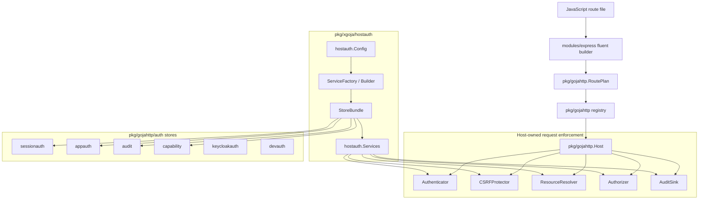

# PR 74 Code Review Methodology and Intern Guide

## Executive summary

This document is a plan for doing a solid, in-depth code review of PR 74, not the review result itself. It explains the system introduced by the pull request, maps the files that a reviewer must understand, and gives a step-by-step methodology for examining correctness, security, lifecycle behavior, tests, examples, and documentation.

The pull request is large enough that a normal line-by-line review from top to bottom is the wrong starting point. The local branch is `task/goja-express-auth` at `b66baea`, with base `origin/main` at `d406577`. The inventory script in this ticket observed a large local diff: `186 files changed, 28570 insertions(+), 119 deletions(-)`. The GitHub PR metadata reports PR 74 as open with title `Add planned Express auth and host auth examples`, but the `gh pr view --json files` path list is capped at 100 entries in the evidence captured here, so reviewers should use local `git diff origin/main...HEAD` output rather than relying on GitHub's summarized file list alone.

The review should be organized around the security boundary:

1. JavaScript authors declare route intent through `modules/express` fluent builders.
2. Builders compile intent into `pkg/gojahttp.RoutePlan` values.
3. `pkg/gojahttp.Host` validates and executes planned routes through host-owned authentication, CSRF, resource resolution, authorization, and audit interfaces.
4. Auth helper packages under `pkg/gojahttp/auth/...` provide reusable session, audit, capability, app-owned authorization, dev-auth, and Keycloak/OIDC pieces.
5. `pkg/xgoja/hostauth` builds generated-host auth services from config and store settings.
6. `pkg/xgoja/providers/http` wires those generated-host services into the HTTP `serve` lifecycle.
7. Examples under `examples/xgoja/18-*`, `19-*`, `20-*`, and `21-*` prove the expected integration shapes.

A good review must therefore combine API review, security review, lifecycle review, persistence review, documentation review, and targeted tests. It should not only ask whether the code compiles. It should ask whether the system fails closed, whether the trust boundary is explicit, whether generated hosts open resources at the right time, whether tests cover negative cases, and whether examples teach safe usage.

## Problem statement and scope

### What the review is about

PR 74 introduces a host-owned authentication model for Express-like routes in `go-go-goja`. The design described in the accompanying write-ups is that JavaScript should declare route security intent while Go owns the security-critical enforcement steps. The review should validate that the implementation matches that design.

The review plan covers:

- Planned Express route-builder API behavior.
- `RoutePlan` validation and request dispatch semantics.
- Strict rejection of raw routes where configured.
- Session, CSRF, audit, capability, appauth, dev-auth, and Keycloak helper packages.
- Store implementations and store contract tests.
- Generated-host auth config resolution and service construction.
- HTTP `serve` provider integration, including hot reload.
- Examples, docs, TypeScript declaration updates, and migration guidance.
- Test strategy for ordinary unit tests, integration tests, smoke tests, and security-focused negative tests.

### What the review is not about

This document is not a final code review report and does not claim that PR 74 is correct or incorrect. It intentionally avoids merge recommendations. It also does not modify production code. The scripts created for this ticket live under the ticket's `scripts/` directory and only gather evidence or run validation commands.

### Main review question

The central review question is:

> Does PR 74 create a clear, fail-closed, testable path from JavaScript route declarations to Go-owned authentication and authorization enforcement, without introducing unsafe lifecycle, persistence, or generated-host behavior?

Everything in this guide decomposes that question into smaller review tasks.

## Evidence gathered for planning

The ticket contains scripts and captured outputs that shape the review plan:

| Artifact | Purpose |
| --- | --- |
| `scripts/01-pr74-inventory.sh` | Captures branch/base/head, PR metadata, diff stats, changed files, changed packages, and largest deltas. |
| `sources/01-pr74-inventory.md` | Captured inventory output. It is the primary local diff map. |
| `scripts/02-targeted-validation.sh` | Runs a targeted package test set for the subsystems touched by PR 74. |
| `sources/02-targeted-validation.md` | Captured test output. Targeted package tests passed with `GOFLAGS=-buildvcs=false`. |
| `sources/03-express-auth-host-smoke.md` | Captured smoke run for the non-generated auth-host example. |
| `sources/04-test-inventory.md` | Lists test names in key packages, useful for identifying coverage and missing cases. |
| `sources/05-key-line-anchors.md` | Fast line-anchor index for important types, functions, and review entry points. |

The targeted validation run used Go `go1.26.1 linux/amd64` and `GOFLAGS=-buildvcs=false`. It passed:

```text
go test ./pkg/gojahttp ./modules/express ./pkg/xgoja/providers/http ./pkg/xgoja/hostauth -count=1
go test ./pkg/gojahttp/auth/... -count=1
go test ./examples/xgoja/18-express-auth-host/cmd/host ./examples/xgoja/20-express-hello-world/cmd/host ./examples/xgoja/21-generated-host-auth/cmd/host -count=1
```

The example smoke run for `examples/xgoja/18-express-auth-host` passed and exercised public health, unauthenticated `/me`, login, async planned handlers, authenticated `/me`, CSRF denial, authorized project update, missing resource, logout, and post-logout denial.

## Mental model of the system

The system is easiest to understand as a set of layers. Each layer should be reviewed against its own responsibilities and against the contracts between layers.



A request to a planned route should follow this conceptual flow:

```text
match HTTP route
  -> build RequestDTO
  -> require a valid RoutePlan
  -> authenticate actor if the plan requires a user
  -> verify CSRF for unsafe methods if the plan requires CSRF
  -> resolve declared resources from route/query/body/literal sources
  -> authorize the declared action against actor and resources
  -> emit audit events
  -> invoke JavaScript handler with secure ctx and response object
  -> await promises and emit completed/failed audit events
```

The review should keep asking whether every transition above is explicit, validated, tested, and fail-closed.

## High-level review sequence

The review should be done in phases. Do not start by reading every new file alphabetically. Start with the boundary contracts, then trace execution flows, then review implementations beneath those flows.

### Phase 0: Establish branch and diff facts

Goal: make sure the reviewer and author are discussing the same code.

Run:

```bash
cd /home/manuel/workspaces/2026-06-12/goja-express-auth/go-go-goja
git status --short
git branch --show-current
git rev-parse origin/main HEAD
git diff --stat origin/main...HEAD
git diff --name-status origin/main...HEAD
```

Then compare with the captured inventory:

```bash
ttmp/2026/06/14/XGOJA-PR74-CODE-REVIEW-PLAN--pr-74-code-review-methodology-for-express-and-host-auth/scripts/01-pr74-inventory.sh
```

Review questions:

- Is the local branch exactly the PR head expected by reviewers?
- Are there uncommitted changes outside the ticket workspace?
- Are generated files included intentionally?
- Are committed `ttmp` documents part of the PR intentionally, or should the review separate product code from supporting ticket history?
- Does the GitHub file list omit files because of API pagination or UI truncation?

### Phase 1: Review public API contracts first

Goal: understand the API that users and generated hosts will rely on before reading implementation details.

Start with these files:

| File | Why it matters |
| --- | --- |
| `pkg/gojahttp/auth_plan.go` | Defines `RoutePlan`, `SecuritySpec`, resource specs, auth interfaces, audit events, and plan validation. |
| `modules/express/auth_builders.go` | Defines the JavaScript fluent route builder and trusted Go-backed builder objects. |
| `modules/express/express.go` | Changes Express verb helpers and removes the legacy overload. |
| `pkg/xgoja/hostauth/config.go` | Defines generated-host auth config shape. |
| `pkg/xgoja/hostauth/services.go` and `lookup.go` | Define how concrete services move through xgoja host-service bags. |
| `pkg/xgoja/providers/http/serve.go` | Defines how HTTP `serve` discovers and installs auth services. |

Key line anchors from the planning inventory:

- `pkg/gojahttp/auth_plan.go:40` defines `RoutePlan`.
- `pkg/gojahttp/auth_plan.go:106` defines `AuthOptions`.
- `pkg/gojahttp/auth_plan.go:182` validates route plans.
- `modules/express/auth_builders.go:39` rejects `.auth(...)` values not created by `express.user()`.
- `modules/express/auth_builders.go:93` rejects `.resource(...)` values not created by `express.resource(type)`.
- `modules/express/auth_builders.go:124` starts the route builder state machine.
- `modules/express/express.go:192` rejects the removed `app.get(path, handler)` style.
- `pkg/xgoja/hostauth/config.go:28` defines `Config` and states that it is host config, not route config or a policy DSL.
- `pkg/xgoja/providers/http/serve.go:398` builds auth services for `serve`.
- `pkg/xgoja/providers/http/serve.go:416` maps auth services into `gojahttp.HostOptions`.

Review questions:

- Are exported names and comments clear enough to become long-term API?
- Does the fluent JavaScript API force a security decision before handler registration?
- Does the Go API keep route declaration separate from identity provider and persistence concerns?
- Are all public error messages actionable for users migrating from the old API?
- Are TypeScript declarations and docs aligned with the actual API behavior?

### Phase 2: Trace the planned-route path end to end

Goal: prove, by reading code and tests, that a planned route is validated once and enforced on every request.

Suggested trace:

1. A JavaScript route calls `app.get("/me")`.
2. `modules/express` returns a staged builder.
3. `.auth(express.user().required())` stores a `SecuritySpec` copied from a Go-backed object.
4. `.allow("user.self.read")` records an action.
5. `.handle(fn)` calls `Host.RegisterPlanned` with a `RoutePlan` and handler.
6. `ValidateRoutePlan` normalizes method/pattern/action/audit event and rejects missing security or missing action.
7. The host registry stores the route and plan.
8. `Host.ServeHTTP` matches the route and dispatches planned routes to `servePlannedRoute`.
9. `buildSecureEnvelope` authenticates, verifies CSRF, resolves resources, authorizes, and returns a secure context.
10. The handler runs only after the host-owned checks pass.

Pseudocode for the review trace:

```go
// JavaScript-facing setup path
builder := app.get(pattern)
builder.auth(express.user().required()).allow(action).handle(handler)

// Go-facing registration path
plan := RoutePlan{Method: method, Pattern: pattern, Security: user, Action: action}
validatedPlan, err := ValidateRoutePlan(plan)
if err != nil { reject registration }
registry.add(Route{Plan: &validatedPlan, Handler: handler})

// Request path
route := registry.match(req.Method, req.URL.Path)
if route.Plan == nil && host.RejectRawRoutes { deny }
if route.Plan != nil {
    envelope, status, err := buildSecureEnvelope(ctx, req, dto, route.Plan)
    if err != nil { auditDenied; writeError; return }
    auditAllowed
    callJSHandler(envelope.JSObject(vm), response)
    auditCompletedOrFailed
}
```

Review questions:

- Does every route that claims to be planned have a non-nil, validated plan?
- Does every protected route require an action before `.handle(...)` is reachable?
- Does `.public()` intentionally allow `.handle(...)` without an action?
- Are route params validated at registration time rather than failing unexpectedly at request time?
- Are `body` and `query` value sources handled safely and predictably?
- Are status codes for authentication, authorization, CSRF, not found, and backend errors consistent?

### Phase 3: Review the security invariants

Goal: check that the implementation fails closed and does not let JavaScript bypass host-owned decisions accidentally.

Primary invariants to verify:

1. **Security mode required.** A route cannot be registered without `.public()` or `.auth(...)`.
2. **Protected action required.** A user route cannot be registered without `.allow(action)`.
3. **Trusted builder objects only.** `.auth(...)` and `.resource(...)` reject plain JavaScript objects.
4. **No handler before security choice.** The staged builder does not expose `.handle(...)` at the initial route state.
5. **CSRF before mutation handler.** Unsafe methods with `.csrf()` are verified before resource resolution, authorization, and handler execution.
6. **Resource resolver required for resource routes.** Resource plans fail with server error if the host is misconfigured.
7. **Authorizer required for protected action routes.** Protected routes fail closed if no authorizer exists.
8. **Audit is host-owned.** JavaScript declares audit event names; Go records outcome events.
9. **Raw routes can be rejected.** `RejectRawRoutes` rejects matched unplanned routes while allowing planned routes and mounted static handlers where intended.
10. **Error details are controlled by dev mode.** Internal errors should not leak in production responses.

Useful files and tests:

| Area | Files/tests to inspect |
| --- | --- |
| Plan validation | `pkg/gojahttp/auth_plan.go`, `pkg/gojahttp/auth_plan_test.go` |
| Builder staging | `modules/express/auth_builders.go`, `modules/express/auth_builders_integration_test.go` |
| Dispatch and status mapping | `pkg/gojahttp/planned_dispatch.go`, `pkg/gojahttp/planned_dispatch_test.go` |
| Raw-route rejection | `pkg/gojahttp/host.go`, `pkg/gojahttp/route_registry.go`, related tests listed in `sources/04-test-inventory.md` |
| Audit normalization | `pkg/gojahttp/auth/audit/audit.go`, `pkg/gojahttp/auth/audit/audit_test.go` |
| CSRF/session behavior | `pkg/gojahttp/auth/sessionauth/sessionauth.go`, `pkg/gojahttp/auth/sessionauth/sessionauth_test.go` |

Negative-test checklist:

- Legacy `app.get(path, handler)` panics with a migration-oriented error.
- `.auth({ required: true })` fails.
- `.resource({ type: "project" })` fails.
- A user route without `.allow(...)` fails registration.
- A route referencing a missing `:param` fails registration.
- A protected route with no authenticator returns 500, not accidental allow.
- An authenticated route with authenticator returning nil actor returns 401.
- A CSRF-protected unsafe request without token returns 403 and does not invoke the handler.
- A resource route with resolver returning nil maps to 404.
- An authorizer denial maps to 403.
- A backend error maps to 500 unless intentionally wrapped as one of the security sentinel errors.

### Phase 4: Review generated-host lifecycle and ownership

Goal: make sure xgoja generated-host auth services are constructed at the correct time, installed in the correct host-service bag, and closed reliably.

The key design claim is that providers can discover the existence of an auth factory while commands are built, but must not open databases or resolve environment-dependent DSNs until command execution. The code to check is `pkg/xgoja/hostauth/builder.go` and `pkg/xgoja/providers/http/serve.go`.

Observed API anchors:

- `hostauth.NewServiceFactory` returns a lazy builder and its comment says it opens stores only when `BuildHostAuthServices` is called.
- `BuildHostAuthServices` resolves config, builds stores, builds a session manager, builds `gojahttp.AuthOptions`, and closes partially built stores on failure.
- `newServeCommandSet` validates malformed hostauth service factory presence during command construction.
- `serveVerb` builds services only when the `serve` command runs, defers close, and requires `RuntimeFactoryWithHostServices` if auth services exist.
- `serveVerbHotReload` shares auth services across candidate runtime reloads and passes the candidate host into runtime services.

Review questions:

- Does service construction happen after Glazed values are parsed?
- Are command-time checks limited to type validation and discovery?
- Are DB handles and stores closed on both success and failure paths?
- Does hot reload reuse auth services intentionally, or should it rebuild them per reload?
- Does hot reload close old candidate hosts without closing shared auth stores too early?
- Does an external host remain the owner of listening when it is provided?
- Does `RejectRawRoutes` propagate through generated-host and provider-owned host options?
- Are host-service keys type-safe and impossible to confuse with HTTP host services?

Pseudocode for generated-host review:

```go
// Command construction: safe, no DB open.
factory, ok, err := hostauth.LookupServiceFactory(ctx.Host)
if err != nil { return err }

// Command execution: values and env exist now.
services, err := factory.BuildHostAuthServices(runCtx, parsedValues)
if err != nil { return err }
defer services.Close(context.Background())

host := gojahttp.NewHost(hostOptionsWithAuth(httpSettings, services))
runtimeServices := serveRuntimeServices(host, services, ownsListen, includeHost)
rt := runtimeFactory.NewRuntimeFromSectionsWithHostServices(ctx, parsedValues, runtimeServices, loader)
```

### Phase 5: Review store and persistence behavior

Goal: ensure memory, SQLite, and Postgres stores preserve the same behavior, fail cleanly, and avoid leaking mutable caller state.

The PR adds several packages under `pkg/gojahttp/auth/...`:

| Package | Review focus |
| --- | --- |
| `sessionauth` | Session cookie manager, CSRF token, idle/absolute expiration, rotation, revocation, MFA freshness, actor loading. |
| `audit` | Record normalization, redaction, sink behavior, memory/store/log sinks. |
| `capability` | Hashed token issue/redeem/revoke, single-use semantics, purpose binding, expiry. |
| `appauth` | App-owned users, Keycloak subject mappings, memberships, resources, resolver, authorizer. |
| `devauth` | Example/dev login host services; should remain clearly non-production. |
| `keycloakauth` | OIDC Authorization Code + PKCE adapter, state/nonce/PKCE transaction handling, session creation. |
| `*/sqlstore` | SQL persistence, schema application, dialect differences, data shape round-trips. |
| `auth/internal/*test` | Store behavior contracts shared across memory and SQL implementations. |

Store review checklist:

- Every memory store should deep-copy mutable maps/slices on input and output.
- SQL stores should round-trip empty slices, nil maps, timestamps, nullable fields, and status flags intentionally.
- SQL schema creation should be idempotent.
- SQL dialect selection should be explicit for SQLite vs Postgres.
- SQL errors should preserve enough context for debugging without leaking secrets.
- Store `Close` behavior should not double-close shared DB handles.
- Transactional operations such as session rotation and capability redemption should be atomic.
- Contract tests should encode behavior, not implementation details.

Important planning note: `pkg/xgoja/hostauth/stores.go` opens SQL handles with `sql.Open`, which does not necessarily connect immediately. The review should decide whether builders should `PingContext` during schema application or service build, and whether tests cover unreachable DSNs where schema application is enabled.

### Phase 6: Review Keycloak/OIDC and browser-session security

Goal: evaluate the most security-sensitive parts without assuming that unit tests are enough.

Primary files:

- `pkg/gojahttp/auth/keycloakauth/keycloakauth.go`
- `pkg/gojahttp/auth/keycloakauth/keycloakauth_test.go`
- `examples/xgoja/19-express-keycloak-auth-host/cmd/host/main.go`
- `examples/xgoja/19-express-keycloak-auth-host/scripts/keycloak_smoke.py`
- `examples/xgoja/19-express-keycloak-auth-host/docker-compose.yml`
- `examples/xgoja/19-express-keycloak-auth-host/keycloak/realm-goja-demo.json`

Review questions:

- Are state, nonce, and PKCE verifier generated with cryptographic randomness?
- Are state and nonce single-use, expiring, and bound to the callback?
- Are ID tokens verified for issuer, audience/client ID, expiry, and nonce?
- Does the browser receive only an opaque application session, not provider tokens?
- Does logout clear app sessions and cookies?
- Can a disabled or revoked app user continue to authenticate?
- Are CSRF cookies/tokens scoped correctly for unsafe planned routes?
- Are SameSite, Secure, HttpOnly, and path settings safe by default?
- Are demo credentials and dev-only shortcuts clearly limited to examples?
- Does the Keycloak smoke exercise Postgres-backed app auth state, not only Keycloak's own DB?

Recommended manual checks:

```bash
# Run only if Docker/ports are available and the reviewer accepts the heavier dependency.
cd examples/xgoja/19-express-keycloak-auth-host
make keycloak-up
make smoke
make keycloak-down
```

The final review should record whether this smoke was run, skipped due to environment constraints, or failed with exact logs.

### Phase 7: Review examples as executable specifications

Goal: make sure examples teach the intended usage, not accidental shortcuts.

Examples to inspect:

| Example | Purpose |
| --- | --- |
| `examples/xgoja/18-express-auth-host` | Hand-written Go host wiring for planned Express auth with dev auth services. |
| `examples/xgoja/19-express-keycloak-auth-host` | Production-shaped Keycloak/OIDC + Postgres validation path. |
| `examples/xgoja/20-express-hello-world` | Minimal planned Express route shape after the cutover. |
| `examples/xgoja/21-generated-host-auth` | Runtime-package/generated-host auth service factory and HTTP serve integration. |

Review questions:

- Do examples use `.public().handle(...)` and `.auth(...).allow(...).handle(...)` consistently?
- Do they avoid resurrecting old raw-route patterns accidentally?
- Do smokes cover both successful and denied requests?
- Do generated files match the generator output, or is the committed example stale?
- Do docs explain which examples are dev-only versus production-shaped?
- Does `examples/xgoja/21-generated-host-auth/Makefile` regenerate tracked files during smoke? If yes, reviewers should run it in a clean worktree and check whether the tree remains unchanged after the smoke.

Suggested commands:

```bash
GOFLAGS=-buildvcs=false go test ./examples/xgoja/18-express-auth-host/cmd/host ./examples/xgoja/20-express-hello-world/cmd/host ./examples/xgoja/21-generated-host-auth/cmd/host -count=1
make -C examples/xgoja/18-express-auth-host smoke

# Optional, modifies generated example directory; run only with a clean worktree.
make -C examples/xgoja/21-generated-host-auth smoke
git status --short
```

### Phase 8: Review documentation and migration behavior

Goal: make sure users can adopt the breaking API change and generated-host auth path safely.

Primary docs:

- `pkg/doc/18-express-module.md`
- `pkg/doc/29-express-auth-user-guide.md`
- `pkg/doc/30-migrate-express-apps-to-planned-auth.md`
- `pkg/doc/31-express-auth-examples.md`
- `cmd/xgoja/doc/11-provider-runtime-config-and-host-services.md`
- `cmd/xgoja/doc/17-xgoja-v2-reference.md`
- Example READMEs.
- The two project articles referenced by the review request.

Review questions:

- Do docs state that old `app.get(path, handler)` is intentionally removed?
- Do docs show explicit `.public()` for public routes?
- Do protected examples show `.auth(...)` and `.allow(...)` before `.handle(...)`?
- Do docs explain that Express does not own Keycloak, user stores, or production authorization policy?
- Do docs explain `reject-raw-routes` and when to enable it?
- Do docs distinguish host auth config from JavaScript route config?
- Do docs list known follow-ups such as full OIDC generated-host mode if not implemented?

Documentation should be reviewed like code because it is the migration contract for a breaking change.

## Detailed subsystem review guide

### 1. `pkg/gojahttp`: route contracts and enforcement

Start with `auth_plan.go`. The important type is:

```go
type RoutePlan struct {
    Name      string
    Method    string
    Pattern   string
    Security  SecuritySpec
    Resources []ResourceSpec
    Action    string
    CSRF      CSRFSpec
    Audit     AuditSpec
}
```

The reviewer should verify that `ValidateRoutePlan` normalizes method, path, name, action, and audit event, and rejects invalid plans before they reach request time. It currently distinguishes public and user routes and requires `.allow(action)` for user routes.

Then read `planned_dispatch.go`. This is the most important enforcement file. The reviewer should trace `buildSecureEnvelope` and make a table of every possible early return:

| Condition | Expected status | Expected audit? | Handler invoked? |
| --- | --- | --- | --- |
| Missing plan | 500 | denied if audit available | no |
| Missing authenticator | 500 | denied | no |
| Authentication failure | 401 or mapped status | denied | no |
| Missing CSRF protector | 500 | denied | no |
| CSRF failure | 403 | denied | no |
| Missing resource resolver | 500 | denied | no |
| Resource not found | 404 | denied | no |
| Missing authorizer | 500 | denied | no |
| Authorizer denied | 403 | denied | no |
| Handler error | 500 | failed | handler started |
| Handler success | handler status | completed | yes |

Code-reading tasks:

- Confirm that all `nil` service dependencies fail closed.
- Confirm that audit records are best-effort and cannot change an otherwise successful response unless that is explicitly intended.
- Confirm that promise-returning handlers are awaited in the same path as synchronous handlers.
- Confirm that `secureEnvelope.JSObject` exposes only the intended actor, resource, params, body, action, route name, and request DTO fields.
- Confirm that copied resources and claims cannot be mutated by JavaScript in a way that changes host-owned authorization state.

### 2. `modules/express`: JavaScript API and builder staging

This is the user-facing module. The reviewer should treat it as both API and security boundary.

The builder store keeps two maps:

```go
authSpecs     sync.Map // map[*goja.Object]*gojahttp.SecuritySpec
resourceSpecs sync.Map // map[*goja.Object]*gojahttp.ResourceSpec
```

That design is meant to prevent arbitrary JavaScript objects from masquerading as trusted auth/resource declarations. Review these concerns carefully:

- Object identity: Does `value.ToObject(vm)` preserve identity for the same Go-backed object?
- Cross-runtime safety: Could a builder object from another runtime be accepted incorrectly?
- Mutability: After `.auth(userBuilder)` copies a spec, can later JavaScript mutation change the route plan unexpectedly?
- Reuse: If the same resource builder is reused across routes and mutated later, is each route getting a copy or a pointer? The code appears to return value copies from `authSpec` and `resourceSpec`; verify this in tests.
- Builder state: Does the staged object returned by `.auth()` hide `.handle()` until `.allow()` is called?
- Method removal: Does the legacy overload panic consistently for all verbs listed in docs?

Suggested review experiment:

```javascript
const user = express.user().required()
const route = app.get('/a').auth(user).allow('x')
user.mfaFresh('10m')
route.handle((ctx, res) => res.json({ mfa: ctx.actor }))
```

The reviewer should decide, based on implementation and desired API, whether mutating `user` after `.auth(user)` should affect the route. If not, a regression test should assert copy-on-auth behavior.

### 3. `pkg/gojahttp/auth/sessionauth`: sessions and CSRF

Review this package as the bridge between browser cookies and planned-route `Authenticator` / `CSRFProtector` interfaces.

Questions to answer:

- What are the defaults for cookie name, path, SameSite, Secure, HttpOnly, idle timeout, and absolute timeout?
- Does `AllowInsecureHTTP` default to false for production safety?
- How are session IDs and CSRF tokens generated?
- Are expired, revoked, and rotated sessions rejected everywhere?
- Does rotation validate the replacement session before deleting the old session?
- Does MFA freshness use trusted session timestamps?
- Are cookies cleared on authentication failures where appropriate?
- Does the manager implement both `Authenticate` and `VerifyCSRF` in a way that matches the host dispatch order?

Test names to inspect include `TestAuthenticateAndCSRF`, `TestAuthenticateRequiresFreshMFA`, `TestMemoryStoreRotateValidatesNextBeforeDeletingOld`, `TestExpiredRevokedAndRotatedSessions`, and `TestCSRFMismatchAndCookieClearing`.

### 4. `pkg/gojahttp/auth/audit`: audit normalization and redaction

Review audit as a security log surface. It should preserve operationally useful facts while avoiding accidental sensitive data storage.

Questions:

- What fields are recorded by default?
- Are request headers, cookies, authorization headers, and query strings redacted or omitted appropriately?
- Are actors/resources copied instead of referenced?
- Can audit store failures block a route? If not, is best-effort behavior documented?
- Is there a future need for strict audit mode, and is that out of scope for PR 74?

The test `TestLogSinkOmitsSensitiveRequestMetadata` is especially important because audit logs are a common source of credential leaks.

### 5. `pkg/gojahttp/auth/capability`: one-time and purpose-bound tokens

Capability tokens are often security sensitive because they are used for invites, password reset, email verification, or API-style delegated actions.

Review questions:

- Is the raw token stored only as a hash?
- Is purpose checked during redemption?
- Are expired, revoked, and already-used tokens rejected?
- Is single-use redemption atomic in SQL stores?
- Are audit events generated for issue/redeem paths without storing token material?
- Are entropy and token length sufficient?

Tests to inspect include `TestIssueRedeemSingleUseAndAudit`, `TestRedeemFailures`, `TestRevoke`, and `TestOrgInviteFlow`.

### 6. `pkg/gojahttp/auth/appauth`: app-owned users and authorization

This package is intentionally not a universal policy engine. It provides small app-owned primitives and helper implementations for route auth interfaces.

Review questions:

- Does the resource resolver validate tenant boundaries and missing resources correctly?
- Does the authorizer deny by default?
- How are roles/actions represented, and is matching exact or pattern-based?
- Do disabled users or revoked memberships fail safely?
- Are Keycloak subject mappings unique and stable?
- Are store methods safe from caller mutation?
- Is the package documentation explicit that real apps may replace these interfaces with domain-specific services?

### 7. `pkg/gojahttp/auth/keycloakauth`: OIDC adapter

Review this package with an OAuth/OIDC checklist. A reviewer unfamiliar with OIDC should first read the package README and then map each handler step to the security property it provides.

Callback pseudocode to validate:

```go
state := request.Query("state")
tx := transactionStore.Consume(state)
if tx == nil || tx.Expired { deny }

token := oauth2.Exchange(code, PKCEVerifier(tx.Verifier))
idToken := verifier.Verify(rawIDToken)
claims := idToken.Claims()
if claims.Nonce != tx.Nonce { deny }

userSession := normalizer.Normalize(claims)
if userSession.UserID == "" { deny }

sessionManager.Create(w, r, userSession.UserID, options...)
redirectAfterLogin()
```

The reviewer should verify each line above exists semantically and is tested.

### 8. `pkg/xgoja/hostauth`: generated-host auth service construction

`hostauth` is the adapter between generated/runtime package configuration and `gojahttp.AuthOptions`. Review it as an infrastructure package, not as JavaScript route logic.

Important concepts:

- `Config` chooses mode (`none`, `dev`, `oidc`) and store/session config.
- `ResolveConfig` normalizes mode, durations, SameSite, cookie path, and store inheritance.
- Per-store config inherits from `default` field by field.
- Explicit `dsn` clears inherited `dsn-env`; explicit `dsn-env` clears inherited `dsn`.
- `ApplySchema` is a pointer in input config so omitted and explicit false can be distinguished.
- `BuildStores` shares SQL DB handles for identical `(driver, dsn)` pairs.
- `BuildAuthOptions` maps session manager to authenticator/CSRF, audit sink to audit, appauth resources to resolver, and appauth memberships to authorizer.

Review questions:

- Does `mode=none` avoid building auth options and stores?
- Does `mode=oidc` fail explicitly with `ErrOIDCNotImplemented`?
- Are config errors path-rich enough for CLI users?
- Are environment variable lookups delayed until command execution?
- Are store defaults safe? Memory default is convenient; docs must make clear what that means.
- Are DB handles shared and closed exactly once?
- Does schema application happen only when requested?
- Are Postgres dependencies optional enough for non-Postgres users?

### 9. `pkg/xgoja/providers/http`: serve and hot reload integration

This package decides whether generated-host auth actually reaches Express at runtime. Review it after understanding `hostauth`.

Review questions:

- Does provider registration expose the right HTTP config section?
- Does `serve` reject malformed hostauth service factory values early?
- Does `serve` require `RuntimeFactoryWithHostServices` when auth services must be overlaid?
- Does `serve` preserve external host ownership and avoid binding ports twice?
- Does hot reload install the candidate host and shared auth services correctly?
- Are auth services closed when `serve` exits?
- Does hot reload keep auth session state stable across reloads, and is that desired?
- Are source registries scoped to the selected command, not global process state?

Tests to inspect include `TestServeVerbUsesHostAuthServiceFactory`, `TestServeVerbPreservesExternalHostWithHostAuthFactory`, `TestServeVerbHotReloadUsesHostAuthServiceFactory`, and `TestHostOptionsWithAuthPreservesHTTPSettings`.

## Test plan for the final review

The final code review should include both automated and manual validation. Record exact commands, environment, and outputs.

### Fast mandatory tests

```bash
cd /home/manuel/workspaces/2026-06-12/goja-express-auth/go-go-goja
GOFLAGS=-buildvcs=false go test ./pkg/gojahttp ./modules/express ./pkg/xgoja/providers/http ./pkg/xgoja/hostauth -count=1
GOFLAGS=-buildvcs=false go test ./pkg/gojahttp/auth/... -count=1
GOFLAGS=-buildvcs=false go test ./examples/xgoja/18-express-auth-host/cmd/host ./examples/xgoja/20-express-hello-world/cmd/host ./examples/xgoja/21-generated-host-auth/cmd/host -count=1
```

### Example smoke tests

```bash
make -C examples/xgoja/18-express-auth-host smoke
```

Optional with clean worktree because it regenerates tracked example runtime files:

```bash
git status --short
make -C examples/xgoja/21-generated-host-auth smoke
git status --short
```

Optional with Docker and free ports:

```bash
make -C examples/xgoja/19-express-keycloak-auth-host keycloak-up
make -C examples/xgoja/19-express-keycloak-auth-host smoke
make -C examples/xgoja/19-express-keycloak-auth-host keycloak-down
```

### Full repository test

```bash
GOFLAGS=-buildvcs=false go test ./... -count=1
```

If full tests fail due to known generated temporary workspace VCS stamping, record the exact failure and distinguish it from PR 74 behavior. Do not hide unrelated failures; classify them.

### Static and dependency checks

Suggested, if available in the repo toolchain:

```bash
go vet ./pkg/gojahttp/... ./modules/express ./pkg/xgoja/hostauth ./pkg/xgoja/providers/http
rg -n 'TODO|panic\(|http\.Error|Authorization|Cookie|SameSite|csrf|secret|token|password' pkg/gojahttp modules/express pkg/xgoja examples/xgoja -S
```

For security-sensitive code, grep is not a substitute for review, but it helps find paths that deserve careful reading.

## Review report template

When the actual review is written, use a stable structure so the author can respond efficiently:

```markdown
# PR 74 Review

## Scope and environment
- Branch/head/base:
- Commands run:
- Smokes run/skipped:

## Architecture summary
- One paragraph confirming the intended model.

## Blocking issues
1. [file:line] issue, impact, suggested fix, test needed.

## Non-blocking issues
1. [file:line] issue, impact, suggested improvement.

## Security notes
- Authn/authz/CSRF/audit observations.

## Test coverage notes
- What is covered, what is missing.

## Documentation and migration notes
- Docs/examples alignment.

## Merge recommendation
- Approve / request changes / comment only, with rationale.
```

Every issue should include:

- File and line.
- Minimal reproduction or code path.
- Why it matters.
- Expected behavior.
- Suggested fix or test.
- Severity: blocking, important non-blocking, nit, or follow-up.

## Intern onboarding guide

An intern reviewing this PR should not try to understand everything at once. Use this reading order:

1. Read the two project articles supplied in the prompt to understand intent.
2. Read `pkg/doc/29-express-auth-user-guide.md` to see the user-facing planned-route model.
3. Read `modules/express/auth_builders.go` to see how fluent JavaScript becomes Go data.
4. Read `pkg/gojahttp/auth_plan.go` to understand the route contract.
5. Read `pkg/gojahttp/planned_dispatch.go` to understand request enforcement.
6. Run `go test ./pkg/gojahttp ./modules/express -count=1` and inspect the relevant tests.
7. Read `pkg/gojahttp/auth/sessionauth/sessionauth.go` and tests.
8. Read `pkg/gojahttp/auth/appauth/appauth.go` and tests.
9. Read `pkg/xgoja/hostauth/config.go`, `resolve.go`, `stores.go`, and `builder.go`.
10. Read `pkg/xgoja/providers/http/serve.go` with the hostauth tests open side by side.
11. Run or inspect the examples.
12. Only then start line-by-line review of the full diff.

A useful technique is to keep three notes while reading:

- **Contract notes:** what each package promises to callers.
- **Invariant notes:** what must never happen, especially security bypasses.
- **Coverage notes:** which tests prove the invariant and which tests are missing.

## Decision records for the review methodology

### Decision: Review by security boundary rather than file order

- **Context:** PR 74 spans Express bindings, HTTP routing, auth stores, generated-host service construction, docs, and examples.
- **Options considered:** Review files alphabetically; review largest files first; review by runtime/security flow.
- **Decision:** Review by runtime/security boundary.
- **Rationale:** The main correctness risk is a broken boundary between JavaScript declaration and Go enforcement. Flow-based review exposes bypasses and lifecycle issues earlier than alphabetical review.
- **Consequences:** Reviewers must understand the architecture first, but findings will be more actionable and less fragmented.
- **Status:** proposed

### Decision: Treat examples as part of the contract

- **Context:** PR 74 includes multiple examples and migration docs, and the API change is breaking for old Express verb overloads.
- **Options considered:** Review examples only for compilation; review examples as executable documentation.
- **Decision:** Review examples as executable specifications.
- **Rationale:** Users will copy these examples. Unsafe or stale example patterns can undo the value of a secure API.
- **Consequences:** The review includes smoke tests and documentation checks, not only package unit tests.
- **Status:** proposed

### Decision: Separate planning evidence from review conclusions

- **Context:** This ticket is for planning the review, not delivering the final review.
- **Options considered:** Mix preliminary findings into this guide; keep the guide focused on methodology.
- **Decision:** Keep this document focused on methodology and record only evidence that shapes the plan.
- **Rationale:** Premature conclusions can bias the actual reviewer. The review should still be evidence-based and line-anchored when performed.
- **Consequences:** This document lists risk areas and questions, but does not make merge-readiness claims.
- **Status:** proposed

## Risks and high-attention areas

These are not findings. They are areas where the final reviewer should spend extra time:

1. **Builder object identity and mutation semantics.** Make sure trusted object maps cannot be spoofed and that copied specs cannot be mutated unexpectedly after route setup.
2. **Fail-closed host misconfiguration.** Missing authenticator, authorizer, resource resolver, and CSRF protector should deny requests, not silently allow them.
3. **Audit data leakage.** Confirm sensitive headers, cookies, tokens, and request metadata are omitted or redacted.
4. **Session rotation and capability redemption atomicity.** These paths must not allow double-valid sessions or double token redemption under concurrency.
5. **Generated-host service lifetime.** DB handles and auth services must be opened late and closed once, including hot reload and failure paths.
6. **OIDC callback security.** State, nonce, PKCE, audience, issuer, and expiry checks must all be present and tested.
7. **Documentation drift.** Docs, TypeScript declarations, examples, and implementation must all describe the same breaking route API.
8. **Generated example freshness.** The generated-host example includes committed generated runtime files; the review should verify regeneration is stable.
9. **Diff scope.** The local diff includes product code, examples, docs, and ticket artifacts. The final review should avoid losing product issues inside documentation volume.

## File reference map

| File or directory | Review role |
| --- | --- |
| `modules/express/auth_builders.go` | Fluent route builder and trusted Go-backed object boundary. |
| `modules/express/express.go` | Verb helper cutover and legacy overload rejection. |
| `modules/express/typescript.go` | TypeScript API surface for planned auth routes. |
| `pkg/gojahttp/auth_plan.go` | Route plan contract and auth interface definitions. |
| `pkg/gojahttp/planned_dispatch.go` | Runtime enforcement pipeline and audit outcomes. |
| `pkg/gojahttp/host.go` | Host options, raw-route rejection, request dispatch entry point. |
| `pkg/gojahttp/route_registry.go` | Route metadata and planned route storage. |
| `pkg/gojahttp/auth/sessionauth` | Session cookies, CSRF, MFA freshness, store contract. |
| `pkg/gojahttp/auth/audit` | Audit normalization, memory/store/log sinks. |
| `pkg/gojahttp/auth/capability` | One-time capability token lifecycle. |
| `pkg/gojahttp/auth/appauth` | App-owned user/resource/membership authorization helpers. |
| `pkg/gojahttp/auth/keycloakauth` | Keycloak/OIDC browser-login adapter. |
| `pkg/gojahttp/auth/devauth` | Development auth host helper. |
| `pkg/xgoja/hostauth` | Generated-host auth config, stores, services, lookup helpers. |
| `pkg/xgoja/providers/http/http.go` | HTTP provider config and host setup. |
| `pkg/xgoja/providers/http/serve.go` | Generated-host auth integration with `serve` and hot reload. |
| `examples/xgoja/18-express-auth-host` | Hand-written auth host smoke example. |
| `examples/xgoja/19-express-keycloak-auth-host` | Keycloak/Postgres smoke example. |
| `examples/xgoja/20-express-hello-world` | Minimal planned route example. |
| `examples/xgoja/21-generated-host-auth` | Generated-host auth runtime-package example. |
| `pkg/doc/29-express-auth-user-guide.md` | User guide for planned routes. |
| `pkg/doc/30-migrate-express-apps-to-planned-auth.md` | Migration guide for removed legacy route overload. |

## Final reviewer checklist

Before sending the final review, confirm:

- [ ] Local branch/head/base were recorded.
- [ ] Product code was separated from docs/examples/ticket artifacts during triage.
- [ ] Planned-route API was reviewed from JavaScript to Go registration.
- [ ] Request dispatch was traced for success and every denial path.
- [ ] Auth/session/CSRF/audit semantics were reviewed with negative tests open.
- [ ] Store contracts were checked for memory and SQL implementations.
- [ ] Keycloak/OIDC path was reviewed with OAuth-specific checklist.
- [ ] Generated-host service lifecycle was reviewed for lazy construction and cleanup.
- [ ] HTTP `serve` and hot reload were reviewed with host-service overlays in mind.
- [ ] Examples were run or explicitly skipped with reason.
- [ ] Docs and TypeScript declarations were compared against implementation.
- [ ] Review comments are line-anchored, severity-labeled, and include suggested validation.

## References

- PR: <https://github.com/go-go-golems/go-go-goja/pull/74>
- Local repo: `/home/manuel/workspaces/2026-06-12/goja-express-auth/go-go-goja`
- Article: `/home/manuel/code/wesen/go-go-golems/go-go-parc/Projects/2026/06/12/ARTICLE - go-go-goja Express Auth - Go Backed Fluent Route Plans.md`
- Article: `/home/manuel/code/wesen/go-go-golems/go-go-parc/Projects/2026/06/14/ARTICLE - go-go-goja Express Auth - From Planned Routes to Generated Host Auth.md`
- Ticket inventory: `sources/01-pr74-inventory.md`
- Targeted validation output: `sources/02-targeted-validation.md`
- Smoke output: `sources/03-express-auth-host-smoke.md`
- Test inventory: `sources/04-test-inventory.md`
- Key line anchors: `sources/05-key-line-anchors.md`
