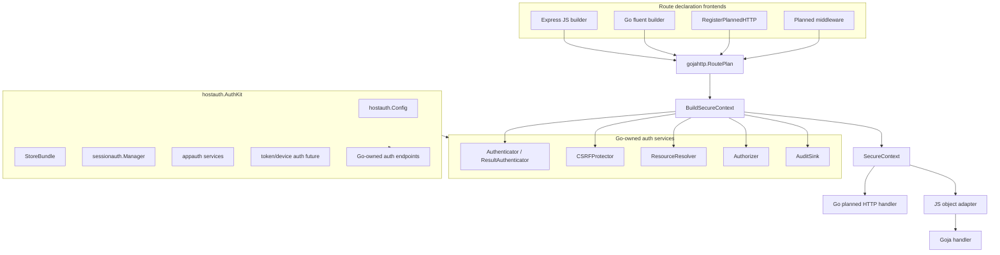
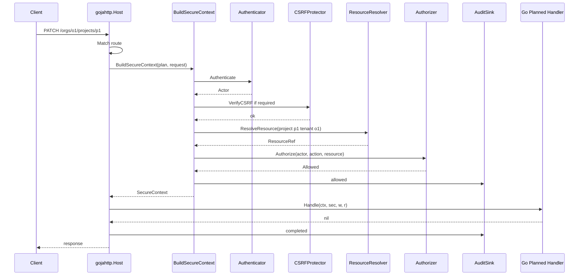
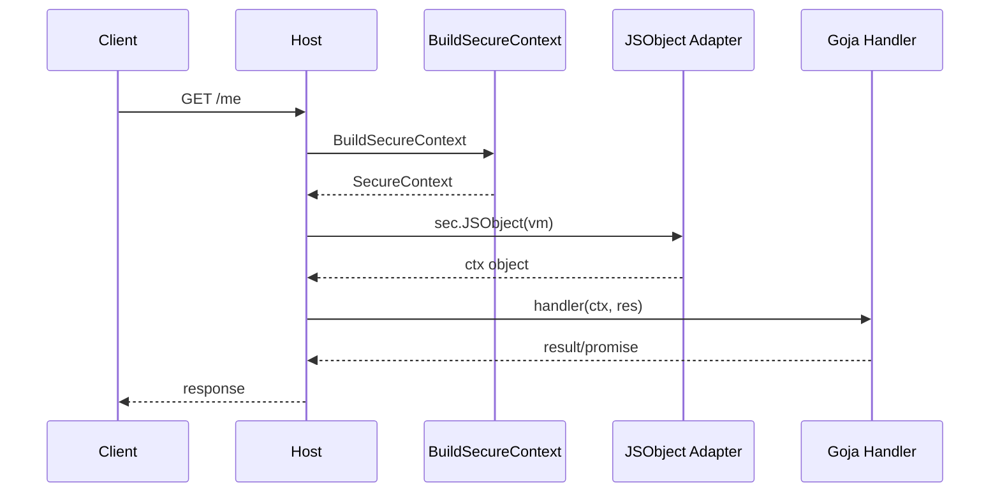

# Go Native Planned Auth API Intern Implementation Guide

## 1. Purpose of this guide

This guide explains how to make the planned authentication framework useful to ordinary Go programs, not only to JavaScript routes registered through the Express-style Goja module. The reader should understand the current system, why it works, where it is tied too tightly to Goja, and how to extract the reusable core so a traditional Go host can define protected routes with the same security semantics.

The short version is this: planned auth should become a `gojahttp` feature, and JavaScript Express should become one frontend to that feature. A Go program should be able to create a host, build an auth kit, register Go handlers with route plans, mount Goja routes on the same host, and know that all of those routes share the same authentication, CSRF, resource resolution, authorization, and audit rules.

The intended reader is a new intern who can read Go code but has not yet worked in this repository. The guide therefore starts with the concepts, then points to files, then proposes APIs, then breaks the implementation into small reviewable phases.

## 2. The central idea

The current PR 74 architecture introduces a valuable pattern: route code declares intent, and Go-owned infrastructure enforces that intent before application code runs. In JavaScript, a route says it is public or authenticated, declares resources, declares an action, optionally requires CSRF, and then supplies a handler. That fluent JavaScript chain compiles into a `gojahttp.RoutePlan`.

The route plan is more important than the JavaScript builder. It is the data contract that says what must be true before a handler may run.

```go
type RoutePlan struct {
    Name      string
    Method    string
    Pattern   string
    Security  SecuritySpec
    Resources []ResourceSpec
    Action    string
    CSRF      CSRFSpec
    Audit     AuditSpec
}
```

The Go-side API should make a Go handler produce the same contract:

```go
app.Patch("/orgs/:orgID/projects/:projectID").
    Auth(gojahttp.User().Required()).
    Resource(gojahttp.Resource("project").IDFromParam("projectID").TenantFromParam("orgID")).
    CSRF().
    Allow("project.update").
    Audit("project.updated").
    Handle(updateProject)
```

The JavaScript route and the Go route should compile into the same `RoutePlan`. Once that is true, the enforcement pipeline can be shared.

## 3. What exists now

### 3.1 `gojahttp.Host`

`pkg/gojahttp/host.go` defines the HTTP host. It owns the route registry, session manager, auth options, static mounts, and request dispatch. A host is already a normal `http.Handler`, so a Go program can serve it with the standard library:

```go
host := gojahttp.NewHost(gojahttp.HostOptions{
    Auth: gojahttp.AuthOptions{ /* services */ },
    RejectRawRoutes: true,
})

log.Fatal(http.ListenAndServe(":8080", host))
```

The host already supports raw route registration and planned route registration:

```go
func (h *Host) Register(method, pattern string, handler goja.Callable)
func (h *Host) RegisterPlanned(plan RoutePlan, handler goja.Callable) error
```

The problem is that both route registration methods are Goja-oriented. A traditional Go handler is an `http.Handler` or `func(http.ResponseWriter, *http.Request)`, not a `goja.Callable`.

### 3.2 `gojahttp.AuthOptions`

`pkg/gojahttp/auth_plan.go` defines the service interfaces used by planned dispatch:

```go
type AuthOptions struct {
    Authenticator Authenticator
    Resources     ResourceResolver
    Authorizer    Authorizer
    CSRF          CSRFProtector
    Audit         AuditSink
}
```

These are already Go interfaces. That is important. The framework is not inherently JavaScript-specific. The current dispatch happens to call a JavaScript function after enforcement, but authentication and authorization are already expressed as Go interfaces.

The key services are:

- `Authenticator` turns a request into an `Actor`.
- `CSRFProtector` verifies unsafe browser-session requests.
- `ResourceResolver` turns route/query/body values into `ResourceRef` values.
- `Authorizer` decides whether the actor may perform the route action.
- `AuditSink` records allowed, denied, completed, and failed outcomes.

### 3.3 `planned_dispatch.go`

`pkg/gojahttp/planned_dispatch.go` is the current enforcement center. It does two jobs that should be separated:

1. It builds the secure planned-route context by authenticating, checking CSRF, resolving resources, and authorizing.
2. It converts that context into a JavaScript object and calls the Goja handler.

The first job is useful for every Go host. The second job is only useful for JavaScript routes.

The target refactor is:

```text
current:
  servePlannedRoute = enforce auth + build JS object + call JS

target:
  BuildSecureContext = enforce auth + resources + authorization
  servePlannedGoja   = BuildSecureContext + JS adapter + call JS
  servePlannedHTTP   = BuildSecureContext + Go handler
```

### 3.4 Express route builders

`modules/express/auth_builders.go` contains the JavaScript fluent API. It stages route registration so `.handle(...)` is not available until the route declares `.public()` or `.auth(...).allow(...)`.

That staging should remain. The Go API should not replace it. Instead, the Go API should mirror it with typed builders that produce the same `RoutePlan`.

### 3.5 Reusable auth packages

The auth implementation is already split into reusable Go packages:

| Package | Current purpose | Useful for Go-native routes? |
| --- | --- | --- |
| `sessionauth` | Cookie-backed server-side sessions and CSRF. | Yes. Use directly in Go hosts. |
| `appauth` | App-owned users, resources, memberships, and simple authorizer. | Yes. Use as default resolver/authorizer. |
| `audit` | Audit normalization, redaction, memory/log/SQL stores. | Yes. Use for all route types. |
| `capability` | Narrow bearer-capability flows such as invites. | Yes, for non-route token flows. |
| `devauth` | Development login/logout helpers. | Yes, for local examples and tests. |
| `keycloakauth` | OIDC browser login and app-session creation. | Yes, as host-owned auth endpoints. |
| `hostauth` | Generated-host service builder. | Yes, but it needs a friendlier Go `AuthKit` surface. |

The important observation is that the auth packages are already normal Go code. The missing layer is a Go-native route API that uses the same route-plan enforcement.

## 4. What a traditional Go host should be able to write

The target developer experience should be understandable without knowing Goja internals. A Go service should be able to create an auth kit, create a host, mount auth endpoints, register planned Go routes, and optionally load JavaScript routes into the same host.

```go
func main() {
    ctx := context.Background()

    authKit, err := hostauth.NewKit(ctx, hostauth.Config{
        Mode: hostauth.ModeDev,
        Session: hostauth.SessionConfig{
            Cookie: hostauth.CookieConfig{AllowInsecureHTTP: true},
        },
        Stores: hostauth.StoresConfig{
            Default: hostauth.StoreConfig{Driver: string(hostauth.StoreDriverMemory)},
        },
    })
    if err != nil {
        log.Fatal(err)
    }
    defer authKit.Close(ctx)

    host := gojahttp.NewHost(gojahttp.HostOptions{
        Auth:            authKit.AuthOptions,
        RejectRawRoutes: true,
    })

    authKit.MountHandlers(host)

    app := gojahttp.NewApp(host)

    app.Get("/healthz").
        Public().
        Audit("health.checked").
        HandleJSON(func(ctx context.Context, sec *gojahttp.SecureContext) any {
            return map[string]any{"ok": true}
        })

    app.Get("/me").
        Auth(gojahttp.User().Required()).
        Allow("user.self.read").
        Audit("user.self.read").
        HandleJSON(func(ctx context.Context, sec *gojahttp.SecureContext) any {
            return sec.Actor
        })

    app.Patch("/orgs/:orgID/projects/:projectID").
        Auth(gojahttp.User().Required()).
        Resource(gojahttp.Resource("project").IDFromParam("projectID").TenantFromParam("orgID")).
        CSRF().
        Allow("project.update").
        Audit("project.updated").
        Handle(updateProject)

    log.Fatal(http.ListenAndServe(":8080", host))
}
```

This example shows the intended shape. The host program never calls `Authenticate`, `VerifyCSRF`, `ResolveResource`, or `Authorize` directly for ordinary routes. It declares a plan and supplies a handler. The framework enforces the plan.

## 5. Architecture diagram



The diagram has one center: `BuildSecureContext`. Every route declaration frontend should converge there. Every handler backend should run only after it succeeds.

## 6. The new core type: `SecureContext`

`SecureContext` is the Go representation of the secure route envelope. The JavaScript `ctx` object should become a projection of this type, not a separate implementation.

```go
type SecureContext struct {
    Plan      RoutePlan
    Request   *RequestDTO

    Actor *Actor
    Auth  AuthResult

    Resource  *ResourceRef
    Resources map[string]*ResourceRef

    Params map[string]string
    Body   any
}
```

The fields should be treated as read-only by handlers. The implementation should copy maps and slices when needed so a handler cannot mutate host-owned authorization state. The earlier review found that Go maps exposed to Goja can be mutated from JavaScript; the Go API should avoid repeating that mistake.

### Key invariants

- `SecureContext` exists only after the route plan has passed validation and enforcement.
- `SecureContext.Actor` is non-nil for `SecurityModeUser` routes.
- `SecureContext.Resources` contains only resources returned by the host-owned resolver.
- `SecureContext.Resource` is the first planned resource, for convenience.
- `SecureContext.Auth` identifies the credential method once token/device auth lands.
- A handler should not be able to change the audit record's actor/resource by mutating `SecureContext` fields.

## 7. The new enforcement method: `BuildSecureContext`

The enforcement method should be the extracted heart of `planned_dispatch.go`.

```go
func (h *Host) BuildSecureContext(ctx context.Context, w http.ResponseWriter, r *http.Request, route Route, req *RequestDTO) (*SecureContext, int, error)
```

A slightly cleaner internal signature is:

```go
func (h *Host) buildSecureContext(ctx context.Context, httpReq *http.Request, req *RequestDTO, plan *RoutePlan) (*SecureContext, int, error)
```

The high-level pseudocode is:

```go
func (h *Host) buildSecureContext(ctx, httpReq, req, plan) (*SecureContext, int, error) {
    if plan == nil {
        return nil, 500, error("planned route is missing route plan")
    }

    sec := &SecureContext{
        Plan: *plan,
        Request: req,
        Params: clone(req.Params),
        Body: cloneOrImmutable(req.Body),
        Resources: map[string]*ResourceRef{},
    }

    authResult, status, err := h.authenticateForPlan(ctx, httpReq, req, plan)
    if err != nil {
        return sec, status, err
    }
    sec.Auth = authResult
    sec.Actor = authResult.Actor

    if shouldCheckCSRF(plan, httpReq, authResult) {
        if h.auth.CSRF == nil { return sec, 500, error("requires csrf protector") }
        if err := h.auth.CSRF.VerifyCSRF(ctx, CSRFRequest{...}); err != nil {
            return sec, 403, err
        }
    }

    resources, status, err := h.resolvePlannedResources(ctx, httpReq, req, plan, sec.Actor)
    if err != nil { return sec, status, err }
    sec.Resources = resources
    sec.Resource = firstPlannedResource(plan, resources)

    if shouldAuthorize(plan) {
        if h.auth.Authorizer == nil { return sec, 500, error("requires authorizer") }
        decision, err := h.auth.Authorizer.Authorize(ctx, AuthorizationRequest{...})
        if err != nil { return sec, statusForAuthError(err), err }
        if !decision.Allowed { return sec, 403, ErrForbidden }
    }

    return sec, 0, nil
}
```

The implementation should move existing code rather than rewriting behavior from scratch. Preserve existing status mappings and audit behavior first, then improve it in small follow-up commits.

## 8. Go-native planned handler registration

The first public API should be direct and small.

```go
type PlannedHTTPHandler func(ctx context.Context, sec *SecureContext, w http.ResponseWriter, r *http.Request) error

func (h *Host) RegisterPlannedHTTP(plan RoutePlan, handler PlannedHTTPHandler) error
```

A handler returns an error so the framework can record `failed` audit outcomes consistently. If the handler has already written a response, the framework should not overwrite it. This mirrors the current JS response behavior.

Example:

```go
err := host.RegisterPlannedHTTP(gojahttp.RoutePlan{
    Method: "GET",
    Pattern: "/me",
    Security: gojahttp.SecuritySpec{Mode: gojahttp.SecurityModeUser, Required: true},
    Action: "user.self.read",
    Audit: gojahttp.AuditSpec{Event: "user.self.read"},
}, func(ctx context.Context, sec *gojahttp.SecureContext, w http.ResponseWriter, r *http.Request) error {
    w.Header().Set("Content-Type", "application/json")
    return json.NewEncoder(w).Encode(sec.Actor)
})
```

### Handler error behavior

Define the rules explicitly:

- If enforcement fails, the application handler is not called.
- If enforcement fails and audit event is configured, audit outcome is `denied`.
- If the handler returns nil, audit outcome is `completed`.
- If the handler returns an error, audit outcome is `failed`.
- If the handler returns an error and no response was sent, write `500` in production or detailed error in dev mode.
- If the handler wrote a response and then returns an error, record audit failure but do not rewrite the response.

## 9. Generalizing the route registry

`pkg/gojahttp/route_registry.go` currently stores this:

```go
type Route struct {
    Method  string
    Pattern string
    Handler goja.Callable
    Plan    *RoutePlan
}
```

That shape assumes every non-static route is a Goja handler. A Go-native planned route needs a different handler type.

Use a route kind and separate fields:

```go
type RouteKind string

const (
    RouteKindRawGoja      RouteKind = "raw-goja"
    RouteKindPlannedGoja  RouteKind = "planned-goja"
    RouteKindPlannedHTTP  RouteKind = "planned-http"
)

type Route struct {
    Method  string
    Pattern string
    Kind    RouteKind
    Plan    *RoutePlan

    GojaHandler goja.Callable
    HTTPHandler PlannedHTTPHandler
}
```

Then `Register` and `RegisterPlanned` preserve existing behavior, while `RegisterPlannedHTTP` adds the new kind.

```go
func (r *Registry) AddPlannedHTTP(plan RoutePlan, handler PlannedHTTPHandler) {
    r.routes = append(r.routes, Route{
        Method: plan.Method,
        Pattern: plan.Pattern,
        Kind: RouteKindPlannedHTTP,
        Plan: &plan,
        HTTPHandler: handler,
    })
}
```

`RouteDescriptor` should include the route kind so debugging output can distinguish JS planned routes from Go planned routes.

## 10. Updating `Host.ServeHTTP`

`Host.ServeHTTP` should dispatch by route kind.

Current shape:

```go
if route.Plan != nil {
    h.servePlannedRoute(w, r, route, req)
    return
}
// raw Goja route
```

Target shape:

```go
switch route.Kind {
case RouteKindPlannedGoja:
    h.servePlannedGoja(w, r, route, req)
case RouteKindPlannedHTTP:
    h.servePlannedHTTP(w, r, route, req)
case RouteKindRawGoja, "":
    if h.rejectRawRoutes { h.writeRawRouteRejected(w, route); return }
    h.serveRawGoja(w, r, route, req)
default:
    http.Error(w, "unknown route kind", http.StatusInternalServerError)
}
```

This change should be mechanical and heavily tested. Do not change route matching semantics in the same commit.

## 11. Go fluent route builder

Direct `RegisterPlannedHTTP` is useful, but a Go host should not have to fill `RoutePlan` by hand for every route. Add a small builder package or place it in `gojahttp`.

### API sketch

```go
type App struct {
    host *Host
}

func NewApp(host *Host) *App

func (a *App) Get(pattern string) *RouteNeedsSecurity
func (a *App) Post(pattern string) *RouteNeedsSecurity
func (a *App) Put(pattern string) *RouteNeedsSecurity
func (a *App) Patch(pattern string) *RouteNeedsSecurity
func (a *App) Delete(pattern string) *RouteNeedsSecurity
func (a *App) Route(method, pattern string) *RouteNeedsSecurity
```

The builder should preserve the same staged idea as JavaScript, as much as Go allows. Go cannot make method availability as strict without many generic types, but it can still separate types for clarity.

```go
type RouteNeedsSecurity struct { b *routeBuilder }
type RouteNeedsPolicy struct { b *routeBuilder }
type RouteNeedsHandler struct { b *routeBuilder }

func (r *RouteNeedsSecurity) Name(name string) *RouteNeedsSecurity
func (r *RouteNeedsSecurity) Public() *RouteNeedsHandler
func (r *RouteNeedsSecurity) Auth(spec SecuritySpec) *RouteNeedsPolicy

func (r *RouteNeedsPolicy) Resource(spec ResourceSpec) *RouteNeedsPolicy
func (r *RouteNeedsPolicy) CSRF() *RouteNeedsPolicy
func (r *RouteNeedsPolicy) Audit(event string) *RouteNeedsPolicy
func (r *RouteNeedsPolicy) Allow(action string) *RouteNeedsHandler

func (r *RouteNeedsHandler) CSRF() *RouteNeedsHandler
func (r *RouteNeedsHandler) Audit(event string) *RouteNeedsHandler
func (r *RouteNeedsHandler) Handle(handler PlannedHTTPHandler) error
func (r *RouteNeedsHandler) HandleJSON(handler JSONHandler) error
```

This mirrors the JavaScript API enough that developers can move between JS and Go route declarations without learning a new security model.

### Helper builders

Add small helper functions for specs:

```go
func User() UserAuthBuilder
func Resource(typ string) ResourceBuilder
```

User builder:

```go
type UserAuthBuilder struct { spec SecuritySpec }

func User() UserAuthBuilder {
    return UserAuthBuilder{spec: SecuritySpec{Mode: SecurityModeUser, Required: true}}
}

func (b UserAuthBuilder) Required() SecuritySpec { return b.spec }

func (b UserAuthBuilder) MFAFresh(d time.Duration) SecuritySpec {
    b.spec.MFAFreshWithin = d
    return b.spec
}
```

Resource builder:

```go
type ResourceBuilder struct { spec ResourceSpec }

func Resource(typ string) ResourceBuilder {
    return ResourceBuilder{spec: ResourceSpec{Name: typ, Type: typ}}
}

func (b ResourceBuilder) Named(name string) ResourceBuilder
func (b ResourceBuilder) IDFromParam(param string) ResourceBuilder
func (b ResourceBuilder) TenantFromParam(param string) ResourceBuilder
func (b ResourceBuilder) MustExist() ResourceSpec
func (b ResourceBuilder) Spec() ResourceSpec
```

Example:

```go
project := gojahttp.Resource("project").
    IDFromParam("projectID").
    TenantFromParam("orgID").
    MustExist()
```

### JSON convenience handlers

Most Go routes return JSON. Provide a small convenience wrapper that still preserves normal `http.ResponseWriter` escape hatches.

```go
type JSONHandler func(ctx context.Context, sec *SecureContext) (any, error)

func (r *RouteNeedsHandler) HandleJSON(handler JSONHandler) error {
    return r.Handle(func(ctx context.Context, sec *SecureContext, w http.ResponseWriter, req *http.Request) error {
        value, err := handler(ctx, sec)
        if err != nil { return err }
        w.Header().Set("Content-Type", "application/json")
        return json.NewEncoder(w).Encode(value)
    })
}
```

Do not hide status-code control entirely. Add helpers later if needed:

```go
func JSON(status int, value any) Response
```

## 12. Standard `net/http` middleware

Some Go services will not want to use `gojahttp.Host` as the main router. They may already use `http.ServeMux`. The auth framework should still be usable.

Add middleware that enforces a plan around a normal handler:

```go
type MiddlewareOptions struct {
    Auth AuthOptions
    Sessions SessionOptions
    ParamFunc func(r *http.Request, name string) string
    Dev bool
}

func PlannedMiddleware(opts MiddlewareOptions, plan RoutePlan, next PlannedHTTPHandler) (http.Handler, error)
```

Example with Go 1.22 `http.ServeMux`:

```go
mux := http.NewServeMux()

handler, err := gojahttp.PlannedMiddleware(gojahttp.MiddlewareOptions{
    Auth: authKit.AuthOptions,
    ParamFunc: func(r *http.Request, name string) string { return r.PathValue(name) },
}, gojahttp.RoutePlan{
    Method: "PATCH",
    Pattern: "/orgs/:orgID/projects/:projectID",
    Security: gojahttp.SecuritySpec{Mode: gojahttp.SecurityModeUser, Required: true},
    Resources: []gojahttp.ResourceSpec{
        gojahttp.Resource("project").IDFromParam("projectID").TenantFromParam("orgID").Spec(),
    },
    CSRF: gojahttp.CSRFSpec{Required: true},
    Action: "project.update",
}, updateProject)
if err != nil { log.Fatal(err) }

mux.Handle("PATCH /orgs/{orgID}/projects/{projectID}", handler)
```

The middleware can internally use a small fake host or extracted enforcement engine. The cleaner implementation is an enforcement engine:

```go
type Enforcer struct {
    Auth AuthOptions
    Sessions *SessionManager
    Dev bool
    ParamFunc func(*http.Request, string) string
}

func (e *Enforcer) BuildSecureContext(ctx context.Context, r *http.Request, plan RoutePlan) (*SecureContext, int, error)
```

Then `Host` and middleware both use `Enforcer`.

## 13. Reusable `hostauth.AuthKit`

`pkg/xgoja/hostauth` currently builds services for generated hosts. Traditional Go programs should be able to use the same config and services without pretending to be generated xgoja packages.

### Current builder

Current code exposes `NewServiceFactory` and `BuildHostAuthServices`, which returns `*hostauth.Services`. It is useful but shaped around xgoja provider lifecycle.

### Target API

Add a direct kit API:

```go
type Kit struct {
    Config ResolvedConfig
    AuthOptions gojahttp.AuthOptions

    SessionManager *sessionauth.Manager
    SessionStore sessionauth.Store
    AuditSink gojahttp.AuditSink
    AuditStore audit.Store
    AppAuth AppAuthStores
    Capability capability.Store

    handlers []MountableHandler
    closers []func(context.Context) error
}

func NewKit(ctx context.Context, cfg Config, opts ...KitOption) (*Kit, error)
func (k *Kit) Close(ctx context.Context) error
func (k *Kit) MountHandlers(host *gojahttp.Host) error
func (k *Kit) Handler(prefix string) http.Handler
```

Options:

```go
type KitOption func(*kitOptions)

func WithLookupEnv(func(string) (string, bool)) KitOption
func WithActorLoader(sessionauth.ActorLoader) KitOption
func WithNow(func() time.Time) KitOption
func WithDevAuth(enabled bool) KitOption
```

Usage:

```go
kit, err := hostauth.NewKit(ctx, cfg,
    hostauth.WithActorLoader(myActorLoader),
)
if err != nil { return err }
defer kit.Close(ctx)

host := gojahttp.NewHost(gojahttp.HostOptions{Auth: kit.AuthOptions})
_ = kit.MountHandlers(host)
```

### Why this belongs in `hostauth`

The kit is not just for xgoja. It is a convenient assembly of lower-level packages:

- Config resolution.
- Store construction.
- Session manager construction.
- Auth option wiring.
- Optional auth endpoints.
- Resource cleanup.

A traditional Go host needs exactly those pieces.

## 14. How Go routes and Goja routes share one host

A Go program should be able to register Go routes and then load Goja Express routes into the same `gojahttp.Host`.

```go
host := gojahttp.NewHost(gojahttp.HostOptions{Auth: kit.AuthOptions})
app := gojahttp.NewApp(host)

_ = app.Get("/go/me").
    Auth(gojahttp.User().Required()).
    Allow("user.self.read").
    HandleJSON(func(ctx context.Context, sec *gojahttp.SecureContext) (any, error) {
        return sec.Actor, nil
    })

rt, err := engine.New(... express.NewRegistrar(host) ...)
// JS can now register /js routes into the same host.
```

The registry should not care whether a planned route came from Go or JS. It should only care about:

- method
- pattern
- route kind
- route plan
- handler backend

This gives mixed hosts one consistent security boundary.

## 15. Sequence diagrams

### 15.1 Go planned route request



### 15.2 Goja planned route after refactor



The same secure context feeds both handlers. The JS path adds only the runtime adapter.

## 16. Error and audit semantics

The Go route API should keep the same observable behavior as planned JS routes.

| Condition | Status | Handler called? | Audit outcome |
| --- | --- | --- | --- |
| Missing route plan | 500 | no | denied if audit event exists |
| Missing authenticator | 500 | no | denied |
| Unauthenticated | 401 | no | denied |
| Missing CSRF protector | 500 | no | denied |
| CSRF failure | 403 | no | denied |
| Missing resource resolver | 500 | no | denied |
| Resource missing | 404 | no | denied |
| Missing authorizer | 500 | no | denied |
| Authorization denied | 403 | no | denied |
| Handler returns error | 500 if no response sent | yes | failed |
| Handler succeeds | handler status | yes | completed |

These semantics matter because route authors should not need to re-learn auth behavior when moving from JS to Go.

## 17. API reference summary

### 17.1 `SecureContext`

```go
type SecureContext struct {
    Plan RoutePlan
    Request *RequestDTO
    Actor *Actor
    Auth AuthResult
    Resource *ResourceRef
    Resources map[string]*ResourceRef
    Params map[string]string
    Body any
}
```

Use this in Go handlers to read actor, route params, resolved resources, auth metadata, and parsed request body.

### 17.2 Direct registration

```go
type PlannedHTTPHandler func(context.Context, *SecureContext, http.ResponseWriter, *http.Request) error

func (h *Host) RegisterPlannedHTTP(plan RoutePlan, handler PlannedHTTPHandler) error
```

Use this when generating routes or when a builder is unnecessary.

### 17.3 Fluent Go app

```go
func NewApp(host *Host) *App

func (a *App) Get(pattern string) *RouteNeedsSecurity
func (a *App) Post(pattern string) *RouteNeedsSecurity
func (a *App) Put(pattern string) *RouteNeedsSecurity
func (a *App) Patch(pattern string) *RouteNeedsSecurity
func (a *App) Delete(pattern string) *RouteNeedsSecurity
func (a *App) Route(method, pattern string) *RouteNeedsSecurity
```

Use this for application routes written by humans.

### 17.4 AuthKit

```go
func NewKit(ctx context.Context, cfg hostauth.Config, opts ...KitOption) (*Kit, error)
func (k *Kit) MountHandlers(host *gojahttp.Host) error
func (k *Kit) Close(ctx context.Context) error
```

Use this to build auth services from config in traditional Go programs.

### 17.5 Middleware

```go
func PlannedMiddleware(opts MiddlewareOptions, plan RoutePlan, next PlannedHTTPHandler) (http.Handler, error)
```

Use this when the main router is standard `http.ServeMux` or another router.

## 18. File-level implementation plan

### Phase 1: Extract secure context without changing public behavior

Files:

- `pkg/gojahttp/planned_dispatch.go`
- `pkg/gojahttp/planned_dispatch_test.go`

Tasks:

1. Add `SecureContext` type.
2. Rename or wrap `secureEnvelope` around `SecureContext` temporarily.
3. Extract `buildSecureContext` from `buildSecureEnvelope`.
4. Keep `secureEnvelope.JSObject` as a JS adapter over `SecureContext`.
5. Preserve all existing planned JS tests.
6. Add tests proving audit/status behavior did not change.

Suggested intermediate structure:

```go
type secureEnvelope struct {
    *SecureContext
}
```

That reduces churn while separating concepts.

### Phase 2: Add route kinds and planned HTTP registration

Files:

- `pkg/gojahttp/route_registry.go`
- `pkg/gojahttp/route_registry_test.go`
- `pkg/gojahttp/host.go`
- `pkg/gojahttp/planned_http.go` (new)
- `pkg/gojahttp/planned_http_test.go` (new)

Tasks:

1. Add `RouteKind`.
2. Split `Route.Handler` into `GojaHandler` and `HTTPHandler`.
3. Add `RegisterPlannedHTTP`.
4. Add `servePlannedHTTP`.
5. Update `ServeHTTP` route dispatch switch.
6. Add tests for public, authenticated, CSRF-denied, authorization-denied, and handler-error Go routes.

### Phase 3: Add Go fluent builder

Files:

- `pkg/gojahttp/app.go` (new)
- `pkg/gojahttp/auth_builders.go` or `pkg/gojahttp/plan_builders.go` (new)
- `pkg/gojahttp/app_test.go` (new)

Tasks:

1. Add `NewApp(host)`.
2. Add method builders.
3. Add `User()` and `Resource()` builders.
4. Add `Handle` and `HandleJSON`.
5. Add tests for plan validation errors and successful route registration.

### Phase 4: Add planned middleware

Files:

- `pkg/gojahttp/middleware.go` (new)
- `pkg/gojahttp/middleware_test.go` (new)

Tasks:

1. Extract an `Enforcer` type or reuse a hidden host.
2. Add `ParamFunc` support for standard mux path values.
3. Add tests using `http.NewServeMux` and Go 1.22 path params.
4. Document differences between `:param` patterns and `{param}` mux patterns.

### Phase 5: Add reusable `hostauth.Kit`

Files:

- `pkg/xgoja/hostauth/kit.go` (new)
- `pkg/xgoja/hostauth/kit_test.go` (new)
- `pkg/xgoja/hostauth/builder.go`
- `pkg/xgoja/hostauth/services.go`

Tasks:

1. Add `NewKit` as direct wrapper around config resolution and service construction.
2. Preserve `NewServiceFactory` behavior by delegating to shared construction code.
3. Add `MountHandlers` with current/future auth endpoints.
4. Add examples for `ModeDev` and SQLite stores.
5. Ensure `Close` closes owned stores exactly once.

### Phase 6: Examples and documentation

Files:

- `examples/xgoja/22-go-native-planned-auth-host/`
- `pkg/doc/32-go-native-planned-auth.md`
- `cmd/xgoja/doc/17-xgoja-v2-reference.md` if shared hostauth config is documented there.

Example should demonstrate:

- Go public planned route.
- Go authenticated planned route.
- Go resource/CSRF planned route.
- JS Express planned route mounted into the same host.
- Shared auth kit and audit events across both route types.

## 19. Testing plan

### Unit tests

- `ValidateRoutePlan` continues to reject missing security/action/resource parameters.
- `BuildSecureContext` returns the same statuses as current `buildSecureEnvelope`.
- `RegisterPlannedHTTP` rejects invalid plans.
- Route descriptors include planned Go route metadata.
- Go builder produces the expected `RoutePlan`.
- `HandleJSON` writes JSON and content type.

### Integration tests

- A public Go planned route responds without actor.
- An authenticated Go planned route returns 401 without session.
- The same route returns 200 with session.
- A CSRF-protected Go planned route returns 403 without token.
- Resource resolution happens before authorization.
- Authorization denial prevents handler execution.
- Audit records `allowed`, `denied`, `completed`, and `failed` for Go routes.
- A host can serve both a Go planned route and a Goja planned route.

### Middleware tests

- Standard `http.ServeMux` route with `{projectID}` maps params into a `RoutePlan` using `ParamFunc`.
- Middleware returns 401/403/404/500 consistently with host planned routes.
- Middleware does not require `goja.Runtime`.

### AuthKit tests

- `hostauth.NewKit` with memory stores builds usable `AuthOptions`.
- `hostauth.NewKit` with SQLite and `apply-schema` creates usable stores.
- `Kit.Close` closes SQL DB handles once.
- Existing generated-host `ServiceFactory` tests still pass.

## 20. Common misunderstandings to avoid

### Misunderstanding: Go planned routes should bypass `RoutePlan`

They should not. The route plan is the shared security contract. If Go routes bypass it, the project ends up with two security systems and two sets of edge cases.

### Misunderstanding: `hostauth` is only for generated xgoja hosts

It is currently shaped that way, but its job is broader: assemble auth stores and services from config. Traditional Go programs need the same assembly.

### Misunderstanding: middleware is enough

Middleware helps existing Go routers, but it does not replace `RegisterPlannedHTTP`. The host-native route registration is needed for mixed Go/Goja hosts, route descriptors, hot reload candidates, and examples that use `gojahttp.Host` directly.

### Misunderstanding: JavaScript and Go need identical APIs

They need identical semantics, not identical syntax. JS uses staged objects because that is natural in JavaScript. Go can use typed builders, direct registration, and middleware while producing the same `RoutePlan`.

## 21. Decision records

### Decision: Make planned auth a `gojahttp` feature, not an Express-only feature

- **Context:** Current enforcement is tied to planned Goja handlers, but the auth services are Go interfaces and traditional Go hosts need the same behavior.
- **Options considered:** Keep planned auth only for JS; duplicate auth middleware for Go; extract common planned enforcement into `gojahttp`.
- **Decision:** Extract common planned enforcement and add Go-native route APIs.
- **Rationale:** One enforcement path reduces security drift and lets mixed Go/Goja hosts share auth semantics.
- **Consequences:** `planned_dispatch.go`, `route_registry.go`, and `host.go` need careful refactoring, but the resulting architecture is simpler.
- **Status:** proposed

### Decision: Add `SecureContext` as the shared enforcement result

- **Context:** Current `secureEnvelope` is specific to JS object construction.
- **Options considered:** Reuse `secureEnvelope`; create separate Go context type; pass individual actor/resource args to handlers.
- **Decision:** Add `SecureContext` and make JS context a projection of it.
- **Rationale:** A named shared type gives Go handlers a stable API and makes the enforcement boundary visible.
- **Consequences:** JS adapter code must copy/freeze values carefully to avoid mutability leaks.
- **Status:** proposed

### Decision: Provide both direct registration and a fluent builder

- **Context:** Generated code and low-level integrations benefit from direct structs; human authors benefit from fluent route declarations.
- **Options considered:** Only direct `RoutePlan`; only fluent builder; both.
- **Decision:** Provide both `RegisterPlannedHTTP` and `gojahttp.NewApp(host)` fluent builder.
- **Rationale:** The two APIs serve different callers while sharing the same validation and registration path.
- **Consequences:** More API surface, but it remains small and testable.
- **Status:** proposed

### Decision: Turn `hostauth` into a reusable AuthKit

- **Context:** Generated xgoja hosts and traditional Go hosts both need config resolution, store construction, service wiring, cleanup, and auth endpoints.
- **Options considered:** Keep `hostauth` generated-only; duplicate kit assembly in examples; add direct `NewKit`.
- **Decision:** Add `hostauth.NewKit` and keep generated-host service factories as a lifecycle-specific wrapper.
- **Rationale:** This avoids duplicating production-sensitive auth assembly code.
- **Consequences:** `hostauth` package docs should be rewritten to describe both generated and traditional Go use.
- **Status:** proposed

## 22. Suggested intern work plan

The safest way to implement this is to keep each PR small enough that tests explain the behavior.

1. **Read first.** Read `auth_plan.go`, `planned_dispatch.go`, `host.go`, `route_registry.go`, and `modules/express/auth_builders.go` in that order.
2. **Extract `SecureContext`.** Do not add Go routes yet. First make JS planned routes use the extracted context and keep tests passing.
3. **Add `RegisterPlannedHTTP`.** Add the smallest possible Go handler path and test enforcement outcomes.
4. **Add the Go builder.** Build on direct registration. The builder should not contain new enforcement logic.
5. **Add middleware.** Use the same enforcer so standard mux users get identical behavior.
6. **Add `hostauth.NewKit`.** Make traditional Go examples easy without breaking generated-host lifecycle tests.
7. **Write examples.** Examples should show mixed Go and JS planned routes on one host.
8. **Update docs.** Document the route plan as the shared contract.

At each step, ask: does this produce or consume the same `RoutePlan`? If the answer is no, the design is probably drifting.

## 23. Final recommended API shape

This is the end state to aim for:

```go
kit, err := hostauth.NewKit(ctx, cfg)
if err != nil { return err }
defer kit.Close(ctx)

host := gojahttp.NewHost(gojahttp.HostOptions{
    Auth: kit.AuthOptions,
    RejectRawRoutes: true,
})
_ = kit.MountHandlers(host)

app := gojahttp.NewApp(host)

_ = app.Get("/healthz").
    Public().
    HandleJSON(func(ctx context.Context, sec *gojahttp.SecureContext) (any, error) {
        return map[string]any{"ok": true}, nil
    })

_ = app.Get("/me").
    Auth(gojahttp.User().Required()).
    Allow("user.self.read").
    Audit("user.self.read").
    HandleJSON(func(ctx context.Context, sec *gojahttp.SecureContext) (any, error) {
        return sec.Actor, nil
    })

_ = app.Patch("/orgs/:orgID/projects/:projectID").
    Auth(gojahttp.User().Required()).
    Resource(gojahttp.Resource("project").IDFromParam("projectID").TenantFromParam("orgID").MustExist()).
    CSRF().
    Allow("project.update").
    Audit("project.updated").
    Handle(updateProject)

log.Fatal(http.ListenAndServe(":8080", host))
```

If the implementation reaches this shape, the framework will support three important usage modes with one security model:

- JavaScript Express planned routes.
- Traditional Go planned routes on `gojahttp.Host`.
- Standard `net/http` routes wrapped with planned-auth middleware.

That is the leverage point. Once planned auth is a Go framework feature, future API-token and device-login work can plug into one authenticator/authorizer pipeline instead of being implemented separately for JS and Go.
