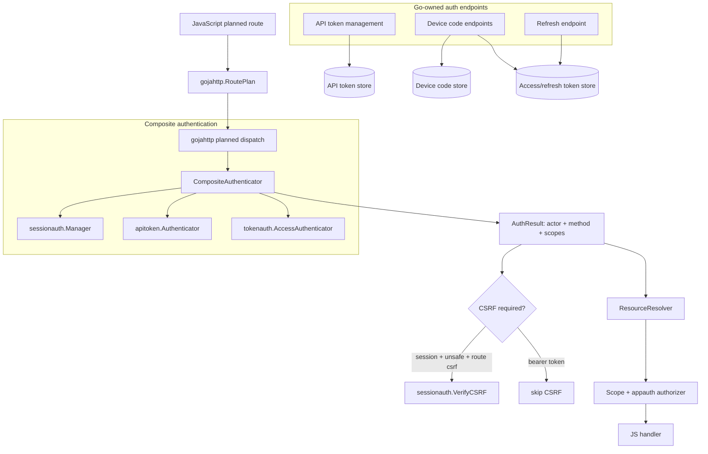

# Token and Device Login Programmatic API Auth Implementation Guide

## Executive summary

PR 74 gives the project the right security foundation for authenticated programmatic REST access: JavaScript declares route intent, while Go owns authentication, CSRF verification, resource resolution, authorization, and audit. The next step should not be to let JavaScript parse bearer tokens or device codes. The next step should be to add Go-owned token services that produce the same `gojahttp.Actor` shape already used by planned routes.

This guide proposes three credential families:

1. **Browser sessions** — already implemented by `sessionauth.Manager`; used by interactive browsers and protected by cookies plus CSRF on unsafe routes.
2. **Personal/service API tokens** — stable bearer credentials for scripts, CI jobs, and service accounts. They are hashed at rest, scope-limited, revocable, and usually do **not** use refresh tokens.
3. **OAuth-style access + refresh tokens** — short-lived access tokens and rotating refresh tokens for device login, CLIs, native apps, and long-running agents that should not store permanent PATs.

Device login should issue the second token family: a short-lived access token plus a rotating refresh token after the user approves a device code in an authenticated browser session. Programmatic REST calls should present only access tokens or API tokens to planned routes. Refresh tokens should only be accepted by Go-owned refresh endpoints.

The key architecture decision is to introduce an explicit authentication result, then route all credential types through a composite authenticator:

```go
type AuthResult struct {
    Actor        *Actor
    Method       AuthMethod // session, api-token, access-token, device-token
    CredentialID string
    Scopes       []string
    CSRFRequired bool
}
```

That allows `planned_dispatch.go` to keep the current fail-closed route pipeline while making CSRF conditional on the credential method. Cookie-backed browser sessions require CSRF. Authorization-header bearer tokens do not.

## Goals

1. Allow scripts, CLIs, devices, and service integrations to call the same planned REST routes as browsers.
2. Preserve the existing route declaration model: JavaScript declares `auth`, `resource`, `allow`, `csrf`, and `handle`; Go enforces.
3. Add first-class API-token support for simple automation.
4. Add access-token/refresh-token support for device login and OAuth-style clients.
5. Add device authorization flow endpoints similar to RFC 8628.
6. Keep refresh tokens out of JavaScript route handlers.
7. Keep raw tokens out of persistent storage and audit logs.
8. Extend generated-host auth config/stores so examples and generated runtimes can opt in.
9. Provide memory + SQL store contracts for all new token/device state.

## Non-goals

1. Do not implement a full OAuth authorization server in the first phase.
2. Do not make JavaScript responsible for verifying bearer tokens.
3. Do not use refresh tokens for personal API tokens in the first phase.
4. Do not expose Keycloak refresh tokens to JavaScript or browser-visible APIs.
5. Do not replace `appauth.Authorizer` with a full policy engine yet.
6. Do not add JWT signing until there is a concrete need for stateless tokens. Opaque tokens are easier to revoke and audit.

## Current-state architecture

The current auth stack introduced by PR 74 has five important seams.

### Planned route contracts

`pkg/gojahttp/auth_plan.go` defines `RoutePlan`, `AuthOptions`, and the current interfaces:

```go
type AuthOptions struct {
    Authenticator Authenticator
    Resources     ResourceResolver
    Authorizer    Authorizer
    CSRF          CSRFProtector
    Audit         AuditSink
}

type Authenticator interface {
    Authenticate(ctx context.Context, req *http.Request, session *SessionDTO, spec SecuritySpec) (*Actor, error)
}
```

That interface returns only an actor. It does not describe how the actor authenticated. Programmatic access needs to know the method because CSRF applies to cookie sessions but not to bearer tokens.

### Planned dispatch

`pkg/gojahttp/planned_dispatch.go` currently performs these steps for user routes:

1. Authenticate actor through `h.auth.Authenticator`.
2. If `.csrf()` and unsafe method, call `h.auth.CSRF.VerifyCSRF`.
3. Resolve resources.
4. Authorize action.
5. Invoke JS handler.
6. Record audit events.

This is the right place to install method-aware auth. The request should still fail before resource resolution and before JS handler execution if authentication fails.

### Express builders

`modules/express/auth_builders.go` intentionally makes JS declare security intent before `.handle(...)` is available. That should remain true. Programmatic auth can initially work without JS API changes because API tokens and device access tokens still authenticate as a user/service actor for `.auth(express.user().required())` routes.

Later, builder sugar can express route-level credential restrictions:

```js
.auth(express.anyOf(express.user().required(), express.apiToken().required()))
.auth(express.programmatic().required())
.auth(express.serviceAccount().required())
```

But that is not required for the first implementation.

### Browser sessions and CSRF

`pkg/gojahttp/auth/sessionauth/sessionauth.go` implements `Authenticator` and `CSRFProtector`. It creates server-side sessions, sets cookies, authenticates cookies, and checks `X-CSRF-Token` against session state.

Browser sessions and bearer credentials should coexist, but their CSRF behavior differs:

- Cookie/session auth: CSRF required when the route says `.csrf()` and method is unsafe.
- Authorization header bearer auth: CSRF not required, because browsers do not attach arbitrary bearer tokens automatically cross-site.

### Generated-host auth

`pkg/xgoja/hostauth` currently builds session, audit, appauth, and capability stores and maps them into `gojahttp.AuthOptions`. This should become the generated-host home for token/device stores and services:

```go
type StoreBundle struct {
    Session    sessionauth.Store
    Audit      audit.Store
    AppAuth    AppAuthStores
    Capability capability.Store

    APITokens     apitoken.Store
    OAuthTokens   tokenauth.Store
    DeviceCodes   deviceauth.Store
}
```

## Proposed architecture



## Credential taxonomy

| Credential | Primary caller | Sent to planned routes? | Refreshes? | Storage | Revocation |
| --- | --- | --- | --- | --- | --- |
| Session cookie | Browser | Yes | Idle/absolute session extension | server-side session store | revoke session |
| CSRF token | Browser | Header on unsafe session-auth routes | New session/rotation | session store | session revoke |
| Personal API token | Script/CI/user automation | Yes, `Authorization: Bearer` | No | hash only | revoke token |
| Service API token | machine/service account | Yes, `Authorization: Bearer` | No | hash only | revoke token |
| Access token | Device/CLI/native app | Yes, `Authorization: Bearer` | Via refresh token | hash only | revoke token/family |
| Refresh token | Device/CLI/native app | **No** | Rotates itself | hash only | revoke token/family |
| Device code | headless device | No | N/A | hash only | expire/deny/approve |
| User code | user browser input | No | N/A | hash only | expire/deny/approve |

## New package 1: `pkg/gojahttp/auth/apitoken`

### Purpose

`apitoken` is for personal access tokens and service tokens. These are long-lived or bounded-lived bearer credentials for automation. They should be simple, revocable, scope-limited, and easy to audit.

Do not overload the existing `capability` package for this. `capability` is designed for narrow delegation flows such as invites, password reset, email verification, and one-time redemption. API tokens need last-used tracking, prefix lookup, stable subject ownership, optional service-account identity, and route authorization scopes.

### Token format

Use an opaque token with a lookup prefix and a secret portion:

```text
ggj_pat_<publicPrefix>_<secret>
ggj_sat_<publicPrefix>_<secret>
```

Where:

- `ggj` identifies the project/product.
- `pat` means personal access token.
- `sat` means service account token.
- `publicPrefix` is stored in plaintext for lookup and display.
- `secret` is random and never stored.

Example generation:

```go
func NewRawToken(kind TokenKind) (RawToken, error) {
    public := randomBase32(10)
    secret := randomBase64URL(32)
    return RawToken{
        Prefix: fmt.Sprintf("ggj_%s_%s", kindPrefix(kind), public),
        Secret: secret,
        Full:   fmt.Sprintf("ggj_%s_%s_%s", kindPrefix(kind), public, secret),
    }, nil
}
```

### Data model

```go
package apitoken

type Kind string

const (
    KindPersonal Kind = "personal"
    KindService  Kind = "service"
)

type Token struct {
    ID          string
    Kind        Kind
    Name        string
    Prefix      string
    Hash        []byte
    SubjectID   string
    SubjectKind string // user, service-account
    TenantIDs   []string
    Scopes      []string
    ExpiresAt   time.Time
    RevokedAt   *time.Time
    LastUsedAt  *time.Time
    CreatedBy   string
    CreatedAt   time.Time
}

type Store interface {
    Create(ctx context.Context, token Token) error
    ByPrefix(ctx context.Context, prefix string) (*Token, error)
    ByID(ctx context.Context, id string) (*Token, error)
    ListBySubject(ctx context.Context, subjectKind, subjectID string) ([]Token, error)
    Touch(ctx context.Context, id string, now time.Time) error
    Revoke(ctx context.Context, id string, now time.Time) error
}
```

### Service API

```go
type IssueSpec struct {
    Kind        Kind
    Name        string
    SubjectID   string
    SubjectKind string
    TenantIDs   []string
    Scopes      []string
    ExpiresAt   time.Time
    TTL         time.Duration
    CreatedBy   string
}

type IssueResult struct {
    Token Token  // redacted; Hash nil
    Raw   string // shown once
}

type Service struct {
    Store Store
    Audit gojahttp.AuditSink
    Now   func() time.Time
}

func (s Service) Issue(ctx context.Context, spec IssueSpec) (IssueResult, error)
func (s Service) Authenticate(ctx context.Context, raw string) (*gojahttp.Actor, *Token, error)
func (s Service) Revoke(ctx context.Context, id string) error
func (s Service) List(ctx context.Context, subjectKind, subjectID string) ([]Token, error)
```

### Authenticator

```go
type Authenticator struct {
    Service Service
    TouchPolicy TouchPolicy // rate-limit LastUsedAt writes
}

func (a Authenticator) AuthenticateBearer(ctx context.Context, raw string) (gojahttp.AuthResult, error) {
    actor, token, err := a.Service.Authenticate(ctx, raw)
    if err != nil {
        return gojahttp.AuthResult{}, gojahttp.ErrUnauthenticated
    }
    _ = a.TouchPolicy.TouchMaybe(ctx, a.Service.Store, token.ID)
    return gojahttp.AuthResult{
        Actor:        actor,
        Method:       gojahttp.AuthMethodAPIToken,
        CredentialID: token.ID,
        Scopes:       append([]string(nil), token.Scopes...),
        CSRFRequired: false,
    }, nil
}
```

### Audit events

- `api_token.issued`
- `api_token.used`
- `api_token.denied`
- `api_token.revoked`

Audit attributes should include token ID/prefix/kind/subject/scope count, but never raw token material or token hash.

## New package 2: `pkg/gojahttp/auth/tokenauth`

### Purpose

`tokenauth` provides short-lived access tokens and rotating refresh tokens for device login and OAuth-style programmatic clients.

Access tokens authenticate planned routes. Refresh tokens only call Go-owned refresh/revoke endpoints.

### Why opaque tokens instead of JWTs first

Opaque tokens are the safer first implementation because:

1. Revocation is immediate and simple.
2. Token reuse detection is straightforward.
3. Scopes and subject state can be changed server-side without waiting for JWT expiry.
4. The project already has SQL/memory store patterns.
5. There is no signing-key lifecycle to design yet.

JWTs can be added later if there is a real multi-service verification need.

### Data model

```go
package tokenauth

type TokenKind string

const (
    TokenKindAccess  TokenKind = "access"
    TokenKindRefresh TokenKind = "refresh"
)

type Token struct {
    ID          string
    FamilyID    string
    Kind        TokenKind
    Prefix      string
    Hash        []byte
    SubjectID   string
    SubjectKind string // user, device, service-account
    ClientID    string
    DeviceID    string
    TenantIDs   []string
    Scopes      []string
    ExpiresAt   time.Time
    UsedAt      *time.Time // refresh only
    RevokedAt   *time.Time
    ReplacedBy  string
    CreatedAt   time.Time
    LastUsedAt  *time.Time // access only, optional/rate-limited
}

type Store interface {
    Create(ctx context.Context, token Token) error
    ByPrefix(ctx context.Context, prefix string) (*Token, error)
    ByID(ctx context.Context, id string) (*Token, error)
    MarkRefreshUsed(ctx context.Context, oldID, newID string, usedAt time.Time) error
    TouchAccess(ctx context.Context, id string, now time.Time) error
    Revoke(ctx context.Context, id string, now time.Time) error
    RevokeFamily(ctx context.Context, familyID string, now time.Time) error
    ListBySubject(ctx context.Context, subjectKind, subjectID string) ([]Token, error)
}
```

### Token issuance

```go
type IssuePairSpec struct {
    SubjectID   string
    SubjectKind string
    ClientID    string
    DeviceID    string
    TenantIDs   []string
    Scopes      []string
    AccessTTL   time.Duration
    RefreshTTL  time.Duration
}

type Pair struct {
    AccessToken  string
    RefreshToken string
    TokenType    string // Bearer
    ExpiresIn    int
    Scope        string
}

func (s Service) IssuePair(ctx context.Context, spec IssuePairSpec) (Pair, error)
```

### Refresh rotation

Every refresh must rotate refresh tokens. A refresh token is single-use.

```go
func (s Service) Refresh(ctx context.Context, rawRefresh string) (Pair, error) {
    old, err := s.loadRefresh(rawRefresh)
    if err != nil { return Pair{}, ErrInvalidRefreshToken }

    now := s.now()
    if old.RevokedAt != nil || now.After(old.ExpiresAt) {
        return Pair{}, ErrInvalidRefreshToken
    }
    if old.UsedAt != nil {
        _ = s.Store.RevokeFamily(ctx, old.FamilyID, now)
        s.auditReuse(ctx, old)
        return Pair{}, ErrRefreshTokenReuse
    }

    nextRefresh := s.newRefreshFrom(old, now)
    access := s.newAccessFrom(old, now)

    // Must be atomic in SQL stores.
    if err := s.Store.RotateRefresh(ctx, old.ID, nextRefresh, access, now); err != nil {
        return Pair{}, err
    }
    return Pair{AccessToken: access.Raw, RefreshToken: nextRefresh.Raw, TokenType: "Bearer", ExpiresIn: int(s.AccessTTL.Seconds())}, nil
}
```

### Reuse detection

If a previously used refresh token appears again, treat it as possible theft. Revoke the entire token family.

```go
if token.UsedAt != nil {
    _ = store.RevokeFamily(ctx, token.FamilyID, now)
    return ErrRefreshTokenReuse
}
```

This protects against attacker/client races. The legitimate client may lose its current refresh token, but that is the correct security tradeoff.

### Authenticator for planned routes

```go
type AccessAuthenticator struct {
    Service Service
}

func (a AccessAuthenticator) AuthenticateBearer(ctx context.Context, raw string) (gojahttp.AuthResult, error) {
    token, err := a.Service.AuthenticateAccess(ctx, raw)
    if err != nil { return gojahttp.AuthResult{}, gojahttp.ErrUnauthenticated }
    return gojahttp.AuthResult{
        Actor: &gojahttp.Actor{
            ID: token.SubjectID,
            Kind: token.SubjectKind,
            TenantIDs: append([]string(nil), token.TenantIDs...),
            Claims: map[string]any{
                "authMethod": "access-token",
                "tokenId": token.ID,
                "clientId": token.ClientID,
                "deviceId": token.DeviceID,
                "scopes": append([]string(nil), token.Scopes...),
            },
        },
        Method: gojahttp.AuthMethodAccessToken,
        CredentialID: token.ID,
        Scopes: append([]string(nil), token.Scopes...),
        CSRFRequired: false,
    }, nil
}
```

A refresh token must never pass this authenticator. It should return unauthenticated if the token kind is refresh.

## New package 3: `pkg/gojahttp/auth/deviceauth`

### Purpose

`deviceauth` implements a first-party device authorization flow for headless CLIs/devices. It should be close to RFC 8628 semantics without pretending to be a complete OAuth server.

### Flow

1. Device requests a code:

```http
POST /auth/device/code
Content-Type: application/json

{
  "client_id": "xgoja-cli",
  "scope": "project.read project.write"
}
```

2. Server returns:

```json
{
  "device_code": "opaque-device-code",
  "user_code": "ABCD-EFGH",
  "verification_uri": "https://app.example/auth/device",
  "verification_uri_complete": "https://app.example/auth/device?user_code=ABCD-EFGH",
  "expires_in": 600,
  "interval": 5
}
```

3. User opens verification URI in a browser and approves while authenticated by session cookie.
4. Device polls:

```http
POST /auth/device/token
Content-Type: application/json

{
  "device_code": "opaque-device-code"
}
```

5. Pending response:

```json
{
  "error": "authorization_pending"
}
```

6. Approved response:

```json
{
  "access_token": "...",
  "refresh_token": "...",
  "token_type": "Bearer",
  "expires_in": 900,
  "scope": "project.read project.write"
}
```

### Data model

```go
package deviceauth

type DeviceCode struct {
    ID             string
    DeviceCodeHash []byte
    UserCodeHash   []byte
    UserCodeDisplay string // may be stored if acceptable; otherwise derive separately
    ClientID       string
    RequestedScopes []string
    ApprovedScopes  []string
    SubjectID      string
    SubjectKind    string
    TenantIDs      []string
    ApprovedAt     *time.Time
    DeniedAt       *time.Time
    ExpiresAt      time.Time
    LastPollAt     *time.Time
    PollInterval   time.Duration
    CreatedAt      time.Time
}

type Store interface {
    Create(ctx context.Context, code DeviceCode) error
    ByDeviceCode(ctx context.Context, hash []byte) (*DeviceCode, error)
    ByUserCode(ctx context.Context, hash []byte) (*DeviceCode, error)
    Approve(ctx context.Context, id string, approval Approval) error
    Deny(ctx context.Context, id string, deniedAt time.Time) error
    MarkPolled(ctx context.Context, id string, at time.Time) error
    Consume(ctx context.Context, id string, at time.Time) error
}
```

### Service API

```go
type Service struct {
    Store       Store
    Tokens      tokenauth.Service
    Audit       gojahttp.AuditSink
    Now         func() time.Time
    CodeTTL     time.Duration
    PollInterval time.Duration
}

func (s Service) Start(ctx context.Context, req StartRequest) (StartResponse, error)
func (s Service) Approve(ctx context.Context, userActor *gojahttp.Actor, userCode string, scopes []string) error
func (s Service) Deny(ctx context.Context, userActor *gojahttp.Actor, userCode string) error
func (s Service) Poll(ctx context.Context, deviceCode string) (tokenauth.Pair, PollStatus, error)
```

### Poll status mapping

| Condition | Response |
| --- | --- |
| unknown device code | `invalid_grant` |
| expired | `expired_token` |
| denied | `access_denied` |
| not approved | `authorization_pending` |
| polling too fast | `slow_down` |
| approved and not consumed | token pair |
| already consumed | `invalid_grant` |

### Device code endpoints

These should be Go-owned, installed by `devauth`, `keycloakauth` examples, and generated-host auth when enabled.

```go
func (h Handlers) DeviceCodeHandler() http.Handler
func (h Handlers) DeviceVerifyHandler() http.Handler // GET form + POST approve/deny
func (h Handlers) DeviceTokenHandler() http.Handler
```

The verify POST must require a browser session and CSRF. It should use the same appauth authorizer if approval requires a scope/tenant choice.

## Change to `gojahttp`: authentication result

### Problem with current interface

Current `Authenticator` returns only `*Actor`. Dispatch cannot distinguish session-cookie authentication from bearer-token authentication. Therefore it cannot correctly decide CSRF behavior for routes that accept both.

### Recommended compatibility path

Add a new optional interface while preserving the old one:

```go
type AuthMethod string

const (
    AuthMethodSession     AuthMethod = "session"
    AuthMethodAPIToken    AuthMethod = "api-token"
    AuthMethodAccessToken AuthMethod = "access-token"
)

type AuthResult struct {
    Actor        *Actor
    Method       AuthMethod
    CredentialID string
    Scopes       []string
    CSRFRequired bool
    Claims       map[string]any
}

type ResultAuthenticator interface {
    AuthenticateResult(ctx context.Context, req *http.Request, session *SessionDTO, spec SecuritySpec) (AuthResult, error)
}
```

Then dispatch does:

```go
func authenticateRoute(...) (AuthResult, error) {
    if ar, ok := h.auth.Authenticator.(gojahttp.ResultAuthenticator); ok {
        return ar.AuthenticateResult(ctx, req, session, spec)
    }
    actor, err := h.auth.Authenticator.Authenticate(ctx, req, session, spec)
    if err != nil { return AuthResult{}, err }
    return AuthResult{Actor: actor, Method: AuthMethodSession, CSRFRequired: true}, nil
}
```

This avoids breaking all existing authenticators in the first PR.

### Dispatch changes

`buildSecureEnvelope` should store auth result:

```go
type secureEnvelope struct {
    Plan       RoutePlan
    Request    *RequestDTO
    Actor      *Actor
    Auth       AuthResult
    Resources  map[string]*ResourceRef
    Body       any
}
```

CSRF check becomes:

```go
if plan.CSRF.Required && isUnsafeMethod(httpReq.Method) && authResult.CSRFRequired {
    if h.auth.CSRF == nil { fail500 }
    if err := h.auth.CSRF.VerifyCSRF(...); err != nil { fail403 }
}
```

JS context can expose non-secret auth metadata:

```js
ctx.auth = {
  method: "api-token",
  credentialId: "tok_...",
  scopes: ["project.read"]
}
```

Do not expose raw token strings.

## Composite authenticator

Add a package or type near `gojahttp/auth` or in generated host auth:

```go
type BearerAuthenticator interface {
    AuthenticateBearer(ctx context.Context, raw string, spec gojahttp.SecuritySpec) (gojahttp.AuthResult, error)
}

type CompositeAuthenticator struct {
    Session     *sessionauth.Manager
    APITokens   BearerAuthenticator
    AccessToken BearerAuthenticator
}

func (a CompositeAuthenticator) AuthenticateResult(ctx context.Context, r *http.Request, session *gojahttp.SessionDTO, spec gojahttp.SecuritySpec) (gojahttp.AuthResult, error) {
    if raw := bearerToken(r); raw != "" {
        if a.AccessToken != nil {
            if result, err := a.AccessToken.AuthenticateBearer(ctx, raw, spec); err == nil {
                return result, nil
            }
        }
        if a.APITokens != nil {
            if result, err := a.APITokens.AuthenticateBearer(ctx, raw, spec); err == nil {
                return result, nil
            }
        }
        return gojahttp.AuthResult{}, gojahttp.ErrUnauthenticated
    }

    if a.Session == nil {
        return gojahttp.AuthResult{}, fmt.Errorf("session authenticator is required")
    }
    actor, err := a.Session.Authenticate(ctx, r, session, spec)
    if err != nil { return gojahttp.AuthResult{}, err }
    return gojahttp.AuthResult{Actor: actor, Method: gojahttp.AuthMethodSession, CSRFRequired: true}, nil
}
```

Bearer parsing must be strict:

```go
func bearerToken(r *http.Request) string {
    h := strings.TrimSpace(r.Header.Get("Authorization"))
    parts := strings.Fields(h)
    if len(parts) != 2 || !strings.EqualFold(parts[0], "Bearer") {
        return ""
    }
    return parts[1]
}
```

## Authorization and scopes

### Keep `.allow(action)` as the common permission language

JavaScript should continue to declare actions:

```js
app.patch("/orgs/:orgID/projects/:projectID")
  .auth(express.user().required())
  .resource(express.resource("project").idFromParam("projectID").tenantFromParam("orgID"))
  .csrf()
  .allow("project.update")
  .handle((ctx, res) => res.json({ ok: true }))
```

The same route can accept browser sessions, API tokens, or access tokens if the host composite authenticator and authorizer allow them.

### Scope authorizer wrapper

Wrap the current app authorizer with scope checks for token methods:

```go
type ScopeAuthorizer struct {
    Next gojahttp.Authorizer
}

func (a ScopeAuthorizer) Authorize(ctx context.Context, req gojahttp.AuthorizationRequest) (gojahttp.AuthorizationDecision, error) {
    if isTokenActor(req.Actor) {
        if !scopeAllows(actorScopes(req.Actor), req.Action, req.Resource) {
            return gojahttp.AuthorizationDecision{Allowed: false, Reason: "token scope does not allow action"}, nil
        }
    }
    if a.Next != nil {
        return a.Next.Authorize(ctx, req)
    }
    return gojahttp.AuthorizationDecision{Allowed: true}, nil
}
```

Important: token scope approval should usually be an additional constraint, not a replacement for app authorization. For example, a user token with `project.update` scope should still be limited to projects the user can update.

### Scope matching v1

Start with exact scopes and a small wildcard:

- `user.self.read`
- `project.read`
- `project.update`
- `org.member.invite`
- `*`

Optional tenant scoping can be encoded as:

```text
tenant:o1:project.read
tenant:o1:project.update
```

Scope matching:

```go
func scopeAllows(scopes []string, action string, resource *gojahttp.ResourceRef) bool {
    if contains(scopes, "*") || contains(scopes, action) {
        return true
    }
    if resource != nil && resource.TenantID != "" {
        if contains(scopes, "tenant:"+resource.TenantID+":"+action) {
            return true
        }
    }
    return false
}
```

Do not implement regex scopes in v1.

## Go-owned endpoint set

### API token management endpoints

These endpoints are for browser-authenticated users/admins to create and revoke PATs/service tokens. They should be mounted by Go, not JS, because they handle raw token material.

```http
GET    /auth/api-tokens
POST   /auth/api-tokens
DELETE /auth/api-tokens/{id}
```

`POST /auth/api-tokens` request:

```json
{
  "name": "ci deploy",
  "kind": "personal",
  "scopes": ["project.read", "project.update"],
  "ttl": "2160h"
}
```

Response:

```json
{
  "id": "tok_...",
  "kind": "personal",
  "name": "ci deploy",
  "prefix": "ggj_pat_abcd1234",
  "token": "ggj_pat_abcd1234_SECRET_SHOWN_ONCE",
  "scopes": ["project.read", "project.update"],
  "expiresAt": "2026-09-13T12:00:00Z"
}
```

Security requirements:

- Require browser session authentication.
- Require CSRF for POST/DELETE.
- Authorize token creation/revocation against the subject and tenant.
- Return raw token once.
- Never audit raw token.

### Token refresh endpoints

```http
POST /auth/token/refresh
POST /auth/token/revoke
```

`POST /auth/token/refresh` request:

```json
{
  "refresh_token": "ggj_rt_..."
}
```

Response:

```json
{
  "access_token": "ggj_at_...",
  "refresh_token": "ggj_rt_...",
  "token_type": "Bearer",
  "expires_in": 900,
  "scope": "project.read project.update"
}
```

Rules:

- Accept refresh token only here.
- Rotate refresh token every time.
- Revoke token family on reuse.
- Do not require CSRF because this endpoint should not use cookies for refresh auth; it uses the refresh token itself.
- Apply rate limits if exposed publicly.

### Device login endpoints

```http
POST /auth/device/code
GET  /auth/device/verify
POST /auth/device/verify
POST /auth/device/token
```

Rules:

- `/auth/device/code` creates a pending device flow.
- `/auth/device/verify` GET shows approval UI for browser users.
- `/auth/device/verify` POST requires session + CSRF and approves/denies.
- `/auth/device/token` is polled by the device and returns access/refresh token after approval.

## JavaScript API design

### Minimal v1: no JS changes required

Existing route declarations can remain:

```js
app.get("/api/projects/:projectID")
  .auth(express.user().required())
  .resource(express.resource("project").idFromParam("projectID"))
  .allow("project.read")
  .handle((ctx, res) => {
    res.json({ project: ctx.resource("project"), auth: ctx.auth })
  })
```

The host decides whether sessions, API tokens, or access tokens may satisfy `user().required()`.

### Optional v2 builder additions

Add only after the backend result model is stable.

```ts
export function apiToken(): APIAuthBuilder;
export function accessToken(): APIAuthBuilder;
export function programmatic(): APIAuthBuilder;
export function anyOf(...specs: AuthSpec[]): AuthSpec;

interface APIAuthBuilder {
  required(): AuthSpec;
  scopes(...scopes: string[]): AuthSpec;
}
```

Possible usage:

```js
app.post("/api/automation/run")
  .auth(express.programmatic().required())
  .allow("automation.run")
  .handle(runAutomation)
```

Avoid making JS specify token stores, TTLs, refresh policies, or device code settings. Those belong in host config.

## Generated-host config

Extend `pkg/xgoja/hostauth.Config` with token/device sections.

```go
type Config struct {
    Mode Mode `yaml:"mode" json:"mode"`
    Session SessionConfig `yaml:"session" json:"session"`
    Stores StoresConfig `yaml:"stores" json:"stores"`

    APITokens APITokenConfig `yaml:"api-tokens" json:"api-tokens"`
    Tokens    TokenConfig    `yaml:"tokens" json:"tokens"`
    Device    DeviceConfig   `yaml:"device-login" json:"device-login"`
}

type APITokenConfig struct {
    Enabled    bool   `yaml:"enabled" json:"enabled"`
    DefaultTTL string `yaml:"default-ttl" json:"default-ttl"`
    MaxTTL     string `yaml:"max-ttl" json:"max-ttl"`
    Prefix     string `yaml:"prefix" json:"prefix"`
}

type TokenConfig struct {
    Enabled               bool   `yaml:"enabled" json:"enabled"`
    AccessTokenTTL         string `yaml:"access-token-ttl" json:"access-token-ttl"`
    RefreshTokenTTL        string `yaml:"refresh-token-ttl" json:"refresh-token-ttl"`
    RevokeFamilyOnReuse    bool   `yaml:"revoke-family-on-reuse" json:"revoke-family-on-reuse"`
}

type DeviceConfig struct {
    Enabled      bool   `yaml:"enabled" json:"enabled"`
    CodeTTL      string `yaml:"code-ttl" json:"code-ttl"`
    PollInterval string `yaml:"poll-interval" json:"poll-interval"`
    VerificationPath string `yaml:"verification-path" json:"verification-path"`
}
```

Example YAML:

```yaml
auth:
  mode: dev
  session:
    cookie:
      allow-insecure-http: true
  api-tokens:
    enabled: true
    default-ttl: 2160h
    max-ttl: 8760h
    prefix: ggj
  tokens:
    enabled: true
    access-token-ttl: 15m
    refresh-token-ttl: 720h
    revoke-family-on-reuse: true
  device-login:
    enabled: true
    code-ttl: 10m
    poll-interval: 5s
    verification-path: /auth/device/verify
  stores:
    default:
      driver: sqlite
      dsn-env: XGOJA_AUTH_SQLITE_DSN
      apply-schema: true
```

## Store and schema plan

### API tokens

SQLite/Postgres table shape:

```sql
CREATE TABLE auth_api_tokens (
    id TEXT PRIMARY KEY,
    kind TEXT NOT NULL,
    name TEXT NOT NULL DEFAULT '',
    prefix TEXT NOT NULL UNIQUE,
    token_hash BLOB_OR_BYTEA NOT NULL UNIQUE,
    subject_id TEXT NOT NULL,
    subject_kind TEXT NOT NULL,
    tenant_ids_json JSON NOT NULL DEFAULT '[]',
    scopes_json JSON NOT NULL DEFAULT '[]',
    expires_at TIMESTAMP NOT NULL,
    revoked_at TIMESTAMP NULL,
    last_used_at TIMESTAMP NULL,
    created_by TEXT NOT NULL DEFAULT '',
    created_at TIMESTAMP NOT NULL
);

CREATE INDEX idx_auth_api_tokens_subject ON auth_api_tokens(subject_kind, subject_id);
CREATE INDEX idx_auth_api_tokens_expires_at ON auth_api_tokens(expires_at);
CREATE INDEX idx_auth_api_tokens_revoked_at ON auth_api_tokens(revoked_at);
```

### Access/refresh tokens

```sql
CREATE TABLE auth_oauth_tokens (
    id TEXT PRIMARY KEY,
    family_id TEXT NOT NULL,
    kind TEXT NOT NULL,
    prefix TEXT NOT NULL UNIQUE,
    token_hash BLOB_OR_BYTEA NOT NULL UNIQUE,
    subject_id TEXT NOT NULL,
    subject_kind TEXT NOT NULL,
    client_id TEXT NOT NULL DEFAULT '',
    device_id TEXT NOT NULL DEFAULT '',
    tenant_ids_json JSON NOT NULL DEFAULT '[]',
    scopes_json JSON NOT NULL DEFAULT '[]',
    expires_at TIMESTAMP NOT NULL,
    used_at TIMESTAMP NULL,
    revoked_at TIMESTAMP NULL,
    replaced_by TEXT NOT NULL DEFAULT '',
    created_at TIMESTAMP NOT NULL,
    last_used_at TIMESTAMP NULL
);

CREATE INDEX idx_auth_oauth_tokens_family ON auth_oauth_tokens(family_id);
CREATE INDEX idx_auth_oauth_tokens_subject ON auth_oauth_tokens(subject_kind, subject_id);
CREATE INDEX idx_auth_oauth_tokens_kind ON auth_oauth_tokens(kind);
```

Refresh rotation must be transactional:

1. Select old refresh token by prefix/hash.
2. Verify it is unused and active.
3. Insert new refresh token.
4. Insert new access token.
5. Mark old refresh token used and replaced_by new refresh ID with `WHERE used_at IS NULL`.
6. Commit.

### Device codes

```sql
CREATE TABLE auth_device_codes (
    id TEXT PRIMARY KEY,
    device_code_hash BLOB_OR_BYTEA NOT NULL UNIQUE,
    user_code_hash BLOB_OR_BYTEA NOT NULL UNIQUE,
    user_code_display TEXT NOT NULL,
    client_id TEXT NOT NULL DEFAULT '',
    requested_scopes_json JSON NOT NULL DEFAULT '[]',
    approved_scopes_json JSON NOT NULL DEFAULT '[]',
    subject_id TEXT NOT NULL DEFAULT '',
    subject_kind TEXT NOT NULL DEFAULT '',
    tenant_ids_json JSON NOT NULL DEFAULT '[]',
    approved_at TIMESTAMP NULL,
    denied_at TIMESTAMP NULL,
    expires_at TIMESTAMP NOT NULL,
    last_poll_at TIMESTAMP NULL,
    poll_interval_ms INTEGER NOT NULL,
    consumed_at TIMESTAMP NULL,
    created_at TIMESTAMP NOT NULL
);

CREATE INDEX idx_auth_device_codes_expires_at ON auth_device_codes(expires_at);
CREATE INDEX idx_auth_device_codes_user_code ON auth_device_codes(user_code_hash);
```

## Hostauth integration

### Extend stores

`pkg/xgoja/hostauth/stores.go` should build new stores using the same driver inheritance and DB-handle sharing approach:

```go
type StoreBundle struct {
    Session sessionauth.Store
    Audit audit.Store
    AppAuth AppAuthStores
    Capability capability.Store
    APITokens apitoken.Store
    Tokens tokenauth.Store
    DeviceCodes deviceauth.Store
    Closers []func(context.Context) error
}
```

Use the same memory/sqlstore pattern already used by sessionauth/appauth/audit/capability.

### Extend services

`pkg/xgoja/hostauth/services.go` should expose service handles:

```go
type Services struct {
    Config ResolvedConfig
    AuthOptions gojahttp.AuthOptions

    SessionManager *sessionauth.Manager
    APITokens apitoken.Service
    Tokens tokenauth.Service
    Device deviceauth.Service

    TokenHandlers *tokenauth.Handlers
    DeviceHandlers *deviceauth.Handlers
}
```

### Build auth options

`BuildAuthOptions` should construct:

```go
composite := gojahttpauth.CompositeAuthenticator{
    Session: sessionManager,
    APITokens: apitoken.Authenticator{Service: apiTokenService},
    AccessToken: tokenauth.AccessAuthenticator{Service: tokenService},
}

options.Authenticator = composite
options.CSRF = sessionManager
options.Audit = auditSink
options.Resources = appauth.Resolver{Store: stores.AppAuth.Resources}
options.Authorizer = ScopeAuthorizer{Next: appauth.Authorizer{Memberships: stores.AppAuth.Memberships}}
```

### Mount Go-owned auth endpoints

Generated-host auth also needs a way to mount token/device handlers into the HTTP host. There are two options:

1. Extend `hostauth.Services` with a `Mount(host *gojahttp.Host)` method.
2. Teach the HTTP provider to mount standard auth handlers when `hostauth.Services` are present.

Prefer option 1 because it keeps auth endpoint ownership in hostauth:

```go
func (s *Services) MountHandlers(host *gojahttp.Host) error {
    if s.APITokenHandlers != nil {
        host.RegisterHandler("/auth/api-tokens", s.APITokenHandlers.Routes())
    }
    if s.TokenHandlers != nil {
        host.RegisterHandler("/auth/token", s.TokenHandlers.Routes())
    }
    if s.DeviceHandlers != nil {
        host.RegisterHandler("/auth/device", s.DeviceHandlers.Routes())
    }
    return nil
}
```

Call this when creating `gojahttp.NewHost(hostOptionsWithAuth(...))` in `serve.go` and in hot reload candidate host creation.

## Security invariants

1. Raw access, refresh, API, device, and user codes are never stored.
2. Refresh tokens are never accepted by planned REST routes.
3. Refresh tokens rotate on every use.
4. Reuse of an already-used refresh token revokes the family.
5. Bearer-token requests skip CSRF; cookie-session requests do not.
6. Token scopes never expand during refresh.
7. Device approval may narrow requested scopes, but not expand them beyond allowed policy.
8. Device codes and user codes expire.
9. Device polling enforces `authorization_pending` and `slow_down` semantics.
10. Token issuance/revocation is audited without raw token material.
11. API tokens and access tokens fail closed when stores are unavailable or malformed.
12. The JS route handler receives auth metadata but never raw credential material.
13. Programmatic auth still uses `.allow(action)` and resource authorization; scopes are an additional constraint.

## Implementation phases

### Phase 0: Prerequisite hardening

Before adding new credentials, fix the known PR 74 hardening issues:

1. Reject empty CSRF tokens in session validation and CSRF verification.
2. Deep-copy/freeze actor/resource claims exposed to JavaScript.
3. Decide `auth.mode=none` store validation behavior.
4. Decide session rotation missing-old-session contract.

These are not strictly required to compile token auth, but they prevent new auth modes from building on ambiguous session behavior.

### Phase 1: Auth result plumbing

Files:

- `pkg/gojahttp/auth_plan.go`
- `pkg/gojahttp/planned_dispatch.go`
- `pkg/gojahttp/planned_dispatch_test.go`

Tasks:

1. Add `AuthMethod`, `AuthResult`, and `ResultAuthenticator`.
2. Update planned dispatch to prefer `AuthenticateResult` when available.
3. Add `AuthResult` to `secureEnvelope`.
4. Expose `ctx.auth` with method, credential ID, and scopes.
5. Make CSRF conditional on `AuthResult.CSRFRequired`.
6. Add tests for session auth still requiring CSRF and bearer result skipping CSRF.

### Phase 2: `apitoken` package

Files:

- `pkg/gojahttp/auth/apitoken/apitoken.go`
- `pkg/gojahttp/auth/apitoken/apitoken_test.go`
- `pkg/gojahttp/auth/apitoken/sqlstore/{schema.go,sqlstore.go,sqlstore_test.go}`
- `pkg/gojahttp/auth/internal/apitokentest/store_contract.go`

Tasks:

1. Implement token generation and hashing.
2. Implement memory store.
3. Implement SQL store for SQLite/Postgres.
4. Add store contract tests.
5. Add issue/authenticate/revoke/list service.
6. Add audit events with raw-token redaction.

### Phase 3: `tokenauth` package

Files:

- `pkg/gojahttp/auth/tokenauth/tokenauth.go`
- `pkg/gojahttp/auth/tokenauth/tokenauth_test.go`
- `pkg/gojahttp/auth/tokenauth/sqlstore/...`
- `pkg/gojahttp/auth/internal/tokenauthtest/store_contract.go`

Tasks:

1. Implement access/refresh token generation.
2. Implement refresh rotation.
3. Implement refresh reuse family revocation.
4. Implement access-token authenticator.
5. Add memory and SQL stores.
6. Add concurrency tests for double refresh.

### Phase 4: `deviceauth` package

Files:

- `pkg/gojahttp/auth/deviceauth/deviceauth.go`
- `pkg/gojahttp/auth/deviceauth/handlers.go`
- `pkg/gojahttp/auth/deviceauth/sqlstore/...`
- `pkg/gojahttp/auth/internal/deviceauthtest/store_contract.go`

Tasks:

1. Implement device code generation.
2. Implement user code generation and normalization.
3. Implement pending/approve/deny/poll/consume service.
4. Issue `tokenauth` token pair after approval.
5. Add handlers.
6. Add tests for pending, slow_down, expired, denied, approved, consumed, and replay states.

### Phase 5: Scope-aware authorization

Files:

- `pkg/gojahttp/auth/appauth` or new `pkg/gojahttp/auth/scopeauth`
- `pkg/xgoja/hostauth/builder.go`

Tasks:

1. Implement `ScopeAuthorizer` wrapper.
2. Add exact/wildcard/tenant scope matching.
3. Ensure token scope is an additional constraint over appauth membership/role checks.
4. Add tests for insufficient scope returning 403.

### Phase 6: Generated-host config and wiring

Files:

- `pkg/xgoja/hostauth/config.go`
- `pkg/xgoja/hostauth/resolve.go`
- `pkg/xgoja/hostauth/stores.go`
- `pkg/xgoja/hostauth/builder.go`
- `pkg/xgoja/hostauth/services.go`
- `pkg/xgoja/providers/http/serve.go`

Tasks:

1. Add config structs and resolved structs.
2. Build stores only when feature sections are enabled.
3. Build services and composite authenticator.
4. Mount token/device handlers onto generated hosts.
5. Preserve lazy construction during command execution.
6. Ensure hot reload shares token stores/services the same way it shares auth services now.

### Phase 7: Examples and docs

Add examples:

- `examples/xgoja/22-generated-host-api-tokens`
- `examples/xgoja/23-device-login-api-access`

Docs:

- `pkg/doc/32-programmatic-api-auth.md`
- `pkg/doc/33-device-login.md`
- Update `cmd/xgoja/doc/17-xgoja-v2-reference.md` config sections.

Example smoke flow:

```bash
# Start host.
go run ./examples/xgoja/22-generated-host-api-tokens/cmd/host serve sites demo --http-listen 127.0.0.1:0

# Browser/dev login gets session + csrf.
# POST /auth/api-tokens creates token.
# curl -H "Authorization: Bearer $TOKEN" /api/projects/p1 returns 200.
# curl without token returns 401.
# token missing scope returns 403.
```

Device smoke:

```bash
# Device requests code.
# Browser/dev session approves user_code.
# Device polls and receives access/refresh.
# Access token calls planned route.
# Refresh token rotates.
# Old refresh reuse revokes family.
```

## Testing strategy

### Unit tests

- Token generation includes expected prefix and entropy length.
- Hash comparison uses constant-time comparison.
- Empty/malformed token strings are rejected.
- API token service never returns raw token except issue result.
- Refresh tokens rotate and old refresh cannot be used again.
- Reuse detection revokes family.
- Device code poll states map to expected errors.

### Store contract tests

For memory, SQLite, and Postgres-compatible SQL stores:

- Create/get clone isolation.
- List by subject.
- Revoke idempotency rules.
- Prefix lookup.
- Expiry fields round-trip.
- Scopes/tenant IDs JSON round-trip.
- Transactional refresh rotation.
- Device code approve/consume is atomic.

### Planned-route integration tests

- Session-auth planned route still works.
- API token authenticates planned route.
- Access token authenticates planned route.
- Refresh token cannot authenticate planned route.
- Bearer auth skips CSRF on unsafe route with `.csrf()`.
- Cookie auth still requires CSRF on the same route.
- Insufficient token scope returns 403.
- Resource tenant scope mismatch returns 403/404 as intended.

### Generated-host tests

- `BuildHostAuthServices` builds token/device stores when enabled.
- `BuildHostAuthServices` does not build token/device stores when disabled.
- `serve` installs token/device handlers.
- Hot reload reuses shared token/device services.
- SQLite generated-host smoke creates all schemas and can authenticate bearer calls.

### Security tests

- Raw tokens do not appear in audit records.
- Raw tokens do not appear in logs from failed auth.
- Device `user_code` brute force gets rate-limited or at least expires quickly.
- Refresh token replay revokes family.
- Scope refresh cannot expand scopes.

## Operational considerations

### Token TTL recommendations

- Access token TTL: 10-15 minutes.
- Refresh token TTL: 30 days for device/CLI by default.
- Personal API token TTL: default 90 days, max 1 year, optionally never for local dev only.
- Device code TTL: 10 minutes.
- Device poll interval: 5 seconds.

### Rate limiting

Minimum rate limits:

- `/auth/device/token` by device code prefix/IP.
- `/auth/device/verify` by user code/IP/session.
- `/auth/token/refresh` by token prefix/IP.
- Bearer authentication failures by IP/token prefix.

Rate limiting can be an interface in v1 and a no-op default in examples:

```go
type RateLimiter interface {
    Allow(ctx context.Context, key string) error
}
```

### Audit and observability

Audit events:

- `api_token.issued`
- `api_token.used`
- `api_token.revoked`
- `access_token.used`
- `refresh_token.rotated`
- `refresh_token.reuse_detected`
- `refresh_token.family_revoked`
- `device_code.created`
- `device_code.approved`
- `device_code.denied`
- `device_code.polled`
- `device_code.exchanged`

Metrics counters:

- auth successes by method
- auth failures by method/reason
- refresh reuse detected
- device code pending/approved/expired
- token revocations

## Decision records

### Decision: Keep JavaScript declaration-only for token auth

- **Context:** PR 74 intentionally makes JS declare route intent while Go enforces auth.
- **Options considered:** Let JS parse/verify tokens; add Go-owned token services behind existing route plans; add a full OAuth server layer first.
- **Decision:** Add Go-owned token services and keep JS route declarations focused on security intent.
- **Rationale:** This preserves the existing security boundary and avoids exposing raw credential handling to arbitrary JS handlers.
- **Consequences:** Initial JS API changes can be minimal; host config and Go packages carry most implementation work.
- **Status:** proposed

### Decision: Add `AuthResult` instead of overloading `Actor.Claims`

- **Context:** Dispatch needs to know whether CSRF applies and which credential authenticated the request.
- **Options considered:** Put `authMethod` only in `Actor.Claims`; add new `AuthResult`; create separate route types for API routes.
- **Decision:** Add `AuthResult` and optional `ResultAuthenticator` compatibility interface.
- **Rationale:** Method, credential ID, scopes, and CSRF behavior are authentication metadata, not application claims.
- **Consequences:** Planned dispatch changes are required, but existing authenticators can keep working through adapter fallback.
- **Status:** proposed

### Decision: Opaque tokens before JWTs

- **Context:** Programmatic access needs revocation, refresh rotation, and device login.
- **Options considered:** Opaque random tokens; signed JWT access tokens; external OAuth-only.
- **Decision:** Start with opaque tokens stored by hash.
- **Rationale:** Opaque tokens simplify revocation, reuse detection, and auditing, and match existing store patterns.
- **Consequences:** Every planned-route bearer auth requires a store lookup. This is acceptable for v1 and can be optimized later.
- **Status:** proposed

### Decision: PATs do not use refresh tokens

- **Context:** Users asked for API tokens and refresh-token support.
- **Options considered:** Give every API token a refresh token; keep PATs directly revocable; use access/refresh only for device/OAuth-style clients.
- **Decision:** PAT/API tokens do not refresh. Device/OAuth clients use access + rotating refresh tokens.
- **Rationale:** PATs are simple automation credentials. Refresh tokens add complexity and replay risk without much benefit for that use case.
- **Consequences:** Users choose between simple PATs and more complex device login depending on client type.
- **Status:** proposed

### Decision: Refresh-token reuse revokes family

- **Context:** Rotating refresh tokens are vulnerable to replay if old tokens are accepted silently or only rejected individually.
- **Options considered:** Reject old token only; revoke current token only; revoke entire family.
- **Decision:** Reuse of a used refresh token revokes the entire family.
- **Rationale:** Reuse is a strong signal of token theft or client race. Family revocation is the safer default.
- **Consequences:** Some legitimate clients may need to re-authenticate after race conditions, but the security behavior is predictable.
- **Status:** proposed

## File-level implementation checklist

### New files

```text
pkg/gojahttp/auth/apitoken/apitoken.go
pkg/gojahttp/auth/apitoken/apitoken_test.go
pkg/gojahttp/auth/apitoken/sqlstore/schema.go
pkg/gojahttp/auth/apitoken/sqlstore/sqlstore.go
pkg/gojahttp/auth/apitoken/sqlstore/sqlstore_test.go
pkg/gojahttp/auth/internal/apitokentest/store_contract.go

pkg/gojahttp/auth/tokenauth/tokenauth.go
pkg/gojahttp/auth/tokenauth/handlers.go
pkg/gojahttp/auth/tokenauth/sqlstore/schema.go
pkg/gojahttp/auth/tokenauth/sqlstore/sqlstore.go
pkg/gojahttp/auth/tokenauth/sqlstore/sqlstore_test.go
pkg/gojahttp/auth/internal/tokenauthtest/store_contract.go

pkg/gojahttp/auth/deviceauth/deviceauth.go
pkg/gojahttp/auth/deviceauth/handlers.go
pkg/gojahttp/auth/deviceauth/sqlstore/schema.go
pkg/gojahttp/auth/deviceauth/sqlstore/sqlstore.go
pkg/gojahttp/auth/deviceauth/sqlstore/sqlstore_test.go
pkg/gojahttp/auth/internal/deviceauthtest/store_contract.go

pkg/gojahttp/auth/composite/composite.go
pkg/gojahttp/auth/scopeauth/scopeauth.go
```

### Modified files

```text
pkg/gojahttp/auth_plan.go
pkg/gojahttp/planned_dispatch.go
pkg/gojahttp/planned_dispatch_test.go
pkg/xgoja/hostauth/config.go
pkg/xgoja/hostauth/resolve.go
pkg/xgoja/hostauth/stores.go
pkg/xgoja/hostauth/services.go
pkg/xgoja/hostauth/builder.go
pkg/xgoja/providers/http/serve.go
modules/express/typescript.go        # only if adding JS builder sugar
modules/express/auth_builders.go     # only if adding JS builder sugar
pkg/doc/32-programmatic-api-auth.md
pkg/doc/33-device-login.md
cmd/xgoja/doc/17-xgoja-v2-reference.md
```

## Open questions

1. Should API token management endpoints be enabled by default when `api-tokens.enabled=true`, or should hosts explicitly mount them?
2. Should generated-host device login include HTML approval pages, JSON-only endpoints, or both?
3. Should token subject kinds include `service-account` in v1, or only `user` and `device`?
4. Should scope approval for device login allow users to narrow scopes interactively?
5. Should token stores support Postgres row locking for refresh rotation immediately, or rely on conditional updates plus unique IDs for v1?
6. Should refresh-token family revocation also revoke active access tokens in the family, or only block future refresh? Safer default: revoke both.
7. Should token auth support explicit audience/client IDs in v1?
8. Should access tokens be accepted over WebSocket upgrade requests if mounted handlers use the same auth stack later?

## Recommended first PR split

1. **PR A:** `AuthResult` plumbing + CSRF-by-auth-method tests.
2. **PR B:** `apitoken` package + composite bearer authentication + planned-route tests.
3. **PR C:** generated-host API-token config/stores + example smoke.
4. **PR D:** `tokenauth` access/refresh package + rotation/reuse tests.
5. **PR E:** `deviceauth` flow + generated-host device example.
6. **PR F:** JS builder sugar and docs polish, if still needed.

This split keeps the security-critical runtime semantics reviewable before adding device-flow complexity.

## Final recommendation

Build programmatic access by extending Go-owned auth services, not by adding token parsing to JavaScript. Start with `AuthResult`, API tokens, and scope-aware authorization. Then add access/refresh tokens and device login. Keep refresh tokens out of planned routes, rotate refresh tokens on every use, revoke token families on reuse, and keep `.allow(action)` as the bridge between JS route declarations and backend authorization.
