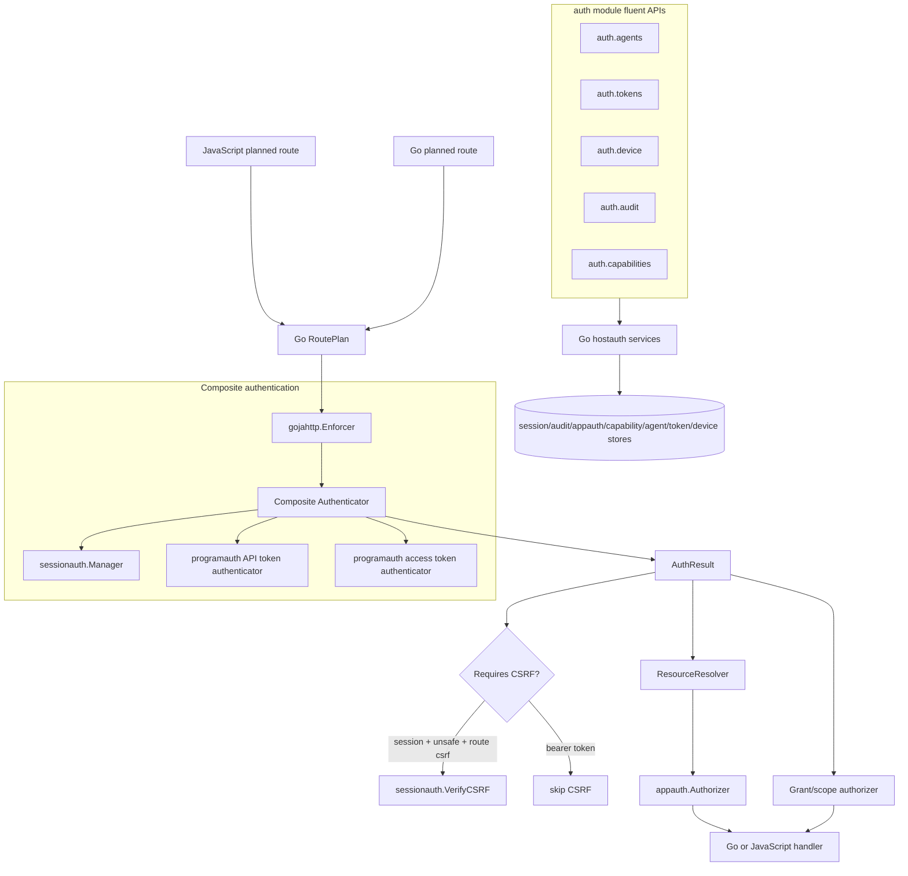

# Best-Practice Review and Opinionated JavaScript API Design for Programmatic Auth

## Executive summary

The earlier implementation guide is directionally correct: authentication should remain Go-owned, JavaScript should declare route intent rather than parse credentials, bearer credentials should skip browser CSRF checks, refresh tokens should rotate, and device login should follow RFC 8628 semantics. Those choices align with OWASP API Security, OWASP OAuth guidance, RFC 6750 bearer-token rules, RFC 8628 device authorization flow, RFC 9700 OAuth security best current practice, and NIST session-management guidance.

The plan is not yet implementation-grade for the codebase as it exists today. The current auth pipeline has moved into `gojahttp.Enforcer`, the generated-host auth module now has a good fluent-builder precedent, and the platform has a stronger concept of JavaScript-owned application routes backed by narrow Go services. A revised plan should take advantage of those changes. It should not merely bolt `apitoken`, `tokenauth`, and `deviceauth` packages onto the host. It should create a small, opinionated **programmatic agent** model that makes the safe path obvious for JavaScript authors while preserving enough flexibility for general API-token and device-login use cases.

The recommended direction is:

1. Add `AuthResult` to `gojahttp.Enforcer`, not just `planned_dispatch.go`.
2. Treat sessions, API tokens, access tokens, and device-issued tokens as credential methods that authenticate a **principal**.
3. Add an explicit first-class **Agent** principal model for automation instead of overloading users and service accounts forever.
4. Keep route authorization based on `.allow(action)` and resource resolution, but add typed credential-method restrictions only when needed.
5. Build JavaScript APIs as Go-backed fluent builders, following the current `auth.audit.query()` and `auth.capabilities.issue()` precedent.
6. Avoid object bags and untyped JavaScript maps for security-sensitive input. Use builder methods like `.tenant(id)`, `.resource(type, id)`, `.allow(action)`, `.expiresInDays(n)`, and `.run()`.
7. Store only hashes of raw credentials, return raw tokens once, redact aggressively, rate-limit auth endpoints, and model refresh-token families explicitly.
8. Make the “agent onboarding” story a product surface, not just a token table.

The high-level API should read like this:

```js
const auth = require("auth");

// Admin/browser route creates an opinionated automation identity and one token.
const issued = auth.agents.create("daily-report-bot")
  .ownedByUser(ctx.actor.id)
  .tenant(org.id)
  .allow("report.read")
  .allow("audit.read")
  .expiresInDays(90)
  .issueApiToken()
  .run();

// Protected API route accepts either a browser user session or an automation agent.
app.get("/orgs/:orgId/reports/:reportId")
  .auth(express.anyOf(express.user().required(), express.agent().required()))
  .resource(express.resource("report").idFromParam("reportId").tenantFromParam("orgId").mustExist())
  .allow("report.read")
  .audit("report.read")
  .handle((ctx, res) => {
    res.json({ report: ctx.resource("report").id, caller: ctx.auth.principalKind });
  });
```

This keeps Go in control of durable objects, token formats, hashing, policy compilation, and route enforcement. JavaScript authors still get a compact DSL for business intent.

## Scope of this review

This document reviews the existing `XGOJA-PROGRAMMATIC-AUTH-DESIGN` plan in light of:

- current code after later auth work,
- OWASP API Security Top 10 2023,
- OWASP REST, Authentication, Authorization, Session Management, and OAuth2 cheat sheets,
- RFC 6750 bearer-token usage,
- RFC 8628 device authorization grant,
- RFC 9700 OAuth 2.0 Security Best Current Practice,
- NIST SP 800-63B session-management guidance,
- GitHub fine-grained personal-access-token guidance as a practical product reference.

It does not implement code. It is a code-review/design document for an intern who needs to understand the moving parts before implementing the next PR series.

## Source corpus downloaded into this ticket

The following references were fetched into `sources/` for offline review. Most were downloaded with `defuddle parse --md`; RFC 8628 and RFC 6750 HTML pages could not be extracted by defuddle, so the RFC Editor plain-text versions were stored with a note in the file header.

| Local file | Why it matters |
| --- | --- |
| `sources/02-owasp-api-security-top-10-2023.md` | API risk overview: broken object authorization, broken authentication, excessive resource consumption. |
| `sources/03-owasp-api2-broken-authentication.md` | Authentication endpoints need stricter anti-bruteforce/rate limits than normal APIs. |
| `sources/04-owasp-api1-broken-object-level-authorization.md` | Object-level authorization must run on every object access, not only at login/token validation. |
| `sources/05-owasp-api4-unrestricted-resource-consumption.md` | API and auth endpoints require rate limits, quotas, timeouts, and resource bounds. |
| `sources/06-owasp-rest-security-cheat-sheet.md` | REST API token transport, HTTPS, status codes, and JWT/API guidance. |
| `sources/07-owasp-authentication-cheat-sheet.md` | Authentication flow hardening and error-handling guidance. |
| `sources/08-owasp-authorization-cheat-sheet.md` | Deny-by-default, least privilege, per-request authorization, and centralized checks. |
| `sources/09-owasp-session-management-cheat-sheet.md` | Cookie/session lifecycle, CSRF, token entropy, and timeout guidance. |
| `sources/10-owasp-oauth2-cheat-sheet.md` | OAuth token terms, bearer vs proof-of-possession, PKCE/state, refresh-token rotation. |
| `sources/11-ietf-rfc9700-oauth-security-bcp.md` | Current OAuth security BCP: no access tokens in URLs, sender-constrained/audience-restricted tokens, refresh-token protections. |
| `sources/12-ietf-rfc8628-device-authorization-grant.md` | Device-code flow details: user code, verification URI, polling, `authorization_pending`, `slow_down`, entropy. |
| `sources/13-ietf-rfc6750-bearer-token-usage.md` | Bearer-token semantics: possession is enough, use TLS, prefer Authorization header, short-lived and scoped tokens. |
| `sources/14-nist-sp800-63b-session-management.md` | Session cookies, CSRF, HTTPS-only sessions, and the distinction between sessions and access tokens. |
| `sources/15-github-personal-access-token-guidance.md` | Practical model for fine-grained, expiring, resource-limited personal tokens. |

## Best-practice baseline

### OWASP API Security: auth endpoints are assets

OWASP API2:2023 treats authentication endpoints and flows as first-class attack targets. The downloaded source highlights credential stuffing, brute force, and missing protections around authentication endpoints (`sources/03-owasp-api2-broken-authentication.md:28-31`). It recommends anti-brute-force controls stricter than ordinary API rate limiting (`sources/03-owasp-api2-broken-authentication.md:115-117`).

Implication for this project:

- API-token creation, device-code verification, device polling, and refresh-token rotation are not just “utility endpoints.” They are high-value auth endpoints.
- Rate limiting cannot be an optional afterthought for device login. The implementation can ship with an interface and a conservative in-memory limiter, but the contract should require a limiter in production mode.
- Device `user_code` verification must be throttled by user/session/IP/code prefix.

### OWASP API1: object authorization must remain per-request

OWASP API1:2023 says object-level authorization should be considered in every function that accesses a data source using user input (`sources/02-owasp-api-security-top-10-2023.md:13-14`) and describes object-level authorization as a code-level access-control mechanism (`sources/04-owasp-api1-broken-object-level-authorization.md:26-27`).

Implication:

- Token scopes are not a replacement for `appauth.Authorizer`.
- A token with `project.update` still needs resource resolution and membership/ownership authorization for the specific project.
- The prior plan correctly says scope is an additional constraint. This should become a hard invariant in tests.

### Bearer tokens are simple but dangerous

RFC 6750 defines bearer tokens as credentials where any party in possession can use the token without proving possession of a key (`sources/13-ietf-rfc6750-bearer-token-usage.md:152-156`). It requires TLS for bearer-token use (`sources/13-ietf-rfc6750-bearer-token-usage.md:113-117`) and says clients should use the HTTP `Authorization: Bearer` scheme (`sources/13-ietf-rfc6750-bearer-token-usage.md:240-263`). It also warns that URL tokens are logged and should not be used (`sources/13-ietf-rfc6750-bearer-token-usage.md:322-361`, `sources/13-ietf-rfc6750-bearer-token-usage.md:721-727`).

Implication:

- Planned routes should accept bearer tokens only in the `Authorization` header for v1.
- Query-string or body bearer tokens should be rejected even if RFC 6750 describes them, because this platform can choose a safer profile.
- The token parser should produce explicit `invalid_request`, `invalid_token`, and `insufficient_scope`-style outcomes for observability and client UX.

### Short-lived and scoped tokens are the safe default

RFC 6750 recommends short-lived bearer tokens and scoped tokens (`sources/13-ietf-rfc6750-bearer-token-usage.md:653-657`, `sources/13-ietf-rfc6750-bearer-token-usage.md:710-717`). OWASP OAuth2 says access tokens should be short-lived and that refresh tokens should be protected with sender-constraining or refresh-token rotation (`sources/10-owasp-oauth2-cheat-sheet.md:42-47`).

Implication:

- Device/CLI access tokens should default to 10-15 minutes, maybe up to one hour only for local/simple deployments.
- Refresh tokens should rotate on every use and be stored by hash.
- Personal API tokens should be expiration-bound by default, even if a dev mode allows “never expires.”

### Refresh-token reuse detection is not optional if rotation is used

The prior plan already recommends rotation and family revocation. That is correct. The missing implementation detail is the storage model and transaction boundary.

Implication:

- Store refresh tokens with `family_id`, `generation`, `used_at`, `revoked_at`, `replaced_by_id`, `subject_id`, `agent_id`, and `scopes`.
- Rotation must be a single database transaction: validate current token, mark it used, insert replacement, and return the replacement.
- If a used token appears again, revoke the entire family and emit a high-severity audit event.

### Device authorization needs polling and user-code protections

RFC 8628 defines `device_code`, `user_code`, `verification_uri`, optional `verification_uri_complete`, `expires_in`, and `interval` (`sources/12-ietf-rfc8628-device-authorization-grant.md:350-381`). Clients must wait the specified interval between polls and use 5 seconds by default if no interval is provided (`sources/12-ietf-rfc8628-device-authorization-grant.md:378-381`). The token endpoint returns `authorization_pending` and `slow_down`, with `slow_down` increasing polling interval (`sources/12-ietf-rfc8628-device-authorization-grant.md:595-608`). The RFC also recommends rate-limiting user-code attempts and enough entropy to make brute force impractical (`sources/12-ietf-rfc8628-device-authorization-grant.md:675-698`).

Implication:

- Device flow cannot be a generic “poll row until approved” loop. Poll state and slow-down semantics need to be represented.
- User codes should be normalized for human entry, stored only by hash, short-lived, and rate-limited.
- Approval UI should show requested agent name, requested scopes/actions, tenant/resource constraints, expiry, and the code to confirm.

### Sessions are not access tokens

NIST explicitly warns that access tokens and refresh tokens can outlive the authentication session and should not be interpreted as evidence of subscriber presence (`sources/14-nist-sp800-63b-session-management.md:130-135`). NIST also requires CSRF protection for session-bound POST/PUT content (`sources/14-nist-sp800-63b-session-management.md:92-96`) and HTTPS-only cookies (`sources/14-nist-sp800-63b-session-management.md:115-125`).

Implication:

- The prior plan is right that bearer-token requests should skip browser CSRF while cookie-session requests still require CSRF.
- Device approval is a browser session action and must require CSRF.
- Refresh-token use proves possession of a refresh credential, not active user presence. Sensitive token expansion should require a fresh browser session, not just a refresh token.

### Fine-grained PATs are a product model, not just a credential format

GitHub’s fine-grained token docs emphasize that token access is limited by the token owner’s access and further limited by scopes/permissions (`sources/15-github-personal-access-token-guidance.md:19-21`). They also expose expiration as a first-class field with bounded values (`sources/15-github-personal-access-token-guidance.md:250-251`).

Implication:

- The product surface should help users/admins create narrow, expiring tokens.
- A programmatic agent should have an owner/tenant/resource/action envelope. The token should not be a global password.
- If the owner loses membership or the agent is disabled, token requests should fail even if the token hash is valid.

## Current system orientation for a new intern

### Planned routes

The core contract is `gojahttp.RoutePlan` in `pkg/gojahttp/auth_plan.go`. It records the security declaration compiled from JavaScript or Go route builders: method, pattern, security mode, resources, action, CSRF requirement, and audit event (`pkg/gojahttp/auth_plan.go:38-49`).

Authenticated routes currently use `SecurityModeUser` (`pkg/gojahttp/auth_plan.go:16-19`) and validate that user routes declare `.allow(action)` (`pkg/gojahttp/auth_plan.go:196-205`). That is a strong design: JavaScript cannot register an authenticated planned route without an action, and authorization has a single vocabulary.

The current `AuthOptions` interface exposes five host-owned services (`pkg/gojahttp/auth_plan.go:106-112`):

- `Authenticator` authenticates the request and returns an `Actor`.
- `ResourceResolver` resolves declared resources.
- `Authorizer` checks action/resource/actor decisions.
- `CSRFProtector` verifies browser-session CSRF.
- `AuditSink` records route outcomes.

Today, `Authenticator` returns only `*Actor` (`pkg/gojahttp/auth_plan.go:114-116`). This is the seam that blocks clean programmatic auth. The enforcer cannot know whether the actor came from a session cookie, API token, access token, or future proof-of-possession token.

### Enforcer

The current enforcement path is `pkg/gojahttp/enforcer.go`. `Enforcer.Enforce` validates the route plan, creates a `SecureContext`, authenticates user routes, verifies CSRF, resolves resources, authorizes the action, and returns a secure context (`pkg/gojahttp/enforcer.go:59-157`).

Important lines:

- Authentication happens at `pkg/gojahttp/enforcer.go:76-91`.
- CSRF always runs for unsafe methods when the route declares `.csrf()` (`pkg/gojahttp/enforcer.go:96-103`).
- Resource resolution happens before authorization (`pkg/gojahttp/enforcer.go:105-136`).
- Authorization uses `AuthorizationRequest` with actor, action, first resource, and all resources (`pkg/gojahttp/enforcer.go:138-153`).

The earlier plan mentions `planned_dispatch.go` as the primary integration point. That was true when written, but later work extracted enforcement into `Enforcer`. The revised implementation must target `Enforcer` first and let `planned_dispatch.go` only project the result into JavaScript.

### JavaScript route builders

`modules/express/auth_builders.go` is the JavaScript DSL. It uses staged builders so `.handle(...)` is unavailable until the route has declared security and, for authenticated routes, policy (`modules/express/auth_builders.go:122-180`). Resource builders are Go-owned objects tracked in `builderStore`, not arbitrary JavaScript maps (`modules/express/auth_builders.go:13-16`, `modules/express/auth_builders.go:55-97`).

This is the pattern to preserve. It prevents defensive “did the JS object have the right fields?” programming because Go owns the object state.

Current example:

```js
app.patch("/orgs/:orgId/projects/:projectId")
  .auth(express.user().required())
  .resource(express.resource("project").idFromParam("projectId").tenantFromParam("orgId").mustExist())
  .csrf()
  .allow("project.update")
  .audit("project.updated")
  .handle((ctx, res) => { ... });
```

That example is present in `examples/xgoja/21-generated-host-auth/verbs/sites.js:46-60`.

### Go-native planned routes

`pkg/gojahttp/app.go` mirrors the JavaScript route builder for Go hosts. It also uses staged types (`RouteNeedsSecurity`, `RouteNeedsPolicy`, `RouteNeedsHandler`) and typed builders for user auth and resources (`pkg/gojahttp/app.go:39-63`, `pkg/gojahttp/app.go:120-190`). Programmatic auth must keep Go and JavaScript route declarations in sync.

### SecureContext and JavaScript projection

`SecureContext` currently contains plan, request, actor, resources, params, and body (`pkg/gojahttp/planned_dispatch.go:12-24`). `secureEnvelope.JSObject` exposes `ctx.request`, `ctx.actor`, `ctx.body`, `ctx.params`, `ctx.resources`, `ctx.action`, `ctx.routeName`, and `ctx.resource(name)` (`pkg/gojahttp/planned_dispatch.go:187-203`). Actor and resource maps are cloned before projection (`pkg/gojahttp/planned_dispatch.go:206-265`).

The next step should add `ctx.auth` with non-secret authentication metadata:

```js
ctx.auth.method        // "session" | "apiToken" | "accessToken"
ctx.auth.principalKind // "user" | "agent" | "service"
ctx.auth.principalId
ctx.auth.credentialId  // stable ID/prefix only; never raw token
ctx.auth.scopes        // copy of allowed action strings or typed grants
```

Do not add raw tokens, refresh-token IDs, token hashes, or secrets to `ctx.auth`.

### Generated-host services

`pkg/xgoja/hostauth/builder.go` builds generated-host auth services lazily at command execution time (`pkg/xgoja/hostauth/builder.go:36-54`). It resolves config, opens stores, builds session manager, builds auth options, and native OIDC handlers (`pkg/xgoja/hostauth/builder.go:54-104`).

`BuildAuthOptions` currently wires the session manager as the only authenticator and CSRF protector (`pkg/xgoja/hostauth/builder.go:222-242`). Programmatic auth must extend this function to build a composite authenticator.

`StoreBundle` currently includes session, audit, appauth, and capability stores (`pkg/xgoja/hostauth/stores.go:22-30`). Programmatic auth should extend it with agent, API-token, OAuth-token, and device-code stores.

### Current high-level `require("auth")` module

`pkg/xgoja/providers/hostauth/hostauth.go` is the best precedent for the desired API style. It exposes safe JavaScript access to host-owned auth services and explicitly avoids raw database handles (`pkg/xgoja/providers/hostauth/hostauth.go:30-32`). It requires hostauth services, an audit query store, and a capability store at module setup time (`pkg/xgoja/providers/hostauth/hostauth.go:54-78`).

It exposes builders:

- `auth.audit.query().tenantId(...).outcome(...).limit(...).run()` (`pkg/xgoja/providers/hostauth/hostauth.go:83-154`).
- `auth.capabilities.issue(...).resource(...).tenantId(...).ttlSeconds(...).singleUse(...).run()` (`pkg/xgoja/providers/hostauth/hostauth.go:156-230`).
- `auth.capabilities.consume(token).expectedType(...).expectedResource(...).run()` (`pkg/xgoja/providers/hostauth/hostauth.go:233-268`).

This is exactly the right shape for programmatic-auth JavaScript APIs.

## Review of the existing plan

### What is correct and should stay

The prior guide makes several good calls:

1. **Go owns credential verification.** JavaScript route handlers should never parse bearer tokens or device codes.
2. **`AuthResult` is the right missing abstraction.** Method, credential ID, scopes, and CSRF behavior are authentication metadata, not actor claims.
3. **Bearer-token CSRF differs from cookie-session CSRF.** Browser session routes still need CSRF; Authorization-header bearer requests do not.
4. **API tokens and refresh tokens are different credential families.** Personal/service API tokens should not automatically get refresh tokens.
5. **Opaque tokens are a good first implementation.** They are easy to revoke, easy to audit, and avoid premature JWT key-rotation/audience complexity.
6. **Refresh-token rotation with family revocation is required.** This aligns with OWASP OAuth2 guidance.
7. **Device flow should follow RFC 8628 state names and polling behavior.** The prior guide mentions `authorization_pending` and `slow_down`.
8. **Scopes are additional constraints.** They should not replace appauth/resource authorization.
9. **Capability tokens should not be overloaded for long-lived API access.** Capability tokens are narrow delegation credentials; programmatic agents need lifecycle, owner, last-used, scopes, and revocation UX.

### What is stale

The plan’s integration point is stale. It focuses on `planned_dispatch.go`, but current enforcement lives in `pkg/gojahttp/enforcer.go`. The correct layering is now:

```text
Router / JavaScript adapter / Go route adapter
  -> RequestDTO
  -> Enforcer.Enforce(...)
     -> authenticate with AuthResult
     -> method-aware CSRF
     -> resources
     -> app authorization + scope authorization
     -> SecureContext{Auth: AuthResult, Actor, Resources, ...}
  -> Go handler or JS SecureContext projection
```

Implementation tasks should be rewritten around `Enforcer`.

### What is under-specified

#### 1. No first-class programmatic agent model

The plan has “personal/service API tokens” but no durable `Agent` or `Client` concept. That misses the product opportunity. A platform for programmatic API access should model automation identities explicitly:

```go
type Agent struct {
    ID          string
    Name        string
    Kind        AgentKind // personal, service, device, ci, integration
    OwnerUserID string
    TenantID    string
    DisabledAt  *time.Time
    CreatedBy   string
    CreatedAt   time.Time
    Policy      GrantSet
}
```

An API token should point to an agent or user. A device login should produce a token family for an agent/client installation. This gives administrators something to list, disable, rotate, and audit.

#### 2. Scope strings need a typed internal model

The plan uses strings like `project.read`, `tenant:o1:project.read`, and wildcard `*`. That is a reasonable wire format, but Go should own a typed `GrantSet` internally.

Recommended internal model:

```go
type Grant struct {
    Action       string
    TenantID     string
    ResourceType string
    ResourceID   string
}

type GrantSet struct {
    Grants []Grant
}
```

JavaScript should build grants fluently:

```js
auth.grants()
  .allow("project.read")
  .tenant(org.id)
  .resource("project", project.id)
  .done()
```

The service can serialize grants into OAuth-style scope strings when needed, but application code should not assemble security strings by concatenation.

#### 3. API-token management endpoints are too generic

The plan lists `/auth/api-tokens` endpoints, but does not distinguish:

- Go-owned generic management endpoints,
- JavaScript-owned app routes that issue tokens after domain-specific authorization,
- generated-host defaults,
- production admin UI flows.

Recommended split:

- **Core Go services:** issue, list, revoke, rotate, authenticate.
- **Optional native handlers:** minimal RFC-like endpoints for generated hosts that opt in.
- **JavaScript builders:** app-specific token/agent issuance after route auth and appauth have already succeeded.

#### 4. Rate limiting is treated as operational, but it is security-critical

The prior guide puts rate limiting in “Operational considerations.” OWASP and RFC 8628 make it part of the authentication design. Device-code verification and polling should require a limiter interface in the service constructor. Dev mode can install `NoopLimiter`, but production `ResolveConfig` should warn or fail if device login is enabled without a limiter.

#### 5. Bearer-token transport policy should be stricter

RFC 6750 describes header/body/query mechanisms, but this project should define an opinionated profile:

- Accept only `Authorization: Bearer <token>`.
- Reject duplicate Authorization headers.
- Reject empty, whitespace-only, and malformed tokens.
- Reject query/body `access_token` for planned routes.
- Never emit raw tokens in error bodies, audit records, logs, or panic strings.

#### 6. Sender-constrained tokens are missing as an extension point

We do not need DPoP or mTLS in v1, but RFC 9700 and OWASP OAuth2 both point at sender-constrained tokens for stronger replay protection (`sources/11-ietf-rfc9700-oauth-security-bcp.md:909-917`, `sources/10-owasp-oauth2-cheat-sheet.md:46-51`). The data model should reserve fields for future binding:

```go
type CredentialBinding struct {
    Method string // none, dpop, mtls
    KeyID  string
    Thumbprint string
}
```

V1 can set `Method: "none"` and enforce only bearer semantics.

#### 7. Audit lacks auth method and credential context

`AuditEvent` has an `Attributes` map (`pkg/gojahttp/auth_plan.go:160-175`), but route audit currently does not populate method/credential attributes (`pkg/gojahttp/enforcer.go:199-228`). Once `AuthResult` exists, route audit should include redacted auth metadata:

```json
{
  "authMethod": "apiToken",
  "principalKind": "agent",
  "principalId": "agt_...",
  "credentialId": "tok_...",
  "credentialPrefix": "ggpat_abc123"
}
```

Do not include raw tokens or hashes.

#### 8. JavaScript API design is too thin

The earlier guide says “minimal v1: no JS changes required” and optional route-builder sugar later. That is acceptable for the enforcer layer, but it misses the opportunity to make programmatic agent creation easy and safe from JavaScript.

Current `auth.audit` and `auth.capabilities` prove the better pattern: high-level, bounded, fluent builders backed by Go stores. Programmatic auth should follow that immediately for token issuance/list/revoke and agent management.

## Revised conceptual model

### Terminology

Use these terms consistently:

- **Credential:** Secret presented by a caller. Examples: session cookie, API token, access token, refresh token, device code, user code.
- **Credential method:** How the credential authenticated the request: `session`, `apiToken`, `accessToken`.
- **Principal:** Entity on whose behalf the request runs: `user`, `agent`, or `service`.
- **Agent:** Durable automation identity that may be owned by a user, tenant, service, or integration.
- **Grant:** Typed permission envelope: action, optional tenant, optional resource type/id.
- **Scope string:** External/wire serialization of grants for OAuth compatibility.
- **Token family:** Refresh-token lineage where reuse of an old token revokes the family.
- **Device authorization:** Browser-assisted flow that lets a limited-input device obtain access/refresh tokens after user approval.

### Data flow diagram



### AuthResult contract

Add a non-secret auth result to `pkg/gojahttp/auth_plan.go`:

```go
type AuthMethod string

const (
    AuthMethodNone        AuthMethod = "none"
    AuthMethodSession     AuthMethod = "session"
    AuthMethodAPIToken    AuthMethod = "apiToken"
    AuthMethodAccessToken AuthMethod = "accessToken"
)

type PrincipalKind string

const (
    PrincipalKindUser    PrincipalKind = "user"
    PrincipalKindAgent   PrincipalKind = "agent"
    PrincipalKindService PrincipalKind = "service"
)

type AuthResult struct {
    Actor          *Actor
    Method         AuthMethod
    PrincipalKind  PrincipalKind
    PrincipalID    string
    CredentialID   string
    CredentialHint string // short prefix/fingerprint for audit; never raw token
    Grants         GrantSet
    Scopes         []string // derived wire/debug view
    CSRFRequired   bool
}

type ResultAuthenticator interface {
    AuthenticateResult(ctx context.Context, req *http.Request, session *SessionDTO, spec SecuritySpec) (AuthResult, error)
}
```

Compatibility rule:

```go
func authenticate(ctx context.Context, a Authenticator, req *http.Request, session *SessionDTO, spec SecuritySpec) (AuthResult, error) {
    if ra, ok := a.(ResultAuthenticator); ok {
        return ra.AuthenticateResult(ctx, req, session, spec)
    }
    actor, err := a.Authenticate(ctx, req, session, spec)
    if err != nil {
        return AuthResult{}, err
    }
    if actor == nil {
        return AuthResult{}, ErrUnauthenticated
    }
    return AuthResult{
        Actor:         actor,
        Method:        AuthMethodSession,
        PrincipalKind: PrincipalKindUser,
        PrincipalID:   actor.ID,
        CSRFRequired:  true,
    }, nil
}
```

### SecureContext extension

Add `Auth AuthResult` to `SecureContext`:

```go
type SecureContext struct {
    Plan      RoutePlan
    Request   *RequestDTO
    Auth      AuthResult
    Actor     *Actor
    Resource  *ResourceRef
    Resources map[string]*ResourceRef
    Params    map[string]string
    Body      any
}
```

Project only safe fields to JavaScript:

```js
ctx.auth = {
  method: "apiToken",
  principalKind: "agent",
  principalId: "agt_123",
  credentialId: "tok_456",
  credentialHint: "ggpat_abcd",
  scopes: ["report.read", "audit.read"]
}
```

### Composite authenticator

The composite authenticator should be simple and deterministic:

```go
type CompositeAuthenticator struct {
    Session     *sessionauth.Manager
    APITokens   APITokenAuthenticator
    AccessToken AccessTokenAuthenticator
}

func (a CompositeAuthenticator) AuthenticateResult(ctx context.Context, r *http.Request, session *SessionDTO, spec SecuritySpec) (AuthResult, error) {
    raw, ok, err := bearerFromHeader(r)
    if err != nil {
        return AuthResult{}, err
    }
    if ok {
        if a.APITokens != nil {
            if result, err := a.APITokens.AuthenticateBearer(ctx, raw, spec); err == nil {
                result.CSRFRequired = false
                return result, nil
            } else if !errors.Is(err, ErrUnauthenticated) {
                return AuthResult{}, err
            }
        }
        if a.AccessToken != nil {
            result, err := a.AccessToken.AuthenticateBearer(ctx, raw, spec)
            if err != nil {
                return AuthResult{}, err
            }
            result.CSRFRequired = false
            return result, nil
        }
        return AuthResult{}, ErrUnauthenticated
    }

    if a.Session == nil {
        return AuthResult{}, ErrUnauthenticated
    }
    actor, err := a.Session.Authenticate(ctx, r, session, spec)
    if err != nil {
        return AuthResult{}, err
    }
    return AuthResult{
        Actor:         actor,
        Method:        AuthMethodSession,
        PrincipalKind: PrincipalKindUser,
        PrincipalID:   actor.ID,
        CSRFRequired:  true,
    }, nil
}
```

Opinionated bearer parser:

```go
func bearerFromHeader(r *http.Request) (token string, ok bool, err error) {
    values := r.Header.Values("Authorization")
    if len(values) == 0 {
        return "", false, nil
    }
    if len(values) != 1 {
        return "", false, ErrInvalidAuthorizationHeader
    }
    scheme, value, found := strings.Cut(strings.TrimSpace(values[0]), " ")
    if !found || !strings.EqualFold(scheme, "Bearer") || strings.TrimSpace(value) == "" {
        return "", false, ErrInvalidAuthorizationHeader
    }
    if strings.ContainsAny(value, " \t\r\n") {
        return "", false, ErrInvalidAuthorizationHeader
    }
    return value, true, nil
}
```

Do not accept `access_token` query/body parameters.

## Opinionated JavaScript API design

### Design principles

1. **Go owns security state.** JavaScript gets builders and results, not raw store handles.
2. **No untyped object bags for security-sensitive input.** Prefer fluent methods over `{ scopes: [...], tenantId: ... }` maps.
3. **Builders are mutable Go-backed objects.** Setter methods validate and normalize input as close to Go as possible.
4. **`run()` is the only side-effect boundary.** Before `.run()`, builders only accumulate validated intent.
5. **Route policy remains declarative.** JavaScript declares `auth`, `resource`, `allow`, `csrf`, `audit`, and `rateLimit`; Go enforces before handler execution.
6. **Rate limiting is a route-plan primitive.** Treat request budgets like audit: visible in route declarations, enforced centrally, and available on public as well as authenticated routes.
7. **Generated hosts fail loudly.** If `require("auth")` asks for token services that were not configured, module setup fails.
8. **The safe path is short.** Creating an expiring, fine-grained agent token should be fewer than ten fluent calls.
9. **The escape hatch is lower-level but still typed.** Advanced code can call `auth.tokens.api.issue(...)`, but still through builders.

### Recommended module layout

Extend `require("auth")` to expose:

```js
auth.audit          // already exists
auth.capabilities   // already exists
auth.agents         // new high-level product API
auth.tokens         // lower-level token lifecycle API
auth.device         // device flow helper API, mostly for custom UIs
auth.grants         // builder for typed grants/scope sets
```

### High-level agent API

Primary path for application authors:

```js
const issued = auth.agents.create("daily-report-bot")
  .ownedByUser(ctx.actor.id)
  .tenant(org.id)
  .allow("report.read")
  .allow("audit.read")
  .expiresInDays(90)
  .issueApiToken()
  .run();

res.json({
  agentId: issued.agent.id,
  token: issued.token.value,          // only returned once
  tokenPrefix: issued.token.prefix,
  expiresAt: issued.token.expiresAt
});
```

Go-side builder state:

```go
type AgentCreateBuilder struct {
    service AgentService
    spec AgentCreateSpec
    issueToken bool
    tokenSpec APITokenIssueSpec
}
```

JavaScript methods:

| Method | Meaning |
| --- | --- |
| `.ownedByUser(userID)` | Links the agent to a human owner. |
| `.tenant(tenantID)` | Constrains default grants to a tenant. |
| `.serviceAccount()` | Creates a non-human service principal where allowed by host policy. |
| `.allow(action)` | Adds an action grant. |
| `.resource(type, id)` | Narrows the most recent or current grant builder to a resource. |
| `.expiresInDays(days)` | Sets API-token expiry; default and max enforced by Go config. |
| `.issueApiToken()` | Requests a first token to be returned once. |
| `.run()` | Creates the agent and optional token in one transaction. |

Intern note: this API intentionally avoids `auth.agents.create({ name, owner, scopes, expires })`. Object bags are easy to misuse, hard to validate incrementally, and encourage dynamic maps in security code.

### Lower-level token API

Advanced but still typed:

```js
const issued = auth.tokens.api.issue("deploy-key")
  .subjectUser(ctx.actor.id)
  .agent(agent.id)
  .tenant(org.id)
  .allow("project.deploy")
  .resource("project", project.id)
  .expiresInDays(30)
  .run();

auth.tokens.api.revoke()
  .id(tokenId)
  .reason("rotated")
  .run();

const tokens = auth.tokens.api.list()
  .agent(agent.id)
  .activeOnly()
  .limit(50)
  .run();
```

Returned token object:

```js
{
  value: "ggpat_...",     // present only immediately after issue
  id: "tok_...",
  prefix: "ggpat_abcd1234",
  kind: "apiToken",
  agentId: "agt_...",
  subjectUserId: "u1",
  expiresAt: "...",
  createdAt: "..."
}
```

List responses must not include `value` or hashes.

### Grant builder API

Reusable when an app needs to build a policy once and pass it to multiple APIs:

```js
const grants = auth.grants()
  .tenant(org.id)
  .allow("project.read")
  .allow("project.update")
  .resource("project", project.id)
  .done();

const issued = auth.tokens.api.issue("project-agent")
  .agent(agent.id)
  .grants(grants)
  .expiresInDays(30)
  .run();
```

The Go object behind `grants` should be opaque to JavaScript. It can expose `.toJSON()` for diagnostics, but services should accept the hidden Go-backed object rather than parse arbitrary JS arrays.

### Device flow API

Most hosts should mount Go-owned device endpoints, but JavaScript may need custom approval UIs. Provide a typed API:

```js
const started = auth.device.start("goja-cli")
  .tenant(org.id)
  .allow("project.read")
  .allow("project.update")
  .expiresInMinutes(10)
  .pollIntervalSeconds(5)
  .run();

// Browser approval route, already protected by session + CSRF + appauth.
auth.device.approve(body.userCode)
  .asUser(ctx.actor.id)
  .narrowTo("project.read")
  .run();
```

Device token polling should usually be native Go-owned HTTP, not JavaScript-owned, because it is a high-volume auth endpoint with strict rate-limiting and error semantics.

### Route-builder auth restrictions

Minimal v1 can keep `.auth(express.user().required())` accepting any authenticated user-like actor. But the API should soon support intentional restrictions:

```js
// Any human user session or user-owned token.
.auth(express.user().required())

// Browser-only route: needs session freshness and CSRF.
.auth(express.sessionUser().required())

// Automation-only route.
.auth(express.agent().required())

// Explicit union.
.auth(express.anyOf(express.sessionUser().required(), express.agent().required()))

// Explicit methods if needed.
.auth(express.user().viaApiToken().viaAccessToken().required())
```

Do not implement this as:

```js
.auth({ methods: ["apiToken"], kind: "agent" }) // avoid
```

Use Go-backed builder objects stored in `builderStore`, just like current `express.user()` and `express.resource()`.

### Route-level rate limiting primitive

Yes: rate limiting should become a fundamental planned-route primitive, next to `.audit(...)` and `.csrf()`, and it should apply to **all planned routes**, not only auth endpoints. OWASP API4 frames unrestricted resource consumption as a general API risk, while OWASP API2 and RFC 8628 make authentication-specific throttling stricter. The implementation should therefore support a general route-level limiter plus stronger named policies for auth/device/token endpoints.

The API should be declarative and Go-owned:

```js
app.get("/healthz")
  .public()
  .rateLimit(express.rateLimit("public.read").perMinute(120).byIP())
  .audit("health.checked")
  .handle(...);

app.post("/orgs/:orgId/invites")
  .auth(express.sessionUser().required())
  .resource(express.resource("org").idFromParam("orgId").mustExist())
  .csrf()
  .rateLimit(express.rateLimit("invite.issue").perMinute(10).byActor().byTenantParam("orgId"))
  .allow("org.member.invite")
  .audit("org.invite.issued")
  .handle(...);

app.post("/auth/device/token")
  .public()
  .rateLimit(express.rateLimit("device.poll").perMinute(12).byIP().byBodyField("device_code"))
  .audit("device.poll")
  .handle(...);
```

Do not use object bags such as:

```js
.rateLimit({ key: "ip", perMinute: 10, burst: 20 }) // avoid
```

Use a Go-backed builder instead:

```go
type RateLimitSpec struct {
    Policy     string
    Limit      int
    Window     time.Duration
    Burst      int
    KeyParts   []RateLimitKeyPart
    FailOpen   bool // default false for auth routes; configurable for low-risk public routes
}

type RateLimitKeyPart struct {
    Kind string // ip, actor, principal, tenantParam, route, bodyField, header
    Name string
}

type RateLimiter interface {
    Check(ctx context.Context, req RateLimitRequest) (RateLimitDecision, error)
}
```

Recommended route-plan change:

```go
type RoutePlan struct {
    Name       string
    Method     string
    Pattern    string
    Security   SecuritySpec
    Resources  []ResourceSpec
    Action     string
    CSRF       CSRFSpec
    Audit      AuditSpec
    RateLimits []RateLimitSpec
}

type AuthOptions struct {
    Authenticator Authenticator
    Resources     ResourceResolver
    Authorizer    Authorizer
    CSRF          CSRFProtector
    Audit         AuditSink
    RateLimiter   RateLimiter
}
```

Ordering should be explicit:

1. Run cheap pre-auth limits first when the key does not need actor/resource context, such as `byIP()` + route.
2. Authenticate if the route requires actor/principal-based keys.
3. Resolve resources if the limiter uses tenant/resource keys derived from route params or resource resolution.
4. Run actor/tenant/resource-aware limits before calling the handler.
5. Audit rate-limit denials with event outcome `denied`, status `429`, and redacted key metadata.

This two-stage model avoids a trap: if all rate limiting waits until after authentication, public and login/device endpoints remain vulnerable; if all rate limiting runs before authentication, user/tenant quotas cannot work. A single primitive can support both by splitting compiled limits into pre-auth and post-auth checks.

Rate limiting should also be configurable globally for generated hosts:

```yaml
auth:
  rate-limits:
    defaults:
      public-read: { limit: 120, window: 1m, by: [ip, route] }
      authenticated-write: { limit: 60, window: 1m, by: [principal, route] }
      auth-sensitive: { limit: 10, window: 1m, by: [ip, route] }
    policies:
      device.poll: { limit: 12, window: 1m, by: [ip, body:device_code] }
      token.refresh: { limit: 20, window: 1m, by: [ip, token_prefix] }
```

Default behavior should be conservative:

- auth/device/token endpoints fail closed if the limiter is unavailable in production mode;
- ordinary public read routes may choose fail-open only by explicit config;
- generated dev mode can use an in-memory limiter;
- production should use a shared backend such as Redis, Postgres advisory counters, or a host-provided limiter.

### JavaScript result ergonomics

Handlers should get enough context to make app responses useful but not enough to bypass policy:

```js
.handle((ctx, res) => {
  if (ctx.auth.method === "session") {
    // UI response
  }
  if (ctx.auth.principalKind === "agent") {
    // Maybe omit user-only fields from response
  }
  res.json({ caller: ctx.auth.principalKind, resource: ctx.resource("project").id });
})
```

JavaScript should not use `ctx.auth.scopes` to decide authorization. That decision already happened. `ctx.auth.scopes` is for display, diagnostics, and downstream application behavior.

## Revised Go package plan

The prior plan creates three packages: `apitoken`, `tokenauth`, and `deviceauth`. That is workable, but a more cohesive package layout would be easier for interns and generated-host wiring.

Recommended layout:

```text
pkg/gojahttp/auth/programauth/
  agent.go              // Agent model/service/store interfaces
  grants.go             // GrantSet model and matching
  token.go              // API token model/service/authenticator
  oauth_token.go        // Access/refresh token family service
  device.go             // Device authorization service
  composite.go          // Composite authenticator
  errors.go             // typed public errors
  redaction.go          // token redaction helpers
  memory_store.go       // dev/in-memory store

pkg/gojahttp/auth/programauth/sqlstore/
  schema.go
  sqlstore.go
  sqlstore_test.go

pkg/gojahttp/auth/internal/programauthtest/
  store_contract.go
```

Why a unified `programauth` package?

- API tokens, refresh tokens, device codes, and agents share the same grant model.
- Device approval issues token pairs; token pairs often belong to agents.
- Composite auth needs to reason across credential types.
- Generated-host wiring gets one store/service bundle instead of three loosely-related packages.

If the team prefers smaller packages, keep `apitoken`, `tokenauth`, and `deviceauth`, but put `Agent`, `GrantSet`, and `CompositeAuthenticator` in a shared `programauth` or `scopeauth` package. Do not duplicate grant matching across packages.

## Revised persistence model

### Agents

```sql
CREATE TABLE auth_agents (
  id TEXT PRIMARY KEY,
  name TEXT NOT NULL,
  kind TEXT NOT NULL,
  owner_user_id TEXT,
  tenant_id TEXT,
  disabled_at TIMESTAMP,
  created_by TEXT,
  created_at TIMESTAMP NOT NULL,
  updated_at TIMESTAMP NOT NULL
);

CREATE INDEX idx_auth_agents_owner ON auth_agents(owner_user_id);
CREATE INDEX idx_auth_agents_tenant ON auth_agents(tenant_id);
```

### Agent grants

```sql
CREATE TABLE auth_agent_grants (
  id TEXT PRIMARY KEY,
  agent_id TEXT NOT NULL,
  action TEXT NOT NULL,
  tenant_id TEXT,
  resource_type TEXT,
  resource_id TEXT,
  created_at TIMESTAMP NOT NULL
);

CREATE INDEX idx_auth_agent_grants_agent ON auth_agent_grants(agent_id);
```

### API tokens

```sql
CREATE TABLE auth_api_tokens (
  id TEXT PRIMARY KEY,
  token_hash BYTEA NOT NULL UNIQUE,
  token_prefix TEXT NOT NULL,
  name TEXT NOT NULL,
  subject_user_id TEXT,
  agent_id TEXT,
  tenant_id TEXT,
  expires_at TIMESTAMP,
  revoked_at TIMESTAMP,
  last_used_at TIMESTAMP,
  last_used_ip_hash TEXT,
  created_by TEXT,
  created_at TIMESTAMP NOT NULL
);

CREATE INDEX idx_auth_api_tokens_prefix ON auth_api_tokens(token_prefix);
CREATE INDEX idx_auth_api_tokens_agent ON auth_api_tokens(agent_id);
CREATE INDEX idx_auth_api_tokens_subject ON auth_api_tokens(subject_user_id);
```

Hashing note:

- A 256-bit random token hashed with SHA-256 is already resistant to offline guessing if generated correctly.
- Still consider a `TokenHasher` interface with HMAC-SHA-256 and a host secret pepper for defense in depth after database leaks.
- Store a short prefix for lookup/display, not for authentication.

### Refresh token families

```sql
CREATE TABLE auth_token_families (
  id TEXT PRIMARY KEY,
  subject_user_id TEXT,
  agent_id TEXT,
  tenant_id TEXT,
  revoked_at TIMESTAMP,
  revoked_reason TEXT,
  created_at TIMESTAMP NOT NULL
);

CREATE TABLE auth_refresh_tokens (
  id TEXT PRIMARY KEY,
  family_id TEXT NOT NULL,
  token_hash BYTEA NOT NULL UNIQUE,
  token_prefix TEXT NOT NULL,
  generation INTEGER NOT NULL,
  scopes_json JSON NOT NULL,
  expires_at TIMESTAMP NOT NULL,
  used_at TIMESTAMP,
  replaced_by_id TEXT,
  revoked_at TIMESTAMP,
  created_at TIMESTAMP NOT NULL
);
```

Rotation must be transactional.

### Device codes

```sql
CREATE TABLE auth_device_codes (
  id TEXT PRIMARY KEY,
  device_code_hash BYTEA NOT NULL UNIQUE,
  user_code_hash BYTEA NOT NULL UNIQUE,
  user_code_display TEXT NOT NULL,
  client_name TEXT NOT NULL,
  requested_grants_json JSON NOT NULL,
  approved_grants_json JSON,
  subject_user_id TEXT,
  agent_id TEXT,
  status TEXT NOT NULL,
  poll_interval_seconds INTEGER NOT NULL,
  last_poll_at TIMESTAMP,
  poll_count INTEGER NOT NULL DEFAULT 0,
  expires_at TIMESTAMP NOT NULL,
  approved_at TIMESTAMP,
  denied_at TIMESTAMP,
  consumed_at TIMESTAMP,
  created_at TIMESTAMP NOT NULL
);
```

Do not store raw `device_code`; do store display `user_code` only if the code is short-lived and considered non-secret enough for approval UI. If that is too permissive, store only normalized display fragments and hash.

## Revised enforcement algorithm

Pseudocode for `Enforcer.Enforce` after AuthResult:

```go
func (e *Enforcer) Enforce(ctx context.Context, httpReq *http.Request, req *RequestDTO, plan *RoutePlan) (*SecureContext, int, error) {
    plan = validate(plan)
    sec := &SecureContext{Plan: *plan, Request: req, Params: clone(req.Params), Body: req.Body, Resources: map[string]*ResourceRef{}}

    if err := e.checkPreAuthRateLimits(ctx, httpReq, req, plan); err != nil {
        return sec, http.StatusTooManyRequests, err
    }

    var auth AuthResult
    switch plan.Security.Mode {
    case SecurityModePublic:
        auth = AuthResult{Method: AuthMethodNone}
    case SecurityModeUser:
        result, err := authenticate(ctx, e.auth.Authenticator, httpReq, req.Session, plan.Security)
        if err != nil { return sec, statusForAuthError(err), err }
        if result.Actor == nil { return sec, 401, ErrUnauthenticated }
        auth = normalizeAuthResult(result)
        sec.Auth = auth
        sec.Actor = auth.Actor
    }

    if plan.CSRF.Required && isUnsafeMethod(httpReq.Method) && auth.CSRFRequired {
        verifyCSRF(...)
    }

    resolveResources(sec, auth.Actor)

    if err := e.checkPostAuthRateLimits(ctx, httpReq, req, plan, sec); err != nil {
        return sec, http.StatusTooManyRequests, err
    }

    if needsAuthorization(plan) {
        if !appauthAllows(...) { return sec, 403, ErrForbidden }
        if !grantsAllow(auth.Grants, plan.Action, sec.Resource) { return sec, 403, ErrForbidden }
    }

    return sec, 0, nil
}
```

Important ordering:

1. Authenticate before CSRF only because CSRF verification currently needs the session/actor.
2. For bearer-token methods, skip CSRF but still enforce resources and authorization.
3. Scope/grant checks happen after resource resolution, because tenant/resource constraints need resolved resource facts.
4. Rate limits run in two stages: pre-auth for IP/route keys and post-auth for actor/tenant/resource keys.
5. Audit should record denied and completed outcomes with redacted auth metadata, including `429` rate-limit denials.

## Token error contract

Use typed Go errors and map them consistently:

| Error | HTTP | Bearer challenge | Notes |
| --- | ---: | --- | --- |
| missing credential | 401 | none or `Bearer` realm | For protected routes. |
| malformed Authorization header | 400 or 401 | `invalid_request` | Prefer 400 if syntax invalid before auth. |
| expired/revoked/malformed token | 401 | `invalid_token` | Do not reveal whether token existed. |
| insufficient grant/scope | 403 | `insufficient_scope` | Include required action only if safe. |
| device pending | 400 | OAuth JSON `authorization_pending` | Device token endpoint. |
| device slow down | 400 | OAuth JSON `slow_down` | Include new interval. |
| refresh reuse detected | 401 | `invalid_token` | Also revoke family and audit. |
| rate limit exceeded | 429 | none | Include `Retry-After` when possible. |

Example header:

```http
WWW-Authenticate: Bearer realm="goja", error="insufficient_scope", scope="project.update"
```

## Security invariants to add to the plan

The earlier guide’s invariants are good. Add these:

1. Planned routes accept bearer credentials only through the `Authorization` header.
2. `AuthResult` and `ctx.auth` never expose raw token values, refresh token IDs, token hashes, device codes, or user-code hashes.
3. Programmatic token authorization is the intersection of token grants, current appauth/resource authorization, and route action.
4. Agent disablement or owner membership revocation invalidates future requests without waiting for token expiry.
5. Device approval requires an authenticated browser session, CSRF, and app authorization for the requested tenant/resource/action envelope.
6. Device polling and user-code verification are rate-limited in the service layer, not only in reverse-proxy documentation.
7. Refresh-token rotation is atomic; old-token reuse revokes the family.
8. Token last-used updates are bounded or throttled so normal API usage cannot become a write-amplification DoS.
9. Public logs and audit records store token prefixes/IDs only, never raw tokens or hashes.
10. Generated production config fails closed when programmatic auth is enabled without persistent stores, secure public base URL, and rate limiter.
11. Every planned route can declare rate limits, and generated hosts can apply default limits even when JavaScript omitted `.rateLimit(...)`.
12. Rate-limit keys use normalized Go-owned key parts; JavaScript never concatenates raw limiter keys.

## Concrete implementation phases

### Phase 0: Update the design baseline

Files:

- `ttmp/.../design/01-token-and-device-login-programmatic-api-auth-implementation-guide.md`
- this document

Tasks:

- Mark the old plan as superseded where it names `planned_dispatch.go` as the primary enforcement target.
- Add source references and this review to the ticket index/changelog.
- Decide whether to use one `programauth` package or three smaller packages plus shared grant package.

### Phase 1: AuthResult in Enforcer

Files:

- `pkg/gojahttp/auth_plan.go`
- `pkg/gojahttp/enforcer.go`
- `pkg/gojahttp/planned_dispatch.go`
- `pkg/gojahttp/ratelimit.go`
- `pkg/gojahttp/enforcer_test.go`
- `pkg/gojahttp/planned_dispatch_test.go`

Tasks:

1. Add `AuthMethod`, `PrincipalKind`, `Grant`, `GrantSet`, `AuthResult`, and `ResultAuthenticator`.
2. Add `Auth AuthResult` to `SecureContext`.
3. Update enforcer authentication to prefer `ResultAuthenticator`.
4. Make CSRF conditional on `auth.CSRFRequired`.
5. Expose safe `ctx.auth` to JavaScript.
6. Add route audit attributes for method/principal/credential.
7. Add route-level `RateLimitSpec`, `RateLimiter`, and pre/post-auth enforcement hooks.
8. Add tests: session route still requires CSRF; bearer-auth result skips CSRF; JS cannot mutate internal auth state; public and authenticated route rate limits return 429.

### Phase 2: Programmatic grants and agent model

Files:

- `pkg/gojahttp/auth/programauth/grants.go`
- `pkg/gojahttp/auth/programauth/agent.go`
- `pkg/gojahttp/auth/programauth/memory_store.go`
- `pkg/gojahttp/auth/programauth/sqlstore/...`
- `pkg/gojahttp/auth/internal/programauthtest/store_contract.go`

Tasks:

1. Implement `GrantSet` normalization and matching.
2. Implement agent CRUD/disable service.
3. Implement memory and SQL stores.
4. Add store contract tests for clone isolation, disablement, owner lookup, tenant lookup, and grant matching.

### Phase 3: API tokens

Files:

- `pkg/gojahttp/auth/programauth/token.go`
- `pkg/gojahttp/auth/programauth/composite.go`
- `pkg/xgoja/hostauth/stores.go`
- `pkg/xgoja/hostauth/builder.go`

Tasks:

1. Implement random token format with prefix.
2. Implement hash/pepper abstraction.
3. Implement issue/list/revoke/authenticate.
4. Implement throttled `last_used_at` updates.
5. Build `AuthResult` with principal kind, agent ID, credential ID, credential hint, and grants.
6. Add integration test: API token calls planned route, skips CSRF, still fails appauth if resource not allowed.

### Phase 4: JavaScript `auth.agents` and `auth.tokens`

Files:

- `pkg/xgoja/providers/hostauth/hostauth.go`
- `pkg/xgoja/providers/hostauth/hostauth_test.go`
- `pkg/doc/33-auth-module-guide.md`
- `cmd/xgoja/doc/24-generated-auth-javascript-apis.md`

Tasks:

1. Add fluent `auth.agents.create()` builder.
2. Add fluent `auth.tokens.api.issue/list/revoke` builders.
3. Avoid object-bag input for grants/scopes.
4. Ensure module setup fails if token services are not configured.
5. Add example route that creates an expiring agent token after session+CSRF+appauth.

### Phase 5: Route-builder credential restrictions

Files:

- `pkg/gojahttp/auth_plan.go`
- `modules/express/auth_builders.go`
- `pkg/gojahttp/app.go`
- TypeScript declaration generation files, if applicable.

Tasks:

1. Extend `SecuritySpec` with optional principal/method restrictions.
2. Add `express.agent()`, `express.sessionUser()`, `express.anyOf(...)` builders.
3. Add `express.rateLimit(policy)` builder and `.rateLimit(...)` route method for public and authenticated route stages.
4. Mirror auth and rate-limit builders in Go.
5. Keep `.auth(express.user().required())` backward compatible as “authenticated user-like principal by host policy.”
6. Test route plan validation and enforcement for method/principal restrictions and limiter key construction.

### Phase 6: Access/refresh token families

Files:

- `pkg/gojahttp/auth/programauth/oauth_token.go`
- `pkg/gojahttp/auth/programauth/sqlstore/...`

Tasks:

1. Implement access-token issue/authenticate.
2. Implement refresh-token rotation transaction.
3. Implement reuse detection and family revocation.
4. Ensure refresh tokens are not accepted by planned route authenticator.
5. Add concurrency tests for double refresh.

### Phase 7: Device authorization

Files:

- `pkg/gojahttp/auth/programauth/device.go`
- `pkg/gojahttp/auth/programauth/handlers.go`
- `pkg/xgoja/hostauth/builder.go`
- `pkg/xgoja/providers/http/serve.go`

Tasks:

1. Implement `device_code`, `user_code`, verification URI, expiry, poll interval.
2. Implement rate-limited user-code verification and polling.
3. Implement approval with scope/grant narrowing.
4. Issue access/refresh token pair after approval.
5. Add native handlers for standard device endpoints.
6. Add optional JavaScript builders for custom approval UI.

### Phase 8: Examples and docs

Add examples:

- `examples/xgoja/22-generated-host-api-tokens`
- `examples/xgoja/23-device-login-api-access`

Add docs:

- `pkg/doc/34-programmatic-agent-auth.md`
- `pkg/doc/35-device-login-api-access.md`
- generated help docs for `auth.agents`, `auth.tokens`, and route-builder restrictions.

Example smoke:

```bash
# Start generated host with programmatic auth enabled.
go run ./examples/xgoja/22-generated-host-api-tokens/cmd/host serve sites demo \
  --http-listen 127.0.0.1:0 \
  --auth-mode oidc \
  --auth-programmatic-enabled

# Browser session creates an agent token through a CSRF-protected JS route.
# curl with Authorization: Bearer $TOKEN returns 200 on allowed action.
# curl with same token on disallowed action returns 403.
# curl with token in query string returns 401/400 and audit redaction holds.
```

## Testing strategy

### Unit tests

- Bearer parser rejects empty, malformed, duplicate, query, and body tokens.
- Token generator emits correct prefix and sufficient entropy.
- Token hasher never stores raw token and supports peppered HMAC mode.
- GrantSet exact/tenant/resource matching works and denies by default.
- Agent disablement denies token authentication.
- Refresh rotation revokes old token and returns a replacement.
- Refresh reuse revokes family.
- Device polling returns `authorization_pending`, `slow_down`, `expired_token`, and success at correct times.
- Rate-limit specs normalize windows, limits, burst, key parts, and default fail-open/fail-closed policy.

### Store contract tests

- Memory and SQL stores clone returned records.
- API token prefix lookup does not authenticate without full hash match.
- List APIs never return token hashes.
- Refresh rotation is atomic under concurrent calls.
- Device approve/deny/consume is atomic.
- Last-used update throttling does not break authentication.

### Enforcer integration tests

- Session route with `.csrf()` rejects unsafe request without CSRF.
- API-token route with `.csrf()` succeeds without CSRF when token grants and appauth allow.
- API-token route fails with insufficient grant.
- Token with grant but without appauth membership fails.
- Refresh token cannot authenticate a planned route.
- `ctx.auth` is present, redacted, and mutation-safe.
- Public route rate limit denies with `429` before expensive handler work.
- Authenticated actor/tenant rate limit denies with `429` after authentication/resource key extraction but before handler work.
- Route audit records include auth method, credential hint, and rate-limit policy/key hint but not raw credential or raw limiter secrets.

### JavaScript module tests

- `auth.agents.create(...).issueApiToken().run()` creates agent and token.
- `auth.tokens.api.list()` omits raw token.
- Builders reject empty action, invalid expiry, invalid resource type/id, and missing subject.
- Module setup fails loudly when programmatic services are not configured.
- Object-bag overloads are not accepted for security-sensitive APIs.

### Generated-host smoke tests

- Generated host starts with programmatic auth disabled.
- Generated host starts with programmatic auth enabled and SQLite stores.
- Token issued by JS admin route authenticates planned API route.
- Device flow completes from start to approval to poll to access-token call.
- Old refresh-token reuse revokes family and future access fails after access-token expiry.

## Code review checklist for implementation PRs

Reviewers should ask these questions for every PR in this series:

1. Does JavaScript receive only high-level builders and redacted result objects?
2. Does any API accept free-form maps for security-sensitive grants, subjects, or credentials?
3. Are all raw tokens returned exactly once and then redacted from storage, audit, logs, and errors?
4. Does the enforcer still run resource resolution and app authorization for token requests?
5. Does method-aware CSRF preserve browser safety and bearer-token ergonomics?
6. Are auth endpoints rate-limited in code, not only documented?
7. Are refresh-token operations transactional under concurrent use?
8. Does generated-host config fail closed when production token auth is enabled unsafely?
9. Do tests prove that disabled agents or revoked owner memberships stop future requests?
10. Do route-builder additions preserve staged `.handle(...)` gating?
11. Can every route declare `.rateLimit(...)`, and are generated defaults applied when route authors forget?
12. Are auth-sensitive limiter failures fail-closed in production and audited as `429` without leaking raw keys?

## Decision records

### Decision: Model programmatic agents explicitly

- **Context:** The earlier plan talks about personal/service API tokens but not the automation identity that owns them.
- **Options considered:** Store tokens directly under users; create service accounts only; introduce a first-class agent model.
- **Decision:** Introduce first-class agents and let tokens/device clients attach to users or agents.
- **Rationale:** Agents provide a durable object to list, disable, audit, restrict, and explain in UI/API responses. They align with programmatic API design better than anonymous long-lived tokens.
- **Consequences:** More schema and service work up front, but simpler lifecycle and cleaner audit later.
- **Status:** proposed

### Decision: Use Go-backed fluent builders for JavaScript auth APIs

- **Context:** The project already prefers staged route builders and wants to avoid defensive programming over arbitrary JavaScript maps.
- **Options considered:** Object-bag APIs; plain JS classes; Go-backed fluent builders stored in hidden Go state.
- **Decision:** Use Go-backed fluent builders with `.run()` side-effect boundaries.
- **Rationale:** This matches `express.resource`, `auth.audit.query`, and `auth.capabilities.issue`; it keeps validation and state in Go.
- **Consequences:** Slightly more API surface, but much clearer examples and fewer runtime map-shape checks.
- **Status:** proposed

### Decision: Keep bearer-token v1 header-only

- **Context:** RFC 6750 describes header, form-body, and URI-query transport, but URI tokens leak through logs and referrers.
- **Options considered:** Implement all RFC 6750 transports; implement only Authorization header; allow query tokens for convenience.
- **Decision:** Accept only `Authorization: Bearer` for planned-route authentication.
- **Rationale:** This is the safest profile and easiest to explain to users and agents.
- **Consequences:** Some clients must be configured correctly, but the platform avoids high-risk token leakage patterns.
- **Status:** proposed

### Decision: Add AuthResult to Enforcer and SecureContext

- **Context:** Current `Authenticator` returns only `Actor`, so CSRF and audit cannot distinguish session and bearer methods.
- **Options considered:** Put method/scopes into `Actor.Claims`; add side-channel request context; add `AuthResult`.
- **Decision:** Add `AuthResult` and a compatibility `ResultAuthenticator` path.
- **Rationale:** Auth method, credential ID, principal kind, grants, and CSRF requirement are auth metadata, not actor claims.
- **Consequences:** Core auth interfaces change, but existing authenticators keep working through compatibility wrapping.
- **Status:** proposed

### Decision: Use typed grants internally and scope strings at boundaries

- **Context:** OAuth scopes are string-based, but application code needs tenant/resource/action safety.
- **Options considered:** Raw strings everywhere; typed grants everywhere; typed grants internally with string serialization externally.
- **Decision:** Use typed `GrantSet` internally and serialize to scope strings only at protocol/storage boundaries.
- **Rationale:** Prevents JavaScript string concatenation from becoming an authorization mechanism while preserving OAuth compatibility.
- **Consequences:** Requires grant normalization and matching code, but makes tests and code review much clearer.
- **Status:** proposed

### Decision: Device polling endpoints are Go-owned by default

- **Context:** Device token polling is an auth endpoint with strict RFC semantics and rate-limit requirements.
- **Options considered:** Let JavaScript implement all device endpoints; mount Go-owned endpoints only; expose both.
- **Decision:** Mount Go-owned standard endpoints by default and expose JavaScript builders for custom approval UI only.
- **Rationale:** High-volume polling and auth errors are safer in Go; approval UX can remain app-specific.
- **Consequences:** Generated-host config needs native handler wiring, but JS apps get a safer default.
- **Status:** proposed

### Decision: Make rate limiting a first-class planned-route primitive

- **Context:** Programmatic auth introduces high-value token, refresh, and device endpoints, but unrestricted resource consumption affects every API route, not only auth routes. The previous design treated rate limiting as operational guidance rather than a route contract.
- **Options considered:** Rely on reverse-proxy limits only; add special-case limits to auth endpoints; make rate limiting a planned-route primitive like audit and CSRF.
- **Decision:** Add `RateLimitSpec` to `RoutePlan`, `RateLimiter` to `AuthOptions`, `.rateLimit(...)` to JavaScript and Go route builders, and generated-host default policies.
- **Rationale:** Route authors know business cost and abuse shape. The host knows normalized identities, tenants, resources, and deployment backends. A planned primitive lets both cooperate without JavaScript concatenating limiter keys.
- **Consequences:** The enforcer needs pre-auth and post-auth limiter stages, and generated hosts need limiter configuration. In return, public routes, browser routes, token-auth routes, and auth endpoints all get one consistent safety model.
- **Status:** proposed

## Final verdict on the old plan

The old plan is a strong first draft, not a final implementation blueprint. Its main architectural instincts are correct: Go-owned credential verification, `AuthResult`, opaque tokens first, refresh rotation, and RFC 8628-like device login. The weaknesses are mostly omissions caused by later codebase evolution and by treating “tokens” as the feature rather than “programmatic agents” as the product.

A revised implementation should keep the security core but make the platform more opinionated:

- first-class agents,
- typed grants,
- header-only bearer profile,
- `AuthResult` in `Enforcer`,
- redacted `ctx.auth`,
- Go-backed fluent JavaScript builders,
- rate-limited auth endpoints,
- generated-host fail-closed config.

If implemented this way, `go-go-goja` will have a simple but serious story for JavaScript-authored APIs: JavaScript declares business intent and invokes narrow Go-backed builders; Go owns credentials, policy compilation, enforcement, storage, audit, and protocol semantics.
