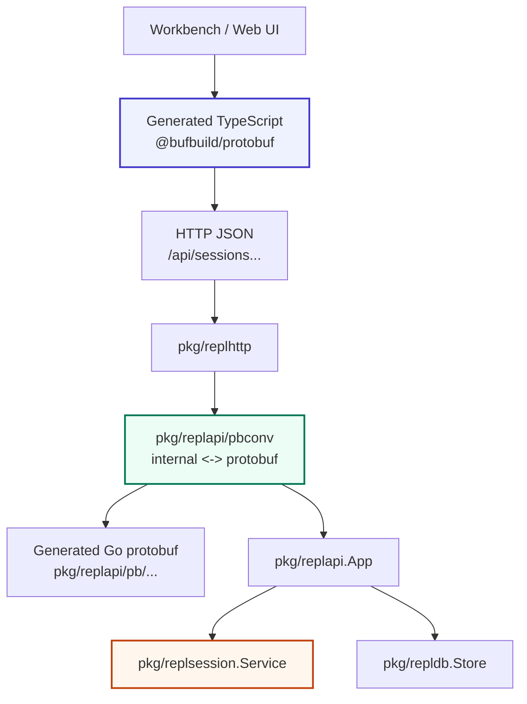

# Protobuf replapi schema and TypeScript generation implementation guide

## Executive summary

Yes: `replapi` can use protobuf as the source of truth for its HTTP payloads and generate TypeScript bindings from the same schema. The current implementation already has a clear JSON DTO layer in Go, but that layer is hand-written in `pkg/replsession/types.go` and mixed with a few persistence DTOs from `pkg/repldb/types.go`. The proposed change is to introduce a public protobuf schema for the REPL API, generate Go and TypeScript code from it, and make `replhttp` marshal/unmarshal protobuf JSON with `protojson` while preserving the existing HTTP route shape during migration.

The design should not immediately rewrite the internal REPL engine around generated protobuf messages. The safer first step is an adapter boundary: keep `pkg/replsession` as the internal service model, add `proto/goja/replapi/v1/replapi.proto` as the public transport contract, and implement conversion functions between internal structs and generated protobuf messages. This preserves the current runtime behavior while giving frontend code a generated TypeScript API.

This is the same architectural pattern that appears in `sessionstream`: define a `.proto` contract, generate Go code, use `protojson` for browser-facing JSON, and keep strict unmarshal behavior. The difference is that `replapi` is an HTTP JSON API rather than a websocket frame protocol, and its payloads include large UI-oriented analysis reports. That means the schema must be careful about dynamic JSON fields, timestamp fields, integer widths, and compatibility with existing clients.

## Problem statement and scope

`go-go-goja` currently exposes a persistent JavaScript REPL service through three layers:

1. `pkg/replsession` owns session execution, static analysis, runtime observation, cell reports, bindings, and policy behavior.
2. `pkg/replapi` wraps the session service and optional durable store into an application facade.
3. `pkg/replhttp` exposes JSON HTTP routes for sessions, evaluation, history, bindings, docs, and export.

The current JSON contract exists, but it is implicit. `pkg/replsession/types.go` says that it defines “the JSON serialization layer (DTOs) for the REPL service” and that the types “exist purely for JSON transport to the web UI” (`pkg/replsession/types.go:5-7`). The HTTP route implementation then directly encodes these structs with `encoding/json` (`pkg/replhttp/handler.go:155-158`). This is simple and effective for a Go-only service, but it gives frontend code no generated contract.

The immediate user need is a future combined `researchctl`/codesign workbench. That workbench would likely use `go-go-goja` as an embedded notebook/session engine. A frontend needs reliable TypeScript types for payloads like `EvaluateResponse`, `CellReport`, `StaticReport`, `RuntimeReport`, `BindingView`, and `SessionExport`. Hand-written TypeScript mirrors will drift.

This ticket is a design and implementation guide for making those payloads schema-first.

### In scope

- Define a protobuf schema for public `replapi` transport payloads.
- Generate Go bindings for server-side adapters.
- Generate TypeScript bindings for frontend consumers through Buf and `@bufbuild/protobuf`.
- Use protobuf JSON (`protojson`) over the existing HTTP transport.
- Preserve existing routes initially.
- Provide migration and validation guidance for compatibility.
- Explain how dynamic JSON fields and int64 fields should be represented.

### Out of scope

- Replacing the internal REPL execution engine with protobuf messages in the first implementation.
- Changing how goja runtimes execute JavaScript.
- Changing session persistence schema in the first implementation.
- Designing the full `researchctl` workbench UI.
- Introducing gRPC. The proposal is protobuf schema with JSON transport, not necessarily a gRPC service.

## Current-state analysis

### The current DTO layer is already separated from logic

`pkg/replsession/types.go` is explicitly a JSON DTO file. It defines `SessionSummary`, `EvaluateRequest`, `EvaluateResponse`, `CellReport`, `ExecutionReport`, `StaticReport`, `RewriteReport`, `RuntimeReport`, binding views, AST/CST views, diagnostics, and utility spans (`pkg/replsession/types.go:11-123`, `pkg/replsession/types.go:143-220`, `pkg/replsession/types.go:231-321`). This is a strong starting point because the public shape is already gathered into one package.

The top-level evaluation response is:

```go
type EvaluateResponse struct {
    Session *SessionSummary `json:"session"`
    Cell    *CellReport     `json:"cell"`
}
```

The per-cell report then separates the payload into static analysis, rewrite, execution, runtime diff, and provenance sections:

```go
type CellReport struct {
    ID         int                `json:"id"`
    CreatedAt  time.Time          `json:"createdAt"`
    Source     string             `json:"source"`
    Static     StaticReport       `json:"static"`
    Rewrite    RewriteReport      `json:"rewrite"`
    Execution  ExecutionReport    `json:"execution"`
    Runtime    RuntimeReport      `json:"runtime"`
    Provenance []ProvenanceRecord `json:"provenance"`
}
```

These names can map cleanly into protobuf messages.

### The HTTP layer directly exposes Go structs

`pkg/replhttp/handler.go` defines the route surface. The key routes are visible in the mux registration:

| Route | Current response shape | Evidence |
|---|---|---|
| `GET /api/sessions` | `{sessions: []repldb.SessionRecord}` | `pkg/replhttp/handler.go:22-30` |
| `POST /api/sessions` | `{session: SessionSummary}` | `pkg/replhttp/handler.go:32-39` |
| `GET /api/sessions/{id}` | `{session: SessionSummary}` | `pkg/replhttp/handler.go:41-49` |
| `DELETE /api/sessions/{id}` | `{deleted: true}` | `pkg/replhttp/handler.go:51-57` |
| `POST /api/sessions/{id}/evaluate` | `EvaluateResponse` | `pkg/replhttp/handler.go:59-72` |
| `POST /api/sessions/{id}/restore` | `{session: SessionSummary}` | `pkg/replhttp/handler.go:74-82` |
| `GET /api/sessions/{id}/history` | `{history: []EvaluationRecord}` | `pkg/replhttp/handler.go:84-92` |
| `GET /api/sessions/{id}/bindings` | `{bindings: []BindingView}` | `pkg/replhttp/handler.go:94-102` |
| `GET /api/sessions/{id}/docs` | `{docs: []BindingDocRecord}` | `pkg/replhttp/handler.go:104-112` |
| `GET /api/sessions/{id}/export` | `SessionExport` | `pkg/replhttp/handler.go:114-122` |

All responses are encoded with the same helper:

```go
func writeJSON(w http.ResponseWriter, status int, payload any) {
    w.Header().Set("Content-Type", "application/json; charset=utf-8")
    w.WriteHeader(status)
    _ = json.NewEncoder(w).Encode(payload)
}
```

A protobuf migration can keep the routes and replace the payload encoder. The route structure does not have to change first.

### `replapi.App` is a useful boundary

`pkg/replapi/app.go` is the facade used by HTTP and CLI-facing code. It creates sessions, evaluates source, snapshots sessions, restores from the store, deletes sessions, lists sessions, returns history, exports sessions, returns docs, and exposes `WithRuntime` (`pkg/replapi/app.go:58-183`). This package is a good place to keep Go-native behavior stable while transport adapters evolve.

The design should not force `replapi.App` to return generated protobuf messages immediately. A cleaner migration keeps `App` returning internal types and adds conversion functions at `replhttp` or a new `pkg/repltransport` boundary.

### Persistence has additional public shapes

The HTTP API does not only return live session DTOs. It also returns durable records from `pkg/repldb/types.go`: `SessionRecord`, `SessionExport`, `EvaluationRecord`, `ConsoleEventRecord`, `BindingVersionRecord`, and `BindingDocRecord`. These types contain `json.RawMessage` fields for stored reports, analysis, globals, summaries, exports, and normalized docs (`pkg/repldb/types.go:8-59`).

Those raw JSON fields are the hardest part of the protobuf schema. They should map to `google.protobuf.Value` or `google.protobuf.Struct` instead of strings where the data is semantically JSON. For fields that are intentionally string-encoded JSON in the current live DTO, such as `ExecutionReport.ResultJSON`, the first version can preserve a string field for compatibility.

### The REPL evaluation path produces rich reports

`pkg/replsession/evaluate.go` shows how a cell report is built. Empty source produces an `empty-source` execution report without running the VM (`pkg/replsession/evaluate.go:39-76`). Non-empty source is analyzed, rewritten, executed in either instrumented or raw mode, then returned as an `EvaluateResponse` (`pkg/replsession/evaluate.go:78-191`).

This matters for the schema because the frontend is not only displaying “result” and “error.” It may need the full analysis/rewrite/runtime report:

- static diagnostics and AST/CST rows,
- declared bindings and references,
- transformed source,
- console events,
- runtime before/after global snapshots,
- binding diffs,
- provenance records.

The proto schema should preserve this decomposition rather than flattening it.

### Sessionstream provides the closest local pattern

`sessionstream` defines transport frames in `proto/sessionstream/v1/transport.proto` and uses `protojson` for transport. Its websocket server declares `marshalOptions = protojson.MarshalOptions{EmitUnpopulated:false, UseProtoNames:false}` and strict unmarshal options with `DiscardUnknown:false` (`pkg/sessionstream/transport/ws/server.go:20-23`). Its schema registry also uses `protojson` for decode and marshal (`pkg/sessionstream/schema.go:61-82`).

The JavaScript module in `sessionstream` demonstrates a practical JS/protobuf bridge: it marshals protobuf messages to protojson, decodes them into plain Go values, and converts those into goja values; in the reverse direction, it first tries to recover a generated protobuf message from a goja value and then falls back to strict protojson decoding (`pkg/js/modules/sessionstream/codec.go:24-69`).

For `replapi`, the relevant pattern is not websocket framing. The relevant pattern is schema-first payloads plus strict protojson conversion.

## Gap analysis

The current codebase has the runtime behavior but lacks a portable contract. The gaps are:

1. **No machine-readable API schema.** Frontend code cannot generate types from the current Go DTOs.
2. **No TypeScript output.** A workbench UI must either hand-write interfaces or infer shapes from examples.
3. **No compatibility test for transport JSON shape.** Existing tests exercise HTTP behavior, but there is no generated schema golden that says “this is the public wire contract.”
4. **Dynamic JSON fields are untyped.** The existing `json.RawMessage` and `ResultJSON string` fields need deliberate schema choices.
5. **Integer and timestamp semantics are implicit.** `time.Time`, `int`, and `int64` fields need protobuf mappings that are safe in TypeScript.

The missing piece is not “protobuf everywhere.” The missing piece is a public schema and generated client types.

## Proposed architecture

Add a protobuf transport layer while keeping the internal REPL service unchanged at first.



The new files should be:

```text
proto/goja/replapi/v1/replapi.proto
buf.yaml
buf.gen.yaml
pkg/replapi/pb/proto/goja/replapi/v1/replapi.pb.go        # generated
web/replapi/src/generated/goja/replapi/v1/replapi_pb.ts   # generated, or another chosen TS output path
pkg/replapi/pbconv/session.go                             # handwritten adapters
pkg/replapi/pbconv/repldb.go                              # handwritten adapters for persistence records
pkg/replhttp/proto_handler.go                             # optional v2 handler, or replace encoder after adapters exist
```

The schema should be package-versioned:

```proto
syntax = "proto3";

package goja.replapi.v1;

option go_package = "github.com/go-go-golems/go-go-goja/pkg/replapi/pb/proto/goja/replapi/v1;replapiv1";

import "google/protobuf/struct.proto";
import "google/protobuf/timestamp.proto";
```

### Transport strategy

Use protobuf JSON over HTTP, not binary protobuf and not gRPC in the first implementation.

The server should marshal with:

```go
var protoJSONMarshal = protojson.MarshalOptions{
    EmitUnpopulated: false,
    UseProtoNames:   false,
}

var protoJSONUnmarshal = protojson.UnmarshalOptions{
    DiscardUnknown: false,
}
```

This keeps camelCase JSON keys for TypeScript and rejects unknown request fields. That matches the sessionstream pattern and avoids silent frontend/backend drift.

### Route strategy

Keep the existing routes initially. Only the response bodies become protobuf-generated messages. That yields a migration with low operational risk.

| Existing route | Proposed protobuf response |
|---|---|
| `GET /api/sessions` | `ListSessionsResponse` |
| `POST /api/sessions` | `CreateSessionResponse` |
| `GET /api/sessions/{id}` | `GetSessionResponse` |
| `DELETE /api/sessions/{id}` | `DeleteSessionResponse` |
| `POST /api/sessions/{id}/evaluate` | `EvaluateResponse` |
| `POST /api/sessions/{id}/restore` | `RestoreSessionResponse` |
| `GET /api/sessions/{id}/history` | `HistoryResponse` |
| `GET /api/sessions/{id}/bindings` | `BindingsResponse` |
| `GET /api/sessions/{id}/docs` | `DocsResponse` |
| `GET /api/sessions/{id}/export` | `SessionExport` or `ExportSessionResponse` |

A later version can add `/api/v1/...` routes if dual-running old and new JSON shapes becomes necessary.

## Proposed protobuf API sketch

This sketch is not a complete copy-paste schema, but it is detailed enough to guide implementation.

```proto
syntax = "proto3";

package goja.replapi.v1;

option go_package = "github.com/go-go-golems/go-go-goja/pkg/replapi/pb/proto/goja/replapi/v1;replapiv1";

import "google/protobuf/struct.proto";
import "google/protobuf/timestamp.proto";

message EvaluateRequest {
  uint32 schema_version = 1;
  string source = 2;
}

message EvaluateResponse {
  uint32 schema_version = 1;
  SessionSummary session = 2;
  CellReport cell = 3;
}

message SessionSummary {
  string id = 1;
  string profile = 2;
  SessionPolicy policy = 3;
  google.protobuf.Timestamp created_at = 4;
  uint32 cell_count = 5;
  uint32 binding_count = 6;
  repeated BindingView bindings = 7;
  repeated HistoryEntry history = 8;
  repeated GlobalStateView current_globals = 9;
  repeated ProvenanceRecord provenance = 10;
}

message CellReport {
  uint32 id = 1;
  google.protobuf.Timestamp created_at = 2;
  string source = 3;
  StaticReport static = 4;
  RewriteReport rewrite = 5;
  ExecutionReport execution = 6;
  RuntimeReport runtime = 7;
  repeated ProvenanceRecord provenance = 8;
}

message ExecutionReport {
  string status = 1;
  string result = 2;
  string result_json = 3;
  string error = 4;
  int64 duration_ms = 5;
  bool awaited = 6;
  repeated ConsoleEvent console = 7;
  bool had_side_effects = 8;
  bool helper_error = 9;
}

message ConsoleEvent {
  string kind = 1;
  string message = 2;
}
```

The first schema version can use strings for fields currently represented as strings and `google.protobuf.Value` for persisted raw JSON fields. The schema should not over-normalize every string enum immediately, because many current fields are stringly typed by design: diagnostic severity, execution status, binding kind, diff change, export kind, source kind, and similar values.

### Policy messages

Current session policy structs are in `pkg/replsession/policy.go`. They should map directly:

```proto
enum EvalMode {
  EVAL_MODE_UNSPECIFIED = 0;
  EVAL_MODE_RAW = 1;
  EVAL_MODE_INSTRUMENTED = 2;
}

message EvalPolicy {
  EvalMode mode = 1;
  bool capture_last_expression = 2;
  bool support_top_level_await = 3;
  int64 timeout_ms = 4;
}

message ObservePolicy {
  bool static_analysis = 1;
  bool runtime_snapshot = 2;
  bool binding_tracking = 3;
  bool console_capture = 4;
  bool jsdoc_extraction = 5;
}

message PersistPolicy {
  bool enabled = 1;
  bool evaluations = 2;
  bool binding_versions = 3;
  bool binding_docs = 4;
}

message SessionPolicy {
  EvalPolicy eval = 1;
  ObservePolicy observe = 2;
  PersistPolicy persist = 3;
}
```

The adapter must convert existing strings `"raw"` and `"instrumented"` into enum values for output and back for input if session-create options are later exposed through HTTP.

### Static analysis messages

Static analysis payloads are large but regular. They can be mapped with repeated messages:

```proto
message StaticReport {
  repeated DiagnosticView diagnostics = 1;
  repeated TopLevelBindingView top_level_bindings = 2;
  repeated IdentifierUseView unresolved = 3;
  repeated BindingReferenceGroup references = 4;
  ScopeView scope = 5;
  repeated ASTRowView ast = 6;
  uint32 ast_node_count = 7;
  bool ast_truncated = 8;
  repeated CSTNodeView cst = 9;
  uint32 cst_node_count = 10;
  bool cst_truncated = 11;
  RangeView final_expression = 12;
  repeated StaticSummaryFact summary = 13;
}

message ScopeView {
  uint32 id = 1;
  string kind = 2;
  uint32 start = 3;
  uint32 end = 4;
  repeated ScopeBinding bindings = 5;
  repeated ScopeView children = 6;
}
```

The Go adapter should treat absent nested messages as zero values when converting back to internal structs. For frontend use, generated TS gives a stable shape and the UI can check presence with standard protobuf semantics.

### Runtime and binding messages

Runtime reports and binding views should stay close to the current DTOs:

```proto
message RuntimeReport {
  repeated GlobalStateView before_globals = 1;
  repeated GlobalStateView after_globals = 2;
  repeated GlobalDiffView diffs = 3;
  repeated string new_bindings = 4;
  repeated string updated_bindings = 5;
  repeated string removed_bindings = 6;
  repeated string leaked_globals = 7;
  repeated string persisted_by_wrap = 8;
  string current_cell_value = 9;
}

message BindingView {
  string name = 1;
  string kind = 2;
  string origin = 3;
  uint32 declared_in_cell = 4;
  uint32 last_updated_cell = 5;
  uint32 declared_line = 6;
  string declared_snippet = 7;
  BindingStaticView static = 8;
  BindingRuntimeView runtime = 9;
  repeated ProvenanceRecord provenance = 10;
}
```

### Persistence/export messages

For `repldb` records, prefer `google.protobuf.Value` for raw JSON values:

```proto
message EvaluationRecord {
  int64 evaluation_id = 1;
  string session_id = 2;
  uint32 cell_id = 3;
  google.protobuf.Timestamp created_at = 4;
  string raw_source = 5;
  string rewritten_source = 6;
  bool ok = 7;
  google.protobuf.Value result_json = 8;
  string error_text = 9;
  google.protobuf.Value analysis_json = 10;
  google.protobuf.Value globals_before_json = 11;
  google.protobuf.Value globals_after_json = 12;
  repeated ConsoleEventRecord console_events = 13;
  repeated BindingVersionRecord binding_versions = 14;
  repeated BindingDocRecord binding_docs = 15;
}
```

This is different from the live `ExecutionReport.result_json` string. The difference reflects the current Go model: the live DTO stores a string containing a JSON envelope, while persistence records store raw JSON bytes. An implementation may later normalize both, but the first version should match existing semantics to reduce migration risk.

## TypeScript generation plan

Use Buf and `protoc-gen-es` through the remote Buf plugin. The exact output directory depends on whether `go-go-goja` will contain a frontend package. If the future workbench lives inside this repo, use a local package such as `web/replapi/src/generated`. If not, generate under `pkg/replapi/ts/generated` or `web/packages/replapi-types/src/generated` and publish/copy from there.

Recommended `buf.yaml`:

```yaml
version: v2
name: buf.build/local/go-go-goja

deps:
  - buf.build/googleapis/googleapis
```

Recommended `buf.gen.yaml`:

```yaml
version: v2
plugins:
  - remote: buf.build/protocolbuffers/go
    out: pkg/replapi/pb
    opt:
      - paths=source_relative
  - remote: buf.build/bufbuild/es
    out: web/packages/replapi-types/src/generated
    opt:
      - target=ts
      - import_extension=none
```

Frontend usage with `@bufbuild/protobuf` v2:

```ts
import { fromJson } from "@bufbuild/protobuf";
import { EvaluateResponseSchema } from "./generated/proto/goja/replapi/v1/replapi_pb";

const raw = await fetch(`/api/sessions/${sessionId}/evaluate`, {
  method: "POST",
  headers: { "Content-Type": "application/json" },
  body: JSON.stringify({ schemaVersion: 1, source }),
}).then(r => r.json());

const response = fromJson(EvaluateResponseSchema, raw);
console.log(response.cell?.execution?.status);
```

The frontend should consume generated types directly. Do not create a hand-written mirror of `CellReport` or `SessionSummary` unless it is a genuinely different view model.

## Server adapter design

The adapter layer should be boring and heavily tested. It has one job: convert between internal structs and generated protobuf messages.

Suggested package:

```text
pkg/replapi/pbconv/
  session.go       # replsession DTO conversions
  repldb.go        # repldb record conversions
  json_value.go    # json.RawMessage <-> google.protobuf.Value helpers
  policy.go        # EvalMode enum/string conversion
```

Representative pseudocode:

```go
func EvaluateResponseToProto(in *replsession.EvaluateResponse) *replapiv1.EvaluateResponse {
    if in == nil {
        return nil
    }
    return &replapiv1.EvaluateResponse{
        SchemaVersion: 1,
        Session: SessionSummaryToProto(in.Session),
        Cell: CellReportToProto(in.Cell),
    }
}

func CellReportToProto(in *replsession.CellReport) *replapiv1.CellReport {
    if in == nil {
        return nil
    }
    return &replapiv1.CellReport{
        Id: uint32(in.ID),
        CreatedAt: timestamppb.New(in.CreatedAt),
        Source: in.Source,
        Static: StaticReportToProto(in.Static),
        Rewrite: RewriteReportToProto(in.Rewrite),
        Execution: ExecutionReportToProto(in.Execution),
        Runtime: RuntimeReportToProto(in.Runtime),
        Provenance: ProvenanceRecordsToProto(in.Provenance),
    }
}
```

JSON raw message conversion:

```go
func RawJSONToValue(raw json.RawMessage) (*structpb.Value, error) {
    if len(bytes.TrimSpace(raw)) == 0 {
        return structpb.NewNullValue(), nil
    }
    var v any
    if err := json.Unmarshal(raw, &v); err != nil {
        return nil, err
    }
    return structpb.NewValue(v)
}
```

The reverse function should use `protojson` only at the HTTP edge. Internal persistence can remain `encoding/json` until a later migration.

## HTTP migration plan

There are two viable migration paths.

### Option A: Replace response encoding in existing routes

This keeps the route surface unchanged and changes each handler to wrap internal values in protobuf response messages before encoding:

```go
resp, err := app.Evaluate(r.Context(), id, req.Source)
if err != nil { ... }
writeProtoJSON(w, http.StatusOK, pbconv.EvaluateResponseToProto(resp))
```

This is simplest for users who do not care about dual-running old and new JSON. It has one risk: protobuf JSON omits empty fields differently than `encoding/json` in some cases, and timestamp/int64 rendering will change for affected fields.

### Option B: Add `/api/v1` protobuf-JSON routes and keep legacy routes

This adds new typed routes while keeping old JSON behavior:

```text
/api/sessions/...       legacy encoding/json DTOs
/api/v1/sessions/...    protobuf JSON DTOs
```

This is safer for compatibility and better for incremental frontend adoption. It costs more code in the short term.

Recommended decision: implement Option B first if any external UI already depends on current JSON. Implement Option A only if this API is still internal enough to change in place.

## Decision records

### Decision: Use protobuf as transport schema, not internal service model

- **Context:** `pkg/replsession` already has working internal DTOs and execution logic. Rewriting it around generated messages would touch evaluation, persistence, observation, and tests at once.
- **Options considered:** Replace all DTOs with generated protobuf structs; add adapters at the HTTP boundary; generate TypeScript from Go structs instead.
- **Decision:** Add protobuf messages as the public transport schema and adapt at the boundary.
- **Rationale:** This gives generated TypeScript without destabilizing the REPL service.
- **Consequences:** There is temporary duplication between Go DTOs and proto messages. Golden adapter tests are required to keep them aligned.
- **Status:** proposed.

### Decision: Use protojson over HTTP JSON rather than gRPC

- **Context:** The existing server is a small JSON HTTP handler mounted by `goja-repl serve` (`cmd/goja-repl/cmd_serve.go:41-84`). Frontend clients already expect HTTP JSON.
- **Options considered:** gRPC-web, binary protobuf over HTTP, protobuf JSON over existing routes, OpenAPI only.
- **Decision:** Use protobuf JSON over HTTP.
- **Rationale:** It preserves the current deployment model while enabling generated Go/TS types.
- **Consequences:** The wire format is still JSON, so payload size is not minimized. Type safety comes from codegen and decoding, not from binary transport.
- **Status:** proposed.

### Decision: Represent raw JSON persistence fields as `google.protobuf.Value`

- **Context:** `repldb.EvaluationRecord` and related records contain `json.RawMessage` fields (`pkg/repldb/types.go:8-59`). These may hold arbitrary JSON objects, arrays, strings, numbers, booleans, or null.
- **Options considered:** Store them as strings; use `google.protobuf.Struct`; use `google.protobuf.Value`; define one message per raw field.
- **Decision:** Use `google.protobuf.Value` for arbitrary raw JSON and keep `ExecutionReport.result_json` as a string in v1 for compatibility.
- **Rationale:** `Value` matches arbitrary JSON. `Struct` only represents objects. Strings would force frontend callers to parse nested JSON manually.
- **Consequences:** TypeScript receives a JSON-like value for persistence records. BigInt serialization must still be considered for other int64 fields.
- **Status:** proposed.

### Decision: Generate TypeScript with `protoc-gen-es` and `@bufbuild/protobuf`

- **Context:** The frontend should not maintain hand-written mirrors of REPL payloads.
- **Options considered:** Hand-written TS interfaces, OpenAPI generator, `protoc-gen-ts`, `protoc-gen-es`.
- **Decision:** Use Buf remote `buf.build/bufbuild/es` with `@bufbuild/protobuf` v2.
- **Rationale:** This matches the protobuf/TypeScript pattern used elsewhere in the ecosystem and works cleanly with protojson `fromJson`.
- **Consequences:** Frontend packages must depend on `@bufbuild/protobuf`, and code must handle int64 fields as `bigint` or strings depending on generated runtime semantics.
- **Status:** proposed.

## Implementation plan

### Phase 1: Schema inventory and field map

Create a field mapping document or table from current DTOs to proto messages. Include all public HTTP payloads:

- `pkg/replsession/types.go`
- `pkg/replsession/policy.go`
- `pkg/repldb/types.go`
- response envelopes currently created inline in `pkg/replhttp/handler.go`

Deliverable:

```text
ttmp/.../reference/02-current-replapi-json-shape.md
```

### Phase 2: Add protobuf schema and Buf config

Add:

```text
proto/goja/replapi/v1/replapi.proto
buf.yaml
buf.gen.yaml
```

Use v2 Buf config and remote plugins. Generate Go and TS outputs. If the repo does not yet want checked-in TypeScript, generate it into a package directory with a README explaining its purpose.

Validation:

```bash
buf lint
buf generate
```

### Phase 3: Add adapter package

Add `pkg/replapi/pbconv` and implement conversions from internal structs to protobuf messages. Start output-only. Do not change HTTP yet.

Tests:

- Unit tests for `EvaluateResponseToProto`.
- Unit tests for `SessionSummaryToProto`.
- Unit tests for `repldb.EvaluationRecord` raw JSON conversion.
- Golden JSON tests comparing protojson output to expected camelCase JSON.

### Phase 4: Add protobuf JSON handler path

Add either `/api/v1` routes or a new handler constructor:

```go
func NewProtoJSONHandler(app *replapi.App) (http.Handler, error)
```

Keep `NewHandler` unchanged until compatibility is proven. `goja-repl serve` can expose both under one mux:

```text
/api/...     legacy
/api/v1/...  protobuf JSON
```

### Phase 5: Add TypeScript consumer tests

Add a minimal TS test package or script that imports generated types and decodes sample JSON with `fromJson`:

```ts
import { fromJson } from "@bufbuild/protobuf";
import { EvaluateResponseSchema } from "./generated/proto/goja/replapi/v1/replapi_pb";

const decoded = fromJson(EvaluateResponseSchema, sample);
if (decoded.cell?.execution?.status !== "ok") throw new Error("bad status");
```

Validate:

- timestamp fields decode,
- int64 fields behave as expected,
- `google.protobuf.Value` fields preserve object/array/scalar shape,
- missing optional sections are safe to read.

### Phase 6: Migrate frontend/workbench consumers

Once a workbench exists, use generated TypeScript shapes for API calls. Keep frontend-specific view models separate from wire models. Use transformations only at component boundaries.

### Phase 7: Decide whether to retire legacy JSON

After one frontend consumes `/api/v1`, decide whether `pkg/replhttp.NewHandler` should remain legacy forever, internally call the proto handler, or be replaced by the protobuf handler in a major release.

## Testing strategy

### Go tests

- Adapter tests for every top-level response.
- Golden protojson tests for representative evaluation responses.
- Round-trip tests for request messages, especially `EvaluateRequest`.
- Strict unknown-field tests with `protojson.UnmarshalOptions{DiscardUnknown:false}`.
- Handler tests that compare `/api/v1` output to generated protobuf JSON expectations.

### TypeScript tests

- Decode sample evaluate response with `fromJson`.
- Decode sample session export.
- Assert `durationMs` and `evaluationId` handling for int64 fields.
- Assert `google.protobuf.Value` fields preserve nested JSON.
- Assert frontend code imports generated schemas, not hand-written mirrors.

### Compatibility tests

If legacy routes remain, keep tests for both route families:

```text
/api/sessions/{id}/evaluate     legacy encoding/json
/api/v1/sessions/{id}/evaluate  protobuf JSON
```

This makes intentional shape differences visible.

## Risks and mitigations

### Risk: Large schema surface

The current DTO set is broad. A complete proto can become large quickly.

Mitigation: implement top-level live session/evaluate messages first, then add persistence/export messages. Do not include unused internal-only structs.

### Risk: Proto JSON shape differs from encoding/json

Timestamps, int64 values, zero values, and omitted fields may change.

Mitigation: introduce `/api/v1` routes first and use golden tests. Keep legacy routes until consumers migrate.

### Risk: Dynamic JSON fields lose fidelity

`json.RawMessage` can contain any JSON value.

Mitigation: use `google.protobuf.Value`, not `Struct`, for arbitrary values. Add tests for object, array, string, number, boolean, and null.

### Risk: Generated TypeScript is checked in without runtime dependency discipline

Generated TS requires `@bufbuild/protobuf` version alignment.

Mitigation: create a small package with its own `package.json`, pin `@bufbuild/protobuf`, and test decoding in CI.

### Risk: Internal and proto DTOs drift

Adapters can become stale as `pkg/replsession/types.go` changes.

Mitigation: add an explicit mapping test and a checklist for any changes to `pkg/replsession/types.go`: update proto, regenerate, update adapter, update golden JSON.

## Intern implementation checklist

1. Read `pkg/replsession/types.go` from top to bottom. Identify every type that appears directly or indirectly in `EvaluateResponse` and `SessionSummary`.
2. Read `pkg/replhttp/handler.go` and list every route and response envelope.
3. Read `pkg/repldb/types.go` and decide which persistence records need protobuf transport messages.
4. Create `proto/goja/replapi/v1/replapi.proto` with live response messages first.
5. Add Buf config and run generation.
6. Add `pkg/replapi/pbconv` with output adapters.
7. Add protojson golden tests.
8. Add `/api/v1` handler routes.
9. Add a minimal TypeScript decode test using generated code.
10. Update `goja-repl serve` docs to explain legacy and protobuf JSON endpoints.

## References

- `/home/manuel/workspaces/2026-06-30/benchmark-cpu-inference/go-go-goja/pkg/replsession/types.go` — current JSON DTO source of truth.
- `/home/manuel/workspaces/2026-06-30/benchmark-cpu-inference/go-go-goja/pkg/replsession/policy.go` — session policy structs and eval mode constants.
- `/home/manuel/workspaces/2026-06-30/benchmark-cpu-inference/go-go-goja/pkg/replapi/app.go` — application facade over live sessions and persistence.
- `/home/manuel/workspaces/2026-06-30/benchmark-cpu-inference/go-go-goja/pkg/replhttp/handler.go` — current HTTP JSON routes.
- `/home/manuel/workspaces/2026-06-30/benchmark-cpu-inference/go-go-goja/pkg/repldb/types.go` — durable session/export record shapes.
- `/home/manuel/workspaces/2026-06-30/benchmark-cpu-inference/go-go-goja/pkg/replsession/evaluate.go` — evaluation pipeline and cell report construction.
- `/home/manuel/code/wesen/go-go-golems/sessionstream/proto/sessionstream/v1/transport.proto` — local protobuf transport schema reference.
- `/home/manuel/code/wesen/go-go-golems/sessionstream/pkg/sessionstream/schema.go` — protojson schema registry helpers.
- `/home/manuel/code/wesen/go-go-golems/sessionstream/pkg/sessionstream/transport/ws/server.go` — protojson marshal/unmarshal options in a transport.
- `/home/manuel/code/wesen/go-go-golems/sessionstream/pkg/js/modules/sessionstream/codec.go` — JS/protobuf conversion pattern for goja values.
